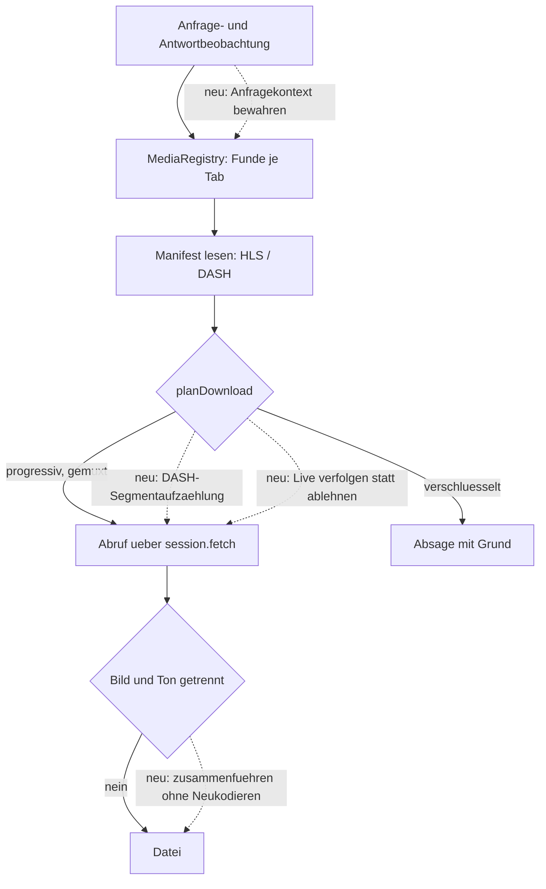

# Medien-Recorder - Plan

## Goal Capsule

- **Ziel:** Der Browser kann erkannte Videos herunterladen und laufende Streams mitschneiden — ohne Erweiterung, in der höchsten verfügbaren Qualität und mit Bild und Ton in einer Datei. Der Geltungsbereich sind unverschlüsselte Quellen, die HLS oder DASH mit fMP4- oder MPEG-2-TS-Segmenten liefern.
- **Produktautorität:** Der Product Contract in diesem Dokument. Er ersetzt die bisherige Annahme, das Medien-Subsystem sei ein reiner VOD-Downloader.
- **Offene Blocker:** Q1 bis Q4 unter Outstanding Questions. Q1 entscheidet über den Weg zum Zusammenführen von Bild und Ton, Q3 und Q4 darüber, ob YouTube und Twitch in voller Qualität überhaupt erreichbar sind.

---

## Product Contract

### Summary

Das vorhandene Medien-Subsystem wird angeschlossen und um die vier Fähigkeiten erweitert, die heute fehlen: den Anfragekontext einer beobachteten Medienanfrage für einen späteren Abruf zu bewahren, DASH-Segmentadressen selbst zu ermitteln, getrennte Bild- und Tonspuren zu einer Datei zusammenzuführen, und einer wachsenden Live-Playlist zu folgen, bis der Benutzer stoppt.

### Problem Frame

Die Beobachtungsseite des Subsystems ist gebaut und sieht nie Daten. `MediaService.observeRequest` und `observeResponse` haben keinen Aufrufer in `src/main/`; `WindowRegistry` hat kein Medienfeld. Die IPC-Handler dagegen sind über `registerMediaHandlers` bereits verdrahtet, samt Push-Kanal: `media:changed` wird an das besitzende Fenster gesendet und gegen ein Schema validiert. Es fehlt allein der Renderer-Teil — `MediaPanel` wird in keiner Renderer-Datei importiert, und `media:changed` hat dort keinen Abonnenten. Über 3500 Zeilen Tests prüfen damit eine Maschine, die im laufenden Browser nichts zu sehen bekommt. Zwei Freigabefunktionen in `src/main/media/MediaSessions.ts` haben ebenfalls keinen Aufrufer — solange nichts verdrahtet ist, ist das folgenlos; in dem Moment, in dem die Beobachtung anläuft, hinterlässt jedes private Fenster dauerhaft Session, Registry und Funde.

Selbst vollständig verdrahtet träfe die Maschine ihre Zielquellen nur zum kleinsten Teil. Live-Playlists werden in `src/shared/media/plan.ts` abgelehnt, bevor irgendeine Segmentarbeit beginnt; Polling gibt es nirgends. Getrennte Bild- und Tonspuren werden mit `separate-audio-track` abgelehnt, DASH mit `dash-needs-muxer`; einen Muxer gibt es nicht, und `src/main/media/MediaDownloader.ts` notiert das ausdrücklich. Von den drei Zielquellen liefert damit keine ein Ergebnis: Twitch scheitert an der Live-Ablehnung, Vimeo und YouTube an getrennten Spuren und fehlender DASH-Segmentaufzählung.

Bezahlt wird das heute mit Erweiterungen, die den Netzwerkverkehr beobachten und die Medienanfrage mit gültigem Token nachstellen. Genau diesen Nachstellschritt kann das Subsystem nicht. Anfrage-Header liegen dabei nicht am Eintritt der Request-Pipeline — `ObservedRequest` in `src/main/privacy/RequestPipeline.ts` trägt vier Felder und keine Header, weil Electron an `onBeforeRequest` keine liefert. Sie entstehen eine Stufe später, an der Header-Härtung in `src/main/session/hardening.ts`, wo bereits eine Registrierung sitzt; `MediaFetchInit.headers` ist heute für `Range` da.

### Key Decisions

- **Richtung, abhängig von Q1: Zusammenführen in JavaScript statt mitgelieferter ffmpeg-Binary.** Getrennte Spuren kommen als fMP4-Fragmente, und die dort nötige Arbeit ist containerweit statt codecweit — eine ISOBMFF-Bibliothek kostet weder Installergröße noch Notarisierung noch einen Prozess außerhalb des Netzwerkstacks. Bei zwei Laufzeitabhängigkeiten im Projekt ist jede weitere eine sichtbare Entscheidung. Der Spike aus Q1 entscheidet, ob die Richtung trägt; ffmpeg bleibt der Rückfall. *Governs R12, R13, R14.*
- **Eigener Abruf mit nachgestelltem Anfragekontext, kein Mitschnitt des Player-Verkehrs.** Die Bytes abzugreifen, die der Player ohnehin lädt, würde das Token-Problem erledigen, liefert aber die adaptiv gewählte Stufe — in einer kleinen Kachel die schlechte. *Governs R6, R8, R9, R15.*
- **VOD und Live sind ein Arbeitspaket, in zwei Stufen.** Der Live-Mitschnitt setzt dieselbe Verdrahtung voraus wie der VOD-Download, deshalb ein Paket. Innerhalb des Pakets gehen Verdrahtung, Anfragekontext und die Live-Verfolgung gemuxter Quellen zuerst; Segmentermittlung, Zusammenführen und Live-Quellen mit getrennten Spuren folgen, sobald Q1 beantwortet ist. Die Unabhängigkeit der ersten Stufe von Q1 gilt nur für bereits gemuxte Quellen und steht und fällt mit der Twitch-Annahme unter Dependencies — sie zu prüfen ist die erste Handlung des Pakets. Die erste Stufe setzt Q5 und Q6 nicht voraus, sondern beantwortet sie. *Governs R1, R16.*
- **Verschlüsselte Quellen bleiben abgelehnt — aus zwei verschiedenen Gründen.** Widevine, PlayReady und FairPlay sind ohne castlabs-Build technisch nicht erreichbar. AES-128 wäre erreichbar und wird als Haltung abgelehnt: dass ein Player den Schlüssel holen darf, heißt nicht, dass der Benutzer eine Kopie behalten darf. *Governs R21.*
- **Funde bleiben flüchtig.** Beobachtete Medienadressen samt Anfragekontext sind Browserverlauf unter anderem Namen; in einem Privacy-Browser gehören sie nicht auf die Platte. *Governs R5, R7.*
- **Kein Bildschirmmitschnitt.** Eine skalierte Kachel abzufilmen kostet genau die Qualität, um derentwillen dieses Feature existiert.
- **Unfreiwilliges Ende behält, absichtlicher Abbruch verwirft.** Endet ein Transfer, weil der Tab geschlossen wird, der Platz ausgeht oder die Anwendung abstürzt, bleibt das Geschriebene erhalten — für Mitschnitt und Download gleichermaßen. Nur der Stopp-Knopf verwirft; sonst wäre er keiner. *Governs R19, R20.*
- **Ausgelieferte Texte nennen Verfahren, nicht Dienste.** Release-Notes und Oberfläche sprechen von unverschlüsseltem HLS und DASH; Twitch, Vimeo und YouTube bleiben interne Abnahmefälle in Plan und Tests. Der Update-Kanal des Projekts hängt an derselben Plattform, auf der Werkzeuge dieser Klasse schon entfernt wurden.
- **Dieses Paket kommt vor V3 und V5 des Verbesserungsplans.** Es ist das, woran als Nächstes gearbeitet wird; die dort beschriebenen Lücken warten. V1 wartet nicht — Kamera und Mikrofon bleiben bewusst unangetastet.

Die Kette vom beobachteten Verkehr bis zur Datei, mit den fehlenden Gliedern:

Durchgezogene Kanten sind vorhanden, gestrichelte fehlen.

### Requirements

**Verdrahtung und Lebenszyklus**

- R1. Die Anfrage- und Antwortbeobachtung des Medien-Subsystems ist im laufenden Browser angeschlossen, so dass Funde ohne Zutun des Benutzers entstehen.
- R2. Das Medien-Panel ist aus der Werkzeugleiste erreichbar und zeigt die Funde des aktiven Tabs.
- R3. Der Zugang zum Panel zeigt an, ob der aktive Tab Funde hat, und wechselt mit dem Tab; ohne Funde bleibt er unauffällig.
- R4. Funde und Dienste eines Tabs werden beim Schließen des Tabs freigegeben, die Session eines privaten Fensters beim Schließen des Fensters; ein dort laufender Transfer endet dabei nach R20 und nicht als Verlust.
- R5. Funde und bewahrter Anfragekontext werden nicht auf die Platte geschrieben, überleben ihr Fenster nicht und werden zusätzlich verworfen, sobald der Benutzer Browserdaten löscht.

**Anfragekontext**

- R6. Zu jeder beobachteten Medienanfrage bewahrt der Browser den Anfragekontext, den ein späterer Abruf braucht, um vom Server angenommen zu werden.
- R7. Der Kontext einer noch nicht eingestuften Anfrage wird verworfen, sobald deren Antwort nicht als Medium erkannt wird oder ausbleibt; für offene Einträge gilt eine benannte Obergrenze nach Anzahl und Alter.
- R8. Ein Abruf verwendet diesen Kontext und läuft über die session-gebundene Abrufschnittstelle, nie an Chromiums Netzwerkstack vorbei.
- R9. Der Kontext geht ausschließlich an Anfragen an dieselbe Herkunft, aus deren Beobachtung er stammt; bei einem Wechsel der Herkunft — durch Manifestverweis, Segmentadresse oder Weiterleitung — wird er verworfen und die Anfrage läuft ohne ihn.
- R10. Eine während einer laufenden Aufnahme ablaufende Adresse beendet die Aufnahme nicht.

**Bild und Ton**

- R11. Für DASH-Quellen ermittelt der Browser die Segmentadressen selbst aus den Vorlagen und Zeitleisten des Manifests, ohne Player-Framework.
- R12. Liegen Bild und Ton getrennt vor, führt der Browser sie zu einer Datei mit beiden Spuren zusammen, ohne neu zu kodieren.
- R13. Scheitert das Zusammenführen, entsteht keine Datei ohne Ton, sondern eine Absage mit Grund.
- R14. Segmentdaten gelten als fremde Eingabe; das Zusammenführen läuft unter benannten Grenzen für Speicher und Laufzeit und endet bei deren Überschreitung als Absage nach R13.
- R15. Für einen Download wählt der Browser die höchste verfügbare Qualitätsstufe, unabhängig davon, welche Stufe der Player gerade abspielt.
- R24. Beim Start eines Mitschnitts wählt der Benutzer die Stufe, mit der höchsten als Vorgabe; die zu erwartende Größe je Stunde ist dabei erkennbar.

**Live-Mitschnitt**

- R16. Ein laufender Stream kann mitgeschnitten werden; der Browser folgt der wachsenden Segmentliste, bis der Benutzer stoppt oder der Stream endet. Für Live-Quellen mit getrennten Bild- und Tonspuren gilt R12 zusätzlich.
- R17. Die Zieldatei ist nach jedem geschriebenen Segment abspielbar.
- R18. Ein Unterbruch in der Segmentfolge beendet den Mitschnitt nicht, solange er die Initialisierungsparameter unverändert lässt.
- R19. Ein laufender Mitschnitt und ein laufender Download sind im Panel mit ihrem Fortschritt und ihrer bisherigen Größe sichtbar und dort abbrechbar; ein Abbruch über diesen Weg hinterlässt kein Teilergebnis im Zielverzeichnis.
- R20. Endet ein Mitschnitt oder Download unfreiwillig — der Tab wird geschlossen, der Platz auf dem Datenträger geht zur Neige, die Anwendung endet unerwartet —, bleibt das bisher Geschriebene als abspielbare Datei erhalten, mit einem benannten Grund.

**Grenzen und Ablage**

- R21. Verschlüsselte Quellen werden abgelehnt, mit einem Grund, der das Verfahren benennt.
- R22. Wird eine Quelle abgelehnt, weil der nachgestellte Anfragekontext nicht mehr genügt, ist dieser Grund als solcher erkennbar und nicht als allgemeiner Fehler.
- R23. Medien-Downloads verwenden dieselbe Zielpfad-Behandlung wie die übrigen Downloads, einschließlich der Säuberung des eingestellten Verzeichnisses.
- R25. Manifestverweise, Weiterleitungsziele und selbst ermittelte Segmentadressen werden nur abgerufen, wenn sie `http:` oder `https:` sind und nicht auf Loopback-, Link-Local- oder private Adressbereiche zeigen; jede andere Adresse endet vor dem ersten Schreibvorgang als Absage nach R13.

### Key Flows

- F1. Ein Video sichern
  - **Auslöser:** Der Benutzer öffnet das Panel auf einer Seite, deren Video geladen wurde.
  - **Schritte:** Panel zeigt die Funde des Tabs; Benutzer wählt einen aus; der Browser wählt die höchste Stufe, ruft mit bewahrtem Kontext ab, führt getrennte Spuren zusammen und legt die Datei ab.
  - **Ergebnis:** Eine abspielbare Datei mit Bild und Ton im Download-Verzeichnis.
  - **Deckt ab:** R2, R3, R6, R8, R12, R15, R19, R23, R25
- F2. Einen laufenden Stream mitschneiden
  - **Auslöser:** Der Benutzer startet den Mitschnitt an einem Fund, dessen Playlist noch wächst, und wählt dabei die Stufe.
  - **Schritte:** Der Browser lädt die Playlist in ihrem eigenen Takt neu, hängt neue Segmente an, schreibt fortlaufend und zeigt Größe und Fortschritt; der Benutzer stoppt, oder der Stream endet von selbst.
  - **Ergebnis:** Eine abspielbare Datei über den mitgeschnittenen Zeitraum.
  - **Deckt ab:** R10, R16, R17, R18, R19, R20, R24, R25
- F3. Eine Quelle, die nicht geht
  - **Auslöser:** Der Benutzer wählt einen Fund, den der Browser nicht liefern kann.
  - **Schritte:** Die Absage wird vor jedem Schreibvorgang entschieden und mit ihrem Grund angezeigt.
  - **Ergebnis:** Keine Datei, kein Teilergebnis, ein benannter Grund.
  - **Deckt ab:** R13, R21, R22

### Acceptance Examples

- AE1. Getrennte Spuren
  - **Deckt ab:** R12, R15
  - **Gegeben:** Eine Quelle bietet Bild und Ton als getrennte Spuren in mehreren Stufen an.
  - **Wenn:** Der Benutzer sichert sie.
  - **Dann:** Es entsteht eine Datei mit der höchsten Bildstufe und hörbarem Ton, ohne Neukodierung.
- AE2. Absturz während eines Mitschnitts
  - **Deckt ab:** R17
  - **Gegeben:** Ein Mitschnitt läuft seit zwanzig Minuten.
  - **Wenn:** Die Anwendung unerwartet endet.
  - **Dann:** Die vorhandene Datei spielt bis kurz vor den Abbruch ab.
- AE3. Werbeunterbrechung ohne Parameterwechsel
  - **Deckt ab:** R18
  - **Gegeben:** Ein Mitschnitt läuft.
  - **Wenn:** Der Stream einen Unterbruch meldet, der Auflösung und Codec-Konfiguration unverändert lässt.
  - **Dann:** Der Mitschnitt läuft weiter, und die Datei bleibt durchgehend abspielbar.
- AE4. Verschlüsselte Quelle
  - **Deckt ab:** R21
  - **Gegeben:** Eine Quelle liefert verschlüsselte Segmente.
  - **Wenn:** Der Benutzer sie zu sichern versucht.
  - **Dann:** Es entsteht keine Datei, und der Grund benennt das Verfahren.
- AE5. Privates Fenster
  - **Deckt ab:** R4, R5
  - **Gegeben:** In einem privaten Fenster wurden Medien gefunden.
  - **Wenn:** Das Fenster geschlossen wird.
  - **Dann:** Weder Funde noch Anfragekontext bleiben im Speicher oder auf der Platte zurück.
- AE6. Abgelaufene Adresse
  - **Deckt ab:** R10
  - **Gegeben:** Ein Mitschnitt läuft an einer Quelle mit kurzlebig signierten Adressen.
  - **Wenn:** Die Signatur während der Aufnahme abläuft.
  - **Dann:** Der Mitschnitt läuft ohne Zutun weiter.
- AE7. Fremde Herkunft im Manifest
  - **Deckt ab:** R9
  - **Gegeben:** Ein Manifest verweist auf Segmente unter einer anderen Herkunft als der, aus der der Anfragekontext stammt.
  - **Wenn:** Der Browser diese Segmente abruft.
  - **Dann:** Der Abruf läuft ohne den bewahrten Kontext.
- AE8. Vimeo-VOD
  - **Deckt ab:** R11, R12, R15
  - **Gegeben:** Ein Vimeo-Video mit getrennten Bild- und Tonspuren.
  - **Wenn:** Der Benutzer es sichert.
  - **Dann:** Es entsteht eine abspielbare Datei mit Bild und Ton.
- AE9. YouTube-VOD, gültiger Kontext
  - **Deckt ab:** R11, R12, R15
  - **Gegeben:** Ein YouTube-Video mit getrennten Spuren, dessen beobachteter Anfragekontext noch gültig ist.
  - **Wenn:** Der Benutzer es sichert.
  - **Dann:** Es entsteht eine abspielbare Datei mit Bild und Ton.
- AE10. Twitch-Live mit Werbeunterbrechung
  - **Deckt ab:** R16, R17, R18, R19
  - **Gegeben:** Ein laufender Twitch-Stream mit serverseitig eingefügter Werbung, die die Codec-Parameter wechselt.
  - **Wenn:** Der Benutzer den Mitschnitt startet, die Werbung läuft, und er später stoppt.
  - **Dann:** Der Mitschnitt verhält sich wie in Q4 entschieden — und in keinem Fall entsteht eine Datei, die ein Player nach der Unterbrechung abbricht.
- AE12. Tab wird während eines Transfers geschlossen
  - **Deckt ab:** R4, R20
  - **Gegeben:** In einem Tab läuft ein Mitschnitt oder ein Download.
  - **Wenn:** Der Benutzer schließt diesen Tab.
  - **Dann:** Das bisher Geschriebene bleibt als abspielbare Datei liegen, mit einem Grund, der das Schließen benennt.
- AE11. YouTube-VOD, abgelaufener Kontext
  - **Deckt ab:** R22
  - **Gegeben:** Ein YouTube-Video, dessen signierte Adressen abgelaufen sind und deren Kontext nicht mehr angenommen wird.
  - **Wenn:** Der Benutzer es zu sichern versucht.
  - **Dann:** Es entsteht keine Datei, und der Grund benennt den nicht mehr genügenden Anfragekontext statt eines allgemeinen Fehlers.

### Scope Boundaries

**Später denkbar**

- Untertitelspuren und mehrere Tonspuren mitschneiden.
- Auswahl einer anderen als der höchsten Stufe beim Download. Für den Mitschnitt ist sie aktiver Umfang, per R24.
- Zeitgesteuerter Start eines Mitschnitts.

**Außerhalb der Produktidentität**

- Verschlüsselte Quellen, einschließlich AES-128. Per R21.
- Bildschirm- oder Fensteraufnahme über `desktopCapturer` als Ersatz für den Segmentmitschnitt.
- Neukodieren, Format- oder Auflösungswandlung. Der Browser schreibt, was er empfängt.
- Ein Sidecar mit eigenem Netzwerk, etwa yt-dlp, der an R8 scheitert.
- Ein Player-Framework wie dash.js oder shaka-player für die Segmentermittlung, neben den vorhandenen eigenen Parsern.

### Dependencies / Assumptions

- Eine JavaScript-Bibliothek für ISOBMFF trägt das Zusammenführen der fMP4-Fragmente. Nicht bestätigt — siehe Q1; ffmpeg bleibt der Rückfall, dann mit Installer-, Signierungs- und Plattformkosten. Das Projekt hat bisher keine Apple Developer-ID, die dieser Rückfall auf macOS voraussetzt.
- Twitch liefert HLS mit gemuxten MPEG-2-TS-Segmenten, dort fällt kein Zusammenführen an. Darauf beruht, dass die erste Stufe ohne Q1 ein Ergebnis liefert. Liefert Twitch stattdessen fMP4 mit getrennten Spuren, hängt auch die erste Stufe an Q1 und keine der drei Zielquellen ist vor dem Spike lieferbar.
- Neben fMP4 und MPEG-2 TS kommt WebM real vor — oberhalb von 1080p bietet YouTube regelmäßig ausschließlich VP9 oder AV1 in WebM an, und der eigene Code führt diesen Container bereits. WebM ist Matroska, nicht ISOBMFF: der Q1-Spike deckt es nicht mit ab. Das Verhalten dafür ist offen; siehe Q3.
- Der bewahrte Anfragekontext genügt, damit die Zielquellen einen zweiten Abruf annehmen. Nur in der laufenden Anwendung feststellbar — siehe Q5. Zielquellen ändern ihre Annahmebedingungen aktiv; das Feature bleibt darauf angewiesen und kann zwischen zwei Versionen ausfallen.
- Was der Benutzer sichern darf, entscheidet er; das Feature umgeht keinen Kopierschutz.
- Der Live-Mitschnitt beruht auf dem erklärten Wunsch des Autors, nicht auf einem belegten Fall: es gibt kein erinnertes Ereignis, bei dem ein Stream hinterher nicht mehr als Aufzeichnung verfügbar war. Er trägt damit die teuerste Unbekannte des Pakets auf der schwächsten Begründung. Fällt er später doch weg, entfallen R16 bis R20, R24, F2, AE10 sowie die Blocker Q2 und Q4.

### Outstanding Questions

**Vor der Planung zu klären**

- Q1. Führt eine JavaScript-ISOBMFF-Bibliothek getrennte Bild- und Tonfragmente zu einer abspielbaren Datei zusammen, in vertretbarem Aufwand? Ein Spike an einer realen Quelle entscheidet zwischen dem JavaScript-Weg und dem ffmpeg-Rückfall — und damit über Installergröße, Signierung und Plattform-Builds. Er beantwortet zugleich, ob WebM auf demselben Weg mitgeht oder eine zweite Bibliothek verlangt.
- Q2. Dürfen mehrere Mitschnitte gleichzeitig laufen, und wie bleibt einer auf einer nicht aktiven Kachel des Split-View sichtbar und abbrechbar (R19)?
- Q3. Was geschieht mit einer WebM-Stufe: Rückfall auf die höchste ISOBMFF-Stufe, Ablehnung mit benanntem Grund, oder Zusammenführen auch für WebM? Die ersten beiden Antworten deckeln YouTube unter der Zusage aus dem Goal Capsule (R15).
- Q4. Wie eine Diskontinuität mit geänderten Codec-Parametern behandelt wird — Segmente überspringen, neue Initialisierung schreiben oder mit Grund enden (R18). Bei Twitch ist das der Regelfall, nicht die Ausnahme.

**Ergebnis der ersten Stufe, nicht ihre Vorbedingung**

- Q5. Welche Bestandteile des Anfragekontexts verlangen die Zielquellen tatsächlich, damit ein zweiter Abruf angenommen wird? Feststellbar erst, wenn Verdrahtung und Anfragekontext laufen; die Beobachtungen der ersten Stufe beantworten es (R6).
- Q6. Welche Zielquelle fällt aus dem Zuschnitt, wenn Q5 nur teilweise beantwortet wird — und welche Requirements und Flows entfallen damit?

**In der Planung zu beantworten**

- Q7. Wie eine abgelaufene Adresse neu aufgelöst wird, ohne den Mitschnitt zu unterbrechen (R10).
- Q8. Ob der Mitschnitt fortlaufend in eine Datei schreibt oder in Segmentdateien mit abschließendem Zusammenführen (R17).
- Q9. Wo Start und Stopp im Panel sitzen und wie ein laufender Mitschnitt beim Tabwechsel dargestellt wird (R19).
- Q10. Ob R23 über die vorhandene Zielpfad-Behandlung der Downloads läuft oder über eine gemeinsam genutzte Hilfsfunktion.
- Q11. In welchem Takt eine Live-Playlist neu geladen wird und wann ein stehengebliebener Stream als beendet gilt (R16).
- Q12. Wie Weiterleitungen beim Abruf hop-by-hop aufgelöst werden, damit die Herkunftsbindung aus R9 auch für das Ziel einer Weiterleitung gilt (R9, R25).

- Q13. Wie ein unfreiwillig beendeter Transfer die abspielbare Datei hinterlässt, ohne die `.part`-und-`rename`-Disziplin der übrigen Downloads zu brechen (R19, R20).

### Sources / Research

- `src/shared/media/plan.ts` — die eine Entscheidungsstelle; ihr Kopfkommentar zieht die heutige Grenze des Features und begründet jede Absage.
- `src/shared/media/hls.ts`, `src/shared/media/dash.ts` — Parser mit Live- und Verschlüsselungserkennung. `dash.ts` begründet im Kopf, warum die Segmentermittlung fehlt.
- `src/shared/media/model.ts` — die Absagegründe und die Liste der abgelehnten Verschlüsselungsverfahren, mit der Begründung für AES-128.
- `src/main/media/MediaDownloader.ts`, `src/main/media/MediaSessions.ts`, `src/main/media/MediaService.ts` — Abruf, Sessionbindung, Lebenszyklus.
- `src/main/media/fetch.ts` — warum der Abruf session-gebunden sein muss; die Begründung, an der ein Sidecar mit eigenem Netzwerk scheitert.
- `src/main/privacy/RequestPipeline.ts` — `ObservedRequest` und der Grund, warum es nur einen Beobachtungspunkt gibt.
- `src/main/session/hardening.ts` — die Header-Härtung; hier liegen die Anfrage-Header, die R6 braucht, und hier hängt bereits der Antwort-Haken.
- `docs/IMPROVEMENT-PLAN.md`, Abschnitte V2 und Q3 — Verdrahtung und die daran hängenden Lecks.
- `tests/architecture.test.ts` — der vorhandene Ort für Fitness-Funktionen, etwa für die Herkunftsbindung aus R9 und die Regel, dass Medienbytes nur über die session-gebundene Schnittstelle fließen.
