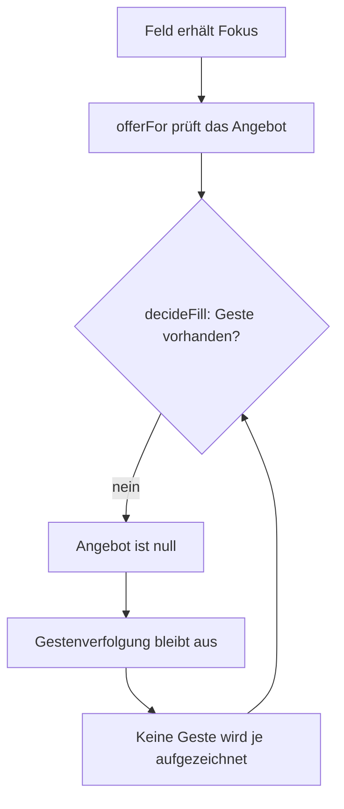
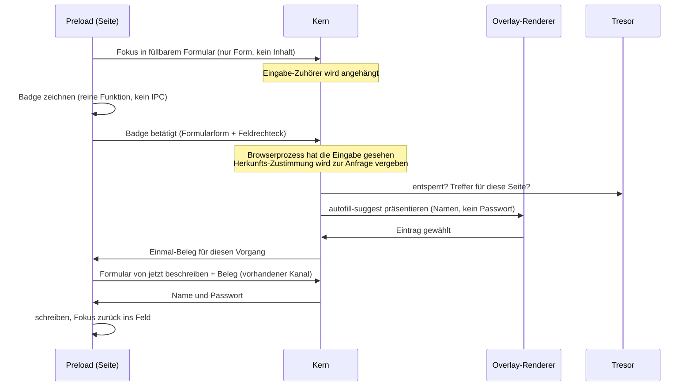
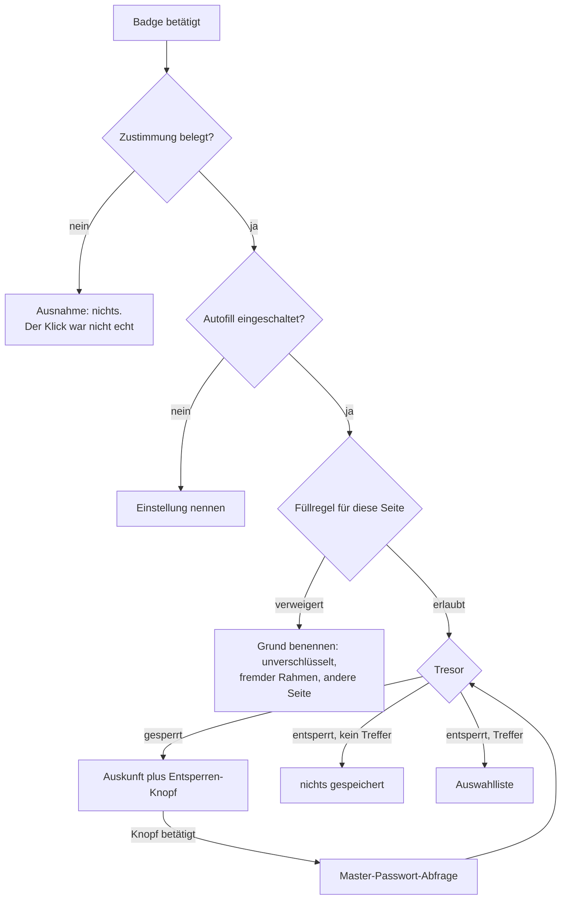
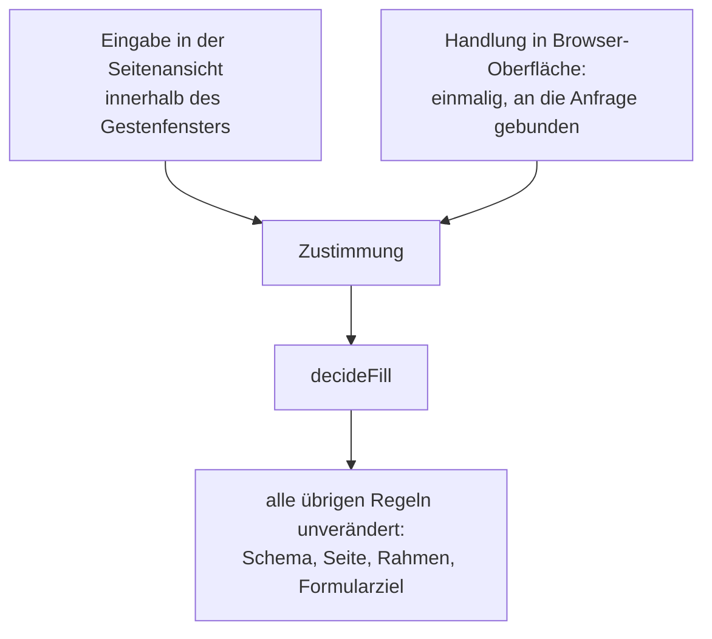

# Password Autofill Trigger Model - Plan

## Goal Capsule

- **Ziel.** Autofill füllt aus. Der Auslöser wird von „Liste erscheint beim Fokus" auf „Badge im Feld, Klick öffnet die Auswahl auf der Overlay-Schicht" umgestellt, und ein zweiter Weg aus der Browser-Oberfläche kommt daneben.
- **Produkthoheit.** Dieser Plan besitzt den Auslöse- und Zustimmungsweg des Ausfüllens sowie die Sichtbarkeit des Tresorzustands. Der Speicherpfad bleibt unberührt. Von den Füllregeln ändert sich genau eine: woraus die Zustimmung entsteht. Jede andere Regel bleibt Zeile für Zeile, wie sie ist.
- **Autoritätsreihenfolge.** Produktverhalten entscheidet die jeweilige R-Nummer; den Mechanismus entscheidet die zugehörige KTD innerhalb dieser R-Grenzen; eine Einheit hebt keins von beidem auf.
- **Ausführungsprofil.** U1 bis U4 sind **eine** Auslieferung und dürfen nicht dazwischen geschnitten werden: U1 allein macht die vorhandene Liste im Dokument der Seite erstmals funktionsfähig — genau die Fläche, die R5 aus der Seite nimmt. U5 folgt unmittelbar. Zusammen sind U1 bis U5 Stufe 1, die ohne Stufe 2 auslieferbar ist. U6 und U7 sind Stufe 2.
- **Abbruchbedingungen.** Anhalten und fragen, wenn eine Füllregel über die Zustimmungsquelle hinaus gelockert werden müsste, wenn eine Produktentscheidung des Product Contract im Weg steht, oder wenn das Preload über 35 kB wachsen würde.
- **Product-Contract-Erhalt.** Product Contract in seinen Entscheidungen unverändert. Präzisiert wurden: R1 (Badge bleibt sichtbar, solange seine Liste offen ist), R2 (Vertrauensgrenze ist die Seitenansicht, nicht der Hauptprozess), R3 (Tastaturbedienung), R8 (zwei benannte Ausnahmen), Key Decision 2 (Belegkraft der Vorbilder). Alle aus dem Dokumenten-Review, keine Umfangsänderung.
- **Abschluss.** Automatisierte Prüfung deckt alles außer dem Durchgang in der laufenden Anwendung ab; der bleibt beim Benutzer, weil in dieser Umgebung kein autonomer Anwendungsstart erfolgt. Der Durchgang ist im Verification Contract benannt.

---

## Product Contract

### Summary

Ein füllbares Passwortfeld bekommt ein Badge; der Klick darauf öffnet die Auswahlliste auf der Overlay-Schicht des Browsers und ist zugleich die Zustimmung, die den Füllvorgang autorisiert. Daneben entsteht ein zweiter Weg aus echter Browser-Oberfläche — Toolbar, Tastenkürzel, Kontextmenü —, der den Sperrzustand des Tresors sichtbar macht und ihn dort auflösen lässt.

### Problem Frame

Autofill ist vollständig gebaut und kann nichts anbieten. Es gibt eine Zirkularität zwischen zwei Stellen, die einzeln beide richtig aussehen:

`src/main/passwords/install-autofill.ts:98` hängt den Eingabe-Zuhörer erst an, **nachdem** ein Angebot zustande kam — begründet damit, dass `offerFor` bereits aus allen Gründen abgelehnt habe, für die Verfolgung Verschwendung wäre. `src/main/passwords/AutofillService.ts:236` baut das Angebot aber über `fillableSubjects`, und das läuft durch die volle `decideFill`, deren erste Prüfung in `src/shared/passwords/fill-policy.ts:242` eine Geste verlangt. `noteInput` hat in der gesamten Anwendung genau einen Aufrufer, und der steht hinter dieser Sperre.

Die Regel selbst ist richtig; sie sitzt eine Stufe zu früh. Das Angebot trägt bewusst keine Passwörter — `AutofillService.ts:218` schreibt, es müsse wertlos sein, wenn eine Seite es beliebig oft auslöst. Passbolt und Bitwarden gaten aus demselben Grund das Füllen und nicht das Anbieten, und ihr Symbol im Feld ist der Erzeuger der Zustimmung.

Unentdeckt blieb das, weil jeder Angebots-Test in `tests/autofill-service.test.ts:251` die Geste über ein Hilfsmittel direkt einsetzt, das die echte Verdrahtung nie erzeugt, und weil `src/main/passwords/install-autofill.ts` keinen eigenen Test hat. Ausgerechnet die Datei, die `tests/architecture.test.ts:845` als „der Test, der `installAutofill()` gefangen hätte" führt, ist selbst ungeprüft.

Der Speicherpfad ist davon nicht betroffen: `reportSubmission` fragt nie nach einer Geste. Der Tresor füllt sich also und füllt nie aus. Dazu kommt ein zweites stilles Versagen, das `docs/IMPROVEMENT-PLAN.md:594` bereits benennt: der Tresor sperrt nach 15 Minuten, nichts in der Oberfläche zeigt das an, und der Nutzer erlebt „Autofill funktioniert manchmal".

### Key Decisions

- Das Badge trägt die Zustimmung, nicht der Fokus. Eine Seite kann Fokus jederzeit erzwingen; ein Klick auf unser eigenes Zeichen ist die Handlung, die sie nicht auslösen kann. Governs R3, R4.
- Die Auswahlliste wird in Browser-Oberfläche gezeichnet, nicht im Dokument der Seite. Eine nachgebaute Liste zeigt zwar keine Passwörter, ist aber ein Phishing-Köder: die Seite lernt, welchen Account der Nutzer hier erwartet, und baut ihre Maske passend. Dasselbe Argument steht schon in `src/main/passwords/AutofillService.ts:55-77` für das Master-Passwort. Passbolt und Bitwarden belegen diesen Schritt **nicht** — beide zeichnen ihre Liste im Dokument der Seite, weil eine Erweiterung keine Browser-Oberfläche zeichnen kann. Ihr Beleg trägt das Symbol im Feld; die Platzierung der Liste ist der Schritt, den dieser Browser gehen kann und sie nicht. Governs R5, R6, R9.
- Die Sichtbarkeit des Badges hängt an der Formularform, nicht am Tresorinhalt. Das ist der einzige Zuschnitt, der nie schweigt, und er gibt der Seite keine Auskunft über gespeicherte Zugangsdaten. Governs R1, R2, R8.
- Keine Füllregel wird gelockert. `decideFill` behält jede Regel; ausgetauscht wird allein der Erzeuger der Zustimmung. Governs R4.
- Ein aus Browser-Oberfläche ausgelöster Füllvorgang belegt seine Zustimmung durch die eigene Herkunft. Ein Klick in der Toolbar ist kein Eingabeereignis in der Seite; ohne eigene Herkunftsregel liefe Stufe 2 in denselben Fehler eine Etage höher. Governs R11.
- Das Preload darf durch diese Arbeit nicht wachsen, muss aber auch nicht unter das Budget zurück. Die Sanierung ist eine eigene Aufgabe und wird hier nicht mitgeschleppt; die Obergrenze steht in den Success Criteria.
- Lieferung in zwei Stufen, Seite zuerst. Stufe 1 — Badge und Overlay-Liste — löst die Sperre auf, ohne neue Konzepte in der Browser-Oberfläche zu brauchen, und ist allein auslieferbar. Stufe 2 — Toolbar, Tastenkürzel, Kontextmenü — erledigt das zweite stille Versagen. Governs R10, R11, R12, R13.

### Requirements

**Auslösen und Zustimmung**

- R1. Ein Passwortfeld, in das gefüllt werden könnte, trägt ein Badge, solange es den Fokus hat oder eine Auswahlliste für dieses Feld offen ist.
- R2. Bevor das Badge geklickt wurde, erreicht keine Auskunft über den Tresorinhalt die Seitenansicht. Die Anzeige aus R10 bleibt davon unberührt: sie landet in Browser-Oberfläche, die die Seite weder lesen noch zeichnen kann.
- R3. Nichts wird gefüllt, bevor der Nutzer das Badge betätigt und danach einen Eintrag der Auswahlliste gewählt hat. Beides ist mit Maus und mit Tastatur bedienbar.
- R4. Ein Füllvorgang braucht eine Zustimmung, die der Browserprozess selbst festgestellt hat. Es gibt genau zwei Quellen: eine Eingabe in der Seitenansicht innerhalb des Gestenfensters, und eine Handlung in Browser-Oberfläche. Die zweite ist einmalig und an den Vorgang gebunden, den sie autorisiert.

**Wo gezeichnet wird**

- R5. Die Auswahlliste wird auf der Overlay-Schicht des Browsers gezeichnet und nicht im Dokument der Seite.
- R6. Die Liste ist an dem Feld verankert, zu dem sie gehört, und folgt ihm nicht über Scrollen, Zoom oder Umbruch hinweg, sondern schließt sich.
- R7. In der Seite verbleibt nur das Badge. Es meldet die Form des Formulars und die Lage des Feldes und empfängt nie Zugangsdaten außer dem einen Wert, den es schreibt.

**Antwort in jedem Zustand**

- R8. Jeder Klick auf das Badge führt zu einer sichtbaren Antwort. Zwei Ausnahmen, beide benannt: ein Klick ohne Zustimmung, die der Browserprozess selbst gesehen hat, bleibt unbeantwortet — er war keine Handlung des Nutzers, und eine Antwort darauf wäre eine Auskunft an die Seite. Und ein Klick, dessen Fläche die Overlay-Schicht nicht bekommt, weil etwas Höherrangiges sie hält, bleibt ebenfalls aus.
- R9. Die Master-Passwort-Abfrage erscheint ausschließlich in Browser-Oberfläche, nie im Dokument der Seite, und wird nie unmittelbar durch eine Nachricht aus der Seitenansicht erhoben.

**Zweiter Weg aus der Browser-Oberfläche**

- R10. Ein Symbol in der Toolbar zeigt an, ob der Tresor gesperrt ist und ob für die aktuelle Seite etwas zu füllen wäre.
- R11. Ein Füllvorgang, der aus Browser-Oberfläche ausgelöst wurde, weist seine Zustimmung über die Herkunft nach statt über eine Eingabe in der Seite. Alle übrigen Füllregeln gelten für ihn unverändert.
- R12. Füllen ist per Tastenkürzel und aus dem Seiten-Kontextmenü auslösbar.
- R13. Der Tresor lässt sich aus der Toolbar entsperren.

**Nachweis, dass es läuft**

- R14. Eine automatisierte Prüfung schlägt fehl, wenn die Kette aus Meldung, Zustimmung und Füllen in der echten Verdrahtung keine Zustimmung erzeugen kann. Sie darf keinen Zustand von Hand einsetzen, den nur der Anwendungslauf herstellt.

### Key Flows

- F1. Füllen aus der Seite
  - **Auslöser:** Der Nutzer setzt den Fokus in ein füllbares Passwortfeld.
  - **Schritte:** Badge erscheint · Betätigung erzeugt die Zustimmung zum Öffnen · Zustand des Tresors bestimmt die Antwort · Auswahl auf der Overlay-Schicht · erneute Prüfung gegen das Dokument · Schreiben.
  - **Ergebnis:** Name und Passwort stehen im Formular, oder der Nutzer weiß, warum nicht.
  - **Deckt ab:** R1, R3, R4, R5, R8, R9

- F2. Füllen aus der Browser-Oberfläche
  - **Auslöser:** Klick auf das Toolbar-Symbol, Tastenkürzel oder Eintrag im Seiten-Kontextmenü.
  - **Schritte:** Herkunft belegt die Zustimmung · Zustand des Tresors bestimmt die Antwort · Auswahl · Prüfung gegen das Dokument · Schreiben.
  - **Ergebnis:** Wie F1, ohne dass die Seite den Vorgang beobachten oder auslösen konnte.
  - **Deckt ab:** R10, R11, R12, R13

### Acceptance Examples

- AE1. **Deckt R1, R8, R9 ab.** Gegeben ein gesperrter Tresor, wenn der Nutzer das Badge betätigt, dann erscheint die Auswahlfläche mit der Auskunft „Tresor gesperrt" und einem Entsperren-Knopf; erst dessen Betätigung erhebt die Master-Passwort-Abfrage.
- AE2. **Deckt R1, R2, R8 ab.** Gegeben ein entsperrter Tresor ohne Eintrag für diese Seite, wenn der Nutzer das Badge betätigt, dann sagt die Antwort, dass nichts gespeichert ist. Vor dieser Betätigung hat die Seite keinen Kernaufruf erzeugt, der den Tresor befragt.
- AE3. **Deckt R4, R8 ab.** Gegeben eine Seite, die ein Passwortfeld ohne Zutun des Nutzers fokussiert und das Badge programmgesteuert anzuklicken versucht, dann geschieht nichts — keine Fläche, keine Antwort, kein Füllvorgang.
- AE4. **Deckt R8 ab.** Gegeben eine Seite über unverschlüsseltes HTTP außerhalb der Loopback-Adresse, wenn der Nutzer das Badge betätigt, dann nennt die Antwort, dass hier nicht gefüllt wird, statt schweigend nichts zu tun.
- AE5. **Deckt R11 ab.** Gegeben ein Auslösen aus der Toolbar ohne jede vorherige Eingabe in der Seite, dann wird gefüllt — und alle übrigen Füllregeln, darunter der Ausschluss eingebetteter Rahmen und fremder Formularziele, greifen unverändert.
- AE6. **Deckt R6 ab.** Gegeben eine offene Auswahlliste, wenn die Seite scrollt, zoomt oder ihr Umbruch sich ändert, dann schließt sich die Liste, statt an einer falschen Stelle stehen zu bleiben.
- AE7. **Deckt R14 ab.** Gegeben die echte Verdrahtung ohne von Hand eingesetzten Zustand, wenn ein Nutzer den Ablauf aus F1 durchläuft, dann kommt eine Zustimmung zustande und ein Füllvorgang wird autorisiert.
- AE8. **Deckt R4 ab.** Gegeben ein abgeschlossener Füllvorgang aus der Browser-Oberfläche, wenn die Seite denselben Vorgang ein zweites Mal anstößt, dann wird nichts gefüllt: die Zustimmung war einmalig und ist verbraucht.
- AE9. **Deckt R8 ab.** Gegeben ausgeschaltetes Autofill, wenn der Nutzer das Badge betätigt, dann nennt die Antwort die Einstellung, statt nichts zu tun.
- AE10. **Deckt R1, R3 ab.** Gegeben ein per Tastatur erreichtes Passwortfeld, wenn der Nutzer das Badge per Tabulator erreicht und mit Eingabetaste betätigt, dann öffnet die Liste und ist mit Pfeiltasten und Eingabetaste bedienbar; das Badge bleibt sichtbar, solange die Liste offen ist.

### Success Criteria

- Der Weg von „Feld angeklickt" zu „Passwort steht im Formular" ist ohne Vorwissen und ohne Umweg über die Passwortseite gehbar, mit Maus wie mit Tastatur.
- Es gibt keinen Zustand des Tresors, in dem Autofill kommentarlos nichts tut.
- Der Sperrzustand des Tresors ist in der Toolbar ablesbar, ohne die Seite zu berühren, und ein Füllvorgang ist von dort auslösbar.
- Das Preload wächst durch diese Arbeit nicht über die heutigen 35 kB. Das Budget von 22 kB bleibt überschritten und wird hier nicht zurückgeholt (`scripts/metrics.mjs`, Ausstieg mit 1). Die Differenz vor U1 und nach U4 wird gemessen und notiert.

### Scope Boundaries

- Anmeldungen in Einzelseiten-Anwendungen ohne `submit`-Ereignis. Heute nicht erkannt und in `src/preload/autofill.ts:434` als bekannte Grenze benannt. Braucht eine eigene Heuristik über verschwindende Passwortfelder.
- Einmalpasswörter (TOTP). Passbolt füllt sie; unser Tresor kennt sie nicht.
- Passwortgenerierung im Formular. Passbolt bietet sie am selben Symbol an; hier bewusst abgeschnitten.
- Auffindbarkeit von Chrome-Import und Tresorverwaltung außerhalb der Toolbar-Anzeige aus R10.
- Die Sanierung der überschrittenen Budgets. Weder das Preload zurück unter 22 kB noch Renderer, Hauptprozess oder die überlangen Dateien aus `scripts/metrics.mjs`.
- Die Füllregeln jenseits der Zustimmungsquelle und der gesamte Speicherpfad. `decideFill` behält Schema-, Seiten-, Rahmen- und Formularziel-Prüfung Zeile für Zeile; U1 tauscht allein den ersten Prüfschritt aus.

#### Deferred to Follow-Up Work

- Die konfigurierbare Leerlaufsperre des Tresors (`src/shared/passwords/vault.ts:44`, 15 Minuten, fest verdrahtet). R10 macht den Zustand sichtbar; einstellbar wird er hier nicht.
- Die Überlänge von `src/renderer/internal/PasswordsPage.tsx` (788 Zeilen, über der Grenze aus `scripts/metrics.mjs`).
- Die Budget-Sanierung des Preloads, ausgehend von der in U4 gemessenen Differenz.

### Dependencies / Assumptions

- Die Overlay-Schicht trägt bereits typisierte Flächenarten mit Antwort-Semantik, darunter `master-password` (`src/shared/overlay/surface.ts`).
- Untergeordnete Rahmen haben in diesem Browser kein Preload (`nodeIntegrationInSubFrames: false`). Dort erscheint kein Badge — als Tatsache der Verdrahtung, nicht als Regel dieses Plans.
- Der Speicherpfad funktioniert heute und bleibt der Weg, auf dem Zugangsdaten in den Tresor kommen.
- `scripts/metrics.mjs` beendet mit 1, sobald ein Budget überschritten ist. `pnpm run quality` ist vor Beginn dieser Arbeit bereits rot: sechs Prüfungen sind über der Grenze.
- Chromium-Pinch-Zoom verändert `window.visualViewport.scale` und den Versatz. Wird das in einer Umgebung nicht gemeldet, fällt die Liste auf Schließen bei jeder Viewport-Änderung zurück, statt falsch zu platzieren.
- Der Overlay-Renderer darf Benutzernamen sehen. Er ist unsere eigene, vertrauenswürdige Oberfläche — dieselbe, die schon die Master-Passwort-Abfrage zeichnet.

---

## Planning Contract

### Key Technical Decisions

- KTD1. **Das Badge bleibt in der Seite gezeichnet; nur die Liste zieht in die Chrome.** Als Overlay-Fläche würde das Badge die Schicht halten, solange irgendein Passwortfeld fokussiert ist — es würde Klicks auf die Seite schlucken und nach `OVERLAY_PRECEDENCE` Kachelleiste und Suchleiste verdrängen. Governs R1, R5, R7. (session-settled: user-approved — chosen over Badge als Overlay-Fläche: eine dauerhaft gehaltene Schicht macht die Seite unbenutzbar.)
- KTD2. **Die Liste wird eine neue Overlay-Art `autofill-suggest` mit eigenen Bounds,** nach dem Muster von `find-bar`: die Fläche trägt ihr Rechteck selbst, weil nur sie weiß, an welchem Feld in welcher Kachel sie hängt. Vorrang 2, gleichauf mit dem Layout-Menü — sie darf eine Berechtigungs- oder Master-Passwort-Abfrage nicht verdrängen und von einer überfahrenen Kachelleiste nicht verdrängt werden. Governs R5, R6.
- KTD3. **Die Liste markiert die Seite, statt eine Antwort zu erwarten.** `OVERLAY_MARKS_THE_PAGE` statt `OVERLAY_AWAITS_ANSWER`: es hängt kein Versprechen daran, aber ihr Abgang muss den Offen-Zustand des Badges in der Seite zurücknehmen und die offene Anfrage im Kern verwerfen — dieselbe Form wie die Fundmarkierung der Suchleiste. Governs R6.
- KTD4. **Der Badge-Klick autorisiert das Öffnen, nicht das Füllen.** Eine Overlay-Eingabe zählt *nicht* als Geste der Seitenansicht: die Overlay-Ansicht trägt alle Flächenarten, also würde Getipptes in der Suchleiste oder eine Antwort in der Berechtigungsabfrage laufend Zustimmung für die Seite darunter erzeugen — und niemand hört diese Eingabepipeline heute ab. Stattdessen prägt der Badge-Klick, den der Browserprozess als echtes Eingabeereignis der Seitenansicht gesehen hat, eine Zustimmung nach KTD5, die den ganzen Vorgang bis zur Auswahl trägt. Damit verfällt sie nicht nach fünf Sekunden Lesezeit. Governs R4.
- KTD5. **Zustimmung wird ein typisierter Eingabewert von `decideFill`, kein zweiter Pfad.** Zwei Erzeuger, eine Regel: eine Eingabe in der Seitenansicht mit Zeitstempel, wie bisher — und eine Herkunfts-Zustimmung, die der Kern zu einer Anfrage vergibt. Die zweite ist **einmalig und an die Anfrage-Kennung gebunden**: sie entsteht beim Auslösen, wird vom ersten autorisierten Füllvorgang verbraucht und ist verworfen, sobald die Anfrage beantwortet ist, die Fläche die Schicht verlässt, die Ansicht ihren Hauptrahmen navigiert, der Tresor sperrt oder die Ansicht vergessen wird. Ohne diese Schranken wäre die Regel `no-user-gesture` für die Kachel dauerhaft erfüllt und ein verstecktes Formular könnte sich später ohne Zutun füllen lassen. Governs R4, R11.
- KTD6. **Die Verweigerungsgründe der Füllregel werden zur Antwort des Badges.** `FillRefusal` trägt je Angriff einen eigenen Wert (`insecure-page`, `cross-origin-frame`, `different-site`, …); die Fläche formuliert daraus die ehrliche Auskunft statt „nichts gefunden". Der Grund wird in der Chrome zu Text, nicht im Preload — die Wortliste gehört nicht in ein Bündel, das vor jeder Seite geparst wird. Governs R8.
- KTD7. **Der Kern-Rundlauf beim Fokus entfällt.** Die Sichtbarkeit des Badges ist `chooseFillTargets(form) !== null`, eine reine Funktion, die das Preload schon hat. Der heutige synchrone Aufruf bei jedem Fokus eines füllbaren Passwortfeldes (`src/preload/autofill.ts:355`) verschwindet; gefragt wird erst bei der Betätigung. Governs R1, R2.
- KTD8. **Die Auswahl läuft über den vorhandenen Füllkanal, mit einem Einmal-Beleg statt der Tresor-Kennung.** Der Kern schickt der Seite nicht die Eintrags-Kennung — die wäre ein dauerhaft gültiger Verweis, den der Renderer später erneut einlösen könnte —, sondern einen zur offenen Anfrage vergebenen Beleg. Das Preload beschreibt das Formular neu und fragt wie bisher über `AUTOFILL_FILL_CHANNEL`; `fillFor` löst den Beleg gegen die gemerkte Kennung ein und verwirft ihn dabei. Die Prüfung gegen das Dokument von jetzt bleibt unverändert. Governs R3, R7.
- KTD9. **Feldgeometrie: das Preload meldet, der Kern rechnet um.** Gemeldet werden CSS-Pixel aus `getBoundingClientRect()` plus Skalierung und Versatz des visuellen Viewports; der Kern rechnet mit dem Seitenzoom der Kachel und den Bounds der Ansicht in Fensterkoordinaten um. Bei Scrollen, Zoom oder Größenänderung schließt die Liste, statt mitzuwandern. Governs R6. (session-settled: user-approved — chosen over Mitwandern: die Umrechnung fortlaufend richtig zu halten kostet mehr als das Schließen, und bei Scrollen schließt die Liste heute schon.)
- KTD10. **Die vorhandene Listen-Implementierung in der Seite wird entfernt, nicht stillgelegt.** Zwei Implementierungen derselben Fläche driften, und sie liegt im teuersten Bündel. Mit ihr entfallen die Wortliste der Seitenliste und ihr Anteil am Übertragungsvertrag. Governs R7. (session-settled: user-approved — chosen over Liegenlassen: dead code im Preload zahlt bei jeder Seite in jedem Tab.)
- KTD11. **Die Verfügbarkeitsanzeige der Toolbar bekommt ein eigenes, zustimmungsfreies Prädikat.** „Gäbe es hier etwas zu füllen" muss beantwortbar sein, bevor Zustimmung, Formular und Feldrechteck existieren — `decideFill` mit erfundener Zustimmung aufzurufen wäre das zweite Prädikat, vor dem `fill-policy.ts` im Kopf ausdrücklich warnt. Der nicht situationsabhängige Teil (Schema, Seite) wird als eigenes Prädikat freigelegt, nach dem Muster von `originMayReceiveCredentials`. Die Anzeige darf damit optimistisch sein; `decideFill` bleibt beim Füllen die einzige entscheidende Stelle. Governs R10.
- KTD12. **Badge und Liste sind mit der Tastatur bedienbar.** Das Badge ist vom Feld aus per Tabulator erreichbar und mit Eingabe- oder Leertaste zu betätigen; die Liste läuft mit Pfeiltasten, Eingabetaste wählt, Escape schließt. Die Gestenerkennung akzeptiert Tastendrücke bereits, es fehlt nur die Bedienung. Governs R3.

### High-Level Technical Design

Vier Beteiligte, und die Grenze zwischen ihnen ist die Sicherheitsaussage: die Seite zeichnet nur das Badge, alles mit Namen darin liegt in Browser-Oberfläche.

Die Betätigung des Badges verzweigt in fünf Antworten und zwei benannte Ausnahmen:

Zwei Zustimmungsquellen, eine Regel — das ist der Kern der Umstellung:

### Risks & Dependencies

- **Die Koordinatenumrechnung ist der härteste Teil und die Tests prüfen sie mit erfundenen Zahlen.** Feldrechteck in CSS-Pixeln, Seitenzoom aus der Kachel, Pinch-Skalierung und -Versatz aus dem visuellen Viewport, Bounds der Ansicht — vier Faktoren, deren Zusammenspiel eine Tabelle belegen, aber nicht beweisen kann. Abgemildert dadurch, dass ein Fehler sichtbar ist (die Liste steht daneben) und nicht still. Der Durchgang in der laufenden Anwendung ist hier der eigentliche Nachweis.
- **Die Fläche nimmt den Fokus und muss ihn zurückgeben.** `takesFocus` gilt für jede Menü-artige Art, und der Overlay-Renderer ist echter Web-Inhalt: sein Fokus nimmt ihn dem Feld, das Dokument feuert `focusout`. Deshalb hängt die Sichtbarkeit des Badges nach R1 nicht am Fokus allein, sondern auch an der offenen Liste — sonst verschwände das Badge in dem Moment, in dem seine eigene Liste erscheint. Nach dem Schreiben geht der Fokus zurück ins Feld.
- **Ein Kriterium dafür, was in der Seite bleiben darf**, statt zweier: eine Fläche darf in der Seite bleiben, wenn eine nachgebaute Kopie dem Angreifer weder ein Geheimnis noch eine Auskunft über den Nutzer einträgt **und** ihn keine Handlung lehrt, die er später in Browser-Oberfläche wiederholt. Das Badge besteht — ein Klick darauf landet in der Seite und kann unsere Fläche nicht erheben. Die Liste besteht nicht — sie lehrt die Seite, welchen Account der Nutzer erwartet. Die Speicherleiste besteht — ihre Antwort ist eines von drei Verben über ein Passwort, das die Seite gerade selbst entgegengenommen hat.
- **Die Overlay-Schicht kann die Fläche ablehnen.** Bei Vorrang 2 hält etwas Höherrangiges sie unter Umständen — etwa wenn zwischen Entsperren und Präsentation eine Seite eine Berechtigung anfragt. Das ist die zweite benannte Ausnahme zu R8; der Kern prüft es vorab, statt es als stille Ablehnung zu erleben.

### Sequencing

U1 → U2 → U3 → U4 sind **eine Auslieferung**; U1 und U2 sind voneinander unabhängig und können parallel beginnen, U3 braucht U2, U4 braucht U1 bis U3. U5 folgt unmittelbar und schließt Stufe 1 ab. U6 und U7 setzen auf U1 bis U4 auf; U7 folgt U6, weil Kürzel und Kontextmenü denselben Vorgang auslösen wie der Toolbar-Knopf.

---

## Implementation Units

### U1. Zustimmung von der Angebotsprüfung lösen

- **Goal:** Zustimmung wird ein typisierter Wert mit zwei Erzeugern und klaren Schranken; der Eingabe-Zuhörer hängt an der Form des Formulars statt am Zustandekommen eines Angebots; die Verdrahtung bekommt eine testbare Nahtstelle und die Toolbar ihr Prädikat.
- **Requirements:** R4, R10 · KTD4, KTD5, KTD11
- **Dependencies:** keine
- **Files:** `src/shared/passwords/fill-policy.ts` · `src/shared/passwords/consent.ts` (neu) · `src/main/passwords/AutofillService.ts` · `src/main/passwords/install-autofill.ts` · `src/shared/passwords/wire.ts` · `tests/autofill-service.test.ts` · `tests/passwords-fill-policy.test.ts`
- **Approach:**
  1. `FillContext.lastGestureAt` weicht einem typisierten Zustimmungswert mit zwei Erzeugern: Seiteneingabe mit Zeitstempel, und Herkunfts-Zustimmung mit Anfrage-Kennung. `decideFill` prüft ihn an derselben ersten Stelle; jede weitere Regel bleibt Zeile für Zeile.
  2. Die Herkunfts-Zustimmung ist einmalig und gebunden. Der Kern hält je Ansicht höchstens eine offene Anfrage, verbraucht sie beim ersten autorisierten Füllvorgang und verwirft sie bei Flächenabgang, Hauptrahmen-Navigation, Tresorsperre und `forget(viewId)`.
  3. Den nicht situationsabhängigen Teil der Füllregel — Schema und Seite, ohne Zustimmung, Formular und Rahmen — als eigenes Prädikat freilegen, nach dem Muster von `originMayReceiveCredentials`. `decideFill` ruft es selbst auf, damit es keine zweite Meinung wird.
  4. Ein neuer Kanal meldet dem Kern, dass diese Ansicht ein füllbares Formular hat. Er trägt keinen Inhalt und keine Antwort und ersetzt das Angebot als Tor für die Gestenverfolgung. Der Kern hängt den Zuhörer nur an, wenn `passwords.autofill` eingeschaltet ist, und löst ihn, sobald die Einstellung ausgeht oder die Ansicht kein füllbares Feld mehr fokussiert hat.
  5. Die Pro-Ansicht-Verdrahtung aus `install-autofill.ts` als exportierte Funktion über einer schmalen Schnittstelle herauslösen — dasselbe Muster, mit dem `AutofillView` den Dienst testbar macht. `installAutofill` bleibt der Electron-Aufsatz darüber und behält seinen einzigen `app`-Import.
- **Patterns to follow:** `isFillGestureInput` in `src/shared/passwords/gesture.ts` bleibt der einzige Leser der untypisierten Nutzlast. Die Erzeuger sind reine Funktionen im `shared`-Baum, wie `fillableSubjects`. `AutofillView` in `AutofillService.ts` ist das Vorbild für die Nahtstelle aus Schritt 5.
- **Execution note:** Test zuerst. Der erste Test ist der, den es heute nicht gibt: die Zirkularität als fehlschlagender Fall, bevor irgendetwas umgebaut wird.
- **Test scenarios:**
  - Deckt AE3 ab. Ohne jede Eingabe verweigert `decideFill` mit `no-user-gesture`, auch wenn keine Herkunfts-Zustimmung gesetzt ist.
  - Eine Seiteneingabe innerhalb des Fensters erlaubt; dieselbe Eingabe nach Ablauf des Fensters verweigert; ein Zeitstempel in der Zukunft verweigert.
  - Eine Herkunfts-Zustimmung erlaubt ohne jede Seiteneingabe — und wird von keiner der übrigen Regeln durchgelassen, wenn Schema, Seite, Rahmen oder Formularziel nicht passen.
  - Deckt AE8 ab. Eine verbrauchte Herkunfts-Zustimmung autorisiert keinen zweiten Füllvorgang.
  - Eine Herkunfts-Zustimmung ohne passende Anfrage-Kennung verweigert mit `no-user-gesture`.
  - Flächenabgang, Hauptrahmen-Navigation, Tresorsperre und Ansichtsende verwerfen die offene Zustimmung, je einzeln geprüft.
  - Keine aus der Seitenansicht eintreffende Nachricht erzeugt je eine Herkunfts-Zustimmung.
  - Der Zuhörer wird angehängt, sobald eine Ansicht ein füllbares Formular meldet, und nicht angehängt, wenn `passwords.autofill` aus ist.
  - Das zustimmungsfreie Prädikat sagt für eine unverschlüsselte Seite außerhalb der Loopback-Adresse nein und für eine passende `https:`-Seite ja.
  - Ein Angebot wird gebaut, wenn Zustimmung vorliegt — der Fall, der heute unerreichbar ist.
- **Verification:** `pnpm test` grün; die Fälle in `tests/passwords-fill-policy.test.ts` laufen bis auf die Zustimmungsprüfung unverändert weiter.

### U2. `autofill-suggest` auf dem Overlay-Vertrag

- **Goal:** Die neue Flächenart existiert im typisierten Overlay-Vertrag, mit allen Antworten, die der Typprüfer verlangt, und mit ihrer Geometrie und Größe.
- **Requirements:** R5, R6 · KTD2, KTD3, KTD9
- **Dependencies:** keine
- **Files:** `src/shared/overlay/surface.ts` · `src/shared/passwords/suggest-bounds.ts` (neu) · `src/shared/ipc/channels.ts` · `src/shared/ipc/contract.ts` · `tests/overlay-surface.test.ts` · `tests/anchor.test.ts`
- **Approach:**
  1. `OVERLAY_KINDS` um `autofill-suggest` erweitern und die fünf `satisfies`-Tabellen beantworten: Region `tile` (eigene Bounds), erwartet keine Antwort, markiert die Seite, übernimmt die Tastatur nicht, Vorrang 2. Dazu die erschöpfenden Schalter `takesFocus` (ja) und `surfaceIdentity` (Anfrage-Kennung) sowie den Zweig in `overlayBounds`, der das eigene Rechteck zurückgibt.
  2. `suggest-bounds.ts` ist reine Geometrie: Feldrechteck in Seitenkoordinaten plus Skalierung, Versatz und Ansichts-Bounds ergeben ein Fensterrechteck; `anchorSurface` platziert die Liste darunter oder darüber.
  3. Feste Maße nach dem Muster von `src/shared/find/bar.ts` — eine Zeilenhöhe, eine Höchstzahl sichtbarer Zeilen, eine feste Breite, Auskunftszustände als eine Zeile. Die Höhe folgt daraus, wird auf die Kachel geklammert, und bei einem leeren Rechteck wird nichts präsentiert.
  4. Präsentation und Antwort als Kanäle in den Vertrag aufnehmen.
- **Patterns to follow:** `src/shared/find/bar.ts` für eine Fläche mit eigenem Rechteck und festen Maßen. `src/shared/ui/anchor.ts` für reine Geometrie mit Tabellentests. Trennung `model`/`schema` nach `docs/solutions/performance-issues/renderer-bundle-bloat-zod-co-location.md`.
- **Test scenarios:**
  - Jede Tabelle und jeder Schalter enthält die neue Art — der Typprüfer erzwingt es, ein Test hält es lesbar fest.
  - Vorrang: die Liste verdrängt Kachelleiste und Suchleiste; Berechtigungs-, Navigations- und Master-Passwort-Abfrage verdrängen die Liste; die Liste verdrängt keine davon.
  - Ihr Abgang wird gemeldet, weil sie die Seite markiert; erneutes Präsentieren mit derselben Anfrage-Kennung ist kein Abgang.
  - Geometrie: Feld oben im Viewport ergibt eine Liste darunter; Feld unten am Rand ergibt eine Liste darüber; ein Feld außerhalb des sichtbaren Bereichs ergibt kein Rechteck.
  - Geometrie bei Seitenzoom 150 % und bei Pinch-Skalierung 2,0 mit Versatz.
  - Mehr Einträge als sichtbare Zeilen ergeben die Höchsthöhe, nicht mehr; eine zu kleine Kachel ergibt kein Rechteck.
- **Verification:** `pnpm run typecheck` grün — ein fehlender Tabelleneintrag ist hier ein Build-Fehler. `pnpm test` grün.

### U3. Die Auswahlfläche im Overlay-Renderer

- **Goal:** Die Liste ist als Fläche gezeichnet, in `src/renderer/src/surfaces/`, mit allen fünf Antwortzuständen, tastaturbedienbar und für Screenreader ansagbar.
- **Requirements:** R3, R5, R8 · KTD6, KTD12
- **Dependencies:** U2
- **Files:** `src/renderer/src/surfaces/AutofillSuggestSurface.tsx` (neu) · `src/renderer/src/surfaces/OverlaySurface.tsx` · `src/renderer/src/styles.css` · `src/shared/i18n/catalog.de.ts` · `src/shared/i18n/catalog.en.ts` · `tests/components/` (neue Komponententests)
- **Approach:**
  1. Die Fläche rendert, was die Präsentation trägt, und fragt nichts nach: Liste von Namen, oder eine Auskunft — gesperrt (mit Entsperren-Knopf), nichts gespeichert, Grund der Verweigerung, Autofill ausgeschaltet.
  2. Eine Auswahl schickt Anfrage-Kennung und Eintrags-Kennung zurück — nie einen Namen und nie ein Passwort.
  3. Escape schließt. **Kein Schließen bei einem Klick daneben:** bei Region `tile` ist die Schicht auf das Listenrechteck zugeschnitten, ein Klick daneben landet in der Seitenansicht und erreicht diese Fläche nie. Das Schließen von außen liegt in U4.
  4. Tastatur: Pfeiltasten laufen die Liste, Eingabetaste wählt, Escape schließt.
  5. Semantik: die Liste als `listbox` mit `option`-Einträgen; jeder Auskunftszustand als Text in einer `aria-live="polite"`-Region, damit der Zustandswechsel angesagt wird.
  6. Jede sichtbare Zeichenkette geht durch den Übersetzer; die Fitness-Funktionen in `tests/architecture.test.ts:1425` und `:1440` erzwingen es.
- **Patterns to follow:** `src/renderer/src/surfaces/PermissionSurface.tsx` für eine Fläche, die eine Anfrage-Kennung zurückgibt. `src/renderer/overlay/FindBarSurface.tsx` für eine Fläche mit eigenem Rechteck und ohne Schließen-bei-Klick-daneben. Die Fläche gehört nach `surfaces/`, nicht nach `components/` — `tests/architecture.test.ts:1469`.
- **Test scenarios:**
  - Deckt AE1, AE2, AE4, AE9 ab. Je Antwortzustand wird genau eine Aussage gezeichnet; der gesperrte Zustand trägt einen Entsperren-Knopf.
  - Eine Auswahl schickt die Kennungen und keinen Klartext.
  - Deckt AE10 ab. Pfeiltasten wandern durch die Einträge, Eingabetaste wählt den fokussierten, Escape schließt.
  - Eine Präsentation mit leerer Liste zeichnet die Auskunft, nicht eine leere Liste.
  - Die Liste trägt `listbox`-Semantik, ihre Einträge `option`; jeder Auskunftszustand steht in einer Live-Region.
  - Beide Sprachkataloge tragen jeden neuen Schlüssel.
- **Verification:** `pnpm test` grün; `pnpm run lint` ohne Warnungen; die Fitness-Funktionen zu Übersetzung und Schichtung bleiben grün.

### U4. Badge in der Seite, Liste in der Chrome

- **Goal:** Das Badge ersetzt die Vorschlagsliste im Dokument. Die Betätigung öffnet die Overlay-Fläche; die Auswahl füllt über den vorhandenen Kanal. Die alte Liste ist entfernt.
- **Requirements:** R1, R2, R3, R7, R8, R9 · KTD1, KTD4, KTD7, KTD8, KTD10, KTD12
- **Dependencies:** U1, U2, U3
- **Files:** `src/preload/autofill.ts` · `src/main/passwords/AutofillService.ts` · `src/main/passwords/install-autofill.ts` · `src/main/passwords/chrome.ts` · `src/shared/passwords/wire.ts` · `src/main/index.ts` · `tests/autofill-service.test.ts` · `tests/passwords-wire.test.ts`
- **Approach:**
  1. Im Preload: `showSuggestion`, `hideSuggestion` und der synchrone Angebotsaufruf entfallen. An ihre Stelle tritt ein Badge im Feld, gezeichnet in einem geschlossenen Shadow Root, sichtbar nach `chooseFillTargets(form) !== null`, per Tabulator erreichbar und mit Eingabe- oder Leertaste betätigbar.
  2. Das Badge bleibt sichtbar, solange das Feld den Fokus hat **oder** eine Fläche für dieses Feld offen ist. Der Fokusverlust an die Overlay-Ansicht entfernt es nicht — sonst verschwände es genau dann, wenn seine Liste erscheint.
  3. Die Betätigung meldet Formularform, Feldrechteck und Viewport-Skalierung. Das Preload behält den Anker für die spätere Füllanweisung.
  4. Im Kern: die Betätigung führt durch den Entscheidungsbaum. Vor dem Präsentieren wird mit `mayPresentOver` geprüft, ob die Schicht überhaupt zu haben ist; ist sie es nicht, geschieht nichts — die zweite benannte Ausnahme zu R8.
  5. Bei gesperrtem Tresor erhebt die Betätigung **nicht** die Master-Passwort-Abfrage, sondern die eigene Fläche mit Auskunft und Entsperren-Knopf. Erst dessen Betätigung — eine Handlung in Browser-Oberfläche — erhebt die Abfrage und erneuert dabei die Herkunfts-Zustimmung für dieselbe Anfrage. Ohne diesen Zwischenschritt wäre die höchstrangige Fläche erstmals durch eine Nachricht aus der Seitenansicht erhebbar.
  6. Die Auswahl schickt einen Einmal-Beleg an die Seite; das Preload ruft seinen vorhandenen Füllweg auf. Nach dem Schreiben geht der Fokus zurück ins Feld.
  7. Das Preload meldet einen Zeigerdruck außerhalb von Feld und Badge sowie Scrollen, Zoom und Größenänderung; der Kern nimmt die Fläche daraufhin herunter. Ihr Abgang nimmt den Offen-Zustand des Badges zurück und verwirft die offene Anfrage.
- **Execution note:** Diese Einheit ist der einzige Punkt, an dem Autofill kurzzeitig zwei Oberflächen hätte. Alte Liste und neues Badge im selben Commit tauschen, nicht nacheinander.
- **Test scenarios:**
  - Deckt AE2 ab. Beim Fokus geht keine Nachricht an den Kern, die den Tresor befragt.
  - Deckt AE1 ab. Gesperrter Tresor: die Betätigung erhebt die Auskunftsfläche mit Entsperren-Knopf, nicht die Master-Passwort-Abfrage; nach dem Entsperren erscheint die Liste ohne erneute Betätigung des Badges.
  - Deckt AE4, AE9 ab. Unverschlüsselte Seite und ausgeschaltetes Autofill nennen je ihren Grund.
  - Deckt AE6 ab. Zeigerdruck daneben, Scrollen, Zoom und Größenänderung schließen die Fläche.
  - Deckt AE10 ab. Das Badge bleibt sichtbar, während die Liste offen ist, und geht erst mit ihrem Abgang zurück.
  - Die Auswahl löst genau einen Aufruf des vorhandenen Füllkanals aus, mit frisch beschriebenem Formular und Einmal-Beleg.
  - Ein zweiter Aufruf des Füllkanals mit demselben Beleg füllt nichts.
  - Nach dem Schreiben steht der Fokus wieder im Feld.
  - Hält etwas Höherrangiges die Schicht, geschieht nichts und keine Anfrage bleibt offen zurück.
  - `src/preload/autofill.ts` enthält keine Vorschlagsliste mehr, und keine Wortliste für sie bleibt im Kern zurück.
- **Verification:** `pnpm test` grün. `node scripts/metrics.mjs` vor U1 und nach U4 messen; der Preload-Wert liegt nicht über 35 kB, und die Differenz wird in der Auslieferung notiert.

### U5. Der Wächter gegen „verdrahtet und tot"

- **Goal:** Eine Prüfung, die fehlschlägt, wenn die Kette aus Meldung, Zustimmung und Füllen in der echten Verdrahtung keine Zustimmung erzeugen kann — ohne einen Zustand von Hand einzusetzen.
- **Requirements:** R14
- **Dependencies:** U1, U4
- **Files:** `src/main/passwords/install-autofill.ts` · `tests/autofill-wiring.test.ts` (neu) · `tests/features/passwords.feature` (neu) · `tests/features/steps/`
- **Approach:**
  1. Der Test treibt die in U1 herausgelöste Pro-Ansicht-Verdrahtung mit einer gefälschten Ansicht, die Ereignisse in derselben Reihenfolge feuert wie Electron.
  2. Er ruft `noteInput` nirgends selbst auf. Das ist die Eigenschaft, die den heutigen Fehler gefangen hätte, und sie gehört als Kommentar an den Test.
  3. Ein Gherkin-Szenario beschreibt denselben Weg in Nutzersprache, wie die übrigen Merkmalsdateien.
- **Execution note:** Den roten Erstlauf gegen den **heutigen** Angebotskanal führen, nicht gegen den neuen Meldekanal — den gibt es vor U1 nicht, und ein Fehlschlag wegen eines fehlenden Kanals belegt nichts. Die Folge Erzeugung → Angebotsanfrage → Eingabeereignis → zweite Angebotsanfrage muss zeigen, dass nie ein Angebot zustande kommt. Danach auf den neuen Weg umschreiben.
- **Test scenarios:**
  - Deckt AE7 ab. Der volle Weg durch die echte Verdrahtung autorisiert einen Füllvorgang.
  - Kein Aufruf von `noteInput` im Test — als Zusicherung über den Quelltext der Testdatei, nach dem Muster der Fitness-Funktionen in `tests/architecture.test.ts`.
  - Ohne das Eingabeereignis autorisiert derselbe Weg nichts.
- **Verification:** `pnpm test` grün; `pnpm run test:bdd` führt das neue Szenario aus.

### U6. Schlüssel in der Toolbar

- **Goal:** Ein Symbol in der Toolbar zeigt Sperrzustand und Verfügbarkeit für die aktuelle Seite und ist der Weg zum Entsperren und zum Füllen aus der Chrome.
- **Requirements:** R10, R11, R13 · KTD5, KTD11
- **Dependencies:** U1, U2, U3, U4
- **Files:** `src/renderer/src/components/Toolbar.tsx` · `src/renderer/src/App.tsx` · `src/shared/ipc/channels.ts` · `src/shared/ipc/contract.ts` · `src/main/ipc/password-handlers.ts` · `src/renderer/src/styles.css` · `src/shared/i18n/catalog.de.ts` · `src/shared/i18n/catalog.en.ts` · `tests/components/` · `tests/ipc-contract.test.ts`
- **Approach:**
  1. Ein Kanal meldet der Chrome den Zustand: gesperrt oder offen, und ob es für die aktive Kachel etwas zu füllen gäbe. Die Verfügbarkeit kommt aus dem zustimmungsfreien Prädikat aus U1 plus einem Domänenabgleich mit dem Tresor — nie aus `decideFill` mit erfundener Zustimmung. Der Kanal trägt einen Zustand und eine Zahl, nie Namen.
  2. Der Knopf öffnet dieselbe Overlay-Fläche, hier am Knopf verankert statt am Feld — `anchorSurface` mit dem Rechteck des Knopfes, wie das Layout-Menü.
  3. Bei gesperrtem Tresor führt der Knopf auf `passwords:requestUnlock`.
  4. Die aus der Toolbar ausgelöste Füllung trägt die einmalige, gebundene Herkunfts-Zustimmung aus U1.
- **Patterns to follow:** `src/renderer/src/components/LayoutMenu.tsx` und `LayoutMenuSurface.tsx` für einen Knopf, der eine Overlay-Fläche beschreibt statt sie zu zeichnen. Der Zustand kommt aus dem Kern zurück, damit der Knopf keine Fläche behaupten kann, die längst verworfen ist — `docs/solutions/ui-issues/chrome-popups-behind-content-views.md`.
- **Test scenarios:**
  - Deckt AE5 ab. Auslösen aus der Toolbar ohne jede Seiteneingabe füllt; ein eingebetteter Rahmen oder ein fremdes Formularziel verhindert es weiterhin.
  - Der Knopf zeigt drei unterscheidbare Zustände: gesperrt, offen mit Treffern, offen ohne Treffer.
  - Die Verfügbarkeit stammt aus dem zustimmungsfreien Prädikat und ist im Ruhezustand nicht dauerhaft „ohne Treffer".
  - Bei gesperrtem Tresor führt der Knopf zur Master-Passwort-Abfrage und nicht zur Liste.
  - Der Zustandskanal trägt keine Benutzernamen; Kachelwechsel aktualisiert den Zustand.
- **Verification:** `pnpm test` grün; die Fitness-Funktionen zu Kanalregistrierung (`tests/architecture.test.ts:1265`) und Übersetzung bleiben grün.

### U7. Tastenkürzel, Menüeintrag und Kontextmenü

- **Goal:** Füllen ist per Kürzel und aus dem Seiten-Kontextmenü auslösbar, mit dem Menüeintrag, den dieses Projekt für jedes Kürzel verlangt.
- **Requirements:** R11, R12 · KTD5
- **Dependencies:** U6
- **Files:** `src/shared/shortcuts/bindings.ts` · `src/main/menu/` · `src/main/menu/page-context-items.ts` · `src/shared/i18n/catalog.de.ts` · `src/shared/i18n/catalog.en.ts` · `tests/page-context-menu.test.ts` · `tests/shortcut-format.test.ts` · `tests/architecture.test.ts`
- **Approach:**
  1. Eine neue Kürzel-Aktion mit Vorgabebelegung je Plattform. `tests/architecture.test.ts:517` verlangt für jede Aktion einen Menüeintrag, der ihr Kürzel trägt — der Eintrag kommt im selben Commit.
  2. Ein Eintrag im Seiten-Kontextmenü, sichtbar nur, wenn die Seite ein füllbares Formular hat, nach dem Muster von „Element blockieren".
  3. Beide Wege lösen denselben Vorgang aus wie der Toolbar-Knopf und tragen dieselbe einmalige, gebundene Herkunfts-Zustimmung.
- **Patterns to follow:** `src/main/menu/page-context-items.ts` für einen bedingten Eintrag mit übersetztem Text. `src/shared/shortcuts/bindings.ts` für plattformabhängige Vorgaben und Konfliktmeldungen.
- **Test scenarios:**
  - Die neue Aktion hat auf jeder Plattform einen Menüeintrag mit ihrem Kürzel; die Vorgabebelegung kollidiert mit keiner bestehenden Aktion.
  - Der Kontextmenüeintrag erscheint nur bei füllbarem Formular.
  - Kürzel und Kontextmenü lösen denselben Vorgang aus wie der Toolbar-Knopf und verbrauchen ihre Zustimmung einmalig.
  - Beide Kataloge tragen die neuen Schlüssel.
- **Verification:** `pnpm test` grün; `pnpm run typecheck` grün.

---

## Verification Contract

| Tor | Befehl | Gilt für | Signal |
|---|---|---|---|
| Typen | `pnpm run typecheck` | alle Einheiten | Grün. Für U2 ein echtes Tor: ein fehlender Tabelleneintrag für die neue Overlay-Art ist ein Build-Fehler. |
| Tests | `pnpm test` | alle Einheiten | Grün, inklusive der Fitness-Funktionen in `tests/architecture.test.ts`. |
| Abdeckung | `pnpm run test:coverage` | U1, U4, U5 | Zeilen ≥ 90 %, Zweige ≥ 85 %, wie `scripts/metrics.mjs` sie prüft. |
| Verhalten | `pnpm run test:bdd` | U5 | Das neue Szenario läuft. |
| Lint | `pnpm run lint` | alle Einheiten | Keine Warnungen. |
| Preload-Budget | `node scripts/metrics.mjs` | U4 | **Hartes Tor:** nicht über 35 kB. Vor U1 und nach U4 messen, Differenz notieren. |
| Übrige Budgets | `node scripts/metrics.mjs` | U3, U6 | Keine **neue** fehlschlagende Prüfung. Renderer und Hauptprozess dürfen wachsen — U3 legt eine Fläche an, U6 einen Knopf —; der Zuwachs wird beziffert, nicht auf den heutigen Wert eingefroren. |
| Durchgang in der Anwendung | vom Benutzer | Abschluss Stufe 1 | Siehe Checkliste unten. |

**`pnpm run quality` ist vor dieser Arbeit bereits rot.** Sechs Prüfungen liegen über der Grenze: nicht erreichte Renderer-Zeilen, größte Quelldatei, Dateien über der Zeilengrenze, Renderer-JavaScript, Preload, Hauptprozess. Das Tor lautet daher **keine neue Fehlermeldung**, nicht „grün".

**Durchgang in der laufenden Anwendung.** In dieser Umgebung wird die Anwendung nicht autonom gestartet; `pnpm run test:smoke` und jeder Electron-Lauf sind ein Schritt des Benutzers. Der Durchgang ist damit der eigentliche Nachweis und deshalb benannt:

- **Vorbedingung:** ein Eintrag im Tresor für die Testseite.
- Gesperrter Tresor → Badge betätigen → Auskunft mit Entsperren-Knopf → entsperren → Liste erscheint.
- Entsperrt ohne Eintrag für die Seite → Badge betätigen → „nichts gespeichert".
- Unverschlüsselte Seite außerhalb Loopback → Badge betätigen → Grund wird genannt.
- Eintrag wählen → Name und Passwort stehen im Formular, Schreibmarke wieder im Feld.
- Bei Seitenzoom 150 % steht die Liste am Feld; Scrollen schließt sie.
- Mit der Tastatur: Feld per Tabulator, Badge per Tabulator, Eingabetaste, Pfeiltasten, Eingabetaste.

Diese Fitness-Funktionen betrifft die Arbeit unmittelbar und sie müssen grün bleiben:

- `keeps the public-suffix table out of the preload` — das Badge darf `registrableDomainOfUrl` nicht importieren.
- `keeps zod out of every module the renderer imports at runtime` — `suggest-bounds.ts` und `consent.ts` bleiben zod-frei.
- `registers each contract channel exactly once` und `checks the sender before dispatching` — für jeden neuen Kanal.
- `gives every internal page a strict subset of the contract` — kein interner Seiten-Zugriff auf die neuen Kanäle.
- `gives every shortcut action a menu item that carries its accelerator` — U7.
- `has no user-visible string literal in a component` und `routes every visible label through the translator` — U3, U6, U7.
- `keeps over-content UI out of the chrome components` — die Auswahlfläche gehört nach `surfaces/`.
- `lets nothing but the password prompt listen to master-password keystrokes` — unverändert.

---

## Definition of Done

**Global**

- Jede Anforderung R1 bis R14 ist von mindestens einer Einheit abgedeckt oder ausdrücklich zurückgestellt.
- Jedes Tor der Verification Contract steht, einschließlich des Durchgangs in der laufenden Anwendung.
- `src/preload/autofill.ts` enthält keine Vorschlagsliste mehr, und kein Modul verweist noch darauf.
- Kein Code aus verworfenen Ansätzen bleibt im Diff.
- Beide Sprachkataloge tragen jeden neuen Schlüssel, keiner ist verwaist.

**Je Einheit**

- U1 — `decideFill` kennt zwei Zustimmungserzeuger und keinen Umgehungspfad; die Herkunfts-Zustimmung ist einmalig, gebunden und wird von allen fünf Ereignissen verworfen; das zustimmungsfreie Prädikat existiert; die Verdrahtung hat eine Nahtstelle ohne Electron-Import.
- U2 — alle fünf Overlay-Tabellen und beide erschöpfenden Schalter beantworten die neue Art; die Geometrie hat Tabellentests für Zoom und Pinch und feste Maße.
- U3 — alle fünf Antwortzustände sind gezeichnet, tastaturbedienbar und ansagbar; die Fläche liegt in `surfaces/`; kein Schließen-bei-Klick-daneben.
- U4 — Fokus löst keinen Kernaufruf mehr aus; die Betätigung beantwortet jeden Tresorzustand; die Master-Passwort-Abfrage wird nie unmittelbar aus der Seitenansicht erhoben; die alte Liste ist weg; die Preload-Differenz ist gemessen.
- U5 — der Wächter war gegen den Stand vor U1 rot und ist jetzt grün, ohne `noteInput` selbst aufzurufen.
- U6 — der Toolbar-Schlüssel zeigt drei Zustände aus dem zustimmungsfreien Prädikat und entsperrt; sein Zustandskanal trägt keine Namen.
- U7 — die Kürzel-Aktion hat auf jeder Plattform ihren Menüeintrag; der Kontextmenüeintrag ist bedingt.

---

## Sources / Research

- `src/main/passwords/install-autofill.ts:98` — die Stelle, an der die Gestenverfolgung an ein bereits zustandegekommenes Angebot gebunden wird.
- `src/main/passwords/AutofillService.ts:222-249` — `offerFor`, das die volle Füllentscheidung durchläuft; `:55-77` — warum das Master-Passwort nie in der Seite abgefragt wird.
- `src/shared/passwords/fill-policy.ts:230-356` — `decideFill` und die benannten Angriffe hinter jeder Regel; `:169` — `originMayReceiveCredentials` als Vorbild für ein zustimmungsfreies Prädikat.
- `src/shared/passwords/gesture.ts:26-32` — welche Eingabeereignisse als Geste zählen; Tastendrücke sind dabei.
- `src/preload/autofill.ts:348-425` — der heutige Weg über Fokus und synchronen Rundlauf; `:434` — die benannte Grenze bei Einzelseiten-Anwendungen; `:491` — das heutige Schließen bei `focusout`.
- `src/shared/overlay/surface.ts` — die fünf Tabellen und zwei Schalter, die jede neue Flächenart beantworten muss, und die Begründung je Eintrag.
- `src/shared/ui/anchor.ts` und `src/shared/find/bar.ts` — reine Geometrie und feste Maße für eine verankerte Fläche mit eigenem Rechteck.
- `src/main/passwords/MasterPasswordPrompt.ts:81-97` — die Wirtsschnittstelle, über die der Kern eine Fläche erhebt und ihre Antwort abwartet.
- `src/main/passwords/chrome.ts:1-25` — warum die Wortliste im Kern liegt und nicht im Preload.
- `tests/autofill-service.test.ts:246-251` — das Hilfsmittel, das die Geste einsetzt, die die Verdrahtung nie erzeugt.
- `docs/solutions/ui-issues/chrome-popups-behind-content-views.md` — warum es die Overlay-Schicht gibt und warum die Chrome eine Fläche beschreibt statt sie zu zeichnen.
- `docs/solutions/performance-issues/renderer-bundle-bloat-zod-co-location.md` — die Trennung `model`/`schema` und die Fitness-Funktion über den Importgraphen.
- `docs/IMPROVEMENT-PLAN.md:520` — der Kostengrund, aus dem die Gestenverfolgung überhaupt bedingt angehängt wird; `:594` — der unsichtbare Sperrzustand des Tresors.
- Passbolt, „Browser integration just got an upgrade" — Symbol im Feld statt Liste beim Fokus. Belegt den Auslöser, nicht die Platzierung der Liste: Passbolt zeichnet sie im Dokument der Seite. https://www.passbolt.com/blog/passbolt-browser-integration-just-got-an-upgrade
- Bitwarden, „Autofill option right inside form fields" — fünf Einstiege und das Inline-Menü als phishing-resistente Antwort auf Autofill-beim-Laden. Ebenfalls in der Seite gezeichnet, weil eine Erweiterung keine Browser-Oberfläche zeichnen kann. https://bitwarden.com/blog/bitwarden-adds-auto-fill-option-inside-form-fields/
