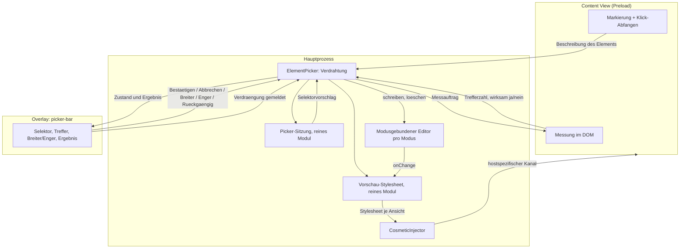
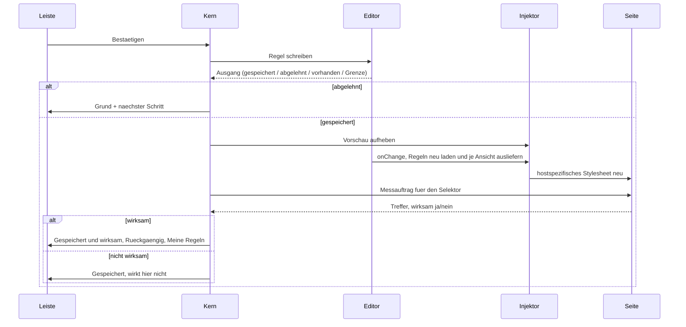
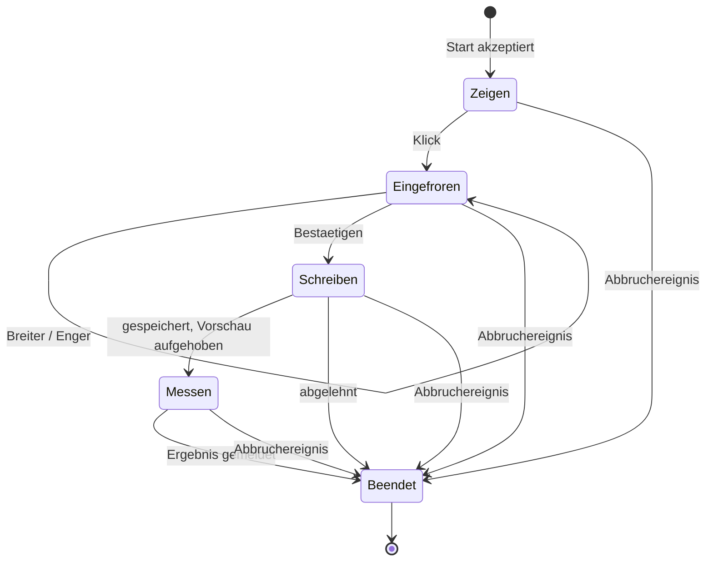

# Element-Picker - Plan

## Goal Capsule

- **Ziel:** Element-Blocken wird ein Vorgang mit Vorschau, Korrektur und benanntem Ergebnis, statt eines Klicks, dessen Ausgang niemand erfährt.
- **Autorität:** Die Anforderungen (R) entscheiden über Produktverhalten, die technischen Entscheidungen (KTD) über den Mechanismus innerhalb ihrer zitierten R. Eine Einheit hebt weder das eine noch das andere auf.
- **Ausführungsprofil:** Reine Modelle zuerst und testgetrieben (U1, U2, U9) — dort gelten volle Abdeckung und Mutationstests. Die Verdrahtungsschichten folgen und werden über die Modelle bewiesen.
- **Abbruchbedingungen:** Halten und fragen, wenn (a) sich zeigt, dass die ansichtsgebundene Anwendung ohne Umbau des generischen kosmetischen Halbteils nicht geht, oder (b) das Preload nach U6 größer ist als vor U6.
- **Offene Blocker:** keine.

---

## Product Contract

### Summary

Der Element-Picker bekommt einen Bestätigungsschritt mit korrigierbarer Auswahl, eine Vorschau, die durch die echte Injektionskette läuft, und einen Rückkanal, auf dem jeder Ausgang benannt wird. Erfolg meldet er erst, nachdem die Vorschau aufgehoben, die geschriebene Regel neu geladen und im Dokument nachgemessen wurde. Die Leiste zieht auf die Overlay-Schicht, der Picker-Zustand an eine Stelle im Kern, und die Regelverwaltung wird ein Textfeld.

### Problem Frame

Gemeldet wurde: „keins der Elemente verschwindet, die Regeln werden nicht applied." Die Dokumentation behauptet das Gegenteil — `docs/STATUS.md` führt Element-Blocken als gebaut und verdrahtet.

Beides kann gleichzeitig stimmen, weil die Kette so gebaut ist, dass sie ihr eigenes Scheitern nicht meldet. `src/main/privacy/ElementPicker.ts:121-134` gibt `void` zurück und verwirft eine gepickte Regel auf fünf Wegen ohne Signal: die View steht nicht in `#active`, der Selektor ist leer, `registrableDomainOfUrl` liefert keinen Host, `editorFor` liefert keinen Editor, oder `editor.add()` meldet `duplicate`/`invalid` — und dieser Rückgabewert wird nicht gelesen. Auf der anderen Seite sendet `src/preload/picker.ts:213-220` per `ipcRenderer.send` und reißt die Oberfläche sofort danach ab. Es gibt keinen Kanal, auf dem ein Ergebnis zurückkäme.

Für den Nutzer sind alle fünf Fälle derselbe: das Overlay schließt sich und nichts passiert. Es gibt keine Beobachtung, mit der er sie unterscheiden könnte, und keine, mit der er einen sechsten Fall — die Regel wurde geschrieben, wirkt aber nicht — von den fünf trennen könnte.

Für das **private Fenster** ist die Ursache belegt und vollständig: `SessionUserRuleEditor.onChange` hat keinen Abonnenten, `editorFor(mode)` baut den Editor bei jedem Aufruf neu (`src/main/data/UserRuleStore.ts:152-158`), und die Engine wird ohnehin nur aus dem Store gespeist (`src/main/index.ts:543`). Für ein **normales Fenster** erklärt keiner dieser Befunde einen erstmaligen Pick auf einer gewöhnlichen `https:`-Seite — die dafür zuständige Reparatur (`reloadUserRules()` vor `cosmeticInjector.refresh()`) ist ausweislich `src/main/index.ts:582-585` bereits gelandet. Der normale Fall bleibt darum offen und wird nicht vorab diagnostiziert, sondern durch den Rückkanal benannt und durch ein eigenes manuelles Tor abgenommen.

Dazu kommt ein Zustand, über den Kern und Seite sich nicht einig sind. `#active` wird nur bei `did-start-navigation` und `destroyed` geräumt. Escape im Preload räumt lokal auf und sagt dem Kern nichts; der dafür vorgesehene Kanal `picker:stop` ist deklariert und behandelt, aber niemand ruft ihn auf.

### Key Decisions

- **Der Rückkanal ist die Grundlage, nicht eine Ausbaustufe.** Ohne ihn bleibt jede weitere Verbesserung unbeobachtbar. *Governs R1, R2, R3, R19.*
- **Die Vorschau entsteht als vorläufige Regel durch die echte Injektionskette.** Gewählt gegen eine lokale Ausblendung mit späterer Nachmessung: zwei Wahrheiten über denselben Zustand sind die Unsauberkeit, die dieser Plan wegräumt. *Governs R4, R5, R6, R20.*
- **Der Klick wählt aus, er schreibt nicht.** Gewählt gegen den heutigen Sofort-Commit, weil eine falsche Auswahl sonst erst in den Einstellungen korrigierbar ist. *Governs R7, R8, R9, R10.*
- **Erfolg hängt an der gemessenen Wirkung, nicht am gelungenen Schreiben.** Teurer, aber die Meldung kann nicht behaupten, was die Engine nicht tut. *Governs R13, R14.*
- **Der Picker-Zustand lebt an genau einer Stelle im Kern.** Aufräumen an einem Ort statt an vieren, und die Divergenz verschwindet strukturell statt durch eine weitere Zeile. *Governs R11, R12.*
- **Regeln werden durch denselben modusgebundenen Editor gelesen, durch den sie geschrieben werden.** Sonst führt der Weg zur Regelverwaltung aus einem privaten Fenster ins Leere. *Governs R16.*
- **Die Regelverwaltung ist ein Textfeld, keine Liste pro Regel.** Kehrt die in `src/renderer/shared/UserRulesEditor.tsx:19-26` festgehaltene Gegenentscheidung um: dort wurde die Zeilen-Oberfläche gewählt, weil eine Ganz-Dokument-Speicherung „a per-line error report next to a textarea" braucht. Der Einwand bleibt gültig und wird beantwortet, nicht ignoriert — die Ablehnung wird an der betroffenen Zeile markiert statt als Sammelmeldung darunter. *Governs R17.*
- **An der Mengengrenze wird abgelehnt, nicht verdrängt.** *Governs R18.*

### Requirements

**Rückmeldung und Ergebnis**

- R1. Der Kern beantwortet jeden Versuch mit einem benannten Ausgang; kein Pfad endet ohne Antwort. Benannt sind acht: gespeichert und wirksam, gespeichert aber ohne Wirkung im Dokument, bereits vorhanden und aktiv, bereits vorhanden und deaktiviert, von der Regelprüfung abgelehnt, kein Host, Dokument nicht filterbar, Mengengrenze erreicht.
- R2. Das Ergebnis erscheint in der Bestätigungsleiste des Fensters, in dem gepickt wurde — nicht im Seiten-Dokument, damit es auch dort ankommt, wo die Seite keine Picker-Oberfläche trägt.
- R3. Ein abgelehnter Ausgang nennt den Grund in der Sprache der Oberfläche und, wo es einen gibt, den nächsten Schritt.
- R19. Alle drei Einstiege — Kontextmenü, Tastenkürzel, Blocker-Menü — prüfen dieselbe Vorbedingung und melden eine Ablehnung, statt Erfolg zu behaupten.

**Vorschau durch die echte Kette**

- R4. Die Vorschau entsteht dadurch, dass die Regel vorläufig durch den echten Injektionspfad läuft; der Picker hat keine eigene Ausblendmechanik.
- R5. Die vorläufige Regel berührt die Platte nicht und wird aufgehoben, sobald sie ihren Zweck erfüllt hat: beim Abbruch, bei jedem Ende der Sitzung, und vor der Nachmessung nach dem Bestätigen.
- R6. Greift die vorläufige Regel im offenen Dokument nicht, sagt der Picker das, bevor der Nutzer bestätigt.
- R20. Eine Regel aus dem Picker wirkt nur dort, wo sie hingehört: die Vorschau nur in der pickenden Ansicht, eine Sitzungsregel nur in den Ansichten des schreibenden Fensters.

**Auswahl korrigieren**

- R7. Der Klick friert die Auswahl ein; erst eine Bestätigung schreibt die Regel durch.
- R8. Die Auswahl lässt sich vor dem Bestätigen breiter und enger ziehen, und Selektor wie Trefferzahl folgen der Änderung.
- R9. Die angezeigte Trefferzahl ist im offenen Dokument gemessen, nicht aus dem Zielelement allein geschätzt.
- R10. Abbrechen und Escape stellen die Seite in den Zustand vor dem Picken zurück.

**Ein Zustandsort**

- R11. Diese Ereignisse räumen den Picker-Zustand an derselben Stelle auf: Bestätigen, Abbrechen, Escape, Dokumentwechsel, Navigation im selben Dokument, Neuladen, zweiter Start, Verdrängung der Leiste durch eine höherrangige Overlay-Fläche, Tab-Schluss, Fenster-Schluss und Programmende.
- R12. Nach jedem Ende sind Kern, Seite und Leiste sich einig, dass der Picker aus ist.

**Wirkung nach dem Schreiben**

- R13. Erfolg wird erst gemeldet, nachdem die Vorschau aufgehoben, die durchgeschriebene Regel neu geladen und im Dokument nachgemessen wurde.
- R14. Greift die durchgeschriebene Regel im Dokument nicht, meldet der Picker das als eigenen Ausgang statt als Erfolg.
- R15. Nach einem Erfolg nimmt ein Weg die eben geschriebene Regel wieder zurück, und ein zweiter führt in die Regelverwaltung.

**Regelverwaltung**

- R16. Die Regelliste liest durch denselben modusgebundenen Editor, durch den geschrieben wird, sodass ein privates Fenster seine eigenen Sitzungsregeln sieht und das normale Profil unberührt bleibt.
- R17. Die Regelverwaltung ist ein einziges Textfeld über alle eigenen Regeln, nicht eine Zeile Oberfläche pro Regel, und eine abgelehnte Zeile wird an ihrer Stelle im Text markiert.
- R18. Bei erreichter Mengengrenze wird nichts geschrieben und nichts gelöscht.

### Key Flows

- F1. Element blocken, Erfolgsfall
  - **Trigger:** Nutzer startet den Picker über Kontextmenü, Tastenkürzel oder Blocker-Menü und klickt ein Element an.
  - **Steps:** Auswahl einfrieren; vorläufige Regel in diese Ansicht injizieren; Vorschau und gemessene Trefferzahl in der Leiste zeigen; Bestätigung; durchschreiben; Vorschau aufheben; neu laden; nachmessen.
  - **Outcome:** Element bleibt weg, Ergebnis wird benannt, Rücknahme und Regelverwaltung sind erreichbar.
  - **Covers R4, R5, R7, R9, R13, R15, R20.**

- F2. Die Regel wirkt nicht
  - **Trigger:** Die vorläufige oder die durchgeschriebene Regel ändert im Dokument nichts.
  - **Steps:** Der Picker misst nach — nach dem Bestätigen ohne aktive Vorschau — und meldet den Befund, statt Erfolg zu zeigen.
  - **Outcome:** Der Nutzer weiß, dass das Schreiben gelang und die Wirkung ausblieb — zwei verschiedene Dinge, verschieden benannt.
  - **Covers R6, R14.**

- F3. Die Regel wird abgelehnt
  - **Trigger:** Kein Host, Dokument nicht filterbar, Regel bereits vorhanden, Regelprüfung verweigert, oder die Mengengrenze ist erreicht.
  - **Steps:** Der Kern gibt den Ausgang zurück; die Leiste nennt Grund und, wo vorhanden, den nächsten Schritt.
  - **Outcome:** Kein stummes Verwerfen mehr.
  - **Covers R1, R2, R3, R18.**

- F4. Beenden
  - **Trigger:** Jedes Ereignis aus R11.
  - **Steps:** Die vorläufige Regel fällt weg; der Zustand wird an der einen Stelle geräumt; die Leiste verschwindet.
  - **Outcome:** Seite wie vorher, alle drei Seiten einig.
  - **Covers R5, R10, R11, R12.**

- F5. Einstieg auf einem Dokument, das keine Regel tragen kann
  - **Trigger:** Der Nutzer ruft den Picker auf einer internen Seite, einem `file:`-Dokument oder im PDF-Betrachter auf.
  - **Steps:** Der Einstieg erkennt die Vorbedingung und meldet über die Leiste, statt den Picker zu starten.
  - **Outcome:** Kein Picker, der auf einen Klick wartet, den niemand einlösen kann.
  - **Covers R2, R19.**

### Acceptance Examples

- AE1. **Covers R1, R3.** Gegeben eine Seite, auf der bereits eine gleichlautende, aber deaktivierte Regel liegt. Wenn der Nutzer dasselbe Element blockt, dann meldet der Picker „bereits vorhanden, deaktiviert" und bietet an, sie wieder einzuschalten — statt stumm zu verwerfen.
- AE2. **Covers R2, R19.** Gegeben ein `file:`-Dokument. Wenn der Nutzer den Picker über das Tastenkürzel aufruft, dann startet er nicht, und die Leiste sagt, dass es hier keine Regel geben kann.
- AE3. **Covers R6.** Gegeben ein Selektor, der die Kette passiert, im Dokument aber nichts trifft. Wenn die Vorschau läuft, dann bleibt die Seite unverändert und die Leiste sagt das, bevor der Nutzer bestätigen kann.
- AE4. **Covers R5, R13, R14.** Gegeben eine Regel, die als Vorschau greift, nach dem Durchschreiben aber nicht. Wenn der Nutzer bestätigt, dann ist die Vorschau vor der Messung aufgehoben, das Element erscheint wieder, und der Picker meldet „gespeichert, wirkt hier nicht" statt Erfolg.
- AE5. **Covers R5, R10.** Gegeben eine laufende Vorschau. Wenn der Nutzer Escape drückt, dann ist das Element wieder da, und auf der Platte steht nichts.
- AE6. **Covers R11, R12.** Gegeben ein Picker, den der Nutzer mit Escape beendet hat. Wenn er ohne Neuladen erneut startet, dann funktioniert er — kein Zustand aus dem vorigen Durchgang stört.
- AE7. **Covers R8, R9.** Gegeben eine Auswahl, die einen von drei gleichartigen Blöcken trifft. Wenn der Nutzer sie breiter zieht, dann steigt die angezeigte Trefferzahl auf die tatsächlich getroffene Zahl und die Vorschau zeigt alle drei verschwunden.
- AE8. **Covers R16, R20.** Gegeben ein privates Fenster, in dem der Nutzer ein Element geblockt hat, und ein gleichzeitig offenes normales Fenster auf demselben Host. Wenn er die Regelverwaltung im privaten Fenster öffnet, dann steht die Regel dort; im normalen Fenster steht sie nicht und versteckt dort auch nichts.
- AE9. **Covers R20.** Gegeben zwei offene Tabs auf demselben Host. Wenn der Nutzer in einem davon eine Vorschau laufen lässt, dann bleibt der andere Tab unverändert.
- AE10. **Covers R11.** Gegeben eine offene Bestätigungsleiste mit aktiver Vorschau. Wenn die Seite eine Navigation im selben Dokument auslöst, dann endet die Sitzung wie bei Abbrechen, statt dass die Leiste weiterlebt.
- AE11. **Covers R11, R12.** Gegeben eine offene Bestätigungsleiste mit aktiver Vorschau. Wenn die Seite einen Berechtigungsdialog auslöst und damit die Overlay-Schicht übernimmt, dann endet die Picker-Sitzung, und die Vorschau ist aufgehoben.
- AE12. **Covers R1, R3, R18.** Gegeben 500 eigene Regeln. Wenn der Nutzer ein weiteres Element blockt, dann wird nichts geschrieben, keine alte Regel verschwindet, und die Leiste nennt die Grenze mit dem Weg zur Regelverwaltung.
- AE13. **Covers R17.** Gegeben eine Regel, die der Picker geschrieben hat. Wenn der Nutzer sie in der Textarea auskommentiert und speichert, dann bleibt sie erhalten, gilt als deaktiviert, und ihre Herkunft und ihr Alter sind unverändert.
- AE14. **Covers R15.** Gegeben ein eben erfolgreich geblocktes Element. Wenn der Nutzer „Rückgängig" wählt, dann ist die geschriebene Regel entfernt und das Element wieder sichtbar, ohne dass die Seite neu geladen werden muss.

### Success Criteria

- Kein Ausgang des Pickers endet ohne benannte Antwort; jeder Rückgabepfad ist im Test belegt.
- Nach einem Klick kann der Nutzer sagen, was passiert ist, ohne die Einstellungen zu öffnen.
- Eine falsche Auswahl ist im Picker korrigierbar, nicht erst nachträglich in der Regelverwaltung.
- Der generische, merkmalsindizierte kosmetische Halbteil verhält sich unverändert.
- Das Content-Preload ist nach dieser Arbeit nicht größer als vorher.

### Scope Boundaries

- Netzregeln aus dem Picker bleiben ausgeschlossen. Eine selbstgeschriebene Netzregel kann eine Seite unreparierbar machen; Ausblenden und Abschneiden dürfen nicht hinter demselben Klick sitzen.
- Regeln ohne Host bleiben ausgeschlossen. Eine generische Regel hätte den Selektor auf jeder Seite versteckt.
- Scriptlets bleiben ausgeschlossen.
- Die heruntergeladenen Listen, die Netzregel-Pipeline und der generische, merkmalsindizierte kosmetische Halbteil bleiben unangetastet. Der **hostspezifische** Injektionspfad wird ansichtsgebunden — das ist der eine bewusste Eingriff, den R20 verlangt.
- Das Auswählen selbst bleibt zeigergebunden. Es gibt keinen Tastaturweg vom Zeigen ins Einfrieren; der Tastaturvertrag aus KTD10 beginnt erst bei der eingefrorenen Auswahl. Benannt statt offengelassen, wie die Rahmen-Grenze darunter.
- In Fremdrahmen wird nicht eingetaucht. Der Preload läuft nicht in Subframes (`src/main/browser/Tab.ts:335`), also sieht der Picker das Rahmenelement und nicht dessen Inhalt — und ein Klick *innerhalb* eines Rahmens erreicht die Seite darin normal. Das bleibt eine benannte Grenze dieser Runde.
- Das Preload-Budget wird nicht angehoben und die 22-kB-Marke in dieser Arbeit nicht erreicht.

#### Deferred to Follow-Up Work

- Der Picker-Einstieg umgeht die beiden Locale-Auflöser und fällt auf `DEFAULT_LOCALE` zurück (`docs/IMPROVEMENT-PLAN.md:574`). Echter, enger i18n-Fehler, aber unabhängig von dieser Kette.
- Ein BDD-Szenario für den Picker. Für den Picker existiert heute keines; das wäre Neuland und gehört nicht in denselben Durchgang.
- Das Schließen der 13 kB Abstand zum Preload-Budget.
- Ein Tastaturweg zum Auswählen eines Elements ohne Zeiger.

### Dependencies / Assumptions

- Der Bruch im **normalen** Fenster ist nicht diagnostiziert und wird es in diesem Plan auch nicht. Der Rückkanal benennt ihn, und das manuelle Tor „Echte Wirkung" nimmt ihn ab. Zeigt der Rückkanal dort einen Ausgang, den keine Einheit erklärt, greift die Abbruchbedingung aus dem Goal Capsule.
- Der prozedurale Halbteil des Injektors ist einwegig (`src/main/privacy/CosmeticInjector.ts:150-180`). Für Picker-Regeln ist das gegenstandslos: `proposeSelector` erzeugt reine CSS-Selektoren und `cosmeticRuleFor` schreibt `host##selector`, was den prozeduralen Pfad nie erreicht. Die Einschränkung gilt nur für prozedurale Regeln aus der Regelverwaltung.
- Vorschau und Commit teilen Regeltext, Prüfung und Selektor-Übersetzung, **nicht** die Zustellung: die Vorschau hängt ein Stylesheet direkt an eine Ansicht, der Commit geht über die hostgeschlüsselte Auflösung der Engine. Eine bestandene Vorschau beweist den Commit-Weg deshalb nicht — genau dafür gibt es R13 und R14.
- Der Kanal `picker:stop` hat heute keinen Aufrufer.
- `pnpm metrics` scheitert heute schon: das Content-Preload liegt bei 35 kB gegen ein Maximum von 22 kB (`scripts/metrics.mjs:304-329`). Das ist Vorbestand, nicht Folge dieser Arbeit, und der Exit-Code des Kommandos taugt deshalb nicht als Erfolgssignal — gemessen wird die Zahl.
- Wie viel das Abgeben der Leiste im Preload einspart, ist nicht abgeschätzt. Stile und Texte kommen heute schon als Zeichenkette aus dem Kern, es entfällt also nur der Aufbau weniger Elemente, während Einfrieren, Vorfahrenkette und Messung hinzukommen. U6 misst vor und nach sich selbst.
- `src/main/privacy/picker-chrome.ts:13-15` behauptet einen Architekturtest, der die Picker-Farben mit `tokens.css` in Gleichklang hält. Ein solcher Test war nicht auffindbar; die Zusage gilt als unbelegt.

### Outstanding Questions

**Deferred to Planning**

- OQ1. Wie lange auf die Wirkung gewartet wird, bevor „wirkt hier nicht" gilt, und ob nachgeladene Elemente eine zweite Messung bekommen. Richtwert: ein Frame plus ein kurzer Nachschlag; null Treffer beim Messen heißt „wirkt hier nicht", nicht „falsch".
- OQ2. Ob `picker:stop` als eigener Vertragskanal bleibt oder in die Sitzungs-API des Kerns aufgeht.
- OQ3. Ob der modusgebundene Editor je privatem Fenster oder je Modus gehalten wird. Beides erfüllt R16; die Lebensdauer der Sitzungsregeln beim Schließen des ersten von zwei privaten Fenstern unterscheidet sich.
- OQ4. Welche Fläche gewinnt, wenn Bestätigungsleiste und Find-Bar dieselbe Kachel beanspruchen.
- OQ5. Ob der Übernahme-Kanal aus U8 die drei bestehenden `userrules:*`-Grants für `tessera://settings` ersetzt oder neben sie tritt.

### Sources / Research

- `src/main/privacy/ElementPicker.ts:106-134` — `#propose` schätzt gegen das Zielelement allein; `#commit` gibt `void` zurück und hat die fünf stillen Abbrüche.
- `src/preload/picker.ts:207-228` — Commit per `ipcRenderer.send`, danach sofort lokaler Abbau; Escape räumt nur lokal, und `onKeyDown` ruft `stopPropagation` ohne `stopImmediatePropagation`, asymmetrisch zu `swallow`.
- `src/preload/index.ts:235` — `installElementPicker()` läuft nur für `role === 'content' && internalPage === null`; auf internen Seiten gibt es keinen Picker im Dokument.
- `src/main/passwords/AutofillService.ts:387-395, 448-462` und `src/shared/passwords/wire.ts:45,48` — das Muster für einen Rückkanal ohne Korrelations-Id: Aufforderung und Antwort auf getrennten Kanälen, Zuordnung über den Zustand pro WebContents im Kern.
- `src/main/privacy/CosmeticInjector.ts:33-42, 112-126, 150-183` — warum der Picker nicht über den IPC-Vertrag läuft, das Antworten auf demselben Kanal, und `refresh()` über `#documents` je `webContents.id`.
- `src/preload/cosmetic.ts:166` — die Seite *ersetzt* das hostspezifische Stylesheet beim Empfang; eine ansichtsgebundene Anhängung ist damit ohne Umbau des generischen Halbteils möglich.
- `src/main/privacy/FilterEngine.ts:196` und `src/main/index.ts:543` — `replaceUserRules` ist ein einziger Speicherplatz für alle Fenster, und `FilterSubscription.reloadUserRules` speist ihn fest aus `userRules.enabledText()`, also aus dem Store.
- `src/main/data/UserRuleStore.ts:69-72, 79-96, 152-158` — `AddRuleResult` mit dem bereits vorhandenen Feld `rule: UserRule | null`, die Editor-Schnittstelle, und die Neukonstruktion pro Aufruf.
- `src/shared/filters/user-rules.ts:108-135, 151, 186-191` — `describeUserRule`, die heutigen Ausgänge `'added' | 'invalid' | 'duplicate'`, und `trimToLimit` mit seinen zwei Aufrufern `addUserRule` und `repairUserRules`.
- `src/shared/filters/parse.ts:197` — `!` ist Kommentarsyntax; eine Textarea kann „aus" damit ausdrücken.
- `src/renderer/shared/UserRulesEditor.tsx:19-26` — warum heute eine Zeilen-Oberfläche statt einer Textarea steht.
- `src/shared/overlay/surface.ts:42-126, 394-497, 637-746` — die erschöpfenden Tabellen pro `OverlayKind` und `overlayBounds`; `find-bar` trägt sein eigenes Rechteck und ist `region: 'tile'`.
- `src/main/browser/OverlayLayer.ts` — eine Fläche pro Fenster, `present` ersetzt, und der Vakanz-Rückweg, über den eine verdrängte Fläche ihrem Besitzer gemeldet wird.
- `src/renderer/src/surfaces/OverlaySurface.tsx:167` — die Auswahl nach Art ist eine `if`-Kette, kein erschöpfender `switch`.
- `src/shared/ipc/channels.ts:120-126, 407-430` — warum die Picker-Kanäle chrome-only sind, und der Grant der `userrules:*`-Kanäle an die Settings-Seite samt seiner Begründung.
- `src/shared/filters/picker-wire.ts:22, 26-70, 57-171` — Kanalkonstanten, die Zod-Freiheit des Moduls, und die `asX(value: unknown): X | null`-Konvention.
- `src/shared/i18n/catalog.en.ts:492-503` und `src/main/privacy/picker-chrome.ts:62-77` — der Weg der Picker-Texte; `src/main/settings/user-rules-text.ts` ist der Präzedenzfall für kernseitige Prosa außerhalb des Katalog-Budgets.
- `vitest.config.ts` — `src/shared/filters/**` bei 100/100/100/100, `src/main/privacy/**` bei 95/100/88/92, `ElementPicker.ts` und `CosmeticInjector.ts` von der Abdeckung ausgenommen, weil ihre Entscheidungen herausgezogen sind.
- `stryker.config.json` — `mutate` enthält bereits `src/shared/filters/**/*.ts` und `src/main/data/UserRuleStore.ts`.
- `docs/solutions/ui-issues/chrome-popups-behind-content-views.md` — ein synthetischer `.click()` kann bestehen, während echtes Hit-Testing kaputt ist.
- `docs/solutions/performance-issues/renderer-bundle-bloat-zod-co-location.md` — Wertimport-Graph statt Verzeichnisregel; zod aus preload-erreichbaren Modulen heraushalten.

---

## Planning Contract

**Product Contract preservation:** geändert — R2 (Ergebnis erscheint auf der Overlay-Leiste statt im Seiten-Dokument), R1 (achter Ausgang ergänzt, weil R14 einen verlangt), R5 (Aufhebung vor der Nachmessung ergänzt), R11 (Ereignisliste vollständig, einschließlich Verdrängung der Leiste), R15 (Rücknahme heißt Löschen der geschriebenen Regel), R17 (zeilennahe Ablehnung ergänzt), R20 (gilt jetzt für Vorschau *und* Sitzungsregeln). Ergänzt — R17, R18, R19, R20, AE11, AE14. Gestrichen — die frühere offene Frage zur prozeduralen Rücknahme, gegenstandslos für Picker-Regeln.

### Key Technical Decisions

- KTD1. **Die Bestätigungsleiste ist eine neue Overlay-Art, nicht Seiten-DOM.** (session-settled: user-directed — chosen over Ausbau der Shadow-DOM-Leiste im Preload: das Content-Preload liegt bei 35 kB gegen ein 22-kB-Budget, und `docs/STATUS.md` nennt das Herausziehen der Oberflächen-Hälften als die richtige Antwort darauf.) Die Find-Bar ist der Präzedenzfall: eigenes Rechteck, blockiert die Seite nicht. Die Art meldet ihre Verdrängung über den bestehenden Vakanz-Rückweg des `OverlayLayer` an den Kern zurück. *Governs R2, R7, R8, R11, R15, R19.*
- KTD2. **Der Rückkanal folgt dem Autofill-Muster:** Aufforderung vom Kern, Antwort auf einem getrennten Kanal, Zuordnung über den Zustand pro WebContents im Kern. Kein `invoke` und keine Korrelations-Id — beides existiert im Projekt nicht, und `invoke` würde den Kanal jeder Content-View geben. *Governs R1, R13.*
- KTD3. **Regeln aus dem Picker erreichen die Seite über ein ansichtsgebundenes Zusatz-Stylesheet im hostspezifischen Injektionspfad.** Nicht über den globalen Engine-Slot: `FilterEngine.replaceUserRules` ist ein einziger Speicherplatz für alle Fenster, gespeist aus dem Store. Das gilt für die Vorschau **und** für die Regeln des modusgebundenen Sitzungs-Editors — sonst wirkt eine private Regel entweder nirgends oder in jedem Fenster. Der Regeltext läuft dabei durch dieselbe Prüfung und Selektor-Übersetzung wie eine geschriebene Regel. *Governs R4, R5, R20.*
- KTD4. **Die Picker-Sitzung wird ein reines Modul unter `src/shared/filters/`, nicht Zustand in `ElementPicker.ts`.** `vitest.config.ts` nimmt diese Klasse von der Abdeckung aus, ausdrücklich weil das, was sie entscheidet, herausgezogen wurde. Es gilt höchstens eine Picker-Sitzung im ganzen Programm, fensterübergreifend. *Governs R11, R12.*
- KTD5. **Der modusgebundene Editor wird pro Browsing-Modus einmal erzeugt und gehalten, und sein `onChange` wird verdrahtet.** Heute entsteht er pro Aufruf neu und niemand hört ihm zu. Die Zustellung seiner Regeln läuft über KTD3, nicht über den Store-Weg. *Governs R5, R16, R20.*
- KTD6. **An der Mengengrenze wird abgelehnt.** (session-settled: user-directed — chosen over „verdrängen, aber sagen": kein stiller Verlust, und der bestehende Zuschnitt schneidet heute die älteste Regel weg und meldet trotzdem Erfolg.) Das gilt für den Hinzufüge-Pfad; das Heilen eines übergroßen gespeicherten Dokuments kürzt weiterhin. *Governs R18.*
- KTD7. **Die Textarea ist eine Projektion über das gespeicherte Modell.** Regeln werden nach Zeilentext auf bestehende Einträge zurückgeführt, damit Id, Alter und Herkunft den Rundlauf überleben; „aus" wird als Kommentarzeile geschrieben und gelesen, und der Regelkörper einer solchen Zeile geht ohne sein Kommentarzeichen durch dieselbe Prüfung wie jede andere. *Governs R17.*
- KTD8. **„Greift" wird in der Seite gemessen** — dort ist das DOM. Gemessen wird die Trefferzahl und ob die Treffer tatsächlich nicht mehr dargestellt werden. Null Treffer zum Messzeitpunkt ist ein eigener, benannter Ausgang und keine Fehlermeldung, weil eine nachgeladene Anzeige später noch passen kann. Das Urteil kommt aus dem Renderer und ist deshalb reine Anzeige für den Nutzer: es darf keine Speicher- oder Berechtigungsentscheidung im Kern tragen. *Governs R6, R9, R13, R14.*
- KTD9. **`AddRuleResult` füllt sein vorhandenes Feld `rule` auch im Duplikatfall**, und der Ausgangstyp unterscheidet aktives von deaktiviertem Duplikat. Ohne das kann der Picker „bereits vorhanden, deaktiviert" weder sagen noch das Wiedereinschalten anbieten. *Governs R1, R3.*
- KTD10. **Die Leiste nimmt Fokus wie die Find-Bar und trägt den Tastaturvertrag:** hoch und runter ziehen die Auswahl breiter und enger, Enter bestätigt, Escape bricht ab. Das Preload schluckt weiterhin die ganze Zeigersequenz, damit die Seite den Klick nicht bekommt. *Governs R8, R10.*
- KTD11. **Das Breiterziehen endet unterhalb von `body`.** Eine harte Obergrenze, keine Warnung: `html` als Selektor leert die Seite. *Governs R8.*
- KTD12. **Markierung und Klick-Abfangen bleiben im Preload.** Die Markierung braucht Seitengeometrie, und die Listener müssen vor jedem Seitenskript registriert sein. Nur die Leiste zieht um. *Governs R7.*
- KTD13. **Die neuen Kanäle werden klassifiziert, nicht von der Nachbarzeile kopiert.** Die Leisten-Kanäle sind chrome-only und stehen auf keiner Liste für interne Seiten, mit der Begründung von `picker:start`. Der Übernahme-Kanal aus U8 ist der einzige neue Kanal für `tessera://settings`. Jeder trägt seinen Begründungskommentar wie die bestehenden Zeilen. *Governs R2, R17.*

### High-Level Technical Design

Wer mit wem spricht. Der Kern ist die einzige Stelle, die die Sitzung kennt; Seite und Leiste sprechen nie miteinander.

Der Bestätigungsweg. Die Reihenfolge ist die Anforderung, und das Aufheben der Vorschau steht **vor** der Messung — sonst misst die Messung die Vorschau statt die geschriebene Regel.

Die Sitzung als Zustandsautomat — das ist der Inhalt des reinen Moduls aus KTD4.

Abbruchereignis ist jedes aus R11. In `Schreiben` und `Messen` nimmt der Automat kein zweites Bestätigen an.

### System-Wide Impact

- **Der hostspezifische Injektionspfad wird ansichtsgebunden.** Heute ist er nur nach Dokument-URL verschlüsselt; nach dieser Arbeit kann eine Ansicht ein Zusatz-Stylesheet tragen, das keine andere sieht. Das trägt sowohl die Vorschau als auch die Regeln eines privaten Fensters. Der generische und der prozedurale Halbteil bleiben unverändert.
- **Der Vertrag der Overlay-Schicht wächst um eine Art.** `src/shared/overlay/surface.ts` hält für jede Art erschöpfende Tabellen; der Compiler fordert jede davon ein. Rangfolge gegenüber Berechtigungsdialog und Find-Bar ist Teil der Änderung, und die Verdrängung der Leiste wird ein Abbruchereignis der Picker-Sitzung.
- **Der modusgebundene Editor bekommt eine Lebensdauer.** Bisher war er ein Wegwerfobjekt; danach wird er gehalten. Das berührt jeden Aufrufer in `src/main/ipc/handlers.ts`.
- **Die Ausgänge von `addUserRule` ändern sich.** `trimToLimit` verliert seine stille Verdrängung im Hinzufüge-Pfad, behält sie aber im Heilungs-Pfad; alles, was heute auf `'added'` prüft, muss die neue Menge kennen.
- **Preload-Gewicht.** Die Leiste verlässt das Preload, die Messung kommt hinzu. Netto muss das Ergebnis kleiner sein als vor U6, sonst greift die Abbruchbedingung aus dem Goal Capsule.

### Risks & Dependencies

- **Ein Klick in einem Fremdrahmen wird von der Seite darin normal verarbeitet.** Der Preload läuft nicht in Subframes, also greift das Abfangen dort nicht. Werbung sitzt häufig in Rahmen. Minderung: der Picker kann den Rahmen als Element blocken; das bleibt in dieser Runde die Antwort, und die Grenze wird benannt statt kaschiert.
- **Die Messung kann eine korrekte Regel als wirkungslos melden**, wenn das Ziel erst nach dem Messfenster nachgeladen wird. Minderung: der Ausgang heißt „wirkt hier nicht", nicht „falsch" (KTD8), und OQ1 legt das Zeitmodell fest.
- **Die Messung kann eine wirkungslose Regel als wirksam melden**, wenn die Seite den getroffenen Knoten entfernt und dieselbe Anzeige unter anderem Namen neu aufbaut. Minderung: keine — das Urteil ist Anzeige, nicht Beweis, und KTD8 hält fest, dass nichts im Kern darauf baut.
- **Die Vorschau kann die Seite unbrauchbar machen**, wenn der Selektor sehr breit ist. Minderung: die Obergrenze aus KTD11, die gemessene Trefferzahl vor dem Bestätigen, und Escape, das immer zurückführt — die Leiste liegt außerhalb der Seite und kann von der Vorschau nicht getroffen werden.
- **Zwei gleichzeitig offene Regelverwaltungen sind ein Last-Write-Wins.** Eine Regel, die der Picker zwischen Laden und Speichern schreibt, verschwindet ohne Meldung. Datenverlust ohne Rechteausweitung; in dieser Runde benannt, nicht gelöst.
- **Synthetische Klicktests belegen das Abfangen nicht.** `docs/solutions/ui-issues/chrome-popups-behind-content-views.md` beschreibt genau diesen blinden Fleck. Minderung: das Einfrieren wird über echte Zeigerereignisse geprüft, nicht über `element.click()`.
- **Neue Kanäle im IPC-Vertrag ziehen Architekturpflichten nach sich** — genau einmal im Vertrag, kein Namensraum-Überlapp, Anfrage- und Antwortschema, genau ein `handle` je Kanal, strikte Teilmenge für interne Seiten. Die Architekturprüfung erzwingt die Teilmenge, nicht die Klassifizierung; KTD13 trifft sie.

---

## Implementation Units

| U-ID | Titel | Wichtigste Dateien | Hängt ab von |
|---|---|---|---|
| U1 | Picker-Sitzung als reines Modul | `src/shared/filters/picker-session.ts` | — |
| U2 | Regelmodell: Ausgänge und Mengengrenze | `src/shared/filters/user-rules.ts`, `src/main/data/UserRuleStore.ts` | — |
| U9 | Vorschau- und Sitzungs-Stylesheet als reines Modul | `src/shared/filters/preview-styles.ts` | — |
| U10 | Overlay-Vertrag: neue Art und Kanäle | `src/shared/overlay/surface.ts`, `src/shared/ipc/channels.ts` | — |
| U3 | Modusgebundener Editor mit Lebensdauer | `src/main/data/UserRuleStore.ts`, `src/main/index.ts` | U2, U9 |
| U4 | Ansichtsgebundene Auslieferung im Injektor | `src/main/privacy/CosmeticInjector.ts` | U9 |
| U5 | Kern: Sitzung, Rückkanal, Einstiege, Texte | `src/main/privacy/ElementPicker.ts`, `src/main/ipc/handlers.ts` | U1, U2, U3, U4, U10 |
| U7 | Overlay: die Bestätigungsleiste | `src/renderer/overlay/PickerBarSurface.tsx` | U5, U10 |
| U6 | Preload: einfrieren, verfeinern, messen | `src/preload/picker.ts` | U5, U7 |
| U8 | Regelverwaltung als Textfeld | `src/renderer/shared/UserRulesEditor.tsx` | U2, U3 |

Die Tabelle ist Wegweiser; die Einheiten selbst sind maßgeblich.

### U1. Picker-Sitzung als reines Modul

- **Goal:** Der Zustandsautomat aus der High-Level-Skizze mit seinen Übergängen und Ausgängen, ohne Electron und ohne IO.
- **Requirements:** R11, R12; setzt KTD4 um.
- **Dependencies:** keine.
- **Files:** `src/shared/filters/picker-session.ts` (neu), `tests/picker-session.test.ts` (neu).
- **Approach:**
  1. Zustände `zeigen | eingefroren | schreiben | messen | beendet` und die Übergänge aus dem Zustandsdiagramm.
  2. Den Ausgangstyp für R1 hier definieren, neben `AddUserRuleOutcome`. Acht Werte.
  3. Die Abbruchereignisse aus R11 als einen benannten Eingang modellieren, damit die Verdrahtung sie nicht einzeln behandeln muss.
  4. Die Invariante „höchstens eine Sitzung, fensterübergreifend" als Eigenschaft des Moduls, nicht des Aufrufers.
- **Execution note:** Testgetrieben. Dieses Modul ist der einzige Ort, an dem die Sitzungslogik geprüft werden kann — `ElementPicker.ts` ist von der Abdeckung ausgenommen.
- **Patterns to follow:** `src/shared/filters/picker.ts` für reine Modelle ohne Abhängigkeiten; die Zod-Freiheit aus `src/shared/filters/picker-wire.ts:22`.
- **Test scenarios:**
  - Ein Klick im Zustand `zeigen` friert ein und trägt den Selektor weiter.
  - Breiter und enger im Zustand `eingefroren` ändern die Auswahl und bleiben im selben Zustand.
  - Breiter am oberen Ende der Kette bleibt unterhalb von `body` stehen (KTD11).
  - Enger unterhalb des ursprünglich geklickten Elements ist kein gültiger Übergang.
  - Jedes Abbruchereignis aus R11 führt aus jedem Zustand nach `beendet`, auch aus `schreiben` und `messen`.
  - Ein zweites Bestätigen in `schreiben` oder `messen` wird verworfen.
  - Eine Messantwort außerhalb des Zustands `messen` wird verworfen.
  - Ein zweiter Start bei laufender Sitzung beendet die laufende und beginnt neu.
  - `beendet` nimmt keinen Übergang mehr an.
  - Jeder der acht Ausgänge aus R1 ist erreichbar und terminal; „gespeichert und wirksam" und „gespeichert, wirkt hier nicht" nur aus `messen`.
- **Verification:** `pnpm test:unit` grün; `pnpm test:coverage` hält 100/100/100/100 für `src/shared/filters/**`; `pnpm test:mutation` bleibt über der Schwelle.

### U2. Regelmodell: Ausgänge und Mengengrenze

- **Goal:** `add` sagt, was passiert ist, und die Grenze verdrängt im Hinzufüge-Pfad nicht mehr still.
- **Requirements:** R1, R3, R18; setzt KTD6, KTD9 um.
- **Dependencies:** keine.
- **Files:** `src/shared/filters/user-rules.ts`, `src/main/data/UserRuleStore.ts`, `tests/filter-user-rules.test.ts`.
- **Approach:**
  1. `AddUserRuleOutcome` um die Fälle erweitern, die R1 verlangt, und das bereits vorhandene Feld `rule` in `AddRuleResult` auch im Duplikatfall füllen — damit wird ein deaktiviertes Duplikat vom aktiven unterscheidbar.
  2. `trimToLimit` im Hinzufüge-Pfad ablehnen lassen statt zu schneiden. Der Heilungs-Pfad `repairUserRules` kürzt weiterhin, sonst lässt sich ein von Hand oder von einem älteren Build übergroß gewordenes Dokument nicht mehr öffnen.
  3. Alle Aufrufer, die heute auf `'added'` prüfen, auf die erweiterte Menge heben.
- **Execution note:** Erst eine Charakterisierung des heutigen Verdrängungsverhaltens schreiben, dann umstellen — das ist stiller Datenverlust, und der Test soll festhalten, dass er verschwunden ist.
- **Patterns to follow:** die bestehende Ausgangsdefinition in `src/shared/filters/user-rules.ts:151`; `SameShape` aus `src/shared/ipc/same-shape.ts` für die Formzusicherung an der Store-Grenze.
- **Test scenarios:**
  - Eine gleichlautende aktive Regel liefert „vorhanden und aktiv" samt der bestehenden Regel.
  - Eine gleichlautende deaktivierte Regel liefert „vorhanden und deaktiviert" samt der bestehenden Regel.
  - Eine Netzregel und ein Scriptlet werden weiterhin abgelehnt.
  - Eine Zeile über der Längengrenze wird abgelehnt.
  - Bei genau 500 Regeln wird die 501. abgelehnt, und alle 500 sind danach unverändert vorhanden.
  - Bei 499 Regeln wird die 500. angenommen.
  - Ein gespeichertes Dokument mit 505 Regeln wird beim Öffnen auf 500 gekürzt — der bestehende Reparaturtest bleibt grün.
- **Verification:** `pnpm test:unit` grün; volle Abdeckung für `src/shared/filters/**` gehalten; `pnpm test:mutation` deckt `UserRuleStore.ts` mit ab.

### U9. Vorschau- und Sitzungs-Stylesheet als reines Modul

- **Goal:** Die Rechenarbeit hinter der ansichtsgebundenen Auslieferung liegt an einem testbaren Ort, nicht im abdeckungsbefreiten Injektor.
- **Requirements:** R4, R20; setzt KTD3 um.
- **Dependencies:** keine.
- **Files:** `src/shared/filters/preview-styles.ts` (neu), `tests/filter-injection.test.ts`.
- **Approach:**
  1. Eine reine Funktion, die aus dem hostspezifischen Ergebnis der Engine, einem optionalen Vorschau-Regeltext und einem optionalen Sitzungs-Regeltext den auszuliefernden Stylesheet-Text berechnet.
  2. Der Zusatztext läuft durch dieselbe Prüfung und Selektor-Übersetzung wie eine geschriebene Regel; besteht er sie nicht, entsteht kein Zusatz und die Funktion sagt es.
  3. Das Aufheben ist derselbe Aufruf ohne Zusatztext, damit es keinen zweiten Weg zurück gibt.
- **Execution note:** Testgetrieben. Dies ist die Stelle, an der U4s Verhalten überhaupt prüfbar wird.
- **Patterns to follow:** die bestehende Übersetzung von Regeltext zu Stylesheet in `src/shared/filters/` und ihre Isolierung fehlerhafter Selektoren (`tests/filter-selector-safety.test.ts`).
- **Test scenarios:**
  - Ohne Zusatztext ist das Ergebnis das hostspezifische Ergebnis, unverändert.
  - Mit Vorschautext wird der Zusatz angehängt, nicht eingemischt.
  - Vorschau- und Sitzungstext zusammen ergeben beide Zusätze in stabiler Reihenfolge.
  - Ein Zusatztext, der die Prüfung nicht besteht, erzeugt keinen Zusatz und wird gemeldet.
  - Ein einzelner unlesbarer Selektor kostet sich selbst und nicht den ganzen Zusatz.
  - Das Aufheben stellt exakt das hostspezifische Ergebnis wieder her.
- **Verification:** `pnpm test:unit` grün; `pnpm test:coverage` hält 100/100/100/100 für `src/shared/filters/**`.

### U10. Overlay-Vertrag: neue Art und Kanäle

- **Goal:** Die Bestätigungsleiste existiert als Art, Presentation-Typ und Kanalpaar, bevor irgendetwas gegen sie testet.
- **Requirements:** R2, R11; setzt KTD1, KTD13 um.
- **Dependencies:** keine.
- **Files:** `src/shared/overlay/surface.ts`, `src/main/browser/OverlayLayer.ts`, `src/main/browser/BrowserWindowController.ts`, `src/shared/ipc/channels.ts`, `src/shared/ipc/contract.ts`, `tests/window-events.test.ts`, `tests/ipc-contract.test.ts`.
- **Approach:**
  1. Die neue Art in jede erschöpfende Tabelle in `src/shared/overlay/surface.ts` eintragen; der Compiler zeigt die Liste. Rangfolge unterhalb des Berechtigungsdialogs, Rechteck wie die Find-Bar aus den Grenzen der pickenden Kachel.
  2. Die Art markiert die Seite, weil ihr Abgang eine Vorschau und eine Markierung im Dokument zurücklässt — die Verdrängung wird über den bestehenden Vakanz-Rückweg an den Besitzer gemeldet.
  3. Die Kanäle klassifizieren statt kopieren (KTD13): chrome-only, auf keiner Liste für interne Seiten, mit Begründungskommentar neben der Zeile.
- **Patterns to follow:** die Find-Bar-Einträge in denselben Tabellen; die Begründungskommentare neben `picker:start` und `permissions:answer` in `src/shared/ipc/channels.ts`.
- **Test scenarios:**
  - Der Vertrag deckt die neuen Kanäle genau einmal ab, mit Anfrage- und Antwortschema.
  - Kein Namensraum-Überlapp mit bestehenden Kanälen.
  - Die neuen Kanäle stehen auf keiner Liste für interne Seiten.
  - Eine höherrangige Fläche verdrängt die neue Art und meldet die Vakanz an den Besitzer.
  - Das Rechteck der Art folgt der Kachel, nicht dem Fenster.
- **Verification:** `pnpm typecheck` grün — die erschöpfenden Tabellen erzwingen jeden Eintrag; `tests/ipc-contract.test.ts` und `tests/architecture.test.ts` grün.

### U3. Modusgebundener Editor mit Lebensdauer

- **Goal:** Der Sitzungs-Editor überlebt länger als einen IPC-Aufruf, seine Regeln wirken in den Ansichten seines Fensters und nirgends sonst, und die Regelliste liest durch ihn.
- **Requirements:** R5, R16, R20; setzt KTD5 um.
- **Dependencies:** U2, U9.
- **Files:** `src/main/data/UserRuleStore.ts`, `src/main/browser/BrowserWindowController.ts`, `src/main/ipc/handlers.ts`, `src/main/index.ts`, `tests/filter-user-rules.test.ts`.
- **Approach:**
  1. Den Editor pro Browsing-Modus einmal erzeugen und halten, statt ihn pro Aufruf zu bauen.
  2. **Die Engine-Speisung bleibt beim Store.** `FilterSubscription.reloadUserRules` liest weiterhin `userRules.enabledText()`, und der globale Slot `FilterEngine.replaceUserRules` bekommt nie Sitzungsregeln — er gilt für alle Fenster. Die Regeln des Sitzungs-Editors erreichen die Seite stattdessen über den ansichtsgebundenen Weg aus U9/U4: bei `onChange` komponiert der Kern aus `editor.enabledText()` den Sitzungszusatz und bedient die Ansichten der privaten Fenster neu.
  3. `userrules:list` durch den modusgebundenen Editor lesen lassen wie die Schreibkanäle.
- **Patterns to follow:** wie `HistoryStore` und `PermissionStore` ihre modus- beziehungsweise sitzungsgebundenen Objekte halten, statt sie pro Aufruf zu erzeugen.
- **Test scenarios:**
  - Zwei aufeinanderfolgende Aufrufe im privaten Modus liefern denselben Editor.
  - Eine im privaten Modus hinzugefügte Regel ist beim nächsten Auflisten da.
  - Dieselbe Regel taucht im normalen Profil nicht auf, und auf der Platte steht nichts.
  - Eine im privaten Modus geschriebene Regel versteckt in einem gleichzeitig offenen normalen Fenster nichts.
  - Der globale Engine-Slot enthält nach einer privaten Regeländerung unverändert nur die Store-Regeln.
  - Das Hinzufügen im privaten Modus bedient genau die Ansichten des privaten Fensters neu.
  - Das Ende der privaten Sitzung nimmt die Regeln mit.
- **Verification:** `pnpm test:unit` grün; AE8 im Test belegt.

### U4. Ansichtsgebundene Auslieferung im Injektor

- **Goal:** Eine Ansicht kann ein zusätzliches hostspezifisches Stylesheet bekommen, das keine andere sieht, und einzeln neu bedient werden.
- **Requirements:** R4, R5, R20; setzt KTD3 um.
- **Dependencies:** U9.
- **Files:** `src/main/privacy/CosmeticInjector.ts`, `src/shared/filters/injection.ts`.
- **Approach:**
  1. Je Ansicht einen Zusatztext führen (Vorschau, Sitzungsregeln oder beides) und beim Ausliefern durch das reine Modul aus U9 schicken.
  2. Ein Neubedienen genau einer Ansicht, parallel zum bestehenden Neubedienen aller — und ein Neubedienen aller, das die Zusätze nicht verliert.
  3. Die bestehenden Tore respektieren: ist der Blocker aus oder die Seite ausgenommen, entsteht kein Zusatz — und der Einstieg aus U5 lässt es dann gar nicht so weit kommen.
- **Execution note:** In dieser Datei bleibt nur die Zuordnung Ansicht→Zusatz und der Sendeaufruf. Jede Entscheidung gehört nach U9 — die Datei ist von der Abdeckung ausgenommen.
- **Patterns to follow:** die vorhandene Zuordnung von WebContents zu offenem Dokument im Injektor; das bewusste Senden einer leeren Zeichenkette zum Aufheben.
- **Test scenarios:**
  - Ein Zusatz für eine Ansicht erscheint im Stylesheet dieser Ansicht.
  - Eine zweite Ansicht auf demselben Host bekommt ihn nicht.
  - Ein Neubedienen aller Ansichten löscht die Zusätze nicht.
  - Eine Ansicht, die noch nie nach Stilen gefragt hat, führt nicht zum Fehler.
- **Verification:** `pnpm test:unit` grün; die Verhaltensbeweise liegen in U9s Tests gegen `src/shared/filters/**`.

### U5. Kern: Sitzung verdrahten, Rückkanal, Einstiege, Texte

- **Goal:** `ElementPicker` wird zur Verdrahtung um das Modul aus U1, jeder Ausgang bekommt eine Antwort, und alle drei Einstiege prüfen dasselbe.
- **Requirements:** R1, R2, R3, R5, R6, R11, R12, R13, R14, R15, R19; setzt KTD2, KTD4, KTD8 um.
- **Dependencies:** U1, U2, U3, U4, U10.
- **Files:** `src/main/privacy/ElementPicker.ts`, `src/shared/filters/picker-wire.ts`, `src/main/privacy/picker-chrome.ts`, `src/shared/i18n/catalog.en.ts`, `src/shared/i18n/catalog.de.ts`, `src/main/ipc/handlers.ts`, `src/main/menu/page-context-items.ts`, `src/main/menu/blocker-menu-items.ts`, `src/renderer/src/App.tsx`, `src/main/index.ts`, `tests/picker-wire.test.ts`.
- **Approach:**
  1. Die Sitzung aus U1 halten statt eines Sets aktiver Ansichten; jedes Abbruchereignis aus R11 dort hineinreichen — einschließlich der Navigation im selben Dokument und der vom Overlay gemeldeten Verdrängung.
  2. Den Rückkanal nach dem Autofill-Muster anlegen: Aufforderung vom Kern, Antwort auf getrenntem Kanal, Zuordnung über den Kernzustand. Der Commit trägt keine Nutzlast mehr, die der Kern nicht schon kennt.
  3. Nach dem Schreiben in der Reihenfolge: **Vorschau aufheben**, Regeln neu laden, ausliefern, messen — und erst dann melden. Ohne den ersten Schritt misst die Messung die Vorschau.
  4. „Rückgängig" löscht die eben geschriebene Regel über denselben modusgebundenen Editor und liefert neu aus, sodass das Element wieder erscheint.
  5. Die Vorbedingung für R19 an einer Stelle definieren und aus allen drei Einstiegen aufrufen — auch aus dem Aufrufort des Blocker-Menüs in `src/main/ipc/handlers.ts`; das Tastenkürzel meldet über den Rückgabewert seines Kanals.
  6. Die Ausgangstexte als benannte Menge in der Picker-Chrome führen, nach dem Muster der bestehenden Warnungen: unbekannter Schlüssel fällt auf den Schlüssel zurück, statt die ganze Chrome ungültig zu machen.
- **Execution note:** `ElementPicker.ts` bleibt von der Abdeckung ausgenommen — was hier entschieden wird, gehört nach U1. Wenn eine Verzweigung sich hier festsetzt, ist sie am falschen Ort.
- **Patterns to follow:** `src/main/passwords/AutofillService.ts` für Aufforderung und Antwort; `src/main/settings/user-rules-text.ts` für kernseitige Prosa außerhalb des Katalog-Budgets; die `asX`-Konvention für jede neue Nachricht.
- **Test scenarios:**
  - Jeder der acht Ausgänge aus R1 erreicht die Leiste, keiner endet stumm.
  - Nach dem Bestätigen ist kein Vorschau-Zusatz mehr ausgeliefert, bevor gemessen wird.
  - Ein Dokument ohne Host liefert den Ausgang „kein Host", ohne zu schreiben.
  - Ein `file:`-Dokument und eine interne Seite starten den Picker nicht und melden es — über alle drei Einstiege.
  - „Rückgängig" entfernt genau die eben geschriebene Regel und liefert neu aus.
  - Eine gemeldete Overlay-Verdrängung beendet die Sitzung und hebt die Vorschau auf.
  - Eine Nachricht von einer Ansicht, deren Sitzung nicht läuft, wird verworfen.
  - Ein Selektorvorschlag von einer nicht gestarteten Ansicht liefert weiterhin nichts.
  - Escape aus der Seite und Abbrechen aus der Leiste enden beide dieselbe Sitzung.
  - Nach dem Ende hält der Kern die Ansicht nicht mehr für aktiv.
  - Die Guards der neuen Nachrichten lehnen jedes fehlende und jedes falsch getypte Feld ab.
  - Beide Kataloge tragen dieselben Schlüssel, ohne leere Übersetzung.
- **Verification:** `pnpm test:unit` grün; `pnpm test` grün; `tests/ipc-contract.test.ts` und `tests/architecture.test.ts` grün.

### U7. Overlay: die Bestätigungsleiste

- **Goal:** Die in U10 angelegte Art bekommt ihre Fläche: Selektor, Trefferzahl, Breiter/Enger, Bestätigen/Abbrechen, Wartezustand und Ergebnis.
- **Requirements:** R2, R3, R7, R8, R15, R19; setzt KTD1, KTD10 um.
- **Dependencies:** U5, U10.
- **Files:** `src/renderer/overlay/PickerBarSurface.tsx` (neu), `src/renderer/overlay/picker-bar.css` (neu), `src/renderer/src/surfaces/OverlaySurface.tsx`, `tests/components/picker-bar-surface.test.tsx` (neu).
- **Approach:**
  1. Die Fläche als reine Darstellung über einem Host-Objekt bauen, ohne eigene Meinung über den Zustand — der Kern ist die Wahrheit.
  2. Einen Wartezustand für `schreiben` und `messen`: Bestätigen ist dort nicht auslösbar, und die Leiste sagt, dass gerade geprüft wird. Die Find-Bar hat für dieselbe Lücke bereits eine eigene Wortwahl.
  3. Fokus wie die Find-Bar; der Tastaturvertrag aus KTD10.
- **Patterns to follow:** `src/renderer/overlay/FindBarSurface.tsx` für die Fläche, ihr Rechteck und ihre Wartewortwahl; `tests/components/user-rules-editor.test.tsx` für den Komponententest mit gestubbten Texten und Host-Objekt.
- **Test scenarios:**
  - Im Zustand „zeigen" erscheint der Selektor, aber keine Bestätigen-Schaltfläche.
  - Im Zustand „eingefroren" erscheinen Trefferzahl, Breiter, Enger, Bestätigen, Abbrechen.
  - Im Wartezustand ist Bestätigen nicht auslösbar und ein zweiter Druck löst nichts aus.
  - Jeder der acht Ausgänge rendert seinen Text; ein unbekannter Ausgang rendert den Schlüssel statt gar nichts.
  - Der Erfolgszustand zeigt Rückgängig und den Weg zur Regelverwaltung.
  - Pfeiltasten, Enter und Escape lösen die vier Aktionen aus.
  - Die Leiste öffnet nicht, während ein Berechtigungsdialog steht.
- **Verification:** `pnpm test` grün (beide Vitest-Projekte). `pnpm typecheck` deckt die Tabellen aus U10 ab, nicht die Verzweigung in `src/renderer/src/surfaces/OverlaySurface.tsx` — die ist eine `if`-Kette und wird durch den Komponententest belegt.

### U6. Preload: einfrieren, verfeinern, messen — und die Leiste abgeben

- **Goal:** Der Klick wählt aus statt zu schreiben, die Vorfahrenkette wird begehbar, die Wirkung wird im DOM gemessen, und das Leisten-DOM verschwindet aus dem Preload.
- **Requirements:** R7, R8, R9, R10; setzt KTD10, KTD11, KTD12 um.
- **Dependencies:** U5, U7. Die Leiste muss existieren, bevor die alte entfernt wird — sonst gibt es zwischenzeitlich keinen Bestätigungsschritt und das manuelle Tor ist nicht beobachtbar.
- **Files:** `src/preload/picker.ts`, `src/shared/filters/picker-wire.ts`, `tests/picker-wire.test.ts`.
- **Approach:**
  1. Vor der ersten Zeile `pnpm build && pnpm metrics` laufen lassen und die Preload-Größe notieren; sie ist der Bezugswert für das Tor.
  2. Den Klick die Auswahl einfrieren lassen; das Schlucken der ganzen Zeigersequenz bleibt unverändert, weil es die gemeldete Ursache war.
  3. `onKeyDown` auf dieselbe Strenge heben wie `swallow` — heute fehlt `stopImmediatePropagation`.
  4. Breiter und enger über die Vorfahrenkette des eingefrorenen Elements, mit der Obergrenze aus KTD11; der Selektorvorschlag kommt weiter über den bestehenden synchronen Kanal.
  5. Die Messung: Trefferzahl im Dokument und ob die Treffer noch dargestellt werden. Den Picker-Host beim Zählen ausnehmen.
  6. Die Leisten-Elemente entfernen; Markierung und Host bleiben. Der Host bleibt am Dokumentelement verankert, nicht an `body`, damit ein transformierter Vorfahre die Markierung nicht verschiebt.
- **Execution note:** Das Einfrieren über echte Zeigerereignisse prüfen, nicht über `element.click()` — der Fall in `docs/solutions/ui-issues/chrome-popups-behind-content-views.md` bestand einen synthetischen Klick, während das echte Hit-Testing kaputt war.
- **Patterns to follow:** die bestehende Capture-Phase-Behandlung in `src/preload/picker.ts:174-221` und ihr Begründungsblock.
- **Test scenarios:**
  - Die Zählung eines Selektors mit drei Treffern liefert drei.
  - Der Picker-Host selbst wird nie mitgezählt.
  - Ein Selektor ohne Treffer liefert null und wird als „wirkt hier nicht" gemeldet, nicht als Fehler.
  - Ein syntaktisch ungültiger Selektor bringt die Messung nicht zum Absturz.
  - Ein Treffer, der noch dargestellt wird, gilt als nicht wirksam.
  - Die Kette nach oben endet unterhalb von `body`.
  - Nach dem Beenden ist kein Listener und kein Host mehr im Dokument.
- **Verification:** `pnpm test` grün; `pnpm build` und danach `pnpm metrics` — die Preload-Zahl ist kleiner als der in Schritt 1 notierte Bezugswert.

### U8. Regelverwaltung als Textfeld

- **Goal:** Die eigenen Regeln werden als ein Text bearbeitet, ohne dass Id, Alter und Herkunft den Rundlauf verlieren und ohne dass eine abgelehnte Zeile gesucht werden muss.
- **Requirements:** R15, R17; setzt KTD7, KTD13 um.
- **Dependencies:** U2, U3.
- **Files:** `src/renderer/shared/UserRulesEditor.tsx`, `src/renderer/shared/SettingsView.tsx`, `src/renderer/internal/SettingsPage.tsx`, `src/shared/ipc/contract.ts`, `src/shared/ipc/channels.ts`, `src/main/ipc/handlers.ts`, `src/main/settings/user-rules-text.ts`, `tests/components/user-rules-editor.test.tsx`, `tests/ipc-contract.test.ts`.
- **Approach:**
  1. Serialisieren: eine Zeile je Regel, deaktivierte als Kommentarzeile.
  2. Übernehmen: der Übernahme-Kanal geht wie die bestehenden Schreibkanäle durch `editorFor(mode)` des sendenden Fensters. Der Text wird zeilenweise gelesen, jede Zeile — deaktivierte ohne ihr Kommentarzeichen — durch die bestehende Prüfung geschickt, und unveränderte Zeilen über ihren Text auf bestehende Regeln zurückgeführt, damit Id, Alter und Herkunft bleiben.
  3. Eine Zeile, die die Prüfung nicht besteht, wird an ihrer Stelle im Text markiert statt als Sammelmeldung darunter aufgeführt; sie blockiert die übrigen nicht. Eine auskommentierte Zeile, die die Prüfung nicht besteht, bleibt ein freier Kommentar und wird keine deaktivierte Regel.
  4. Leerzeilen und freie Kommentarzeilen erhalten, nicht wegwerfen.
  5. Den neuen Kanal klassifizieren (KTD13) und die Frage aus OQ5 beim Umsetzen beantworten.
- **Patterns to follow:** die bestehende Prüfung jeder Zeile im heutigen Editor; `src/main/settings/user-rules-text.ts` für die Texte.
- **Test scenarios:**
  - Ein Rundlauf ohne Änderung lässt Id, Alter und Herkunft jeder Regel unverändert.
  - Das Auskommentieren einer Zeile deaktiviert die Regel und behält sie.
  - Das Entkommentieren aktiviert sie wieder.
  - Eine auskommentierte Netzregel und ein auskommentiertes Scriptlet werden nicht als deaktivierte Regel gespeichert.
  - Das Löschen einer Zeile entfernt die Regel.
  - Eine neue Zeile entsteht als Regel mit Herkunft „von Hand".
  - Eine ungültige Zeile wird an ihrer Stelle markiert, die übrigen werden übernommen.
  - Eine Übernahme über die Mengengrenze hinaus wird abgelehnt, ohne etwas zu löschen.
  - Zwei identische Zeilen führen nicht zu zwei Regeln.
  - Eine Übernahme aus einem privaten Fenster verändert die Datei auf der Platte nicht und lässt das normale Profil unverändert.
- **Verification:** `pnpm test` grün; `tests/ipc-contract.test.ts` grün für den neuen Kanal.

---

## Verification Contract

| Tor | Kommando | Gilt für | Fertig, wenn |
|---|---|---|---|
| Typen | `pnpm typecheck` | alle Einheiten | vier Projekte fehlerfrei; die erschöpfenden Overlay-Tabellen erzwingen U10 |
| Stil | `pnpm lint` | alle Einheiten | keine Warnung (`--max-warnings 0`) |
| Verhalten | `pnpm test` | alle Einheiten | beide Vitest-Projekte grün |
| Abdeckung | `pnpm test:coverage` | U1, U2, U9 | `src/shared/filters/**` bei 100/100/100/100; `src/main/privacy/**` bei 95/100/88/92 |
| Mutation | `pnpm test:mutation` | U1, U2, U9 | über der Schwelle 70; die neuen Module fallen unter den bestehenden `src/shared/filters/**/*.ts`-Eintrag |
| Größe | `pnpm build` dann `pnpm metrics` | U6, U7 | die Preload-Zahl ist kleiner als der vor U6 notierte Bezugswert. Der Exit-Code taugt nicht als Signal: das 22-kB-Maximum ist Vorbestand und bleibt gerissen |
| Echte Eingabe | manuell in der laufenden App | U6, nach U7 | ein echter Zeigerklick auf ein Element mit eigenem `pointerdown`-Handler wählt aus, ohne dass die Seite reagiert |
| Echte Wirkung | manuell in der laufenden App | U5, U6 | auf einer gewöhnlichen `https:`-Seite in einem **normalen** Fenster verschwindet das gepickte Element nach dem Bestätigen sichtbar, der gemeldete Ausgang ist „gespeichert und wirksam", und nach dem Neuladen bleibt es weg |

Die beiden letzten Zeilen sind ausdrücklich keine automatisierten Tests: ein synthetischer `element.click()` besteht auch dann, wenn das Abfangen kaputt ist, und der gemeldete Bruch im normalen Fenster ist nur in der laufenden App beobachtbar.

---

## Definition of Done

**Global**

- Jeder der acht Ausgänge aus R1 ist im Test belegt und erreicht die Leiste.
- Kein Pfad in der Commit-Kette endet ohne Antwort.
- Auf einer gewöhnlichen `https:`-Seite in einem normalen Fenster verschwindet das gepickte Element sichtbar und bleibt nach dem Neuladen weg.
- Die Vorschau ist in genau einer Ansicht sichtbar (AE9), und eine private Regel wirkt in keinem normalen Fenster (AE8).
- Element-Blocken funktioniert im privaten Fenster, und die Regel erscheint dort in der Verwaltung.
- `pnpm metrics` meldet ein Content-Preload, das kleiner ist als der vor U6 notierte Bezugswert.
- Alle Tore aus dem Verification Contract sind grün, außer dem als Vorbestand benannten 22-kB-Maximum.
- Code aus verworfenen Ansätzen ist entfernt, nicht auskommentiert stehen geblieben.
- `docs/STATUS.md` beschreibt den neuen Ablauf; der überholte Eintrag „U9 — Benutzerregeln erreichbar machen" in `docs/IMPROVEMENT-PLAN.md` ist bereinigt (nicht zu verwechseln mit der Implementierungseinheit U9 dieses Plans).

**Je Einheit**

| Einheit | Fertig, wenn |
|---|---|
| U1 | Der Zustandsautomat ist vollständig getestet, und keine Sitzungsverzweigung liegt außerhalb dieses Moduls |
| U2 | Der Hinzufüge-Pfad löscht nichts mehr, der Heilungs-Pfad kürzt weiter, und „vorhanden und deaktiviert" ist vom aktiven Fall unterscheidbar |
| U9 | Das Anhängen, das Aufheben und die abgelehnte Zusatzregel sind gegen das reine Modul belegt |
| U10 | Jede erschöpfende Tabelle trägt die neue Art, und eine Verdrängung meldet Vakanz |
| U3 | Eine private Regel wirkt im privaten Fenster und in keinem normalen; der globale Engine-Slot bleibt unberührt |
| U4 | Ein Zusatz ist in der zweiten Ansicht desselben Hosts nicht sichtbar, und ein Neubedienen aller Ansichten löscht ihn nicht |
| U5 | Nach dem Bestätigen ist die Vorschau vor der Messung aufgehoben; alle drei Einstiege prüfen dieselbe Vorbedingung; der Kern hält nach jedem Ende keine Sitzung mehr |
| U7 | Jeder Ausgang rendert, der Wartezustand sperrt Bestätigen, und ein unbekannter Ausgang rendert seinen Schlüssel statt gar nichts |
| U6 | Ein echter Zeigerklick wählt aus, ohne dass die Seite reagiert, und das Preload ist kleiner als der Bezugswert |
| U8 | Ein Rundlauf ohne Änderung lässt Id, Alter und Herkunft jeder Regel unverändert, und eine Übernahme aus einem privaten Fenster berührt die Platte nicht |
