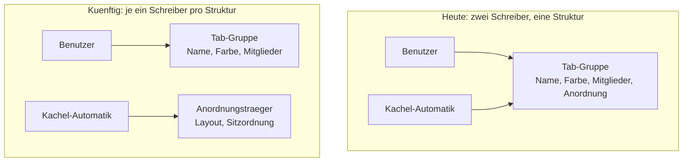

# Tab-Gruppen gehören dem Benutzer - Plan

## Goal Capsule

- **Ziel:** Eine Tab-Gruppe entsteht, verändert sich und vergeht nur durch eine Benutzeraktion. Die Kachel-Anordnung, die heute in der Gruppe mitwohnt, zieht in einen eigenen, unsichtbaren Träger um.
- **Produkthoheit:** Dieser Plan besitzt ausschließlich den Eigentumsumbau. Bedienoberfläche der Gruppen, Ziehen mit Gruppen und die Fenstergrenze sind benannte Folgearbeiten und nicht aktiver Umfang — siehe [How This Work Fits Together](#how-this-work-fits-together).
- **Offene Blocker:** Keine.

---

## Product Contract

### Summary

Tab-Gruppen gehören künftig ausschließlich dem Benutzer. Die Kachel-Anordnung wird auf einem eigenen, im Streifen unsichtbaren Träger geführt, statt in der Gruppe mitzuwohnen. Damit halten „Gruppierung auflösen", „Aus Gruppe entfernen" und Einklappen das, was sie versprechen.

### Problem Frame

Eine Tab-Gruppe trägt heute zwei Bedeutungen gleichzeitig: sie ist die Sache, die der Benutzer anlegt, benennt und einfärbt — und sie ist der Behälter, in dem der Browser die Kachel-Anordnung aufzeichnet. Zwei Schreiber, eine Struktur.

Der Konflikt entlädt sich in derselben Runde, in der der Benutzer handelt. `dissolve()` löscht die Gruppe und ruft dann `broadcast()`; der erste Schritt dieser Runde ist `#maintainArrangement()`. Die Tabs sind jetzt gruppenlos, also sieht `groupToHoldArrangement` mindestens zwei belegte Kacheln ohne Gruppe und legt eine neue an. Weil der frei gewordene Palettenplatz der erste unbenutzte ist, bekommt sie in aller Regel dieselbe Farbe. Für den Benutzer sieht es aus, als sei nichts passiert — tatsächlich sind Name und Identität weg. „Aus Gruppe entfernen" verliert dieselbe Runde gegen `tabsToAbsorb`, sofern die Gruppe die Entfernung überlebt.

Einklappen scheitert an einer zweiten Stelle: der Ablösepfad ruft `Tab.setTileIndex(null)`, was nur ein Feld setzt. Das Kachelgitter erfährt nichts davon, `relayout()` liest weiterhin aus dem Gitter, und die Seiten bleiben sichtbar — ohne Tab im Streifen, über den man sie schließen, stummschalten oder verlassen könnte. Genau der Zustand, den der Kommentar am Einklapppfad zu verhindern beansprucht.

Keiner der drei Fehler wird von Tests gesehen. Die Testumgebung für den Gruppen-Controller hat keinen Split, also läuft dort `#maintainArrangement` nie, und die Ablösung wird gegen eine Spionage-Funktion geprüft statt gegen das Gitter.

### Key Decisions

- KD1. **Eine Gruppe gehört ausschließlich dem Benutzer.** (session-settled: user-directed — chosen over einer „Benutzer hat entschieden"-Markierung auf der Gruppe und over dem Verzicht auf jede Anordnungs-Aufzeichnung: nur bei getrennten Strukturen kann die Automatik eine Benutzerentscheidung gar nicht erst überstimmen.) Governs R1, R2, R3, R4.
- KD2. **Die Kachel-Anordnung bekommt einen eigenen, unsichtbaren Träger**, der Layout und Sitzordnung führt. (session-settled: user-directed — chosen over einem einzelnen Merkposten pro Fenster und over dem Verzicht auf Wiederherstellung: erhält das Zurückholen per Klick ohne Rateschritt.) Governs R5, R6, R7.
- KD3. **Die Aufzeichnung überlebt Beenden und Neustart.** (session-settled: user-directed — chosen over einer reinen Laufzeit-Struktur: sonst käme eine eingeklappt beendete Gruppe stillschweigend unbekachelt zurück.) Governs R8.
- KD4. **Absorption durch Gruppen entfällt ersatzlos.** (session-settled: user-approved — die bisherige Regel „gemischte Herkunft nimmt immer die bestehende Gruppe" aus `docs/STATUS.md` wird gekippt, weil sie ohne Benutzeraktion Mitgliedschaft verändert.) Governs R3.
- KD5. **Beim Update werden unbenannte Gruppen zu Trägern, benannte bleiben Gruppen.** (session-settled: user-approved — ein unbenannter Chip trägt keine Benutzerentscheidung, die verloren gehen könnte.) Governs R12.
- KD6. **Dieser Plan besitzt nur den Eigentumsumbau.** (session-settled: user-directed — chosen over einem gemeinsamen Plan mit der Bedienoberfläche und over einer Rundumsanierung: Ziehen setzt den Umbau ohnehin voraus, Bedienung und Fenstergrenze sind unabhängig davon.)

Was sich strukturell ändert:

### Actors

- A1. **Benutzer** — legt Gruppen an, benennt, färbt, klappt ein, entfernt Mitglieder, löst auf. Einzige Quelle von Gruppenmitgliedschaft.
- A2. **Kachel-Automatik** — hält die Anordnung nach jedem Settle-Durchlauf fest und stellt sie auf Anforderung wieder her. Schreibt nach diesem Umbau nur noch auf den Träger.

### Requirements

**Eigentum von Gruppen**

- R1. Eine Tab-Gruppe entsteht ausschließlich durch eine Benutzeraktion. Kacheln, Layoutwechsel und Sitzungswiederherstellung legen keine Gruppe an.
- R2. Eine Gruppe vergeht nur, wenn der Benutzer sie auflöst oder ihr letztes Mitglied schließt. Kein automatischer Vorgang legt sie danach neu an.
- R3. Kein automatischer Vorgang ändert die Mitgliedschaft einer Gruppe. Ein Tab, der in eine Kachel neben Gruppenmitglieder gesetzt wird, bleibt gruppenlos.
- R4. „Gruppierung auflösen" und „Aus Gruppe entfernen" halten unabhängig von Layout, Anzahl belegter Kacheln und Mitgliederzahl der Gruppe.

**Träger der Kachel-Anordnung**

- R5. Die Kachel-Anordnung wird auf einem eigenen Träger geführt, der Layout und Sitzordnung enthält und im Tab-Streifen nicht erscheint.
- R6. Der Träger wird gepflegt, ohne dass dafür eine Gruppe existieren oder entstehen muss.
- R7. Ein Klick auf einen Tab, dessen aufgezeichnete Anordnung gerade nicht in Kraft ist, stellt diese Anordnung wieder her.
- R8. Eine aufgezeichnete Anordnung übersteht Beenden und Neustart des Browsers.

**Einklappen und Kacheln**

- R9. Einklappen einer Gruppe gibt die Kacheln ihrer Mitglieder tatsächlich frei: die Seiten verschwinden aus dem Gitter, und das Gitter reagiert nach den bestehenden Belegungsregeln.
- R10. Nach dem Einklappen ist kein Tab aktiv, der im Streifen nicht sichtbar ist.
- R11. Ausklappen stellt Kacheln nicht von sich aus wieder her; die Mitglieder kehren als gewöhnliche unbekachelte Tabs zurück. Das Zurückholen ist der Klick aus R7.

**Migration**

- R12. Beim ersten Start nach dem Umbau werden bestehende unbenannte Gruppen mit aufgezeichneter Anordnung in Träger überführt. Benannte Gruppen bleiben Gruppen und behalten ihre Aufzeichnung.

### Key Flows

- F1. Gruppe auflösen, während gekachelt
  - **Auslöser:** A1 wählt „Gruppierung auflösen" im Tab-Kontextmenü. Zwei Mitglieder der Gruppe sitzen in Kacheln.
  - **Schritte:** Die Gruppe verschwindet. Der Träger übernimmt die Anordnung, ohne dass eine Gruppe entsteht. Die Kachelung bleibt unverändert bestehen.
  - **Ergebnis:** Kein Chip mehr im Streifen, Tabs weiterhin gekachelt, Tab-Reihenfolge unverändert.
  - **Deckt ab:** R1, R2, R4, R5, R6

- F2. Gruppe einklappen, während gekachelt
  - **Auslöser:** A1 klickt den Chip einer Gruppe, deren Mitglieder Kacheln belegen.
  - **Schritte:** Die Mitglieder verlassen ihre Kacheln, das Gitter reagiert nach den bestehenden Belegungsregeln, der Träger behält Layout und Sitzordnung. Liegt der aktive Tab unter den Mitgliedern, wandert die Aktivierung auf einen sichtbaren Tab.
  - **Ergebnis:** Nur der Chip steht im Streifen, keine verwaiste Seite im Gitter.
  - **Deckt ab:** R9, R10

- F3. Eingeklappt beenden, neu starten, zurückholen
  - **Auslöser:** A1 beendet den Browser mit eingeklappter Gruppe und startet neu.
  - **Schritte:** Die Sitzungswiederherstellung bringt die Mitglieder unbekachelt zurück, die Gruppe bleibt eingeklappt. A1 klappt aus und klickt ein Mitglied.
  - **Ergebnis:** Die aufgezeichnete Kachelung ist wieder da, mit derselben Sitzordnung.
  - **Deckt ab:** R7, R8, R11

### Acceptance Examples

- AE1. **Deckt R2, R4 ab.** Gegeben ein `2x2`-Fenster mit zwei belegten Kacheln, deren Tabs eine benannte Gruppe bilden. Wenn A1 die Gruppierung auflöst, dann existiert nach dem folgenden Rundendurchlauf keine Gruppe — weder die alte noch eine neue unbenannte.
- AE2. **Deckt R3, R4 ab.** Gegeben eine Gruppe mit drei Mitgliedern, alle in Kacheln. Wenn A1 ein Mitglied aus der Gruppe entfernt, dann bleibt dieser Tab gruppenlos und behält seine Kachel.
- AE3. **Deckt R1, R3 ab.** Gegeben ein Fenster mit zwei belegten Kacheln und keiner Gruppe. Wenn A1 einen dritten Tab in eine Kachel zieht, dann entsteht keine Gruppe und kein Chip erscheint im Streifen.
- AE4. **Deckt R3 ab.** Gegeben eine Gruppe mit zwei bekachelten Mitgliedern. Wenn ein gruppenloser Tab in eine dritte Kachel gesetzt wird, dann tritt er der Gruppe nicht bei.
- AE5. **Deckt R9, R10 ab.** Gegeben eine Gruppe, deren zwei Mitglieder die einzigen belegten Kacheln eines `1x2`-Fensters sind, und der aktive Tab ist eines der Mitglieder. Wenn A1 die Gruppe einklappt, dann zeigt das Gitter keine Seite eines eingeklappten Mitglieds mehr, und der aktive Tab ist einer der im Streifen sichtbaren.
- AE6. **Deckt R7, R8 ab.** Gegeben eine eingeklappte Gruppe mit aufgezeichneter `1x2`-Anordnung, und der Browser wurde beendet und neu gestartet. Wenn A1 ausklappt und ein Mitglied anklickt, dann steht das Fenster wieder in `1x2` mit derselben Sitzordnung.
- AE7. **Deckt R12 ab.** Gegeben ein gespeicherter Gruppenbestand mit einer unbenannten Gruppe samt Anordnung und einer benannten Gruppe. Wenn der Browser nach dem Umbau erstmals startet, dann ist die unbenannte Gruppe als Träger vorhanden und zeichnet keinen Chip, und die benannte Gruppe steht unverändert im Streifen.

### Success Criteria

- Auflösen, Entfernen und Einklappen sind gegen ein Fenster mit echtem Split abgenommen, nicht nur gegen eine splitlose Umgebung. Die heutige Testlücke ist der Grund, warum drei Fehler gleichzeitig unbemerkt blieben.
- Einklappen wird gegen den Zustand des Kachelgitters geprüft, nicht gegen den Aufruf der Ablösefunktion.
- Ein Benutzer, der nie eine Gruppe anlegt, sieht nie einen Farbchip im Streifen.

### Scope Boundaries

Nicht in diesem Plan:

- Bedienoberfläche der Gruppen: Kontextmenü auf dem Chip, „Gruppe schließen", Mehrfachauswahl beim Gruppieren, Tastenkombinationen.
- Ziehen mit Gruppen: Tabs per Maus in eine Gruppe hinein oder heraus, Gruppe als Ganzes verschieben, Drop-Index bei eingeklappten Gruppen.
- Fenstergrenze: Gruppen fremder Fenster im Kontextmenü, fensterübergreifende Mitgliedschaft, Geistergruppen nach dem Schließen eines Fensters.
- Unbehandelte Fehler aus nativen Menü-Klicks und die stille Ablehnung beim Umbenennen einer bereits aufgelösten Gruppe.

<!-- ce-section: work-relationships -->
### How This Work Fits Together

Dieser Plan besitzt den Eigentumsumbau. Die folgende Aufteilung ist das heutige Verständnis der Umgebung, kein zugesagter Fahrplan; ein späterer Plan darf sie revidieren, teilen, zusammenführen oder verwerfen.

- Bedienoberfläche der Gruppen
  - Can proceed independently of diesem Plan.
  - Shares die Erwartung aus R2, dass eine aufgelöste Gruppe aufgelöst bleibt — sonst wirkt ein Auflösen-Eintrag am Chip genauso wirkungslos wie heute.
- Ziehen mit Gruppen
  - Depends on R3: solange ein automatischer Vorgang Mitgliedschaft ändert, kann ein Herausziehen nicht halten.
  - Still to decide: ob Ziehen Mitgliedschaft ändern soll oder nur Reihenfolge.
- Fenstergrenze und Geistergruppen
  - Can proceed independently of diesem Plan.
  - Enables eine spätere Vereinfachung von R12, weil ein je Fenster abgegrenzter Bestand weniger Altlasten enthält.

### Dependencies and Assumptions

- Die Sitzungswiederherstellung trägt Layout, Teilerpositionen und Kachelbelegung bereits selbst und unabhängig von Gruppen. Der Träger muss die laufende Kachelung also nicht sichern, sondern nur eine weggenommene Anordnung.
- Das Zurückholen einer Anordnung ist heute an den Klick auf ein Gruppenmitglied gebunden. R7 verschiebt diese Bindung auf den Träger; der Klick bleibt der Auslöser.
- Der Gruppenbestand liegt versioniert und heilend auf der Platte. Die Migration aus R12 kann sich auf diese Heilung stützen, statt einen eigenen Reparaturpfad zu bauen.

### Outstanding Questions

**Deferred to Planning**

- Ob der Träger eine eigene Datei bekommt oder im bestehenden Gruppenbestand als eigener Eintragstyp lebt.
- Ob `TabGroupController.retainLiveTabs` beim Umbau entfällt. Es hat keinen Aufrufer im Produktivcode, nur zwei in den Tests, und sein eigener Kommentar erklärt es für mehrfenstrig falsch.
- Wie das Kachelgitter genau reagiert, wenn Einklappen mehrere Kacheln auf einmal freigibt — die bestehenden Belegungsregeln geben die Antwort, sie muss nur an dieser Stelle gezogen werden.

### Sources

- `src/main/browser/TabGroupController.ts` — `dissolve`, `removeTab`, `setCollapsed`, `keepArrangement`; der Kommentarblock am Einklapppfad beschreibt das Sollverhalten, das heute nicht eintritt.
- `src/main/browser/BrowserWindowController.ts` — `#maintainArrangement` läuft als erster Schritt jeder Broadcast-Runde; `assignTabToTile` ist die Ablöse-Funktion, die das Gitter tatsächlich anfasst.
- `src/shared/tabgroups/model.ts` — `groupToHoldArrangement`, `tabsToAbsorb`, `nextTabGroupColor`; die Schwelle greift auf belegte Kacheln, nicht auf die Layoutgröße.
- `src/main/browser/window-seams.ts` — die Ablösung ist auf `Tab.setTileIndex(null)` verdrahtet und erreicht das Gitter nicht.
- `src/shared/session/model.ts`, `src/main/session-restore/apply.ts` — die Sitzung trägt Layout und Kachelbelegung unabhängig von Gruppen.
- `tests/tab-group-controller.test.ts` — die Testumgebung hat keinen Split; deshalb sieht kein Test die Rücknahme durch die Anordnungspflege.
- `docs/STATUS.md` — die bisherigen Entscheidungen zu Auto-Gruppierung beim Kacheln, zur Absorption gemischter Herkunft und dazu, dass nie automatisch aufgelöst wird.
