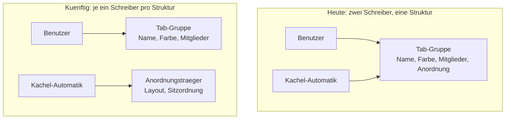
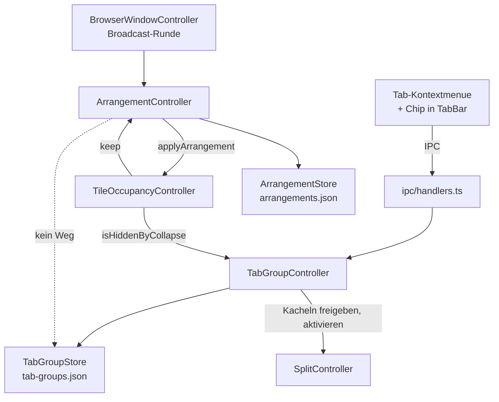
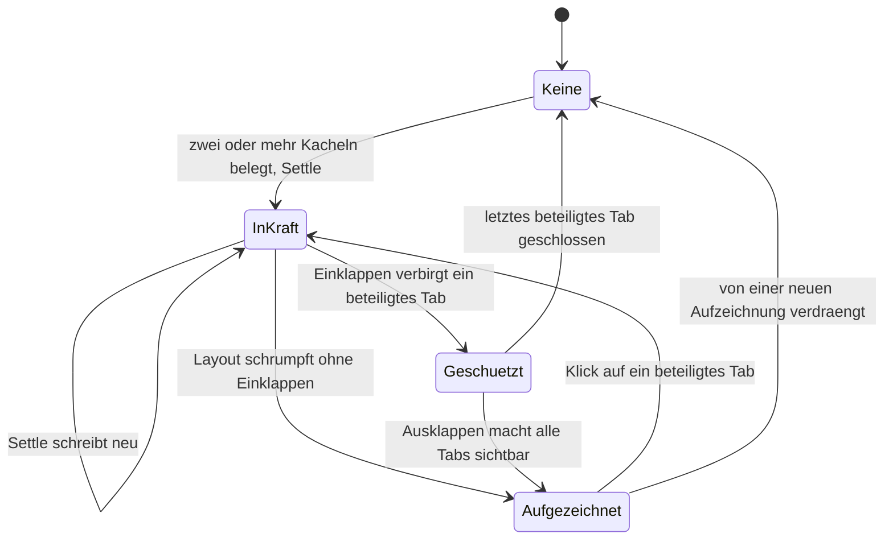

# Tab-Gruppen gehören dem Benutzer - Plan

## Goal Capsule

- **Ziel:** Eine Tab-Gruppe entsteht, verändert sich und vergeht nur durch eine Benutzeraktion. Die Kachel-Anordnung, die heute in der Gruppe mitwohnt, zieht in einen eigenen, unsichtbaren Träger um.
- **Produkthoheit:** Dieser Plan besitzt ausschließlich den Eigentumsumbau. Bedienoberfläche der Gruppen, Ziehen mit Gruppen und die Fenstergrenze sind benannte Folgearbeiten und nicht aktiver Umfang — siehe [How This Work Fits Together](#how-this-work-fits-together).
- **Offene Blocker:** Keine.
- **Product-Contract-Erhalt:** geändert — R9, R12, KD5, AE5, AE7; neu — R13, R14, R15, R16, KD7, AE8, AE9, AE10.
  - R9/R13/KD7/AE8: Einklappen lässt das Layout schrumpfen und schließt dabei keinen Tab; die ursprüngliche Fassung berief sich auf Belegungsregeln, die bei einer reinen Ablösung nicht greifen.
  - R12/KD5/AE7: die Migration überführt nichts in Träger und löscht nichts.
  - R14/R15/R16/AE9/AE10: der gruppenfreie Träger verliert drei Schutzwirkungen, die die Bindung an genau eine Gruppe bisher nebenbei geleistet hat — kein verborgener Tab in einer Kachel, keine Verdrängung einer noch gebrauchten Aufzeichnung, keine Anwendung über Fenstergrenzen hinweg.

---

## Product Contract

### Summary

Tab-Gruppen gehören künftig ausschließlich dem Benutzer. Die Kachel-Anordnung wird auf einem eigenen, im Streifen unsichtbaren Träger geführt, statt in der Gruppe mitzuwohnen. Damit halten „Gruppierung auflösen", „Aus Gruppe entfernen" und Einklappen das, was sie versprechen.

### Problem Frame

Eine Tab-Gruppe trägt heute zwei Bedeutungen gleichzeitig: sie ist die Sache, die der Benutzer anlegt, benennt und einfärbt — und sie ist der Behälter, in dem der Browser die Kachel-Anordnung aufzeichnet. Zwei Schreiber, eine Struktur.

Der Konflikt entlädt sich in derselben Runde, in der der Benutzer handelt. `dissolve()` löscht die Gruppe und ruft dann `broadcast()`; der erste Schritt dieser Runde ist `#maintainArrangement()`. Die Tabs sind jetzt gruppenlos, also sieht `groupToHoldArrangement` mindestens zwei belegte Kacheln ohne Gruppe und legt eine neue an. Weil der frei gewordene Palettenplatz der erste unbenutzte ist, bekommt sie in aller Regel dieselbe Farbe. Für den Benutzer sieht es aus, als sei nichts passiert — tatsächlich sind Name und Identität weg. „Aus Gruppe entfernen" verliert dieselbe Runde gegen `tabsToAbsorb`, sofern die Gruppe die Entfernung überlebt.

Einklappen scheitert an einer zweiten Stelle: der Ablösepfad ruft `Tab.setTileIndex(null)`, was nur ein Feld setzt. Das Kachelgitter erfährt nichts davon, `relayout()` liest weiterhin aus dem Gitter, und die Seiten bleiben sichtbar — ohne Tab im Streifen, über den man sie schließen, stummschalten oder verlassen könnte. Genau der Zustand, den der Kommentar am Einklapppfad zu verhindern beansprucht.

Keiner der drei Fehler wird von Tests gesehen. Die Testumgebung für den Gruppen-Controller hat keinen Split, also läuft dort `#maintainArrangement` nie, und die Ablösung wird gegen eine Spionage-Funktion geprüft statt gegen das Gitter.

### Key Decisions

- KD1. **Eine Gruppe gehört ausschließlich dem Benutzer.** (session-settled: user-directed — chosen over einer „Benutzer hat entschieden"-Markierung auf der Gruppe und over dem Verzicht auf jede Anordnungs-Aufzeichnung: nur bei getrennten Strukturen kann die Automatik eine Benutzerentscheidung gar nicht erst überstimmen.) Governs R1, R2, R3, R4.
- KD2. **Die Kachel-Anordnung bekommt einen eigenen, unsichtbaren Träger**, der Layout und Sitzordnung führt. (session-settled: user-directed — chosen over einem einzelnen Merkposten pro Fenster und over dem Verzicht auf Wiederherstellung: erhält das Zurückholen per Klick ohne Rateschritt.) Governs R5, R6, R7.
- KD3. **Die Aufzeichnung überlebt Beenden und Neustart.** (session-settled: user-directed — chosen over einer reinen Laufzeit-Struktur: sonst käme eine eingeklappt beendete Gruppe stillschweigend unbekachelt zurück.) Governs R8.
- KD4. **Absorption durch Gruppen entfällt ersatzlos.** (session-settled: user-approved — die bisherige Regel „gemischte Herkunft nimmt immer die bestehende Gruppe" aus `docs/STATUS.md:208` wird gekippt, weil sie ohne Benutzeraktion Mitgliedschaft verändert.) Governs R3.
- KD5. **Die Migration löscht keine Gruppe.** (session-settled: user-directed — chosen over dem Wegwerfen unbenannter Gruppen mit Aufzeichnung: eine vom Benutzer angelegte, nie benannte Gruppe bekommt von der Automatik eine Aufzeichnung eingetragen, sobald ihre Tabs gekachelt sind, und ist von einem Automatik-Artefakt damit nicht unterscheidbar.) Governs R12.
- KD6. **Dieser Plan besitzt nur den Eigentumsumbau.** (session-settled: user-directed — chosen over einem gemeinsamen Plan mit der Bedienoberfläche und over einer Rundumsanierung: Ziehen setzt den Umbau ohnehin voraus, Bedienung und Fenstergrenze sind unabhängig davon.)
- KD7. **Einklappen lässt das Layout schrumpfen.** (session-settled: user-directed — chosen over leer stehenden Scheiben und over dem Auffüllen mit anderen geladenen Tabs: die freigeräumte Kachel verschwindet, wie es die erklärte Regel des Belegungs-Controllers verlangt.) Governs R9, R13.
- KD8. **Eine Aufzeichnung wird ganz oder gar nicht angewandt.** Ist auch nur einer ihrer Tabs eingeklappt verborgen oder gehört er einem anderen Fenster, unterbleibt die Wiederherstellung vollständig. Teilweises Anwenden hinterließe eine leere Scheibe, träfe nie den aufgezeichneten Zustand und ließe damit jeden weiteren Klick dieselbe Anordnung erneut anwenden. Governs R14, R16.

Was sich strukturell ändert:



### Actors

- A1. **Benutzer** — legt Gruppen an, benennt, färbt, klappt ein, entfernt Mitglieder, löst auf. Einzige Quelle von Gruppenmitgliedschaft.
- A2. **Kachel-Automatik** — hält die Anordnung nach jedem Settle-Durchlauf fest und stellt sie auf Anforderung wieder her. Schreibt nach diesem Umbau nur noch auf den Träger.

### Requirements

**Eigentum von Gruppen**

- R1. Eine Tab-Gruppe entsteht ausschließlich durch eine Benutzeraktion. Kacheln, Layoutwechsel und Sitzungswiederherstellung legen keine Gruppe an.
- R2. Eine Gruppe vergeht nur, wenn der Benutzer sie auflöst oder ihr letztes Mitglied schließt. Kein automatischer Vorgang legt sie danach neu an.
- R3. Kein automatischer Vorgang ändert die Mitgliedschaft einer Gruppe. Ein Tab, der in eine Kachel neben Gruppenmitglieder gesetzt wird, bleibt gruppenlos.
- R4. „Gruppierung auflösen" und „Aus Gruppe entfernen" halten unabhängig von Layout, Anzahl belegter Kacheln und Mitgliederzahl der Gruppe.

**Träger der Kachel-Anordnung**

- R5. Die Kachel-Anordnung wird auf einem eigenen Träger geführt, der Layout und Sitzordnung enthält und im Tab-Streifen nicht erscheint.
- R6. Der Träger wird gepflegt, ohne dass dafür eine Gruppe existieren oder entstehen muss.
- R7. Ein Klick auf einen Tab, dessen aufgezeichnete Anordnung gerade nicht in Kraft ist, stellt diese Anordnung wieder her. Der geklickte Tab ist danach der aktive.
- R8. Eine aufgezeichnete Anordnung übersteht Beenden und Neustart, solange die Sitzungswiederherstellung eingeschaltet ist. Ist sie abgeschaltet, wird der Anordnungsbestand beim Start geleert wie die Gruppenmitgliedschaften.
- R14. Eine Aufzeichnung wird ganz oder gar nicht angewandt. Ist auch nur einer ihrer Tabs durch Einklappen verborgen, unterbleibt die Wiederherstellung und das Layout bleibt unverändert.
- R15. Eine Aufzeichnung wird nicht von einer neuen verdrängt, solange mindestens einer ihrer Tabs durch Einklappen verborgen ist.
- R16. Eine Aufzeichnung wirkt nur in dem Fenster, dessen Tabs sie enthält. Sie wird von der Tätigkeit anderer Fenster weder verdrängt noch in einem anderen Fenster angewandt.

**Einklappen und Kacheln**

- R9. Einklappen einer Gruppe gibt die Kacheln ihrer Mitglieder frei und lässt das Layout schrumpfen, statt leere Scheiben stehen zu lassen. Kein anderer Tab rückt in eine freigeräumte Kachel nach.
- R10. Nach dem Einklappen ist kein Tab aktiv, der im Streifen nicht sichtbar ist. War der aktive Tab eines der verborgenen Mitglieder, wird der erste sichtbare Tab der Streifenreihenfolge aktiv.
- R11. Ausklappen stellt Kacheln nicht von sich aus wieder her; die Mitglieder kehren als gewöhnliche unbekachelte Tabs zurück. Das Zurückholen ist der Klick aus R7.
- R13. Einklappen schließt keinen Tab, auch keinen vom Browser selbst geöffneten Füll-Tab.

**Migration**

- R12. Beim ersten Start nach dem Umbau bleibt jede gespeicherte Gruppe eine Gruppe. Aus ihr wird nur die Anordnungs-Aufzeichnung entfernt.

### Key Flows

- F1. Gruppe auflösen, während gekachelt
  - **Auslöser:** A1 wählt „Gruppierung auflösen" im Tab-Kontextmenü. Zwei Mitglieder der Gruppe sitzen in Kacheln.
  - **Schritte:** Die Gruppe verschwindet. Der Träger übernimmt die Anordnung, ohne dass eine Gruppe entsteht. Die Kachelung bleibt unverändert bestehen.
  - **Ergebnis:** Kein Chip mehr im Streifen, Tabs weiterhin gekachelt, Tab-Reihenfolge unverändert.
  - **Deckt ab:** R1, R2, R4, R5, R6

- F2. Gruppe einklappen, während gekachelt
  - **Auslöser:** A1 klickt den Chip einer Gruppe, deren Mitglieder Kacheln belegen.
  - **Schritte:** Die Mitglieder verlassen ihre Kacheln, das Layout schrumpft ohne einen Tab zu schließen und ohne einen fremden Tab nachrücken zu lassen, und die Aufzeichnung der weggenommenen Anordnung bleibt geschützt stehen. War der aktive Tab ein Mitglied, wandert die Aktivierung auf den ersten sichtbaren Tab.
  - **Ergebnis:** Nur der Chip steht im Streifen, keine verwaiste und keine leere Scheibe im Gitter.
  - **Deckt ab:** R9, R10, R13, R15

- F3. Eingeklappt beenden, neu starten, zurückholen
  - **Auslöser:** A1 beendet den Browser mit eingeklappter Gruppe und startet neu.
  - **Schritte:** Die Sitzungswiederherstellung bringt die Mitglieder unbekachelt zurück, die Gruppe bleibt eingeklappt. A1 klappt aus — erst danach sind alle Tabs der Aufzeichnung sichtbar — und klickt ein Mitglied.
  - **Ergebnis:** Die aufgezeichnete Kachelung ist wieder da, mit derselben Sitzordnung, und das geklickte Mitglied ist aktiv.
  - **Deckt ab:** R7, R8, R11, R14

### Acceptance Examples

- AE1. **Deckt R2, R4 ab.** Gegeben ein `2x2`-Fenster mit zwei belegten Kacheln, deren Tabs eine benannte Gruppe bilden. Wenn A1 die Gruppierung auflöst, dann existiert nach dem folgenden Rundendurchlauf keine Gruppe — weder die alte noch eine neue unbenannte.
- AE2. **Deckt R3, R4 ab.** Gegeben eine Gruppe mit drei Mitgliedern, alle in Kacheln. Wenn A1 ein Mitglied aus der Gruppe entfernt, dann bleibt dieser Tab gruppenlos und behält seine Kachel.
- AE3. **Deckt R1, R3 ab.** Gegeben ein Fenster mit zwei belegten Kacheln und keiner Gruppe. Wenn A1 einen dritten Tab in eine Kachel zieht, dann entsteht keine Gruppe und kein Chip erscheint im Streifen.
- AE4. **Deckt R3 ab.** Gegeben eine Gruppe mit zwei bekachelten Mitgliedern. Wenn ein gruppenloser Tab in eine dritte Kachel gesetzt wird, dann tritt er der Gruppe nicht bei.
- AE5. **Deckt R9, R10 ab.** Gegeben eine Gruppe, deren zwei Mitglieder die einzigen belegten Kacheln eines `1x2`-Fensters sind, und der aktive Tab ist eines der Mitglieder. Wenn A1 die Gruppe einklappt, dann steht das Fenster in `1x1`, und der aktive Tab ist der erste im Streifen sichtbare.
- AE6. **Deckt R7, R8 ab.** Gegeben eine eingeklappte Gruppe mit aufgezeichneter `1x2`-Anordnung, und der Browser wurde beendet und neu gestartet. Wenn A1 ausklappt und ein Mitglied anklickt, dann steht das Fenster wieder in `1x2` mit derselben Sitzordnung, und das geklickte Mitglied ist aktiv.
- AE7. **Deckt R12 ab.** Gegeben ein gespeicherter Gruppenbestand mit einer unbenannten Gruppe samt Aufzeichnung und einer benannten Gruppe. Wenn der Browser nach dem Umbau erstmals startet, dann stehen beide Gruppen unverändert im Streifen, und keine von ihnen trägt noch eine Aufzeichnung.
- AE8. **Deckt R13 ab.** Gegeben ein `2x2`-Fenster, in dem alle vier Kacheln von Mitgliedern einer Gruppe belegt sind. Wenn A1 die Gruppe einklappt, dann ist danach kein Tab geschlossen worden.
- AE9. **Deckt R14, R15 ab.** Gegeben eine aufgezeichnete `1x2`-Anordnung aus einem eingeklappten Gruppenmitglied und einem losen Tab. Wenn A1 den losen Tab anklickt, dann bleibt das Layout unverändert und es wird keine Kachel zugewiesen; die Aufzeichnung existiert weiterhin.
- AE10. **Deckt R9, R13, R15 ab.** Gegeben ein `2x2`-Fenster mit zwei Gruppenmitgliedern und zwei fremden Tabs in den Kacheln, und die Layout-Anpassung ist in den Einstellungen abgeschaltet. Wenn A1 die Gruppe einklappt, dann steht das Fenster in `1x2` mit beiden fremden Tabs bekachelt, kein Tab ist geschlossen, kein weiterer Tab ist nachgerückt, und die alte `2x2`-Aufzeichnung existiert weiterhin.
- AE11. **Deckt R16 ab.** Gegeben zwei normale Fenster, jedes mit einer eigenen aufgezeichneten Anordnung. Wenn im zweiten Fenster so lange neue Anordnungen entstehen, dass die Mengengrenze greift, dann bleibt die Aufzeichnung des ersten Fensters erhalten.

### Success Criteria

- Auflösen, Entfernen und Einklappen sind gegen einen echten Split abgenommen, nicht nur gegen eine splitlose Umgebung.
- Einklappen wird gegen den Zustand des Kachelgitters geprüft, nicht gegen den Aufruf der Ablösefunktion.
- Ein Benutzer, der nie eine Gruppe anlegt, sieht nie einen Farbchip im Streifen.
- Ein privates Fenster schreibt keine Anordnung auf die Platte.

### Scope Boundaries

Nicht in diesem Plan:

- Bedienoberfläche der Gruppen: Kontextmenü auf dem Chip, „Gruppe schließen", Mehrfachauswahl beim Gruppieren, Tastenkombinationen.
- Ziehen mit Gruppen: Tabs per Maus in eine Gruppe hinein oder heraus, Gruppe als Ganzes verschieben, Drop-Index bei eingeklappten Gruppen.
- Fenstergrenze der **Gruppen**: Gruppen fremder Fenster im Kontextmenü, fensterübergreifende Mitgliedschaft, Geistergruppen nach dem Schließen eines Fensters. Die Fenstergrenze der **Anordnungen** ist über R16 in diesem Plan geregelt, weil sie erst durch den Wegfall der Gruppenbindung entsteht.
- Unbehandelte Fehler aus nativen Menü-Klicks und die stille Ablehnung beim Umbenennen einer bereits aufgelösten Gruppe.

#### Deferred to Follow-Up Work

- Aufteilung der Dateien über dem Zeilenbudget von 780. Heute sind es acht (`src/shared/ipc/contract.ts` 1244, `src/main/browser/BrowserWindowController.ts` 1224, `src/main/browser/Tab.ts` 1114, `src/main/index.ts` 1046, `src/shared/tabgroups/model.ts` 953, `src/renderer/overlay/surface.ts` 944, `src/main/ipc/handlers.ts` 918, `PasswordsPage.tsx` 787). Dieser Plan holt eine davon heraus und darf keine weitere hinzufügen.

<!-- ce-section: work-relationships -->
### How This Work Fits Together

Dieser Plan besitzt den Eigentumsumbau. Die folgende Aufteilung ist das heutige Verständnis der Umgebung, kein zugesagter Fahrplan; ein späterer Plan darf sie revidieren, teilen, zusammenführen oder verwerfen.

- Bedienoberfläche der Gruppen
  - Can proceed independently of diesem Plan.
  - Shares die Erwartung aus R2, dass eine aufgelöste Gruppe aufgelöst bleibt — sonst wirkt ein Auflösen-Eintrag am Chip genauso wirkungslos wie heute.
- Ziehen mit Gruppen
  - Depends on R3: solange ein automatischer Vorgang Mitgliedschaft ändert, kann ein Herausziehen nicht halten.
  - Still to decide: ob Ziehen Mitgliedschaft ändern soll oder nur Reihenfolge.
- Fenstergrenze der Gruppen und Geistergruppen
  - Can proceed independently of diesem Plan.
  - Shares die Fensterzuordnung aus R16, die hier nur für Anordnungen gezogen wird.

---

## Planning Contract

### Key Technical Decisions

- KTD1. **Der Anordnungs-Host führt kein Gruppenbuch.** (session-settled: user-approved — chosen over einem Test, der die Rücknahme verbietet: eine Fähigkeit, die im Host nicht steht, kann nicht falsch benutzt werden, und der Beweis ist eine Typprüfung statt eines Testlaufs.) `ArrangementHost` erhält genau fünf Fähigkeiten: das eigene `ArrangementBook`, `currentLayout()`, `tileTabIds()`, `hiddenTabIds()` und `applyArrangement(layoutId, seats, activatedTabId)`. Kein `TabGroupBook`, kein `groups`, kein `TabGroup`-Typ. Verborgenheit reist als Menge von Tab-Ids, nicht als Zugriff auf Gruppen. **Die Entkopplung ist eine Verengung, keine Trennung:** der Belegungs-Controller behält seine Gruppenkante (`isHiddenByCollapse`), und die Naht speist `hiddenTabIds()` daraus. Governs R1, R2, R3.
- KTD2. **Die Anordnungslogik zieht in ein neues `src/shared/arrangements/`.** (session-settled: user-approved — chosen over einer Erweiterung von `src/shared/tabgroups/model.ts`: diese Datei liegt mit 953 Zeilen über dem Budget von 780 aus `scripts/metrics.mjs:228`, und der Umbau soll sie verkleinern statt vergrößern.) Governs R5, R6.
- KTD3. **Eigener Speicher `arrangements.json`.** (session-settled: user-approved — chosen over einem `version: 2` des Gruppen-Dokuments: jeder Speicher unter `src/main/data/` steht auf `z.literal(1)`, es gibt keinen Präzedenzfall für einen Versionssprung.) Nicht gewählt wurde auch das bestehende Sitzungsdokument, das Layout, Teilerpositionen und Kachelindex bereits führt: es beschreibt die *laufende* Kachelung, der Träger die *weggenommene*, und beides in einer Datei zu halten hieße, zwei Bedeutungen wieder zusammenzulegen — den Fehler, den dieser Plan behebt. Governs R8.
- KTD4. **Die Trennung `model.ts` / `schema.ts` gilt auch für das neue Modul.** Reine Helfer und Typen ohne zod in `model.ts`, die Validierung in `schema.ts`, das `model.ts` importiert und nie umgekehrt. `tests/architecture.test.ts` läuft den Wert-Import-Graphen des Renderers ab und schlägt sonst fehl; die Begründung steht in `docs/solutions/performance-issues/renderer-bundle-bloat-zod-co-location.md`. Für den Schema-Modell-Abgleich den Helfer `SameShape<A, B>` benutzen — der Architekturtest nennt das Zuweisungspaar ausdrücklich die schlechtere Form.
- KTD5. **Einklappen gibt Kacheln über eine dokumentierte Erweiterung von `WindowInternals` frei.** `window-seams.ts:30-34` verlangt, dass eine Naht bewusst und sichtbar verbreitert wird statt über einen Griff ins Fenster. Der `unassign`-Eintrag der Naht wird durch eine **mehrzahlige** Ablösefähigkeit ersetzt, damit die Freigabe einer ganzen Gruppe ein einziges Neuzeichnen auslöst. Governs R9, R10, R13.
- KTD6. **Keine Vertragsänderung an `src/shared/ipc/contract.ts`.** Träger sind für die Oberfläche unsichtbar, das Zurückholen hängt an der Tab-Aktivierung im Kern, und der Vertrag importiert `tabGroupSchema` aus `src/shared/tabgroups/schema.ts` — der Wegfall des `layout`-Feldes landet dort und nirgends sonst. Kein neuer IPC-Kanal.
- KTD7. **Es gibt keine Migrationslogik.** `JsonStore.open` parst vor dem `repair`-Rückruf (`src/main/data/JsonStore.ts:123-152`), und das Speicherschema ist ein einfaches `z.object`, das unbekannte Schlüssel verwirft. Sobald es `layout` nicht mehr kennt, ist das Feld beim Laden fort; ein Reparaturpass hätte nichts zu tun und würde `repairedOnLoad` nie setzen. Funktional folgenlos — aber die Zeichenkette bleibt bis zum nächsten Schreibvorgang in der Datei stehen, deshalb schreibt U7 sie einmalig neu, statt Restdaten unbestimmt liegen zu lassen. Governs R12.
- KTD8. **Verborgenheit ist ein berechnetes Prädikat, kein gespeichertes Feld.** Bei jedem `recordArrangement` wird aus der übergebenen Menge verborgener Tab-Ids neu bestimmt, welche Aufzeichnungen vor Verdrängung geschützt sind; mit dem Ausklappen erlischt der Schutz von selbst. Ein gespeichertes Schutz-Flag würde nach dem Ausklappen oder nach dem Auflösen der Gruppe stehen bleiben, bis die Mengengrenze mit unantastbaren Datensätzen voll ist. Governs R15.
- KTD9. **Der Anordnungsspeicher wird ausnahmslos mit `protection.codec` geöffnet.** `codec` ist in den Store-Optionen optional und fällt still auf Klartext zurück (`JsonStore.ts:117`); eine Auslassung erzeugt weder Typfehler noch roten Test. `JsonStore.ts:18` nennt die Verschlüsselung eine Spezifikationspflicht, und `src/main/index.ts` begründet, dass die Schutzentscheidung einmal fällt und an jeden Speicher geht. Eine Aufzeichnung enthält Tab-Ids und Zeitstempel — Daten derselben Art wie im Gruppenspeicher.

### High-Level Technical Design

Wer nach dem Umbau worauf schreibt:



Die gestrichelte Kante ist der Kern des Fixes: `ArrangementHost` enthält kein Gruppenbuch, also existiert der Pfad nicht, über den heute `keepArrangement` Gruppen anlegt und Mitglieder einsaugt. Die Kopplung ist damit verengt, nicht aufgehoben — der Belegungs-Controller behält seine Gruppenkante, und U8 sichert auch die ab. Die beiden Kanten zwischen `AC` und `Occ` laufen in verschiedene Richtungen und machen die Konstruktionsreihenfolge in `createWindowSeams` zu einer Entscheidung, die U4 trifft.

Zustandsübergänge einer Anordnung:



`Geschuetzt` ist kein gespeicherter Zustand, sondern die Sicht auf eine Aufzeichnung, von der gerade mindestens ein Tab verborgen ist (KTD8). Ein Klick wirkt nur aus `Aufgezeichnet` heraus — aus `Geschuetzt` passiert nichts (R14).

### Output Structure

```text
src/shared/arrangements/
  model.ts        # reine Typen, Regeln, repairArrangements — kein zod
  schema.ts       # zod-Wire-/Speicherschema + SameShape-Abgleich
src/main/data/
  ArrangementStore.ts
src/main/browser/
  ArrangementController.ts
tests/
  arrangements-model.test.ts
  arrangement-store.test.ts
  arrangement-controller.test.ts
  window-seams.test.ts
```

Die Baumdarstellung ist eine Umfangsangabe, keine Fessel — die `**Dateien:**`-Listen der Einheiten bleiben maßgeblich.

### Assumptions

- Private Fenster bekommen wie bei Gruppen ein Buch über eine Speicherzelle ohne Datei. Zwei private Fenster teilen keine Anordnungen.
- Die Sitzungswiederherstellung bleibt der Eigentümer der laufenden Kachelung. Der Anordnungsspeicher sichert nur weggenommene Anordnungen.
- Ein Tab gehört zu höchstens einer in Kraft befindlichen Anordnung. Nach KTD8 kann er zusätzlich in einer geschützten Aufzeichnung stehen; die ist nach R14 nicht anwendbar, solange sie verborgene Tabs enthält, weshalb es keine Vorrangfrage gibt.

### Sequencing

U1 → U2 → U3 → U4 → U5 → U6 → U7 → U8. U6 ist fachlich von der Anordnungskette unabhängig, berührt aber dieselben Dateien wie U4 und wird deshalb danach eingeplant.

---

## Implementation Units

### U1. Reines Anordnungsmodul

- **Ziel:** Die Anordnung existiert als eigener Begriff mit eigenen Regeln, unabhängig von Gruppen.
- **Requirements:** R5, R6, R14, R15, R16
- **Abhängigkeiten:** keine
- **Dateien:**
  - `src/shared/arrangements/model.ts` (neu)
  - `src/shared/arrangements/schema.ts` (neu)
  - `tests/arrangements-model.test.ts` (neu)
- **Vorgehen:**
  1. `Arrangement` beschreiben: Id, `LayoutId`, Sitzordnung als Kachelindex → Tab-Id, Zeitstempel.
  2. Reine Funktionen: `emptyArrangementDocument`, `arrangementOfTab`, `arrangementIsCurrent`, `recordArrangement`, `forgetArrangement`, `retainTabs`, `repairArrangements`.
  3. Alle Funktionen, die auswählen oder verdrängen, nehmen die lebenden Tab-Ids des rufenden Fensters entgegen und beziehen sich nur auf Aufzeichnungen, deren Tabs vollständig darin liegen. Das ist R16; ohne diesen Filter wirken Mengengrenze und Verdrängung über alle normalen Fenster hinweg, weil der Speicher geteilt ist.
  4. `recordArrangement` nimmt zusätzlich die Menge verborgener Tab-Ids und wendet KTD8 an: eine Aufzeichnung mit mindestens einem verborgenen Tab wird nicht verdrängt.
  5. `arrangementOfTab` liefert nur Aufzeichnungen, deren Tabs sämtlich sichtbar sind (R14) — die Filterung gehört hierher und nicht an die Aufrufstelle, damit sie testbar ist.
  6. Konstanten mit eigenem Docblock, der die Zahl begründet: `MIN_ARRANGED_TILES` (aus `src/shared/tabgroups/model.ts:103` übernommen), `MAX_ARRANGEMENTS` und die Verdrängungsordnung (Vorschlag: älteste zuerst). Die Obergrenze ist tragend, nicht kosmetisch — sie ersetzt den Gegendruck, den heute `MAX_TAB_GROUPS` in `groupToHoldArrangement` ausübt. Zusammen mit dem Schutz aus KTD8 muss die Ordnung so gewählt sein, dass niemals alle Einträge unverdrängbar sind.
  7. `schema.ts` mit zod, streng bei Identität, heilend bei Werten, Abgleich über `SameShape<A, B>` (KTD4).
- **Zu folgende Muster:** `src/shared/tabgroups/model.ts` für Docblock-Stil und Exportform; `src/shared/tabgroups/schema.ts` für die Schema-Trennung. Der Kopf des Moduls soll die Grenze aussprechen, die `src/shared/tabgroups/model.ts:17-32` bereits benennt.
- **Ausführungshinweis:** Reine Logik ohne Fenster — testgetrieben, weil jede Regel als Funktion prüfbar ist.
- **Testszenarien:**
  - Eine Anordnung mit weniger als `MIN_ARRANGED_TILES` besetzten Kacheln wird nicht aufgezeichnet.
  - `arrangementIsCurrent` meldet wahr bei übereinstimmendem Layout und übereinstimmender Sitzordnung, falsch bei abweichendem Layout, abweichender Sitzordnung und fehlendem Tab.
  - `recordArrangement` ersetzt eine überschneidende Aufzeichnung, von der kein Tab verborgen ist.
  - `recordArrangement` lässt eine überschneidende Aufzeichnung unangetastet, sobald einer ihrer Tabs als verborgen übergeben wird.
  - Deckt AE9. `arrangementOfTab` liefert nichts für einen Tab, dessen Aufzeichnung einen verborgenen Tab enthält.
  - Deckt AE11. `recordArrangement` mit den Tab-Ids eines Fensters verdrängt keine Aufzeichnung, deren Tabs sämtlich außerhalb dieser Menge liegen; `arrangementOfTab` liefert eine solche Aufzeichnung nicht.
  - Sind alle Aufzeichnungen geschützt und `MAX_ARRANGEMENTS` erreicht, wird keine neue aufgezeichnet statt eine geschützte zu opfern.
  - `retainTabs` entfernt tote Tab-Ids und verwirft eine Aufzeichnung, die dadurch zu klein wird.
  - `repairArrangements` verwirft doppelt belegte Kachelindizes, Indizes außerhalb des Layouts und Aufzeichnungen über `MAX_ARRANGEMENTS`.
  - Der `SameShape`-Abgleich übersetzt in beide Richtungen.
- **Verifikation:** `pnpm test:unit` grün; `pnpm typecheck` grün; das Modul enthält keinen Wert-Import von zod.

### U2. Anordnungsspeicher

- **Ziel:** Anordnungen liegen verschlüsselt in den Benutzerdaten, private Fenster schreiben nichts.
- **Requirements:** R8
- **Abhängigkeiten:** U1
- **Dateien:**
  - `src/main/data/ArrangementStore.ts` (neu)
  - `src/main/paths.ts`
  - `src/main/index.ts`
  - `tests/arrangement-store.test.ts` (neu)
- **Vorgehen:**
  1. `ArrangementStore` nach dem Vorbild von `src/main/data/TabGroupStore.ts`: Docblock über die Arbeitsteilung, heilendes Schema, `version: z.literal(1)`, `ArrangementBook` als Fähigkeitsschnittstelle, `persistedCell`/`memoryCell`, injizierte `generateId`/`now`, `debounceMs`.
  2. `bookFor(mode)` gibt privaten Fenstern eine Speicherzelle.
  3. `paths.ts` bekommt `arrangementsFile()` mit dem Kommentar, warum Benutzerdaten und nicht Cache.
  4. In `src/main/index.ts` öffnen wie den Gruppenspeicher, zwingend mit `codec: protection.codec` (KTD9), und `flushOnExit.push(() => arrangements?.flush())` ergänzen.
- **Zu folgende Muster:** `src/main/data/TabGroupStore.ts` in ganzer Länge; die Öffnungsstelle des Gruppenspeichers in `src/main/index.ts`.
- **Ausführungshinweis:** Der Architekturtest, der jeden puffernden Speicher in der Beenden-Kette verlangt (`tests/architecture.test.ts`, `it('flushes every store that can buffer a write before the process exits')`), schlägt fehl, bis Schritt 4 sitzt. Früh laufen lassen.
- **Testszenarien:**
  - Eine geschriebene Anordnung ist nach erneutem Öffnen derselben Datei vorhanden, mit Layout und Sitzordnung.
  - Der geschriebene Dateiinhalt ist kein lesbares JSON — `JSON.parse` darauf schlägt fehl (KTD9).
  - Eine Datei mit unbekanntem Layout-Bezeichner heilt zu keiner Anordnung statt die Datei zu verwerfen.
  - Eine Datei mit kaputtem JSON führt zu einem leeren Dokument und `recoveredFromInvalidFile`.
  - Ein privates Buch schreibt keine Datei, und zwei private Bücher sehen einander nicht.
  - `onChange` feuert bei jeder Schreiboperation und liefert die vollständige Liste.
  - `flush` schreibt eine noch gepufferte Änderung heraus.
- **Verifikation:** `pnpm test:unit` grün; `pnpm test:coverage` erfüllt die Schwelle für `src/main/data/**`.

### U3. Anordnungs-Controller ohne Zugriff auf Gruppen

- **Ziel:** Die Automatik bekommt einen eigenen Controller, dessen Host keinen Weg zu Gruppen enthält.
- **Requirements:** R1, R2, R3, R5, R6, R7, R14, R15, R16
- **Abhängigkeiten:** U1, U2
- **Dateien:**
  - `src/main/browser/ArrangementController.ts` (neu)
  - `tests/arrangement-controller.test.ts` (neu)
- **Vorgehen:**
  1. `export interface ArrangementHost` mit den fünf Fähigkeiten aus KTD1, je mit Docblock. `applyArrangement(layoutId, seats, activatedTabId)` trägt den geklickten Tab mit, weil `TileOccupancyController.restoreArrangement` (`:293-308`) daraus die aktive Kachel bestimmt; ohne dieses Argument bliebe der Fokus nach einem Klick in der vorherigen Scheibe.
  2. `keep()` — aus Layout, Kachelbelegung, verborgenen und lebenden Tab-Ids eine Aufzeichnung schreiben, wenn sie sich geändert hat. Ersetzt `TabGroupController.keepArrangement`.
  3. `restoreFor(tabId)` — liefert `arrangementOfTab` eine nicht in Kraft befindliche Aufzeichnung, sie vollständig anwenden und `tabId` als aktiv übergeben. Die Filterung nach verborgenen und fremden Tabs liegt im Modell (U1), nicht hier.
  4. `retainLiveTabs(ids)` — Aufzeichnungen mit toten Tabs bereinigen.
- **Zu folgende Muster:** `src/main/browser/TabGroupController.ts:45-58` für die Host-Schnittstelle; `tests/tab-group-controller.test.ts:25-93` für den Testaufbau mit echtem Speicher über einem Temporärverzeichnis statt einem gefälschten Buch.
- **Ausführungshinweis:** Der Kern des Fixes steckt in der Signatur. Zuerst `ArrangementHost` schreiben und typprüfen lassen, dann die Methoden.
- **Testszenarien:**
  - Deckt AE3. Sind zwei Kacheln mit gruppenlosen Tabs belegt, schreibt `keep()` eine Anordnung und kann den Gruppenbestand nicht berühren — der Host hat keinen Zugriff darauf.
  - `keep()` schreibt nicht erneut, wenn Layout und Sitzordnung unverändert sind, und schreibt nichts bei weniger als zwei belegten Kacheln.
  - `keep()` unmittelbar nach einem Einklappen lässt die Aufzeichnung des eingeklappten Tabs stehen.
  - Deckt AE9. `restoreFor` auf einem Tab, dessen Aufzeichnung ein verborgenes Mitglied enthält, ruft `applyArrangement` nicht auf.
  - Deckt AE6. `restoreFor` auf einem Tab mit vollständig sichtbarer, weggenommener Anordnung ruft `applyArrangement` mit Layout, Sitzordnung und genau diesem Tab als drittem Argument.
  - `restoreFor` auf einem Tab ohne Aufzeichnung und auf einem, dessen Aufzeichnung in Kraft ist, tut nichts.
  - `retainLiveTabs` mit einer Teilmenge verwirft die Aufzeichnungen, die dadurch zu klein werden.
- **Verifikation:** `pnpm test:unit` grün. Der Beweis für R1–R3 ist, dass `ArrangementHost` kein Gruppenbuch enthält und der Controller trotzdem kompiliert.

### U4. Naht umlegen und Auto-Gruppierung entfernen

- **Ziel:** Jeder Aufruf, der heute die Gruppen zur Anordnungspflege benutzt, spricht künftig den Anordnungs-Controller an.
- **Requirements:** R1, R2, R3, R4, R6, R7, R16
- **Abhängigkeiten:** U3
- **Dateien:**
  - `src/main/index.ts`
  - `src/main/browser/WindowRegistry.ts`
  - `src/main/browser/BrowserWindowController.ts`
  - `src/main/browser/window-seams.ts`
  - `src/main/browser/TileOccupancyController.ts`
  - `tests/tile-occupancy-controller.test.ts`
- **Vorgehen:**
  1. **Das Buch bis ins Fenster reichen**, denselben Weg wie `tabGroups`: Speicher in `src/main/index.ts` an `new WindowRegistry` übergeben, `WindowRegistryDeps.arrangements` ergänzen, in der Registry `arrangements: this.#deps.arrangements.bookFor(mode)` an die Fensteroptionen hängen, `arrangements: ArrangementBook` in `BrowserWindowControllerOptions` und in `WindowInternals` aufnehmen. Ohne diesen Schritt gibt es kein Buch in `createWindowSeams`, und der Modus-Bezug aus U2 hat keinen Aufrufer — ein privates Fenster schriebe auf die Platte.
  2. In `createWindowSeams` den Anordnungs-Controller bauen. Die Abhängigkeit ist beidseitig — der Belegungs-Controller ruft `keep()`, der Anordnungs-Controller ruft `applyArrangement` — also muss einer der beiden lazy gelesen werden, wie es `occupancy` heute für `drag` vormacht (`window-seams.ts:99-107`). Die Wahl und ihre Begründung gehören in den Kommentar zur Konstruktionsreihenfolge.
  3. Die beiden Kanten von `occupancy` auf `groups` (`window-seams.ts:178,185`) trennen: `keepArrangement` geht an den Anordnungs-Controller, `isHiddenByCollapse` bleibt bei den Gruppen und speist zusätzlich `hiddenTabIds()`.
  4. `BrowserWindowController.#maintainArrangement` ruft den Anordnungs-Controller. Die Wiedereintritts-Absicherung dort wird überflüssig, sobald der Schreibvorgang nicht mehr veröffentlicht; entfernen statt mitschleppen.
  5. `TileOccupancyController.claimTileForNewTab` auf den neuen Controller umstellen; die Docblocks dort nennen heute Gruppen und müssen mitgezogen werden.
  6. Die Aktivierungsstelle, die heute `takeArrangementFor` ruft — der `tile === null`-Zweig von `BrowserWindowController.activateTab` — auf `restoreFor` umstellen.
- **Zu folgende Muster:** `src/main/browser/window-seams.ts:30-49` — die Naht wird sichtbar erweitert, nicht umgangen. Der Weg des Gruppenbuchs durch Registry und Fensteroptionen ist die Vorlage für Schritt 1.
- **Ausführungshinweis:** Erst umlegen, dann in U5 löschen. Ein Zwischenzustand, in dem beide Pfade existieren, ist billiger als einer, in dem keiner funktioniert.
- **Testszenarien:**
  - Deckt AE1. Nach `dissolve` auf einer Gruppe mit zwei bekachelten Mitgliedern legt der folgende Durchlauf keine Gruppe an.
  - Deckt AE2, AE4. Nach `removeTab` bleibt der Tab gruppenlos, auch wenn er weiter in seiner Kachel sitzt.
  - `claimTileForNewTab` schreibt eine Anordnung und keine Gruppe.
  - Schrumpft das Layout, wird die Anordnung aufgezeichnet und die Gruppenliste bleibt unverändert.
  - Ein privates Fenster hat nach mehreren Settle-Durchläufen keine Datei geschrieben.
- **Verifikation:** `pnpm test:unit` grün; `pnpm lint` grün. Eine Suche nach `keepArrangement` in `src/main/browser/` trifft nur noch den Anordnungs-Controller.

### U5. Gruppenmodul und -Controller entschlacken

- **Ziel:** Der Anordnungsbegriff verschwindet vollständig aus den Gruppen.
- **Requirements:** R1, R2, R3, R5, R12
- **Abhängigkeiten:** U4
- **Dateien:**
  - `src/shared/tabgroups/model.ts`
  - `src/shared/tabgroups/schema.ts`
  - `src/main/browser/TabGroupController.ts`
  - `src/main/data/TabGroupStore.ts`
  - `docs/STATUS.md`
  - `tests/tabgroups-model.test.ts`
  - `tests/tab-group-controller.test.ts`
  - `tests/tabgroup-store.test.ts`
- **Vorgehen:**
  1. Aus `src/shared/tabgroups/model.ts` entfernen: `TabGroupLayout`, `ArrangementHolder`, `arrangedTabs`, `groupToHoldArrangement`, `arrangementIsCurrent`, `tabsToAbsorb`, `setGroupLayout`, `sanitisedLayout` (`:861-887`), `withLayout` (`:889`), `MIN_ARRANGED_TILES` (`:103`), das `layout`-Feld von `TabGroup` und von `CreateGroupInput` (`:502-509`), sowie die Layout-Zweige in `repairGroups` (`:768-772`) und `withoutMembers` (`:824-836`). Die Kopfprosa bei `:17-49` und `:145-158` beschreibt die alte Kopplung und wird mitgezogen.
  2. Aus `TabGroupController` entfernen: `keepArrangement` (`:191-219`), `takeArrangementFor` (`:246-253`) und das tote `retainLiveTabs` (`:288-291`, im Produktivcode ohne Aufrufer).
  3. `setLayout` aus `TabGroupBook` und `TabGroupStore` entfernen.
  4. `src/shared/tabgroups/schema.ts` nachziehen; `src/shared/ipc/contract.ts` bleibt unangetastet, weil es `tabGroupSchema` importiert (KTD6).
  5. Tests der entfernten Funktionen löschen statt anpassen — `tests/tabgroups-model.test.ts:659-702` ist der Block dazu.
  6. `docs/STATUS.md` korrigieren: die Entscheidung bei `:650` (Anordnung gehört auf die Tab-Gruppe) und die Absorptionsregel bei `:208` sind durch KD1 und KD4 überholt.
- **Ausführungshinweis:** Überwiegend Löschen. Messlatte ist `pnpm metrics`: `src/shared/tabgroups/model.ts` soll danach unter 780 Zeilen liegen.
- **Testszenarien:**
  - Der bestehende Gruppen-Testbestand bleibt grün, abzüglich der gelöschten Fälle.
  - Deckt AE7. Ein Bestandsdokument mit `layout` an einer unbenannten und einer benannten Gruppe lädt zu zwei Gruppen ohne `layout`; Namen, Farben und Mitgliederlisten sind unverändert.
  - `pnpm test:mutation` über `src/shared/tabgroups/model.ts` bleibt über der Schwelle.
- **Verifikation:** `pnpm metrics` zeigt eine Datei weniger über dem Zeilenbudget; `pnpm typecheck` grün.

### U6. Einklappen gibt die Kacheln wirklich frei

- **Ziel:** Eine eingeklappte Gruppe hinterlässt weder eine sichtbare Seite ohne Tab im Streifen noch eine leere Scheibe, kostet keinen Tab und lässt keinen fremden Tab nachrücken.
- **Requirements:** R9, R10, R11, R13
- **Abhängigkeiten:** U4
- **Dateien:**
  - `src/main/browser/window-seams.ts`
  - `src/main/browser/BrowserWindowController.ts`
  - `src/main/browser/TabGroupController.ts`
  - `src/main/browser/TileOccupancyController.ts`
  - `tests/tab-group-controller.test.ts`
  - `tests/window-seams.test.ts` (neu)
- **Vorgehen:**
  1. **`window-seams.ts` zur Laufzeit Electron-frei machen.** Die Datei hat heute einen Wert-Import (`import { screen } from 'electron'`, benutzt in `cursorInWindow`), weshalb kein Test sie importieren kann und die Verdrahtung ungedeckt blieb — genau dort saß der Fehler. Den Cursor-Zugriff als `WindowInternals`-Fähigkeit herausziehen, umgesetzt in `BrowserWindowController`, so wie `window-options.ts` seinen Electron-Bezug bereits auf einen Typ-Import beschränkt.
  2. `WindowInternals` um eine **mehrzahlige** Ablösefähigkeit erweitern, die den Split anfasst und genau ein `relayout()` auslöst — mit einem Docblock, der die Erweiterung begründet, wie `window-seams.ts:30-34` es verlangt.
  3. Den `unassign`-Eintrag der Naht (`window-seams.ts:168`) darauf umlegen statt auf `Tab.setTileIndex(null)`.
  4. `TabGroupController.setCollapsed` (`:158-164`) ruft die Fähigkeit einmal mit allen zu verbergenden Tabs statt in einer Schleife.
  5. **Einen eigenen Schrumpfschritt für das Einklappen schreiben**, nicht den Schließ-Pfad wiederverwenden. `TileOccupancyController.afterTabClosed` (`:179-193`) setzt erst `#firstHiddenTab()` in die frei gewordene Kachel und schrumpft nur, wenn keiner da ist — das ist das von KD7 verworfene Auffüllen. Derselbe Pfad steigt bei `!adaptEnabled()` ganz aus, sodass R9 bei abgeschalteter Layout-Anpassung nicht einträte. Der neue Schritt schrumpft unbedingt, rückt nichts nach und schließt nichts; insbesondere darf `tabsToCloseOnShrink` hier keinen Füll-Tab einsammeln (R13).
  6. **Die Aktivierungsregel ausschreiben.** `TabGroupHost` bekommt `activateTab(tabId)`, in `createWindowSeams` gegen `internals` verdrahtet. Nach Ablösung und Schrumpfen aktiviert `setCollapsed` den ersten Tab der Streifenreihenfolge, der nicht verborgen ist — und nur dann, wenn der zuvor aktive Tab unter den verborgenen war. Ohne das wird `SplitController.activeTabId()` zu `null` und jeder Toolbar-Befehl läuft ins Leere.
- **Zu folgende Muster:** `BrowserWindowController.assignTabToTile` (`:793-815`) fasst Split und `relayout` korrekt an und ist die Vorlage für die mehrzahlige Fassung.
- **Ausführungshinweis:** Der bestehende Test prüft die Naht über eine Spionage-Funktion, nicht das Gitter. Die neue Prüfung liest den Zustand des Splits. Schritt 1 ist die Voraussetzung dafür, dass `tests/window-seams.test.ts` überhaupt existieren kann.
- **Testszenarien:**
  - Deckt AE5. Nach dem Einklappen einer Gruppe, deren Mitglieder die belegten Kacheln stellen, hält der Split keine dieser Tab-Ids mehr, das Layout ist geschrumpft, und der aktive Tab ist der erste sichtbare.
  - Deckt AE8. Beim Einklappen einer Gruppe, die alle vier Kacheln eines `2x2` belegt, ist danach kein Tab geschlossen.
  - Deckt AE10. Bei abgeschalteter Layout-Anpassung und einem geladenen, unbekachelten Fremdtab schrumpft das Layout trotzdem, und der Fremdtab wird nicht hereingezogen.
  - War der aktive Tab nicht unter den Mitgliedern, bleibt er aktiv.
  - Beim Einklappen einer Gruppe mit drei bekachelten Mitgliedern läuft genau ein `relayout()`.
  - Ausklappen bringt die Mitglieder unbekachelt zurück und weist ihnen keine Kachel zu.
  - Eine Gruppe ohne bekachelte Mitglieder einzuklappen fasst den Split nicht an.
  - In `tests/window-seams.test.ts`: der `unassign`-Eintrag aus `createWindowSeams` erreicht den Split, nicht nur `Tab.setTileIndex`.
- **Verifikation:** `pnpm test:unit` grün; die Sichtbarkeitsprüfung fragt den Split.

### U7. Sitzungsabgleich und Restdaten

- **Ziel:** Anordnungen werden nach einer Wiederherstellung abgeglichen wie Gruppen, und die Bestandsdatei bleibt nicht mit toten Feldern liegen.
- **Requirements:** R8, R12
- **Abhängigkeiten:** U2, U5
- **Dateien:**
  - `src/main/session-restore/apply.ts`
  - `src/main/index.ts`
  - `tests/session-restore.test.ts` (bestehende Datei, sonst neu anlegen)
- **Vorgehen:**
  1. Keine Migrationslogik schreiben (KTD7). R12 erfüllt der Wegfall des Feldes aus dem Speicherschema in U5.
  2. Den Gruppenbestand nach dem ersten Laden einmal neu schreiben, damit das tote `layout` nicht bis zur nächsten Gruppenänderung in der Datei stehen bleibt.
  3. Den Abgleich nach der Wiederherstellung um die Anordnungen erweitern — einmal, mit der Vereinigung aller wiederhergestellten Tab-Ids, an derselben Stelle und aus demselben Grund wie bei den Gruppen (`apply.ts:76-82`).
  4. Ist die Sitzungswiederherstellung abgeschaltet, den Anordnungsbestand leeren wie die Gruppenmitgliedschaften (R8).
- **Ausführungshinweis:** Zuerst den Regressionstest aus U5 (AE7) grün sehen; er ist der einzige Beweis, dass der stille Schemapfad das Richtige tut.
- **Testszenarien:**
  - Nach dem ersten Start mit einer Bestandsdatei enthält die neu geschriebene Datei kein `layout` mehr.
  - Nach einer Wiederherstellung mit zwei Fenstern überleben die Anordnungen beider, und tote Ids sind fort.
  - Bei abgeschalteter Sitzungswiederherstellung ist der Anordnungsbestand nach dem Start leer.
- **Verifikation:** `pnpm test:unit` grün; ein Start mit einer alten `tab-groups.json` verliert keine Gruppe.

### U8. Schutz einziehen

- **Ziel:** Die Regeln dieses Plans sind nach dem Landen maschinell abgesichert, nicht nur eingehalten.
- **Requirements:** R1, R2, R3
- **Abhängigkeiten:** U1–U7
- **Dateien:**
  - `tests/architecture.test.ts`
  - `vitest.config.ts`
  - `stryker.config.json`
  - `tests/features/` (Szenario ergänzen)
- **Vorgehen:**
  1. Architekturtest über `ArrangementHost` in `src/main/browser/ArrangementController.ts`: der Bezeichner darf `TabGroupBook`, `groups` und `TabGroup` nicht nennen. **Das eigene `ArrangementBook` ist ausdrücklich erlaubt** — eine Prüfung auf die bloße Zeichenfolge `book` schlüge auf dem legitimen Feld an. Der Kommentar soll sagen, warum dieser Test den ersetzt, den es nicht geben kann: die Broadcast-Runde lebt in einer Electron-gebundenen Datei.
  2. Zweiter Architekturtest über `TileOccupancyHost`: dessen einzige Gruppenkante ist `isHiddenByCollapse` — kein Buch, keine schreibende Gruppenfähigkeit. Ohne diesen Test bewacht Schritt 1 nur die halbe Angriffsfläche, weil das Anwenden einer Anordnung beim Belegungs-Controller bleibt.
  3. `vitest.config.ts`: Eintrag für `src/shared/arrangements/**` mit 100 % auf allen vier Maßen, wie `src/shared/tabgroups/**` ihn bei `:225` hat.
  4. `stryker.config.json`: je ein `mutate`-Eintrag für `src/shared/arrangements/model.ts`, `schema.ts`, `src/main/data/ArrangementStore.ts`, `src/main/browser/ArrangementController.ts`. Eine Auslassung fällt hier nicht auf — im Repo ausdrücklich als Falle dokumentiert.
  5. Gherkin-Szenario für den gemeldeten Fehler: gekachelte Gruppe auflösen, Chip ist fort und bleibt fort.
- **Testszenarien:**
  - Der Architekturtest aus Schritt 1 schlägt fehl, wenn `ArrangementHost` versuchsweise ein `TabGroupBook` bekommt, und bleibt grün mit dem eigenen `ArrangementBook`.
  - Der Architekturtest aus Schritt 2 schlägt fehl, wenn `TileOccupancyHost` eine schreibende Gruppenfähigkeit bekommt.
  - Das Gherkin-Szenario deckt AE1 auf Ebene der Benutzererzählung ab.
  - `pnpm test:coverage` erfüllt die neue 100-%-Schwelle für `src/shared/arrangements/**`.
- **Verifikation:** siehe Verification Contract.

---

## Verification Contract

| Kommando | Gilt für | Erfolgssignal |
|---|---|---|
| `pnpm typecheck` | alle Einheiten | vier tsconfigs ohne Fehler |
| `pnpm lint` | alle Einheiten | `--max-warnings 0` |
| `pnpm test:unit` | U1–U8 | grün |
| `pnpm test:bdd` | U8 | grün, Szenarienzahl nicht gefallen |
| `pnpm test:coverage` | U1, U2, U3, U8 | globale Schwellen plus 100 % für `src/shared/arrangements/**` |
| `pnpm test:mutation` | U1, U5, U8 | über `break: 70`, neue Dateien in der Erlaubnisliste |
| `pnpm metrics` | U5, U8 | `files over the per-file line bar` fällt von acht auf sieben; keine neue Datei über 780 |

**`pnpm quality` bleibt rot, und das ist kein Fehlschlag dieses Plans.** Der Sammellauf kettet `pnpm metrics`, und dessen Prüfung `files over the per-file line bar` erlaubt eine Datei über 780 Zeilen — acht liegen heute darüber. U5 holt eine heraus. Grün wird der Lauf erst mit der Aufteilung unter „Deferred to Follow-Up Work". Maßgeblich für den Abschluss sind deshalb die Zeilen der Tabelle, nicht der Sammelbefehl.

`pnpm test:smoke` startet die gebaute Anwendung. Dieser Lauf und jede Prüfung in der echten App gehören dem Benutzer und werden hier nicht automatisch ausgeführt.

## Definition of Done

- Eine Gruppe in einem gekachelten Fenster aufzulösen entfernt sie, und der folgende Rundendurchlauf legt keine neue an (AE1).
- Ein Mitglied aus einer Gruppe zu entfernen hält, auch wenn der Tab in seiner Kachel bleibt (AE2).
- Kacheln legt keine Gruppe mehr an und saugt keinen losen Tab in eine bestehende (AE3, AE4).
- Eine eingeklappte Gruppe hinterlässt keine sichtbare Seite ohne Tab im Streifen und keine leere Scheibe; der aktive Tab ist sichtbar (AE5).
- Einklappen kostet keinen Tab und zieht keinen fremden Tab herein, auch bei abgeschalteter Layout-Anpassung (AE8, AE10).
- Eine weggenommene Anordnung kommt nach Neustart, Ausklappen und Klick auf ein Mitglied vollständig zurück, mit dem geklickten Tab aktiv (AE6).
- Eine Aufzeichnung mit einem verborgenen Tab wird nicht angewandt und nicht verdrängt (AE9).
- Eine Aufzeichnung eines anderen Fensters wird weder verdrängt noch angewandt (AE11).
- Ein Bestandsdokument verliert bei der Migration keine Gruppe und behält Namen, Farben und Mitglieder (AE7).
- Ein privates Fenster schreibt keine `arrangements.json`, und die Datei eines normalen Fensters ist verschlüsselt.
- `ArrangementHost` enthält keinen Zugang zum Gruppenbestand, `TileOccupancyHost` nur `isHiddenByCollapse`, und je ein Architekturtest hält das fest.
- Jede Zeile des Verification Contract ist erfüllt.

---

## Open Questions

**Deferred to Implementation**

- Welcher der beiden Controller in `createWindowSeams` lazy gelesen wird, um die beidseitige Abhängigkeit aufzulösen (U4 Schritt 2).
- Der konkrete Wert von `MAX_ARRANGEMENTS` und die Verdrängungsordnung. Beide brauchen dieselbe Art Begründung wie `MAX_TAB_GROUPS = 50`.
- Was mit einer geschützten Aufzeichnung geschieht, wenn ihre Gruppe aufgelöst wird, während sie eingeklappt ist. Nach KTD8 erlischt der Schutz mit dem Verschwinden der Verborgenheit; ob das Auflösen die Tabs sofort sichtbar macht, entscheidet sich am Code.

## Risks

- **Die Broadcast-Runde bleibt ungetestet.** `src/main/browser/BrowserWindowController.ts` ist Electron-gebunden und in `vitest.config.ts:114` von der Abdeckung ausgenommen; genau dort saß der Fehler. Gegenmaßnahme ist KTD1. Restrisiko: die Entkopplung ist eine Verengung, keine Trennung — der Belegungs-Controller behält seine Gruppenkante, und eine spätere Änderung dort oder in der Naht kann dieselbe Fehlerklasse zurückbringen. Deshalb sichert U8 beide Hosts, nicht nur einen.
- **Der gruppenfreie Träger nimmt drei Schutzwirkungen weg**, die die Bindung an genau eine Gruppe bisher nebenbei geleistet hat: kein verborgener Tab in einer Kachel (R14), keine Verdrängung einer noch gebrauchten Aufzeichnung (R15), keine Wirkung über Fenstergrenzen (R16). Alle drei sind als Anforderung, Abnahmebeispiel und Testszenario ausgeschrieben, weil sie sonst erst im Betrieb auffallen.
- **`window-seams.ts` wird von U4 und U6 angefasst**, U6 zusätzlich in seiner Import-Struktur. Nacheinander einplanen.
- **`src/main/browser/BrowserWindowController.ts` liegt mit 1224 Zeilen über dem Budget** und wird von U4 und U6 berührt. Dieser Plan darf es nicht wachsen lassen; die Aufteilung steht unter „Deferred to Follow-Up Work".
- **Zeilennummern in diesem Plan driften.** Sie wurden gegen den Stand vom 10.08.2026 geprüft. Die Bezeichner in den Zitaten sind maßgeblich, nicht die Zeilen.

## Sources & Research

- `src/main/browser/TabGroupController.ts` — `setCollapsed` (`:158-164`), `keepArrangement` (`:191-219`), `takeArrangementFor` (`:246-253`), `retainLiveTabs` (`:288-291`); der Kommentarblock am Einklapppfad beschreibt das Sollverhalten, das heute nicht eintritt.
- `src/main/browser/BrowserWindowController.ts` — `#maintainArrangement` (`:1159-1169`) läuft als erster Schritt jeder Broadcast-Runde; `assignTabToTile` (`:793-815`) fasst das Gitter tatsächlich an; `relayout` liest aus dem Split, nicht aus `Tab.tileIndex`.
- `src/main/browser/TileOccupancyController.ts` — die erklärte Regel „nie eine Scheibe mit nichts darin" (`:18-24`); `restoreArrangement` (`:293-308`) leitet die aktive Kachel aus dem übergebenen Tab ab; `afterTabClosed` (`:179-193`) füllt vor dem Schrumpfen auf und steigt bei abgeschalteter Layout-Anpassung aus.
- `src/main/browser/window-seams.ts` — die Ablösung ist auf `Tab.setTileIndex(null)` verdrahtet (`:168`) und erreicht das Gitter nicht; `:30-49` hält die Regel fest, wie eine Naht erweitert werden darf; `:99-107` zeigt das lazy gelesene `occupancy`; der Wert-Import von `electron` in Zeile 1 verhindert heute jeden Test der Datei.
- `src/main/browser/WindowRegistry.ts` — der Weg, auf dem ein Buch modusgebunden ins Fenster kommt (`:217`), gespeist aus `src/main/index.ts`.
- `src/shared/tabgroups/model.ts` — `groupToHoldArrangement` (`:401-427`) samt `MAX_TAB_GROUPS`-Gegendruck, `tabsToAbsorb`, `sanitisedLayout` (`:861-887`), `MIN_ARRANGED_TILES` (`:103`); die Schwelle greift auf belegte Kacheln, nicht auf die Layoutgröße.
- `src/main/data/JsonStore.ts` — parst vor `repair` und verwirft unbekannte Schlüssel (`:123-152`); `codec` ist optional mit stillem Rückfall auf Klartext (`:117`); `:18` nennt die Verschlüsselung eine Spezifikationspflicht.
- `src/shared/session/model.ts`, `src/main/session-restore/apply.ts` — die Sitzung trägt Layout und Kachelbelegung unabhängig von Gruppen.
- `tests/architecture.test.ts` — Schichtgrenzen, zod-Freiheit des vom Renderer erreichbaren Graphen, Formabgleich mit `SameShape`, Beenden-Kette für Speicher, Erlaubnislisten-Abgleich.
- `vitest.config.ts` — Ausschluss der Electron-gebundenen Module (`:109-170`, `BrowserWindowController.ts` bei `:114`), Pro-Verzeichnis-Schwellen (`:199-225`).
- `scripts/metrics.mjs` — Zeilenbudget 780 (`:228`), höchstens eine Datei darüber (`:245`), Kommentarquote (`:257`).
- `stryker.config.json` — `mutate` ist eine Erlaubnisliste; eine Auslassung ist unsichtbar (`:67-72`).
- `docs/solutions/performance-issues/renderer-bundle-bloat-zod-co-location.md` — warum `model.ts` und `schema.ts` getrennt bleiben müssen.
- `docs/STATUS.md` — die überholten Entscheidungen zu Auto-Gruppierung beim Kacheln (`:205`), zur Absorption gemischter Herkunft (`:208`) und zur Anordnung auf der Tab-Gruppe (`:650`).
