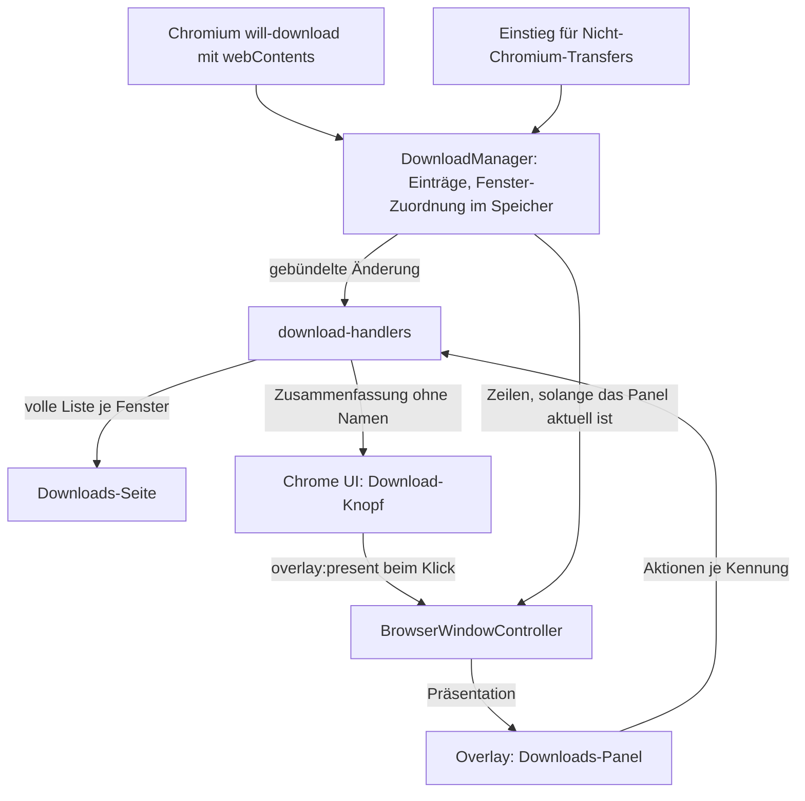

# Download-Anzeige in der Werkzeugleiste - Plan

## Goal Capsule

- **Ziel:** Wer im Browser eine Datei herunterlädt, sieht in der Werkzeugleiste, dass sie lädt, wie weit sie ist und wie es ausging, und öffnet sie mit einem Klick — auch in privaten Fenstern, ohne dass deren Downloads in anderen Fenstern auftauchen.
- **Mittel:** Ein Knopf, gespeist aus einer fensterbezogenen Zusammenfassung, und ein Panel als Overlay-Oberfläche, das der Kern mit Zeilen befüllt (KTD1, KTD2).
- **Autorität:** Der Product Contract in diesem Dokument; darin Requirements vor Key Technical Decisions vor Implementation Units. Acceptance Examples illustrieren, sie ändern nichts. Die Downloads-Seite `tessera://downloads` bleibt die vollständige Ansicht.
- **Abbruchbedingungen:** Anhalten und berichten, wenn ein Größenbudget nur durch Anheben besteht, wenn eine Änderung das Verhalten der Downloads-Seite über die eine in KTD4 benannte hinaus ändern müsste, oder wenn die Overlay-Ebene sich nur aktualisieren lässt, indem sich das Verhalten anderer Oberflächen ändert.
- **Ausführung:** `ce-work` setzt U1 bis U6 in dieser Reihenfolge um; U6 hängt nur an U1. Die Prüfung in der laufenden Anwendung übernimmt der Benutzer — kein Agent startet die App.
- **Offene Blocker:** keiner für U1 bis U4. U5 hängt an der Budget-Entscheidung unter Open Questions im Planning Contract.

---

## Product Contract

**Product Contract preservation:** geändert: R11 und AE5 — der Wortlaut folgt der vorhandenen Haltung zu privaten Fenstern, nach Entscheidung des Autors. Sonst unverändert. R10 wird als Einstieg für Downloads geliefert, die nicht von Chromium stammen; der erste echte solche Produzent, der Medien-Downloader, kommt mit dem Medien-Plan.

### Summary

Ein Download-Knopf erscheint in der Werkzeugleiste, sobald im Fenster ein Download startet. Er zeigt den Fortschritt und öffnet ein kleines Panel mit den jüngsten Downloads und denselben Aktionen wie die Downloads-Seite.

### Problem Frame

Die Download-Seite ist fertig: sie listet, öffnet, zeigt im Ordner, pausiert, setzt fort und bricht ab. Erreichbar ist sie aber nur über „Werkzeuge → Downloads" oder das Tastenkürzel. Startet ein Download, passiert im Browserfenster sichtbar nichts. Wer nicht weiß, dass es die Seite gibt, weiß auch nicht, ob sein Klick etwas ausgelöst hat, ob die Datei noch lädt oder ob sie fehlgeschlagen ist.

Jeder verbreitete Browser beantwortet das mit demselben Muster: ein Knopf in der Werkzeugleiste, der beim ersten Download auftaucht, Fortschritt am Symbol, ein Panel mit den letzten Einträgen und ein Weg zur vollen Liste. Benutzer erwarten es an dieser Stelle.

### Key Decisions

- **Eigene Arbeit, nicht Teil des Medien-Recorders.** Die Anzeige nützt jedem Download sofort; der Medien-Recorder nutzt sie, statt eine eigene Fortschrittsanzeige zu bauen. (session-settled: user-directed — chosen over „in den Medien-Plan aufnehmen": normale Downloads sollen nicht auf den Recorder warten) *Governs R9, R10.*
- **Eine Quelle für alle drei Ansichten.** Knopf, Panel und Downloads-Seite zeigen dieselben Einträge; es entsteht keine zweite Liste, die auseinanderlaufen kann. *Governs R9.*
- **Leise statt aufdringlich.** Ein fertiger Download öffnet kein Panel und keine Systembenachrichtigung; der Knopf zeigt den Ausgang, der Benutzer entscheidet, ob er hinsieht. Passt zu einem Browser, der nichts ungefragt nach vorn holt. *Governs R3.*
- **Ein privates Fenster sieht, was die Seite dort zeigt.** Den gespeicherten Verlauf wie jedes Fenster, dazu seine eigenen Downloads — nach der vorhandenen Haltung, dass ein privates Fenster nichts beiträgt, aber sehen darf. (session-settled: user-directed — chosen over „nur die eigenen": Panel und Seite sollen im privaten Fenster dasselbe zeigen) *Governs R11.*
- **Das Vorhandene wiederverwenden.** Die Aktionen je Eintrag sind die der Downloads-Seite, mit denselben Zuständen und Beschriftungen; das Panel folgt dem Muster der vorhandenen Werkzeugleisten-Panels. *Governs R6.*

### Requirements

**Knopf**

- R1. Sobald in einem Fenster ein Download startet, erscheint in dessen Werkzeugleiste ein Download-Knopf; solange in der Sitzung keiner lief, ist er nicht da.
- R2. Der Knopf zeigt den gemeinsamen Fortschritt der laufenden Downloads des Fensters; ist die Gesamtgröße unbekannt, zeigt er Aktivität ohne Prozentangabe.
- R3. Abgeschlossen, pausiert und fehlgeschlagen sind am Knopf unterscheidbar, ohne das Panel zu öffnen.
- R4. Einmal erschienen, bleibt der Knopf für die Sitzung des Fensters sichtbar, bis der Benutzer die Liste leert.

**Panel**

- R5. Ein Klick auf den Knopf öffnet ein Panel mit den jüngsten Downloads, neueste zuerst, jeweils mit Name, Größe und Zustand samt Fortschritt.
- R6. Jeder Eintrag bietet die Aktionen, die zu seinem Zustand passen — Öffnen, Im Ordner zeigen, Pause, Fortsetzen, Abbrechen —, mit demselben Verhalten wie auf der Downloads-Seite.
- R7. Das Panel führt mit einem Eintrag zur vollständigen Downloads-Seite.
- R8. Das Panel ist vollständig per Tastatur bedienbar und hält den Fokus, solange es offen ist; Escape schließt es.

**Eine Quelle**

- R9. Knopf, Panel und Downloads-Seite lesen dieselben Einträge; eine Aktion in einer Ansicht ist in den anderen sofort sichtbar.
- R10. Jede Art Download erscheint dort — auch solche, die nicht über Chromiums Download-Pfad entstehen, wie die Medien-Transfers des Medien-Recorders.

**Private Fenster**

- R11. Ein privates Fenster zeigt den gespeicherten Verlauf und seine eigenen Downloads; seine eigenen erscheinen in keinem anderen Fenster, auch keinem anderen privaten, und keiner davon überdauert das Fenster.

### Acceptance Examples

- AE1. Erster Download
  - **Deckt ab:** R1, R2
  - **Gegeben:** Ein Fenster, in dem noch nichts heruntergeladen wurde; kein Download-Knopf zu sehen.
  - **Wenn:** Der Benutzer eine Datei herunterlädt.
  - **Dann:** Der Knopf erscheint und zeigt den Fortschritt.
- AE2. Unbekannte Größe
  - **Deckt ab:** R2
  - **Gegeben:** Ein Server, der keine Länge nennt, oder ein laufender Mitschnitt.
  - **Wenn:** Der Download läuft.
  - **Dann:** Der Knopf zeigt Aktivität, aber keine Prozentzahl.
- AE3. Fehlschlag, Panel zu
  - **Deckt ab:** R3
  - **Gegeben:** Ein Download läuft, das Panel ist geschlossen.
  - **Wenn:** Er fehlschlägt.
  - **Dann:** Der Knopf zeigt den Fehlschlag; kein Panel und keine Benachrichtigung öffnet sich.
- AE4. Aktion im Panel, Seite offen
  - **Deckt ab:** R6, R9
  - **Gegeben:** Die Downloads-Seite ist in einem Tab offen, ein Download läuft.
  - **Wenn:** Der Benutzer ihn im Panel abbricht.
  - **Dann:** Die Seite zeigt ihn sofort als abgebrochen.
- AE5. Privates Fenster
  - **Deckt ab:** R11
  - **Gegeben:** Ein normales und zwei private Fenster; im ersten privaten wird eine Datei heruntergeladen.
  - **Wenn:** Der Benutzer das Panel im normalen und im zweiten privaten Fenster öffnet, dann das erste private Fenster schließt.
  - **Dann:** Der private Download taucht in keinem der beiden anderen Fenster auf, und nach dem Schließen ist er nirgends mehr gelistet.

### Scope Boundaries

**Später denkbar**

- Datei aus dem Panel per Ziehen in eine andere Anwendung ablegen.
- Warnung vor potenziell gefährlichen Dateitypen vor dem Öffnen.
- Systembenachrichtigung bei Abschluss, als Einstellung.

**Außerhalb dieser Arbeit**

- Eine Download-Leiste am unteren Fensterrand.
- Verhaltensänderungen an der Downloads-Seite, bis auf die eine, die R11 verlangt (KTD4). Das Herauslösen ihrer Beschriftungs- und Größenlogik in gemeinsame Hilfsfunktionen (U2) ändert nichts an dem, was sie zeigt.

### Deferred to Follow-Up Work

- Den Medien-Downloader an den Einstieg aus U6 anschließen — Teil des Medien-Plans, dessen Subsystem noch nicht verdrahtet ist.
- „Alle Downloads" springt zu einem schon offenen Downloads-Tab, statt einen neuen zu öffnen.
- Den Katalog-Chunk je Sprache aufteilen oder Kern-Texte in den Kern verlegen, wie der Kommentar zum Katalogbudget in `tests/architecture.test.ts` vorschlägt.

### Dependencies / Assumptions

- „Für die Sitzung sichtbar" (R4) folgt dem verbreiteten Muster; ob der Knopf nach einer Weile ohne neue Downloads verschwinden soll, ist ungeprüft angenommen.
- Das Download-Modell kennt eine unbekannte Gesamtgröße bereits; R2 braucht dafür kein neues Modellfeld.

### Sources / Research

- `src/renderer/internal/DownloadsPage.tsx` — die vollständige Ansicht und die Aktionen je Zustand, die das Panel übernimmt.
- `src/shared/downloads/model.ts` — Zustände, Endzustände, unbekannte Gesamtgröße.
- `src/main/downloads/DownloadManager.ts`, `src/main/data/DownloadStore.ts` — die eine Quelle, die R9 verlangt.
- `src/main/menu/appMenu.ts` — der heute einzige Zugang zur Downloads-Seite.
- `src/renderer/src/components/ExtensionsPanel.tsx`, `src/renderer/src/components/Toolbar.tsx` — vorhandenes Werkzeugleisten-Panel als Muster.
- `docs/IMPROVEMENT-PLAN.md` — der gemeinsame Fokus-Hook für modale Oberflächen, an dem R8 hängt.

---

## Planning Contract

### Key Technical Decisions

- KTD1. **Das Panel ist eine neue Overlay-Oberfläche, und ihr Bauteil wird erst beim ersten Öffnen geladen.** Ein Popover im Chrome-DOM liegt hinter den Tab-Ansichten (`docs/solutions/ui-issues/chrome-popups-behind-content-views.md`); ein Vollfenster-Panel wie das der Erweiterungen blendet jede Seite aus, solange es offen ist. Das Panel landet in einem eigenen Chunk mit dem allgemeinen Budget von 40 kB. Im Overlay-Chunk bleiben die Tabelleneinträge der neuen Art, die Weiche und — weil es der erste dynamische Import im Renderer ist — Vites Preload-Helfer von rund 1,3 kB. Der letzte Build zeigte 19,7 von 20 kB; der Spielraum reicht dafür nicht von selbst, siehe die offene Entscheidung unter Open Questions. *Trägt R5, R8.*
- KTD2. **Zwei Zuleitungen: die Werkzeugleiste bekommt eine Zusammenfassung ohne Dateinamen, das Panel bekommt seine Zeilen vom Kern.** Heute erreicht `downloads:changed` nur interne Seiten, mit der Begründung, dass die Liste benennt, was jemand heruntergeladen hat (`src/shared/ipc/channels.ts`), und sie trägt bis zu 1000 Zeilen viermal je Sekunde. Die Zusammenfassung trägt nur Zahlen und Zustände. Die Anfrage der Chrome UI zum Öffnen trägt nur Art und Anker; die Zeilen setzt der Kern ein. Solange das Panel offen ist, erhält die Chrome UI die Zeilen über `overlay:presented` mit, wie jede Präsentation. *Trägt R1–R3, R9.*
- KTD3. **Das Fenster eines Downloads wird beim Start ermittelt und nur im Speicher gehalten.** Die Naht für `will-download` verwirft heute die auslösende `webContents`; sie reicht sie künftig weiter, und ein vom Fensterregister gelieferter Auflöser macht daraus sofort eine Fenster-Kennung. Gespeicherte Einträge bekommen kein Fensterfeld: nach einem Neustart ist eine Fenster-Kennung bedeutungslos, und R1 bis R4 gelten ohnehin für die laufende Sitzung. Der Manager führt je Fenster eine eigene Kennungsmenge, getrennt von den laufenden Einträgen, damit die Zuordnung das Ende eines Downloads überdauert. Fehlt die `webContents`, zählt der Download zum zuletzt fokussierten Fenster derselben Session; diese Reihenfolge führt das Fensterregister heute nicht und bekommt sie neu. Gibt es kein solches Fenster, erscheint der Download in Panel und Seite, aber an keinem Knopf. *Trägt R1, R2.*
- KTD4. **Sichtbarkeit richtet sich nach Session und anfragendem Fenster, nicht nach Modus.** Laufende private Einträge werden nach ihrer Session gefiltert statt nach dem Modus — heute sehen zwei private Fenster gegenseitig ihre laufenden Downloads. Öffnen, Im Ordner zeigen, Pause, Fortsetzen, Abbrechen, Entfernen und Leeren wirken nur auf Einträge, die das anfragende Fenster sehen darf. Das anfragende Fenster wird streng ermittelt — Chrome UI und Overlay über ihre eigene `webContents`, eine Tab-Seite über ihren Tab —, ohne Rückgriff auf das fokussierte Fenster; ohne Treffer wird abgelehnt. Leeren aus einem privaten Fenster wirkt wie heute auf den gespeicherten Verlauf und auf dessen eigene fertige Einträge, aber nie auf die anderer privater Fenster. Die einzige beabsichtigte Änderung an der Downloads-Seite ist damit, dass sie laufende Einträge anderer privater Fenster nicht mehr zeigt, wie R11 verlangt. *Trägt R9, R11.*
- KTD5. **Schließt ein privates Fenster mit laufendem Download, wird er abgebrochen und die Teildatei gelöscht.** Heute entfernt `releaseSession` nur die Listener; der Transfer lädt weiter, und keine Oberfläche zeigt oder stoppt ihn. Abgebrochen wird jeder nicht beendete Eintrag der Session, laufend oder pausiert, bevor die Listener gehen. Die Zwischendatei räumt der Abbruch selbst auf — Chromium bei `item.cancel()`, der Abbruch-Rückruf bei fremden Transfers; der Manager löscht nie per Pfad und nie den Zielpfad, der eine vorhandene Datei benennen kann. (session-settled: user-approved — chosen over „weiterladen lassen wie heute": ein unsichtbarer, nicht mehr steuerbarer Transfer widerspricht R11) *Trägt R11.*
- KTD6. **Der Knopf folgt einer festen Rangfolge.** Läuft etwas, zeigt er den Fortschritt; sonst den schwersten noch nicht gesehenen Ausgang: fehlgeschlagen vor pausiert vor abgeschlossen. Ein eigener Abbruch gilt nicht als Fehler. Beim Präsentieren des Panels gelten alle Ausgänge des Fensters als gesehen, und der Knopf erhält sofort eine neue Zusammenfassung, nicht erst bei der nächsten Download-Änderung. Die Rangfolge steht in der Entscheidungstabelle unten. (session-settled: user-approved — chosen over eine gleichrangige Anzeige aller Zustände: der Knopf hat Platz für genau eine Aussage) *Trägt R2, R3.*
- KTD7. **Der Knopf zählt die Downloads dieses Fensters, das Panel zeigt die Liste der Seite.** Fortschritt und Ausgang am Knopf stammen aus den Downloads, die im Fenster gestartet wurden; das Panel zeigt die jüngsten Einträge genau der Liste, die die Seite für dieses Fenster zeigt, höchstens sechs. (session-settled: user-approved — chosen over ein Panel nur mit den Downloads dieses Fensters: Panel und Seite sollen nicht auseinanderlaufen) *Trägt R2, R5, R9.*
- KTD8. **Der Kern präsentiert das offene Panel bei jeder gebündelten Änderung neu — aber nur, solange es die aktuelle Oberfläche des Fensters ist, und ohne den Fokus zu bewegen.** Gleiche Oberflächen-Identität gilt schon heute als Aktualisierung (so zählt die Suchleiste ihre Treffer). Neu ist eine Tabelle je Art in `src/shared/overlay/surface.ts`, ob eine Aktualisierung derselben Identität den Fokus erneut setzt: für alle bestehenden Arten ja, wie heute — Suchleiste und Auswahlleiste holen sich so die Tastatur nach einem Klick in die Seite zurück —, für das Downloads-Panel nein. Beim ersten Präsentieren liegt der Fokus auf der neuesten Zeile; danach folgt er der Download-Kennung, nicht der Zeilenposition. Verschwindet der fokussierte Aktionsknopf, weil der Eintrag seinen Zustand wechselt, geht der Fokus auf dessen Zeile. *Trägt R8, R9.*
- KTD9. **„Alle Downloads" öffnet die Seite auf demselben Weg wie das Menü.** Ein neuer Tab mit `tessera://downloads`; einen offenen Tab wiederzufinden ist eigene Logik ohne Vorbild und ist zurückgestellt. *Trägt R7.*
- KTD10. **Downloads, die nicht von Chromium stammen, kommen über einen eigenen Einstieg in denselben Manager.** Laufende Einträge sind heute an Electrons `DownloadItem` gebunden. Der Einstieg nimmt Fortschrittsmeldungen, einen Abbruch-Rückruf und die Angabe entgegen, ob Pausieren möglich ist; er schreibt über denselben Recorder je Modus. So erscheinen solche Transfers überall, wo Chromium-Downloads erscheinen. *Trägt R10.*

### High-Level Technical Design

Datenfluss vom Download bis zu den drei Ansichten:

Rangfolge am Knopf (KTD6), je Fenster:

| Lage im Fenster | Knopf zeigt |
|---|---|
| Noch kein Download in dieser Sitzung, oder Liste geleert | nichts, der Knopf fehlt |
| Mindestens ein laufender Download, alle Größen bekannt | Fortschritt: Summe empfangen durch Summe gesamt |
| Mindestens ein laufender Download mit unbekannter Größe | Aktivität ohne Anteil |
| Nichts läuft, ungesehener Fehlschlag | Fehlschlag |
| Nichts läuft, kein ungesehener Fehlschlag, ungesehene Pause | Pause |
| Nichts läuft, nur ungesehene Abschlüsse | Abgeschlossen |
| Nichts läuft, alles gesehen oder selbst abgebrochen | ruhiger Knopf ohne Markierung |

### Assumptions

- Ein nachgeladenes Bauteil im Overlay erzeugt einen eigenen Chunk, den das Budget `overlay-*.js` nicht erfasst; unter der vorhandenen Chunk-Aufteilung trägt er den Namen seines Moduls. Was im Overlay-Chunk zurückbleibt, misst der erste Schritt von U5.
- Der Katalog-Chunk stand im letzten Build (10. August) bei 50,2 von 48 kB. Ist das nach einem frischen Build noch so, ist es ein bestehender Befund und kein Auftrag dieses Plans — er wird gemeldet, nicht durch Anheben gelöst.
- Sechs Zeilen im Panel reichen; die Zahl ist eine Vorgabe, keine Produktentscheidung.

### Risks

- **Fokus springt bei jeder Aktualisierung.** Die Overlay-Ebene fokussiert heute bei jedem Präsentieren. Gegenmittel: KTD8 und ein Test, der vier Aktualisierungen hintereinander ohne Fokuswechsel prüft.
- **Private Sessions lecken bereits** (`docs/IMPROVEMENT-PLAN.md`, Q3). Neue Listener aus U1 und U3 müssen beim Schließen eines Fensters wieder entfernt werden; die Architekturregel, dass jede Abonnierung einen Rückweg hat, gilt auch hier.
- **Aktionen per Kennung aus dem Overlay.** Das Overlay zählt für die Absenderregeln als Chrome UI. KTD4 verhindert, dass es Einträge eines anderen Fensters steuert.

### Open Questions

- **Womit wird der Preload-Helfer im Overlay-Chunk ausgeglichen? (vor U5 zu klären)** Der erste dynamische Import kostet im Overlay-Chunk rund 1,3 kB, bei 0,26 kB Spielraum. Empfohlen: eine bestehende, selten gezeigte Oberfläche — etwa die Abfrage des Master-Passworts — hinter dieselbe Nachladegrenze legen; das holt die Kosten zurück, ohne ein Budget anzuheben, kostet diese Oberfläche aber einmalig einen lokalen Chunk-Abruf beim ersten Zeigen. Die Alternativen sind, das Budget anzuheben, was die Abbruchbedingung ausschließt, oder U5 nach dem Messschritt anzuhalten.

---

## Implementation Units

### U1. Downloads gehören einem Fenster, private bleiben in ihrem

- **Goal:** Jeder laufende Download kennt sein Fenster; private Einträge sind nur in ihrem Fenster sichtbar und steuerbar und überdauern es nicht.
- **Requirements:** R1, R2, R9, R11; Covers AE5. KTD3, KTD4, KTD5.
- **Dependencies:** keine.
- **Files:**
  - `src/main/downloads/DownloadManager.ts`
  - `src/main/ipc/download-handlers.ts`
  - `src/main/browser/WindowRegistry.ts`
  - `src/main/index.ts`
  - `tests/download-manager.test.ts` (neu)
  - `tests/download-ipc.test.ts`
  - `tests/features/downloads.feature`, `tests/features/steps/downloads.steps.ts`
- **Approach:**
  1. Die Naht für `will-download` reicht die auslösende `webContents` weiter; ein injizierter Auflöser ordnet sie einem Fenster zu. Der Manager hält je Fenster eine Kennungsmenge, die das Ende eines Downloads überdauert und bei Entfernen, Leeren und Fensterschluss bereinigt wird; das Fensterregister führt dafür neu eine Fokus-Reihenfolge (KTD3).
  2. Der Snapshot filtert laufende private Einträge nach Session (KTD4).
  3. Die Handler ermitteln das anfragende Fenster streng und lösen jede Aktion, Öffnen und Im Ordner zeigen eingeschlossen, gegen dessen sichtbare Einträge auf, bevor sie den Manager rufen (KTD4). Vorbild für die strenge Ermittlung einer Tab-Seite ist `src/main/ipc/password-handlers.ts`.
  4. Beim Schließen eines privaten Fensters bricht der Manager jeden nicht beendeten Eintrag der Session ab, laufend oder pausiert, bevor die Session freigegeben wird (KTD5).
  5. Schließt ein normales Fenster, gehen seine Kennungen an das zuletzt fokussierte normale Fenster über; gibt es keines, etwa unter macOS ohne offenes Fenster, bleiben sie ohne Knopf.
- **Execution note:** Der Manager hat keinen eigenen Test. Erst die heutigen Pfade (Snapshot je Modus, Pause, Abbruch, Freigabe) charakterisieren, dann ändern.
- **Patterns to follow:** Die Fake-Manager und Fake-Fenster in `tests/download-ipc.test.ts`; die Freigabe über `releaseSession` in `src/main/browser/WindowRegistry.ts`.
- **Test scenarios:**
  - Ein Download aus einem Tab wird dem Fenster dieses Tabs zugeordnet.
  - Ohne `webContents` wird er dem zuletzt fokussierten Fenster derselben Session zugeordnet.
  - Covers AE5. Zwei private Fenster, Download im ersten: der Snapshot des zweiten und des normalen Fensters enthält ihn nicht.
  - Ein privates Fenster sieht den gespeicherten Verlauf weiterhin.
  - Abbrechen einer Kennung, die das anfragende Fenster nicht sieht, ändert nichts und meldet keinen Erfolg.
  - Öffnen oder Im Ordner zeigen einer Kennung, die das anfragende Fenster nicht sieht, ruft die Shell nicht auf und meldet keinen Erfolg.
  - Die Downloads-Seite eines normalen Fensters fragt an, während ein privates Fenster fokussiert ist: sie erhält dessen Einträge nicht.
  - Eine Anfrage, deren Absender keinem Fenster zuzuordnen ist, wird abgelehnt.
  - Leeren aus einem privaten Fenster entfernt den gespeicherten fertigen Verlauf und dessen eigene fertige Einträge, lässt fertige Einträge anderer privater Fenster unberührt.
  - Schließen eines privaten Fensters mit einem laufenden und einem pausierten Download: für beide wird der Abbruch gerufen, bevor die Listener gehen; kein Eintrag bleibt; kein Löschaufruf auf einen Zielpfad.
  - Ein normaler Download endet: seine Kennung bleibt dem Fenster zugeordnet.
  - Schließen eines normalen Fensters mit laufendem Download: der Download läuft weiter und zählt zum anderen normalen Fenster.
  - Nach dem Schließen eines Fensters bleibt kein Listener dieses Fensters am Manager.
- **Verification:** Die neuen Manager-Tests und die angepassten IPC-Tests laufen grün; das BDD-Szenario mit zwei privaten Fenstern besteht.

### U2. Eine Zusammenfassung je Fenster und gemeinsame Beschriftungen

- **Goal:** Eine reine Funktion leitet aus den Einträgen eines Fensters ab, was der Knopf zeigt; Zustandsbeschriftung und Größentext kommen für Seite und Panel aus einer Hand.
- **Requirements:** R2, R3, R4, R6; KTD6, KTD7.
- **Dependencies:** keine.
- **Files:**
  - `src/shared/downloads/summary.ts` (neu, ohne zod)
  - `src/shared/downloads/presentation.ts`
  - `src/renderer/internal/DownloadsPage.tsx`
  - `tests/downloads-summary.test.ts` (neu)
  - `tests/downloads-presentation.test.ts`
- **Approach:**
  1. Die Zusammenfassung nimmt die Einträge, die Kennungen der im Fenster gestarteten Downloads und den Zeitpunkt, zu dem das Panel zuletzt präsentiert wurde; sie liefert Sichtbarkeit, Anteil oder Aktivität und die Markierung nach der Tabelle zu KTD6.
  2. Die Zuordnung Zustand → Übersetzungsschlüssel und die Größen- und Fortschrittstexte wandern aus der Seite in `src/shared/downloads/presentation.ts`; die Seite nutzt sie unverändert weiter.
- **Patterns to follow:** `downloadFraction` und `isActiveDownload` in `src/shared/downloads/model.ts`; die Trennung von Modell und Schema aus `docs/solutions/performance-issues/renderer-bundle-bloat-zod-co-location.md`.
- **Test scenarios:**
  - Keine im Fenster gestarteten Downloads: unsichtbar, auch wenn der gespeicherte Verlauf Einträge hat.
  - Zwei laufende Downloads mit 10 von 100 und 30 von 100 Byte: Anteil 0,2.
  - Ein laufender mit bekannter und einer mit unbekannter Größe: Aktivität ohne Anteil.
  - Nichts läuft, ein ungesehener Fehlschlag und ein ungesehener Abschluss: Markierung Fehlschlag.
  - Nichts läuft, eine ungesehene Pause und ein Abschluss: Markierung Pause.
  - Selbst abgebrochener Download: keine Markierung.
  - Alle Ausgänge vor dem letzten Präsentieren des Panels beendet: keine Markierung.
  - Die Liste des Fensters ist leer, obwohl vorher Downloads liefen: unsichtbar.
  - Die Seite zeigt nach dem Herauslösen dieselben Beschriftungen und Größentexte wie vorher.
- **Verification:** Die Zusammenfassung ist ohne Electron vollständig getestet; die Seite verhält sich unverändert.

### U3. Die Zusammenfassung erreicht die Werkzeugleiste

- **Goal:** Die Chrome UI jedes Fensters erhält die Zusammenfassung ihres Fensters, sobald sie sich ändert.
- **Requirements:** R1–R4, R9; KTD2.
- **Dependencies:** U1, U2.
- **Files:**
  - `src/shared/ipc/channels.ts`
  - `src/shared/ipc/contract.ts`
  - `src/main/ipc/download-handlers.ts`
  - `src/main/browser/BrowserWindowController.ts`
  - `tests/download-ipc.test.ts`
  - `tests/ipc-contract.test.ts`
- **Approach:**
  1. Ein neuer Ereigniskanal trägt die Zusammenfassung; sein Schema steht im Vertrag, ohne Dateinamen oder Adressen (KTD2).
  2. Die Handler berechnen bei jeder gebündelten Änderung die Zusammenfassung je Fenster und senden sie über `emit` an die Chrome UI, nur wenn sie sich geändert hat.
  3. Der Controller merkt sich den Zeitpunkt, zu dem er das Panel zuletzt präsentiert hat, reicht ihn der Zusammenfassung zu und berechnet und sendet die Zusammenfassung seines Fensters bei jeder Präsentation des Panels neu (KTD6).
- **Patterns to follow:** `window:stateChanged` als Ereignis an die Chrome UI; die Tabelle der Vertragskanäle in `tests/ipc-contract.test.ts`.
- **Test scenarios:**
  - Ein Download startet im Fenster A: nur A erhält eine Zusammenfassung mit Sichtbarkeit.
  - Zwei Fortschrittsmeldungen ohne sichtbare Änderung der Zusammenfassung: kein zweites Ereignis.
  - Das Ereignis enthält keinen Dateinamen und keine Adresse.
  - Ein privates Fenster erhält eine Zusammenfassung nur aus seinen eigenen Downloads.
  - Panel präsentieren, ohne dass sich danach ein Download ändert: der Knopf erhält eine Zusammenfassung ohne Markierung.
  - Ein Download endet bei offenem Panel: nach dem Schließen bleibt keine Markierung.
  - Ein normaler Download endet: die Zusammenfassung seines Fensters zeigt Abgeschlossen.
  - Die Vertragstabelle und die Kanalliste stimmen überein.
- **Verification:** Die IPC- und Vertragstests laufen grün; die Architekturtests zu Kanälen und Abonnierungen bleiben grün.

### U4. Der Download-Knopf in der Werkzeugleiste

- **Goal:** Die Werkzeugleiste zeigt den Knopf nach der Zusammenfassung und öffnet und schließt damit das Panel.
- **Requirements:** R1–R5, R8; Covers AE1, AE2, AE3. KTD1, KTD6.
- **Dependencies:** U3.
- **Files:**
  - `src/renderer/src/components/DownloadsButton.tsx` (neu)
  - `src/renderer/src/components/Toolbar.tsx`
  - `src/renderer/src/App.tsx`
  - `src/renderer/src/styles.css`
  - `src/shared/i18n/catalog.en.ts`, `src/shared/i18n/catalog.de.ts`
  - `tests/components/downloads-button.test.tsx` (neu)
  - `tests/components/toolbar-icons.test.tsx`
- **Approach:**
  1. `App.tsx` abonniert die Zusammenfassung und reicht sie an die Werkzeugleiste; der Knopf steht in der rechten Gruppe neben den Erweiterungen.
  2. Ein Klick misst den Knopf und ruft `overlay:present` für das Panel; ist es offen, `overlay:dismiss`. Offen oder zu kommt aus `overlay:presented`, nicht aus lokalem Zustand.
  3. Schließt sich das Panel, bekommt der Knopf den Fokus zurück.
  4. Beschriftungen nutzen die vorhandenen `downloads.*`-Schlüssel; neu sind nur der Knopfname und die Bezeichnungen der Markierungen.
- **Patterns to follow:** `LayoutMenu.tsx` für Messen, Präsentieren und `aria-expanded`; die Symbolknöpfe und der bedingte Zoom-Knopf in `Toolbar.tsx`.
- **Test scenarios:**
  - Covers AE1. Zusammenfassung unsichtbar: kein Knopf; danach sichtbar mit Anteil 0,4: Knopf mit Fortschritt 40 %.
  - Covers AE2. Aktivität ohne Anteil: Fortschritt ohne Wert, ohne Prozentangabe in der Beschriftung.
  - Covers AE3. Markierung Fehlschlag: der Knopf trägt eine unterscheidbare Beschriftung; es öffnet sich nichts.
  - Klick bei geschlossenem Panel ruft `overlay:present` mit der Downloads-Art; Klick bei offenem ruft `overlay:dismiss`.
  - `aria-expanded` folgt `overlay:presented`.
  - Nach dem Schließen des Panels liegt der Fokus auf dem Knopf.
  - Kein Textliteral und kein wörtliches `aria-label` in der Komponente.
- **Verification:** Komponenten- und Architekturtests grün; die neuen Schlüssel stehen in beiden Katalogen.

### U5. Das Downloads-Panel auf der Overlay-Ebene

- **Goal:** Ein Panel mit den jüngsten Einträgen, ihren Aktionen und dem Weg zur Seite, vom Kern befüllt und live gehalten.
- **Requirements:** R5–R9; Covers AE4. KTD1, KTD7, KTD8, KTD9.
- **Dependencies:** U1, U2, U4.
- **Files:**
  - `src/shared/overlay/surface.ts`
  - `src/shared/ipc/contract.ts`
  - `src/main/browser/OverlayLayer.ts`
  - `src/main/browser/BrowserWindowController.ts`
  - `src/renderer/src/surfaces/OverlaySurface.tsx`
  - `src/renderer/src/surfaces/DownloadsPanelSurface.tsx` (neu)
  - `tests/overlay-surface.test.ts`
  - `tests/components/downloads-panel-surface.test.tsx` (neu)
  - `tests/features/downloads.feature`, `tests/features/steps/downloads.steps.ts`
- **Approach:**
  1. Erster Schritt, vor jeder Gestaltung: die neue Art mit einem nachgeladenen, leeren Bauteil anlegen, `pnpm build` ausführen, `overlay-*.js` messen. Liegt der Chunk über 20 kB, gilt die Entscheidung aus Open Questions; ist sie nicht gefallen, anhalten und berichten.
  2. Die neue Art in allen Tabellen von `src/shared/overlay/surface.ts`: Region wie beim Layout-Menü, wartet auf keine Antwort, nimmt den Fokus, Rang unter Eingabeaufforderungen. Das Anfrageschema von `overlay:present` trägt für diese Art nur Art und Anker; das Präsentations- und Ereignisschema tragen die Zeilen (KTD2).
  3. Die neue Tabelle zum erneuten Fokussieren bei Aktualisierung, befolgt von `OverlayLayer.ts` (KTD8).
  4. Der Controller baut die Präsentation beim Aufruf aus dem Snapshot des Fensters (KTD7) und präsentiert sie bei jeder gebündelten Änderung neu, solange das Panel die aktuelle Oberfläche ist.
  5. Eine Layout-Änderung schließt das Panel, wie das Layout-Menü; diese Stelle im Controller muss die neue Art ausdrücklich nennen.
  6. `OverlaySurface.tsx` lädt `DownloadsPanelSurface.tsx` erst beim ersten Präsentieren (KTD1).
  7. Aktionen rufen die vorhandenen `downloads:*`-Kanäle mit der Kennung, darunter Entfernen, das die Seite für jeden Eintrag anbietet; „Alle Downloads" öffnet die Seite wie das Menü (KTD9). Fokus nach KTD8.
- **Execution note:** Der Messschritt 1 kommt vor allem anderen in dieser Unit — an ihm hängt KTD1.
- **Patterns to follow:** `LayoutMenuSurface.tsx` für Platzierung über `anchorSurface` und den ersten Fokus; die Suchleiste für Aktualisierungen derselben Identität; die Zeilen und Aktionen der Downloads-Seite.
- **Test scenarios:**
  - Die neue Art steht in jeder Tabelle; die schleifenden Tests über alle Arten bestehen.
  - Zweimal dieselbe Identität des Downloads-Panels präsentiert: die zweite Präsentation setzt keinen Fokus; eine andere Identität setzt ihn.
  - Eine erneute Präsentation derselben Suchleisten- oder Auswahlleisten-Identität setzt den Fokus weiterhin.
  - Die Anfrage zum Öffnen ohne Zeilen besteht die Validierung; eine Anfrage mit Zeilen wird abgewiesen.
  - Das Panel zeigt höchstens sechs Einträge, neueste zuerst, mit Name, Größe und Zustand.
  - Ein laufender Eintrag bietet Pause und Abbrechen, ein pausierter Fortsetzen und Abbrechen, ein fertiger mit Datei Öffnen und Im Ordner zeigen; jeder Eintrag, auch ein fehlgeschlagener, bietet Entfernen.
  - Beim ersten Öffnen liegt der Fokus auf der neuesten Zeile.
  - Der fokussierte Abbrechen-Knopf verschwindet, weil der Download endet: der Fokus liegt danach auf dessen Zeile.
  - Öffnen einer fehlenden Datei zeigt den Hinweis der Seite und aktualisiert die Zeile.
  - Covers AE4. Abbrechen im Panel: die Seite im anderen Tab zeigt den Eintrag als abgebrochen.
  - Fortschrittsmeldung bei offenem Panel, Fokus auf der zweiten Zeile: der Fokus bleibt auf demselben Download, auch wenn ein neuer oben dazukommt.
  - Panel geschlossen, Fortschrittsmeldung: es öffnet sich nicht wieder.
  - Eine Suchleiste ist aktuell: die Aktualisierung des Panels verdrängt sie nicht.
  - Escape und Klick außerhalb schließen das Panel; eine Layout-Änderung schließt es ebenfalls.
  - „Alle Downloads" öffnet einen Tab mit der Downloads-Seite.
  - Tab-Taste am letzten Element springt zum ersten.
- **Verification:** Overlay-, Komponenten- und BDD-Tests grün; nach `pnpm build` besteht das Budget für `overlay-*.js`.

### U6. Einstieg für Downloads außerhalb von Chromium

- **Goal:** Der Manager nimmt Transfers an, die nicht aus `will-download` stammen, und führt sie wie jeden anderen Download.
- **Requirements:** R10; KTD10.
- **Dependencies:** U1.
- **Files:**
  - `src/main/downloads/DownloadManager.ts`
  - `tests/download-manager.test.ts`
- **Approach:**
  1. Ein Einstieg nimmt Fenster, Session, Dateiname, Zielpfad, eine Fortschrittsfunktion, einen Abbruch-Rückruf und die Angabe entgegen, ob Pausieren möglich ist.
  2. Laufende Einträge unterscheiden intern zwischen Chromium-Transfer und fremdem Transfer; Aktionen, die der fremde nicht kann, werden nicht angeboten.
  3. Aufzeichnung über denselben Recorder je Modus, Kennungen im selben Namensraum.
- **Patterns to follow:** Die Fortschrittsmeldung von `MediaDownloader` (empfangene und gesamte Bytes, gesamt unbekannt bei Segmenten) als erster Abnehmer.
- **Test scenarios:**
  - Ein fremder Transfer erscheint im Snapshot und in der Zusammenfassung seines Fensters.
  - Unbekannte Gesamtgröße erscheint als Aktivität ohne Anteil.
  - Abbrechen ruft den Rückruf und setzt den Zustand abgebrochen.
  - Pausieren eines fremden Transfers ohne Pausenfähigkeit ändert nichts; das Panel bietet es nicht an.
  - Ein fremder Transfer in einem privaten Fenster wird nicht gespeichert und endet mit dem Fenster.
- **Verification:** Die Manager-Tests für den Einstieg laufen grün; kein Code außerhalb des Managers und der Tests benutzt ihn schon.

---

## Verification Contract

| Befehl | Wann | Beweist |
|---|---|---|
| `pnpm typecheck` | nach jeder Unit | alle vier TypeScript-Projekte übersetzen |
| `pnpm lint` | nach jeder Unit | keine Warnungen |
| `pnpm test:unit` | nach jeder Unit | Unit-, Komponenten- und Architekturtests |
| `pnpm test:bdd` | nach U1 und U5 | die Download-Szenarien, darunter zwei private Fenster |
| `pnpm build`, dann `pnpm test:unit` | nach U5 und am Ende | Bündelbudgets gegen einen frischen Build; das Overlay-Budget besteht |

Die Prüfung in der laufenden Anwendung ist Sache des Benutzers: erster Download, unbekannte Größe, Fehlschlag, zwei private Fenster. Kein Agent startet die App oder `scripts/smoke.mjs`.

Ein Katalogbudget, das schon vor dieser Arbeit überschritten war, wird gemeldet und nicht angehoben.

---

## Definition of Done

- Jede Unit erfüllt ihre Verification, und alle Befehle des Verification Contract laufen grün, bis auf ein nachweislich schon vorher überschrittenes Katalogbudget, das gemeldet ist.
- Kein Budget in `tests/architecture.test.ts` ist angehoben.
- Die Downloads-Seite zeigt vorher und nachher dasselbe, bis auf laufende Einträge anderer privater Fenster, die sie nach KTD4 nicht mehr zeigt.
- Kein neuer Listener überlebt das Schließen seines Fensters.
- Code aus verworfenen Ansätzen ist entfernt, nicht auskommentiert.

---

<!-- ce-section: work-relationships -->
## How This Work Fits Together

Dieser Plan besitzt die Download-Anzeige in der Werkzeugleiste. Die Aufteilung unten ist das aktuelle Verständnis, keine zugesagte Reihenfolge.

- Medien-Recorder, `docs/plans/2026-08-09-001-feat-media-recorder-plan.md`
  - **Depends on** diesem Plan: seine Transfers erscheinen über R10 hier, statt eine eigene Fortschrittsanzeige zu bekommen.
  - **Can proceed independently of** diesem Plan bis zur Stelle, an der Medien-Transfers sichtbar werden müssen.
