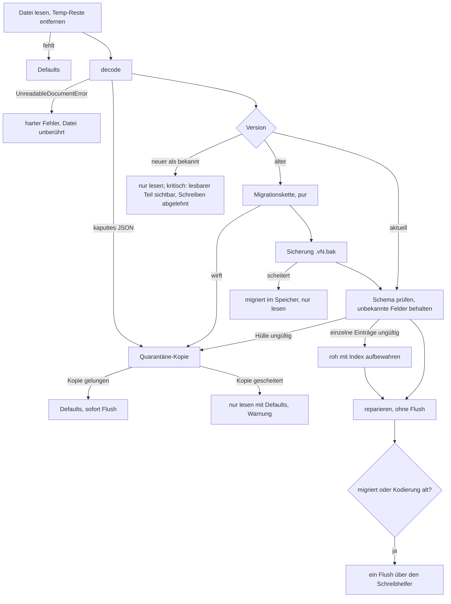
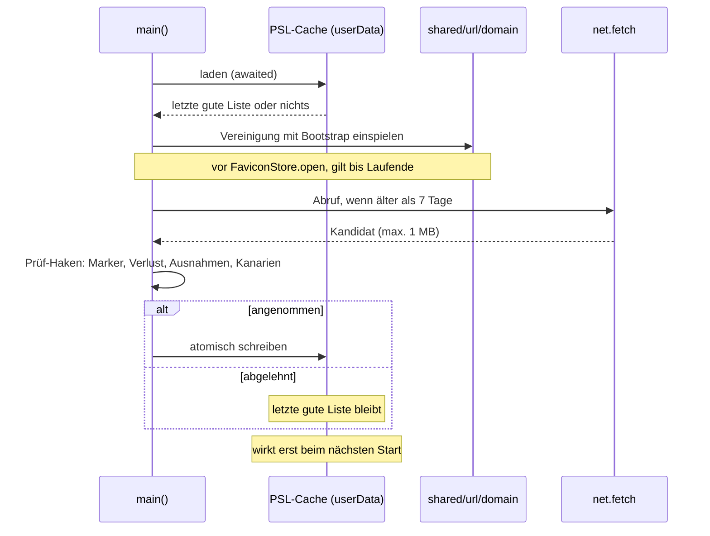
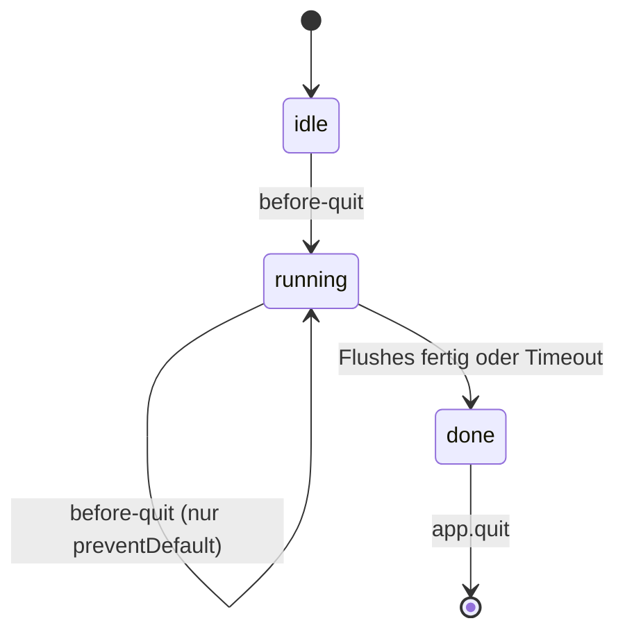
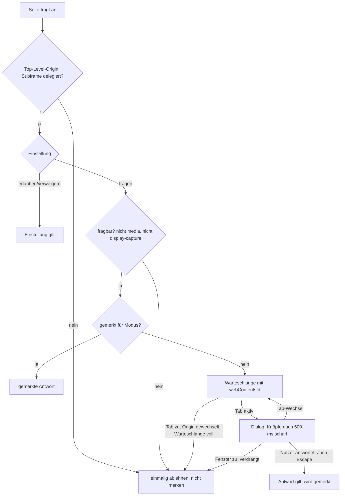

# Härtung nach dem Projekt-Review - Plan

## Goal Capsule

- **Ziel:** Wer Tessera benutzt, verliert keine Lesezeichen, Passwörter oder Verläufe mehr durch eine kaputte, neuere oder halb geschriebene Datei. Passwörter werden nur noch auf der Site angeboten, zu der sie gehören. Ein ausgeliefertes Build lässt sich weder über Umgebungsvariablen noch über Debug-Schalter übernehmen, und Webseiten erfahren nichts aus Tesseras eigenen Caches.
- **Mittel:** Kleine, pure Entscheidungsmodule mit 100-%-Floors plus dünne Electron-Verdrahtung, wie sie das Projekt schon für Navigation, Absender und Updates nutzt (KTD1). Dazu ein PR-CI, das diese Floors tatsächlich erzwingt (KTD2).
- **Autorität:** Requirements vor Key Technical Decisions vor Implementation Units. Acceptance Examples illustrieren, sie ändern nichts. Die Haltung zu Kamera und Mikrofon (bewusst unangetastet) steht über jedem Befund, der ihr widerspricht, auch über `docs/IMPROVEMENT-PLAN.md` V1.
- **Abbruchbedingungen:** Anhalten und berichten, wenn:
  - eine Migration nur durch Ändern der Bedeutung gespeicherter Daten besteht,
  - ein Fuse im gepackten Build die Chrome-UI nicht mehr laden lässt und nur ein Umbau auf ein eigenes Schema hilft,
  - ein Floor oder ein Größenbudget nur durch Absenken besteht,
  - die Berechtigungs-Verdrahtung das heutige Verhalten von Kamera oder Mikrofon ändern müsste.
- **Ausführung:** `ce-work` setzt die Einheiten phasenweise um; Reihenfolge und Abhängigkeiten stehen im Unit Index. Einheiten, die dieselben Kerndateien ändern, laufen nacheinander, nicht parallel in Worktrees. U18 läuft zuletzt und erst, wenn die offenen Branches gemergt sind. Die Prüfung in der laufenden App und im gepackten Build übernimmt der Benutzer — kein Agent startet die App.
- **Offene Blocker:** keine. Eine nicht blockierende Produktfrage steht unter Open Questions.

---

## Product Contract

### Summary

Der Plan behebt die verifizierten Befunde des Projekt-Reviews vom 2026-09-23 in drei Blöcken. Kritisch: Datenverlust in den Stores, fehlende Public Suffix List, ungehärtete Release-Builds, fehlendes PR-CI. Mittel: Lücken an den Vertrauensgrenzen (Chrome-Oberflächen, Bild-Cache, Fensterzuordnung, Berechtigungen, Updates, Filter) und am Lebenszyklus (Start, Beenden, Tresor). Hygiene: Artefakte, Formatierung, Tests. Die Renderer-UX-Befunde sind nicht Teil dieses Plans.

### Problem Frame

Das Review hat eine disziplinierte Codebasis gefunden (strenges TypeScript, 4709 grüne Tests, zweistufige IPC-Prüfung), aber an den Rändern Lücken, die still versagen. Mehrere davon hat das Projekt selbst schon als Nahtstelle gebaut und nie verdrahtet: `configurePublicSuffixes` hat keinen Aufrufer, `PermissionArbiter.ask` hat keinen Produktionsaufrufer, und die Quarantäne existiert nur im `SettingsStore`. Die Coverage-Floors, die solche Lücken fangen sollen, laufen in CI nie, weil es nur einen Tag-Workflow ohne `test:coverage` gibt.

Die schwersten Folgen treffen Nutzerdaten. Ein einziger schemafremder Eintrag lässt `JsonStore` auf Defaults fallen, und das nächste Speichern überschreibt die echte Datei. Ein Downgrade verwirft jede Datei mit `version: 2`. Ohne PSL fallen `bank.com.sg` und `evil.com.sg` auf dieselbe Site, und Autofill bietet das Passwort der einen auf der anderen an.

Das Review hat das Chrome-Fenster zunächst als kritisch eingestuft (Link auf die Tab-Leiste ziehen). Das ist korrigiert: `navigateOnDragDrop` ist in Electron 43 standardmäßig `false` (`node_modules/electron/electron.d.ts:19213`) und wird nirgends gesetzt. Der fehlende Guard bleibt eine Lücke in der Tiefenverteidigung, zumal `will-frame-navigate` vom Kern gestartete Navigationen nicht sieht. Er steht hier als mittel.

### Key Decisions

- **Public Suffix List zur Laufzeit laden und aktualisieren.** (session-settled: user-directed — chosen over „Snapshot zur Build-Zeit mitliefern": Liste bleibt aktuell, ohne neues Release) *Governs R5, R6, R7.*
- **Store-Versionen bekommen einen echten Migrationsmechanismus.** (session-settled: user-directed — chosen over „vorerst nur Quarantäne plus tolerantes Parsen": Downgrades und künftige Schemaänderungen sollen ohne Datenverlust gehen) *Governs R1, R2, R3.*
- **Updates ohne Signatur gehen auf allen Plattformen über die Release-Seite.** (session-settled: user-approved — chosen over „Code-Signing jetzt einrichten": Zertifikate und Kosten liegen außerhalb dieses Plans) *Governs R15.*
- **„Fragen" bei Berechtigungen wird verdrahtet, nicht entfernt.** (session-settled: user-directed — chosen over „Option ‚Fragen' aus den Einstellungen nehmen") *Governs R12.*
- **Die falsch formatierten Dateien werden einmalig umformatiert.** (session-settled: user-directed — chosen over „nur ein Gate für neue Änderungen") *Governs R22.*
- **Kamera und Mikrofon bleiben exakt wie heute.** (session-settled: user-directed — bestehende Haltung, chosen over `docs/IMPROVEMENT-PLAN.md` V1) *Governs R13.*
- **Die Renderer-UX-Befunde kommen später.** (session-settled: user-approved — chosen over „in diesen Plan aufnehmen") *Governs Scope Boundaries.*

### Requirements

**Persistenz**

- R1. Eine Store-Datei, die das Schema nicht erfüllt oder sich nicht dekodieren lässt, wird nie überschrieben, bevor eine Kopie neben ihr liegt.
- R2. Eine Store-Datei älterer Version wird beim Laden migriert; eine Datei neuerer Version wird nie verändert, und kritische Stores zeigen davon, was das aktuelle Schema lesen kann, nur lesend.
- R3. Ein einzelner ungültiger Eintrag in Passwörtern oder Lesezeichen kostet nur diesen Eintrag, nicht das ganze Dokument; der Eintrag bleibt roh erhalten.
- R4. Jeder atomische Schreibvorgang ist nach einem Stromausfall entweder vollständig alt oder vollständig neu auf der Platte.
- R24. Löscht der Nutzer eine Datenkategorie oder den Tresor, verschwinden auch Sicherungs-, Quarantäne- und Temp-Dateien dieser Kategorie.
- R25. Felder, die eine neuere Version in eine Datei gleicher Version geschrieben hat, überleben das Speichern durch eine ältere Version.

**Sites und Passwörter**

- R5. Zwei Hosts gelten nur dann als dieselbe Site, wenn die Public Suffix List (mit Wildcards und Ausnahmen) das sagt.
- R6. Eine heruntergeladene Liste, die abgeschnitten, fremd, gegenüber früheren Listen stark verändert ist oder Sites zusammenlegen würde, wird weder eingespielt noch gespeichert; die letzte gute Liste bleibt.
- R7. Während eines Laufs ändert sich die Site-Zuordnung eines Hosts nicht; eine neue Liste gilt ab dem nächsten Start.

**Vertrauensgrenzen**

- R8. Das Chrome-Fenster und die Overlay-Ebene zeigen ausschließlich Tesseras eigene Oberfläche, und nur deren Hauptframe an der erwarteten Adresse erreicht die volle IPC-Oberfläche.
- R9. Ein gepacktes Build lädt seine Oberfläche nie von einem Dev-Server und startet weder als Node-Prozess noch mit Node- oder Chromium-Debugger.
- R10. Eine Webseite kann nicht feststellen, welche Favicons oder Vorschaubilder Tessera zwischengespeichert hat.
- R11. Eine interne Seite handelt immer für das Fenster, in dem ihr Tab liegt, nie für das gerade fokussierte.
- R12. Steht eine Berechtigung (außer Kamera, Mikrofon, Bildschirmfreigabe) auf „Fragen", sieht der Nutzer einen Dialog für die Seite im aktiven Tab, und nur seine eigene Antwort wird gemerkt.
- R13. Kamera und Mikrofon verhalten sich in jeder Einstellung genau wie vor diesem Plan.
- R14. Unter Linux ohne echten Schlüsselbund zeigt Tessera den Schutz der Schlüssel als schwach an; bestehende Profile bleiben lesbar.
- R15. Ein unsigniertes Update wird auf keiner Plattform selbst installiert; der Nutzer wird zur Release-Seite geführt.
- R16. Ein Punkt am Hostnamen-Ende, Benutzerangaben in der URL, `@@…$document` und `@@…$important` verhalten sich im Blocker wie in uBlock Origin.

**Lebenszyklus**

- R17. Eine zweite gestartete Instanz öffnet keinen Store und übergibt ihre Adresse an die laufende.
- R18. Ein Link, der Tessera beim Kaltstart öffnet, geht nicht verloren und landet nie in einem privaten Fenster.
- R19. Beenden wartet auf das Schreiben des Tresors, läuft nie doppelt und endet auch dann, wenn ein Schreibvorgang hängt.

**Qualitätssicherung**

- R20. Jeder Push und jeder PR läuft durch Typecheck, Lint, Formatprüfung, Build, Tests mit Coverage-Floors.
- R21. Die IPC-Vertrauensgrenze (Router) und der Passwort-Code haben eigene Floors und Mutationstests.
- R22. Der Code ist einheitlich formatiert und bleibt es; die Umformatierung verfälscht `git blame` nicht.
- R23. Kein Build-Artefakt ist versioniert, und kein Test besteht auf einem veralteten Build.

### Acceptance Examples

- AE1. **Covers R2.** Gegeben eine `bookmarks.json` mit `version: 2`, die eine neuere Tessera-Version geschrieben hat. Wenn die ältere Version startet, zeigt sie die Lesezeichen, die ihr Schema lesen kann, mit dem Hinweis, dass die Daten von einer neueren Version stammen, und lehnt das Anlegen eines Lesezeichens ab. Die Datei auf der Platte bleibt unverändert.
- AE2. **Covers R3.** Gegeben ein Tresor mit 40 Einträgen, von denen einer ein leeres Passwort hat. Wenn der Tresor entsperrt wird, erscheinen 39 Einträge, die Passwortseite meldet einen unlesbaren Eintrag, und nach dem nächsten Speichern steht der unlesbare Eintrag unverändert in der Datei. Autofill und Export bieten ihn nie an.
- AE3. **Covers R5.** `registrableDomain("bank.com.sg")` ist `bank.com.sg`, `registrableDomain("a.b.kawasaki.jp")` folgt der Wildcard `*.kawasaki.jp`, und `registrableDomain("city.kawasaki.jp")` folgt der Ausnahme `!city.kawasaki.jp`.
- AE4. **Covers R7.** Gegeben ein Lauf, der mit dem Bootstrap gestartet ist. Wenn während des Laufs die volle Liste heruntergeladen wird, liefert `registrableDomain` bis zum Ende des Laufs dieselben Werte wie beim Start.
- AE5. **Covers R12.** Gegeben Standort auf „Fragen" und acht Tabs, die nach dem Standort fragen. Wenn der Nutzer das Fenster schließt, ohne zu antworten, ist danach keine der acht Sites als „blockiert" gemerkt.
- AE6. **Covers R13.** Gegeben Kamera auf „Fragen". Wenn eine Seite die Kamera anfordert, wird sie ohne Dialog verweigert, wie vor diesem Plan.
- AE7. **Covers R19.** Unter Windows ändert der Nutzer ein Passwort und schließt das letzte Fenster per X. Beim nächsten Start ist die Änderung da.
- AE8. **Covers R24.** Der Nutzer löscht den Verlauf, nachdem beim Start eine `history.json.v1.bak` angelegt wurde. Danach liegt keine Kopie mit dem alten Verlauf mehr im Profil.

### Scope Boundaries

- Renderer-UX-Befunde: Tab-Drag bei eingeklappter Gruppe, Stumm-Knopf an Hintergrund-Tabs, Entwurf in der Kachel-Leiste, doppeltes Escape, Passwortseite nach Auto-Lock, fünf `run`-Kopien statt `useCoreCall`, Tastaturbedienung der Tab-Leiste.
- Code-Signing und Notarisierung auf allen Plattformen.
- Standardwerte der Berechtigungen: Alle bleiben auf „Verweigern". Der Plan macht „Fragen" funktionsfähig, schaltet es aber nirgends ab Werk ein.
- Die Einstellungsseite erklärt bei Kamera und Mikrofon nicht, dass „Fragen" still ablehnt.
- Automatisches Neuverpacken des Tresor-Schlüssels, wenn unter Linux ein Schlüsselbund auftaucht (würde Profile aussperren, die später ohne Schlüsselbund starten).

### Deferred to Follow-Up Work

- Weitere Main-Prozess-Befunde des Reviews: Medien-Erkennung ohne Beobachtungen, private Downloads laufen nach Fensterschließen weiter, abgestürzte Tab-Renderer, Strg+Umschalt+W beendet unter Linux die App, private Sessions werden nie freigegeben, doppelte `hostOf`/`isSameSite`-Implementierungen.
- „Löschen beim Beenden" für Verlauf und Downloads an `HistoryStore.clear()` und `DownloadStore.clear()` anbinden, samt Nebendateien.
- Chrome-UI auf ein eigenes Schema umziehen, damit `grantFileProtocolExtraPrivileges` ausgeschaltet werden kann.
- Neuverpacken des Schlüssels auf ausdrückliche Nutzeraktion.
- Ein gemeinsamer Store-Kern, der `SettingsStore` auf `JsonStore` zurückführt. U5 und U6 teilen nur Schreib- und Quarantäne-Helfer.
- Dependabot für GitHub Actions.
- Budget für `out/main/index.js`.
- Ein `ce-compound`-Learning zu PSL-Laufzeitliste und `basic_text`-Einstufung.

### Open Questions

- **Sollen Tabs weiterhin `file:`-Adressen öffnen dürfen?** Nicht blockierend. Solange `grantFileProtocolExtraPrivileges` an bleibt (KTD8), darf ein `file://`-Dokument im Tab andere lokale Dateien per `fetch` lesen, zum Beispiel eine heruntergeladene HTML-Datei die unverschlüsselten Profildateien. Empfehlung: `file:` aus der Tab-Navigation nehmen, bis die Chrome-UI auf ein eigenes Schema umgezogen ist. Das ist eine Produktentscheidung des Benutzers; bis sie fällt, steht das Risiko in der Risks-Tabelle.

### Sources / Research

- Review-Befunde und ihre Belege: Gespräch vom 2026-09-23, fünf Review-Agents plus eigene Nachprüfung (PSL ohne Aufrufer, fehlende Chrome-Guards, fehlende Fuses, CI nur bei Tags, `app.quit()` ohne Abbruch, unverdrahteter Arbiter).
- `docs/ARCHITECTURE.md` (Prozessmodell, UI/Kern-Grenze, Public-Suffix-Nahtstelle bei `:222-224`, Downgrade-Zusage bei `:95-98`).
- `docs/QA.md` 6.1 (keine Verbindungen zu Google-, Update- oder Telemetrie-Hosts beim Kaltstart), 6.6, 6.7.
- `docs/STATUS.md:1125-1195` (Update-Entscheidungen: GitHub als Quelle, nichts ohne Genehmigung, keine Apple-ID).
- `docs/IMPROVEMENT-PLAN.md` V1 (Arbiter als Verdrahtungsfehler; die Kamera/Mikrofon-Teile gelten nicht).
- Electron 43.2.0 `electron.d.ts` (`navigateOnDragDrop`, `safeStorage.getSelectedStorageBackend`), app-builder-lib 26.15.3 `configuration.d.ts:233-235, 470-524` (`electronFuses`), `platformPackager.js:220-321` (Fuses direkt vor dem Signieren), electron-updater 6.8.9 `NsisUpdater.js:84-100` (ohne `publisherName` keine Signaturprüfung).
- Public Suffix List: `https://publicsuffix.org/list/public_suffix_list.dat`, Format und Algorithmus laut `https://github.com/publicsuffix/list/wiki/Format`, höchstens ein Abruf pro Tag, keine Signaturen, MPL-2.0.

---

## Planning Contract

### Key Technical Decisions

- KTD1. **Jede neue Entscheidung ist ein pures Modul, die Verdrahtung bleibt dünn.** Das Projekt schließt Electron-gebundene Dateien (`Tab.ts`, `index.ts`, `protocol.ts`, `hardening.ts`, `WindowRegistry.ts`) von der Coverage aus und nimmt nur herausgelöste Entscheidungen auf. Jede Einheit, die ein neues pures Modul anlegt, trägt dessen 100-%-Floor in `vitest.config.ts` und den Eintrag in `stryker.config.json` selbst, weil die Gates ab U1 in CI greifen. Jede Verdrahtung bekommt ein strukturelles Gegenstück in `tests/architecture.test.ts`. Vorbilder: `navigation-policy.ts`, `sender-policy.ts`, `startup-flags.ts#readCheckModule`, `UpdateService.ts`.
- KTD2. **Ein wiederverwendbarer Gates-Workflow für PR, Push und Release.** `release.yml` bezieht seine Gates per `workflow_call` aus demselben Workflow, den PRs und Pushes auf `main` nutzen, damit die Gates nicht auseinanderlaufen. `permissions` stehen top-level auf `contents: read`; nur die Release- und Publish-Jobs bekommen `write`. Actions werden per Commit-SHA gepinnt, mit Tag als Kommentar. Die Gates laufen `build` vor `test:coverage`, weil die Bundle-Tests `out/` brauchen.
- KTD3. **Ein Schreibhelfer für alle acht Write-then-rename-Kopien.** Er schreibt in `<ziel>.<pid>-<zufall>.tmp`, ruft `sync` auf dem Dateihandle, benennt um und synchronisiert das Verzeichnis (unter Windows best effort). Er reicht `mode` durch. Der eindeutige Name verhindert, dass zwei Prozesse dieselbe Temp-Datei beschreiben. Weil feste Namen dann nicht mehr treffen, bietet der Helfer auch das Entfernen aller Temp-Reste einer Zieldatei an; es läuft beim Öffnen jedes Stores und in jedem Löschpfad (`PasswordVault.resetVault`, `deleteVaultKeyFile`).
- KTD4. **Laden eines Stores ist eine pure Pipeline mit vier Ausgängen.** Nach `decode` und vor `safeParse` läuft auf `unknown` eine Migrationskette pro Store. Ergebnis ist `current`, `migrated`, `newer` oder `invalid`.
  - `migrated` schreibt vorher eine Sicherung `<datei>.v<N>.bak`: die Originalbytes (gleicher Codec, gleiche Verschlüsselung), Modus 0600, über den Schreibhelfer, pro Store höchstens eine je Version. Scheitert die Sicherung, bleibt der Store migriert im Speicher und nur-lesen. Danach ein einziger Flush für Migration und Kodierungsumstellung.
  - Reine Reparatur (`repairPasswords`, `repairBookmarks`) löst beim Öffnen keinen Flush aus, wie heute, weil sie Daten verwerfen kann.
  - `newer` schaltet den Store auf nur-lesen; `flush()` löst dann sofort auf und schreibt nichts. Degradierbare Stores (Verlauf, Favicons, Vorschaubilder, Downloads, Sitzung, Tab-Gruppen, Erweiterungen, Schnelllinks, Nutzerregeln, Berechtigungen) laufen mit Defaults im Speicher und warnen einmal, dass Änderungen dieses Laufs verworfen werden. Kritische Stores (Passwörter, Lesezeichen) parsen mit dem aktuellen Schema, soweit es geht, zeigen das Ergebnis nur lesend und lehnen jeden Schreibpfad ab, bevor die UI Erfolg meldet.
  - `invalid` legt eine Quarantäne-Kopie an (herausgelöst aus `SettingsStore.quarantineUnreadable`), dann Defaults und sofortiger Flush. Scheitert die Kopie, bleibt der Store nur-lesen mit Defaults, statt den Start zu blockieren. Eine inhaltsgleiche Kopie wird nicht erneut angelegt. Kritische Stores melden `invalid` an ihre UI.
  - `SettingsStore` behält sein heutiges Verhalten, auch den Startabbruch bei gescheiterter Kopie; er nutzt nur den herausgelösten Helfer.
  - `UnreadableDocumentError` aus einem verschlüsselten Codec bleibt unverändert ein harter Fehler.
  - Sicherungs- und Quarantäne-Dateien gehören zu ihrer Datenkategorie: die Löschpfade `history:clear`, `downloads:clear` und `passwords:resetVault` entfernen sie mit (R24). „Löschen beim Beenden" leert heute nur Chromium-Speicher; Verlauf und Downloads sind dort noch nicht angebunden (Kommentar in `clearDataOnExit`), das bleibt Folgearbeit.
- KTD5. **Tolerantes Parsen und unbekannte Felder.** Alle Store-Schemas behalten unbekannte Felder (zod-Objekte, die unbekannte Schlüssel durchlassen, statt sie zu entfernen) und schreiben sie zurück (R25), wie `SettingsStore` es mit `#unknownValues` für Schlüssel tut. Passwörter und Lesezeichen parsen zusätzlich pro Eintrag: Die Hülle bleibt strikt, ein ungültiger Eintrag wird roh mit seinem ursprünglichen Index aufbewahrt und so zurückgeschrieben. Der Vertrag dafür liegt in der Ladepipeline aus KTD4; die Stores nutzen ihn nur.
  - Rohe Einträge erscheinen nie in Autofill, Export oder Suche.
  - Lesezeichen sind eine flache Liste mit `parentId`. IDs roher Knoten gelten in `repairBookmarks` als vorhanden (Umhängen verwaister Knoten, Zyklenprüfung, Duplikate), gültige Kinder eines rohen Ordners bleiben mit ihrem `parentId` sichtbar, und neue IDs kollidieren nie mit rohen.
  - Löschpfade nehmen rohe Einträge mit (Ordner mit rohen Nachfahren löschen, alle Passwörter löschen, Tresor-Reset).
- KTD6. **PSL: Laufzeit-Download, eingespielt nur beim Start, nur im Main-Prozess.** (session-settled: user-directed — chosen over Build-Snapshot: Liste bleibt ohne Release aktuell)
  - Eigene `FilterListStore`-Instanz in einem eigenen Verzeichnis unter `userData` (nicht im verwerfbaren `sessionData`-Cache, nicht im Verzeichnis der Filterlisten, dessen `#prune` sonst die PSL löscht). `FilterListStore` bekommt einen Prüf-Haken, der vor dem Schreiben läuft; lehnt er ab, bleiben Datei und Manifest unverändert.
  - Daneben, außerhalb des `FilterListStore`-Verzeichnisses und über den Schreibhelfer (KTD3), eine Zustandsdatei von `PublicSuffixSubscription`: Zeitpunkt des letzten Abrufversuchs (jeder Versuch zählt, höchstens einer pro 24 h), die Basisliste mit ihrem Annahmedatum (nach 30 Tagen auf die aktuelle gute Liste vorgerollt), die vorige gute Liste und der SHA-256 samt Zeitpunkt des letzten abgelehnten Kandidaten.
  - Abruf über `net.fetch` im selben Kanal wie die Filterlisten, beim Start nach dem Einspielen, nicht periodisch; höchstens ein Versuch pro 24 h laut Zustandsdatei, eine angenommene Liste gilt 7 Tage. Body höchstens 1 MB, nur die feste `https://publicsuffix.org`-Adresse.
  - Beim Start den Cache laden (awaited in `main()` nach `SettingsStore.open` und vor `FaviconStore.open`), prüfen und als Vereinigung mit `BOOTSTRAP_SUFFIXES` einspielen. Scheitert die Prüfung beim Start, gilt die vorige gute Liste aus der Zustandsdatei mit Warnung, und nur wenn auch sie nicht besteht, der Bootstrap mit Warnung. Ein Refresh schreibt nur den Cache; die Liste im Speicher bleibt bis zum Laufende (R7).
  - Die Prüfung (R6) verlangt: beide Sektionsmarker (ICANN und PRIVATE, jeweils BEGIN und END), eine Mindestzahl an Regeln, keine entfernte ICANN-Regel gegenüber der aktuellen guten Liste (ein beibehaltenes Suffix teilt Sites nur feiner, ein entferntes legt sie zusammen), höchstens 2 % entfernte Regeln als Mengendifferenz gegenüber der Basisliste, eine absolute Obergrenze entfernter PRIVATE-Regeln. Eine `!`-Ausnahme nur mit passender Wildcard darüber, keine Regel, die einen Bootstrap-Eintrag aushebelt, kein `*.<ICANN-TLD>`. Semantische Kanarien auf der Kandidatenliste: `example.com`, `www.bbc.co.uk` → `bbc.co.uk`, `a.github.io` → `a.github.io`, `city.kawasaki.jp`.
  - Einzige Ausnahme: Ein Kandidat, dessen einziger Ablehnungsgrund der Verlust von PRIVATE-Regeln innerhalb der absoluten Obergrenze ist, wird angenommen, wenn derselbe Kandidat (gleicher SHA-256) mindestens 7 Tage nach der ersten Ablehnung erneut geliefert wird. So bleibt eine echte Umstrukturierung nicht dauerhaft gesperrt, ohne dass ein wiederholt gelieferter Kandidat die übrigen Regeln aushebelt.
  - Das Datenmodell kennt exakte Regeln, `*.`-Wildcards, `!`-Ausnahmen und die implizite Regel `*`. Unicode-Regeln werden im Main-Prozess per `domainToASCII` in Punycode gewandelt; `shared/` bleibt frei von Node-Built-ins.
  - Der Renderer (`HistoryPage.tsx`) behält den Bootstrap; die Abweichung ist rein kosmetisch und wird im Code kommentiert.
  - **Konflikt mit der Entscheidung, benannt:** Jedes bestehende Profil hat seine Schlüssel bisher mit dem Bootstrap gebildet. Der erste Start mit voller Liste ändert deshalb bei allen Bestandsdaten einmal die Zuordnung. Betroffen sind Element-Regeln (`picker-entry.ts`, als Regeltext im `UserRuleStore`) und der Favicon-Index (`favicons/model.ts`); Site-Ausnahmen (nach Hostname geschlüsselt) und der Fingerprint-Seed (Profilgeheimnis nicht gespeichert) sind es nicht. Ohne gebündelten Snapshot läuft außerdem ein neues Profil offline mit dem Bootstrap. Gemildert durch: eine Element-Regel, deren Schlüssel nach dem Wechsel selbst ein Suffix ist, wird zur Laufzeit als „zu breit" erkannt, gemeldet und nicht angewendet, ohne `enabled` zu ändern; verwaiste Favicon-Einträge werden einmal neu abgerufen; ein QA-Eintrag nennt den einmaligen Wechsel. Wer das nicht hinnehmen will, müsste die Entscheidung zugunsten eines zusätzlichen Snapshots als Startwert öffnen.
- KTD7. **Chrome-Oberflächen: Guard plus Identität UND Adresse im Router.** Der Kern bewegt diese Oberflächen nur per `loadURL`/`loadFile`, was laut Electron-Typings kein `will-frame-navigate` auslöst. Jede Navigation von dort ist deshalb ein Angriff oder ein Fehler und wird abgelehnt; dazu `setWindowOpenHandler` mit `deny` und Ablehnung von `will-attach-webview`. Im Renderer zusätzlich `dragover`/`drop` global verhindern. Weil der Guard vom Kern gestartete Navigationen nicht sieht, gilt ein Absender im Router nur dann als Chrome, wenn die Identität stimmt UND `senderFrame` der Hauptframe ist UND seine Adresse genau die ist, die der Controller geladen hat (im gepackten Build der `file://`-Pfad des Bundles, in `pnpm dev` die Origin aus dem Dev-Server-Helfer aus KTD8). Fehlt `senderFrame`, wird abgelehnt. Die Entscheidung liegt pur in `sender-policy.ts`.
- KTD8. **Release-Härtung über den nativen `electronFuses`-Block, einen Dev-Server-Helfer und einen Debug-Schalter-Wächter.**
  - Fuses aus: `runAsNode`, `enableNodeOptionsEnvironmentVariable`, `enableNodeCliInspectArguments`. An: `enableCookieEncryption` (Einbahnstraße, bewusst endgültig), `enableEmbeddedAsarIntegrityValidation` und `onlyLoadAppFromAsar` (auf Linux wirkungslos, dort kein Schaden). `resetAdHocDarwinSignature: true`, weil der Mac-Build unsigniert ist. `grantFileProtocolExtraPrivileges` bleibt auf dem Standardwert, bis die Chrome-UI auf ein eigenes Schema umgezogen ist (Follow-up); das Risiko steht unter Risks und Open Questions.
  - `ELECTRON_RENDERER_URL` wird nur über einen puren Helfer gelesen, der im gepackten Build `null` liefert.
  - Ein purer Wächter beendet ein gepacktes Build per `app.exit(1)`, wenn der Schalter `remote-debugging-port` oder `remote-debugging-pipe` gesetzt ist; er läuft am Modulanfang von `index.ts`, vor dem Single-Instance-Lock. Er entscheidet über ein injiziertes `hasSwitch`, das in `index.ts` `app.commandLine.hasSwitch` ist, und durchsucht argv nicht selbst: Chromium nimmt auch `-` und unter Windows `/` als Präfix an und vergleicht dort ohne Groß-/Kleinschreibung. Die Fuses sperren nur den Node-Debugger, nicht Chromiums CDP.
- KTD9. **Bild-Cache mit Fähigkeits-Token pro Start.** `faviconUrl`/`thumbnailUrl` bekommen einen zufälligen Parameter, den nur der Kern kennt und über einen Seam wie `configurePublicSuffixes` in `shared/` bekommt. Ein falsches Token liefert dieselbe `204` wie ein Fehltreffer. Bilder mit Cache-URL sind in der UI nicht ziehbar, damit das Token nicht per Drag-and-drop in eine Webseite gelangt. Verworfen: `Referer` (fehlt bei `protocol.handle`, Electron-Issue #44690, und `file://` schickt keinen) und `webRequest` für eigene Schemata (nicht belegt).
- KTD10. **Berechtigungen: der Arbiter wird verdrahtet, mit neuen Regeln in `permission-policy.ts`.**
  - Fragbar sind nur Subjekte außer `media` und `display-capture`; für diese beiden bleibt „Fragen" ein stilles Nein (R13).
  - Nur eine aktiv gewählte Ablehnung (Button oder Escape, beide über `permissions:answer`) wird gemerkt. Fenster zu, volle Warteschlange und verdrängte Oberfläche (die Vacancy-Pfade in `src/main/permissions/vacancy.ts` und `#abandon`) setteln mit einem internen Wert „einmalig abgelehnt", der neben `PermissionAnswer` steht, nicht in `PERMISSION_ANSWERS` und damit über IPC nicht sendbar ist (AE5).
  - Frage und Gedächtnis gelten für die Top-Level-Origin; Cross-Origin-Subframes werden abgelehnt, sofern Chromium nicht per Permissions Policy delegiert hat.
  - Der Check-Handler liest gemerkte Antworten über `rulesFor(mode)`; den Modus kennt er aus `WindowRegistry.#prepareSession`, auch ohne `webContents`.
  - Eine Anfrage trägt die `webContentsId` ihres Tabs. Der Dialog erscheint nur, solange dieser Tab aktiv ist; Tab-Wechsel bei offenem Dialog legt die Anfrage zurück in die Warteschlange, Schließen oder Wechsel der Hauptframe-Origin lehnt einmalig ab. Die Knöpfe nehmen Eingaben erst etwa 500 ms nach dem Einblenden und nach jedem Wiedergewinn des Fokus an (Schutz gegen Klick-Hijacking).
- KTD11. **Fensterzuordnung über den Tab-Durchlauf.** `WindowRegistry.fromEvent` nutzt für Tab-Absender `controllerForWebContents` (mit `isDestroyed`-Prüfung) und verliert den `hostWebContents`-Zweig. Für Tab-Absender fällt `resolve` nicht mehr auf das fokussierte Fenster zurück; ohne Treffer wird die Anfrage abgelehnt.
- KTD12. **Schlüsselbund-Stärke als Laufzeitangabe, ohne Neuverpacken.** Eine pure Funktion stuft `safeStorage` als `os`, `weak` oder `none` ein; unter Linux gilt `basic_text` und `unknown` (nach `ready`) als `weak`. Das Dateifeld `keystore` wird nicht umgedeutet, bestehende Dateien bleiben entschlüsselbar; die UI liest die Laufzeitangabe statt des Dateifelds. Neue Profile unter `weak` starten unverschlüsselt über einen neuen Zweig in `local-data-protection.ts` (unter `basic_text` meldet `isEncryptionAvailable()` `true`, der heutige unverschlüsselte Ausgang greift also nicht); bestehende bleiben verschlüsselt mit Hinweis. Ein Tresor ohne Master-Passwort unter `weak` zeigt deutlich „kein echter Schutz". Ein Tresor-Schlüssel mit unbekannter Version gilt als `newer` im Sinne von KTD4, nicht als Anlass für einen Reset.
- KTD13. **Update-Zustellung pro Plattform aus einer Tabelle.** `IN_PLACE_UPDATES` ersetzt `MAC_BUILD_IS_SIGNED` und steht für alle drei Plattformen auf `false`, mit Kommentar, was den Wert umlegt. Der In-place-Pfad bleibt erhalten. Die Architekturkopplung an `release.yml` gilt für macOS und Windows; `win32 = true` verlangt zusätzlich `publisherName` in `electron-builder.yml`, weil `NsisUpdater` ohne ihn keine Signatur prüft. (session-settled: user-approved — chosen over Code-Signing: außerhalb dieses Plans)
- KTD14. **Beenden als Zustandsautomat.** `idle → running → done`; ein zweites `before-quit` während `running` tut nichts außer `preventDefault`. Flushes haben 10 s Timeout, das Löschen beim Beenden 30 s. Läuft das Löschen ab, wird ein Nachholen beim nächsten Start vermerkt. `PasswordVault.lock()` merkt sich sein laufendes Promise, und `flush()` wartet darauf. `passwords.dispose()` läuft im Shutdown. Ein nur-lesender Store (KTD4) zählt nie als hängend.
- KTD15. **Start: Lock zuerst, externe Adressen gepuffert.** Ohne Single-Instance-Lock endet der Prozess per `app.exit(0)`, bevor irgendetwas anderes läuft. Die erste Instanz liest ihre eigene `process.argv` auf Modulebene in den Puffer, weil Windows und Linux beim Kaltstart die Adresse dort übergeben (`build/installer.nsh` registriert `"%1"`). `open-url` (macOS) wird auf Modulebene registriert und puffert; `second-instance` übergibt die Adresse per `additionalData`. Ein purer Helfer nimmt nur `https?:` an. Der Puffer wird nach der Sitzungswiederherstellung geleert, Ziel ist das zuletzt fokussierte normale Fenster, sonst ein neues.
- KTD16. **Filter: Host einmal normalisieren, zwei neue Buckets.** `hostBounds` schneidet Benutzerangaben und einen Schlusspunkt per Zeichenscan ab, ohne zusätzliches URL-Parsen im Hot Path; `cosmetic.ts` nutzt dieselbe Normalisierung. `@@…$document` erzeugt eine Seiten-Ausnahme über das vorhandene `site-exemption.ts`. `@@…$important` kommt in einen eigenen Bucket, der vor `important` geprüft wird.
- KTD17. **Umformatierung als eigener, isolierter Commit nach dem Mergen der offenen Branches.** (session-settled: user-directed — chosen over Gate ohne Umformatierung) Offen sind `feat/autofill-trigger`, `feat/autofill-trigger-model`, `fix/element-picker` und `fix/tab-group-ownership`. Der Commit-SHA kommt in `.git-blame-ignore-revs`.

### High-Level Technical Design

**Laden eines Stores (KTD4, KTD5)**

**Lebenszyklus der Public Suffix List (KTD6)**

**Beenden (KTD14)**

**Berechtigungsanfrage (KTD10)**

### System-Wide Impact

- **Datei-Inventar:** Die zwölf JsonStores laufen durch die Ladepipeline (KTD4). `settings.json` hat keine Version, behält unbekannte Schlüssel und sein Quarantäne-Verhalten. `local-data.key` und der Tresor-Schlüssel stehen außerhalb des Migrationsmechanismus; der Tresor-Schlüssel verhält sich bei unbekannter Version wie `newer` (KTD12). PSL- und Filterlisten-Cache haben getrennte Verzeichnisse. `startup-flags.json` nutzt nur den Schreibhelfer.
- **Startreihenfolge:** Debug-Schalter-Wächter und Single-Instance-Lock (Modulanfang), dann Datenschutz, PSL laden, `FaviconStore`, `UserRuleStore` und `CosmeticInjector`, dann Fenster. `open-url` ist davor schon registriert.
- **Master-Passwort:** `PasswordStore.open` läuft erst beim Entsperren (`PasswordVault.#openStore`) und bei jedem Entsperren erneut. Meldungen zu `newer`, `invalid` und unlesbaren Einträgen erreichen die Passwortseite über `VaultStatus`, also erst entsperrt.
- **IPC-Vertrag:** `PERMISSION_ANSWERS` und das Enum in `contract.ts` bleiben unverändert; die neue Systemablehnung ist intern. `VaultStatus` bekommt Felder für `newer`, `invalid` und die Zahl unlesbarer Einträge.
- **Netzwerk:** Ein neuer Abruf von `publicsuffix.org`, höchstens einmal pro Tag, im selben `net.fetch`-Kanal wie die Filterlisten (Proxy, Kill-Switch, sicheres DNS). QA 6.1 bekommt diesen Host.
- **Datenschutz beim Löschen:** Sicherungs-, Quarantäne- und Temp-Dateien gehören zu ihrer Kategorie (R24).
- **Wiederherstellung:** `docs/QA.md` beschreibt, wie ein Nutzer eine `.vN.bak` oder `.unreadable` zurückspielt.

### Assumptions

- Die Standardwerte aller Berechtigungen bleiben „Verweigern". Der Dialog erscheint also nur, wenn der Nutzer eine Berechtigung auf „Fragen" stellt.
- `location.reload()` im Vite-Dev-Modus löst kein `will-frame-navigate` aus; das prüft der Benutzer in `pnpm dev`.
- Ein Regelverlust von höchstens 2 % gegenüber der ältesten Liste der letzten 30 Tage deckt normale Änderungen der Liste ab.
- `enableCookieEncryption` wird eingeschaltet, obwohl es sich nicht zurücknehmen lässt; es gibt kein Szenario, in dem Tessera es wieder abschaltet.
- Module-Scripts mit `crossorigin` laden über `file://` ohne `grantFileProtocolExtraPrivileges` vermutlich nicht; deshalb bleibt das Fuse vorerst an.

### Risks

| Risiko | Folge | Gegenmaßnahme |
|---|---|---|
| Fuses brechen den gepackten Build (`file://`, Asar-Integrität, Ad-hoc-Signatur auf Apple Silicon) | App startet nicht | `grantFileProtocolExtraPrivileges` unverändert, `resetAdHocDarwinSignature: true`, Prüfung aller drei Plattformen im gepackten Build durch den Benutzer vor dem Release |
| `grantFileProtocolExtraPrivileges` bleibt an | ein `file://`-Dokument im Tab liest andere lokale Dateien | Open Question an den Benutzer; externer Weg ist über KTD15 schon zu; Follow-up: Chrome-UI auf eigenes Schema |
| Manipulierte oder fehlerhafte PSL | Sites werden zusammengelegt, Passwörter über Site-Grenzen angeboten | Prüf-Haken vor dem Schreiben mit Ausnahme-Regeln, Mengendifferenz, 30-Tage-Basis, Kanarien (KTD6) |
| Bestandsprofile wechseln beim ersten Start mit voller PSL die Site-Zuordnung | Element-Regel gilt zu breit, Favicons verwaist | zu breite Regeln melden und nicht anwenden, Favicons neu abrufen, QA-Eintrag |
| Sicherungs- und Quarantäne-Kopien halten gelöschte Daten | Löschzusage gebrochen | Löschpfade entfernen Nebendateien (R24), eine Sicherung je Version |
| Migration ist gültig, aber fachlich falsch | Daten verfälscht | Sicherung `.vN.bak` vor jedem migrierenden Schreiben (KTD4) |
| Umformatierung kollidiert mit offenen Branches oder verschiebt Zeilen | Merge-Konflikte, `datei:NN`-Verweise und quelltextlesende Architekturtests brechen | U18 erst nach dem Mergen (KTD17), voller Testlauf danach, Zeilenverweise in `docs/` gelten ab dann als ungefähr |
| Check-Handler meldet bei „Fragen" `denied` | Seiten fragen Benachrichtigungen gar nicht erst an | manuelle Prüfung durch den Benutzer; bei Bedarf eigener Folgeplan |

---

## Implementation Units

| U-ID | Titel | Wichtigste Dateien | Hängt ab von |
|---|---|---|---|
| U1 | PR-CI und gemeinsame Gates | `.github/workflows/` | — |
| U2 | Versionierte Artefakte entfernen | `.gitignore`, `.stryker-tmp/` | — |
| U3 | Start: Single-Instance und externe Adressen | `src/main/index.ts`, `src/main/startup-flags.ts` | — |
| U4 | Beenden und Tresor-Flush | `src/main/index.ts`, `src/main/passwords/PasswordVault.ts` | U3 |
| U5 | Atomischer Schreibhelfer | `src/main/data/atomic-write.ts` | U3 |
| U6 | Store-Laden: Migration, Nur-lesen, Quarantäne | `src/main/data/store-load.ts`, `JsonStore.ts` | U5 |
| U7 | Tolerante Einträge in Passwörtern und Lesezeichen | `src/main/data/PasswordStore.ts`, `BookmarkStore.ts` | U6 |
| U9 | Release-Härtung: Fuses, Dev-Server, Debug-Schalter | `electron-builder.yml`, `startup-flags.ts` | U1, U3 |
| U8 | Chrome- und Overlay-Guard, Router-Prüfung | `BrowserWindowController.ts`, `OverlayLayer.ts`, `sender-policy.ts` | U9 |
| U10 | Public Suffix List | `src/shared/url/`, `src/main/privacy/` | U5 |
| U11 | Bild-Cache mit Token | `src/main/protocol.ts`, `shared/favicons/`, `shared/thumbnails/` | U9 |
| U12 | Fensterzuordnung interner Seiten | `src/main/browser/WindowRegistry.ts` | — |
| U13 | Berechtigungen: Regeln und Verdrahtung | `permission-policy.ts`, `src/main/permissions/`, `hardening.ts` | U12 |
| U19 | Berechtigungen: Anfrage an den Tab binden | `src/main/permissions/PermissionArbiter.ts`, `BrowserWindowController.ts` | U13, U8 |
| U14 | Linux-Schlüsselbund-Stärke | `src/main/crypto/` | U5, U6 |
| U15 | Updates über die Release-Seite | `src/main/updates/UpdateService.ts` | U1 |
| U16 | Filter-Umgehungen schließen | `src/shared/filters/` | — |
| U17 | Router-Tests und Passwort-Floors | `tests/ipc-router.test.ts`, `vitest.config.ts` | U1, U8 |
| U18 | Einmalige Umformatierung | alle `src/`, `tests/`, `scripts/` | alle anderen, offene Branches gemergt |

**Phase 1 — Fundament:** U1, U2, U3, U4. **Phase 2 — Persistenz:** U5, U6, U7. **Phase 3 — Vertrauensgrenzen:** U9, U8, U10, U11, U12, U13, U19, U14, U15, U16. **Phase 4 — Absicherung:** U17, U18.

**Nacheinander, nicht parallel:** U3, U4, U6, U9, U10, U11 und U13 ändern `src/main/index.ts`; U8, U9 und U19 ändern `BrowserWindowController.ts`, U8 und U9 `OverlayLayer.ts`; U9 und U11 `protocol.ts`.

### U1. PR-CI und gemeinsame Gates

- **Goal:** Jeder Push und jeder PR läuft durch dieselben Gates wie ein Release, und die Coverage-Floors greifen in CI.
- **Requirements:** R20, R23.
- **Dependencies:** keine.
- **Files:**
  - `.github/workflows/gates.yml` (neu, `workflow_call` plus `pull_request` und `push` auf `main`)
  - `.github/workflows/release.yml`
  - `package.json` (`format:check` um `scripts/*.mjs`, `quality` um `format:check`)
  - `tests/architecture.test.ts`
- **Approach:**
  1. Die Gates aus `release.yml` in `gates.yml` verschieben: install mit `--frozen-lockfile`, `build`, `lint`, `format:check`, `test:coverage`.
  2. `release.yml` ruft `gates.yml` auf; `permissions` nach KTD2.
  3. Alle Actions per SHA pinnen.
  4. Die Bundle- und Preload-Tests in `tests/architecture.test.ts` scheitern in CI (`CI=true`), wenn `out/` fehlt, und überspringen lokal mit einer sichtbaren Meldung, wenn `out/` älter ist als die neueste Datei in `src/`.
  - `format:check` läuft in `gates.yml` bis U18 als eigener Schritt mit `continue-on-error`, danach ohne. Die Zahl der betroffenen Dateien steigt durch den erweiterten Glob über 159.
- **Patterns to follow:** Kommentarkultur in `release.yml`; der Test in `tests/architecture.test.ts`, der `--config.mac.identity=null` an `MAC_BUILD_IS_SIGNED` koppelt, bleibt erhalten, bis U15 ihn umstellt.
- **Test scenarios:**
  - Bundle-Budget-Test mit `CI=true` und ohne `out/` scheitert mit einer Meldung, die `pnpm build` nennt.
  - Bundle-Budget-Test lokal mit `out/` älter als `src/` wird übersprungen und meldet das.
  - Ein neuer Architekturtest prüft, dass `release.yml` seine Gates aus `gates.yml` bezieht und keine Action per Tag statt SHA referenziert.
- **Verification:** Ein PR gegen `main` zeigt die Gates; ein absichtlich gerissener Floor lässt den PR scheitern.

### U2. Versionierte Artefakte entfernen

- **Goal:** Kein Build- oder Mutations-Artefakt ist versioniert, und Worktrees landen nicht versehentlich im Repo.
- **Requirements:** R23.
- **Dependencies:** keine.
- **Files:** `.gitignore`, `.stryker-tmp/` (aus dem Index entfernen, 170 Dateien).
- **Approach:** `.stryker-tmp/` aus dem Index nehmen (die Dateien bleiben lokal); `.claude/worktrees/` und `scripts/spike-mux/` in `.gitignore` aufnehmen.
- **Test expectation:** none — reine Repo-Hygiene ohne Verhalten.
- **Verification:** `git ls-files .stryker-tmp` ist leer; `git status` zeigt die Worktrees nicht mehr.

### U3. Start: Single-Instance und externe Adressen

- **Goal:** Eine zweite Instanz öffnet nichts, und ein Link beim Kaltstart kommt an.
- **Requirements:** R17, R18.
- **Dependencies:** keine.
- **Files:**
  - `src/main/index.ts`
  - `src/main/startup-flags.ts` (purer Helfer für externe Adressen und Zielfenster; Floor und Stryker-Eintrag)
  - `tests/startup-flags.test.ts`, `tests/architecture.test.ts`
- **Approach:** nach KTD15.
  1. `app.exit(0)` direkt nach fehlgeschlagenem Lock; der Rest des Moduls läuft nur im Lock-Zweig.
  2. Die eigene `process.argv` der ersten Instanz in den Puffer lesen.
  3. `open-url` auf Modulebene registrieren, Adressen puffern.
  4. `second-instance` übergibt die Adresse über `additionalData`.
  5. Puffer nach der Sitzungswiederherstellung leeren.
- **Execution note:** Mit U3 beginnen, bevor U6 Migrationen einführt, die beim Öffnen schreiben.
- **Test scenarios:**
  - Helfer nimmt `https://a.test/` an und lehnt `file:///etc/passwd`, `javascript:…`, `tessera://settings` ab.
  - Helfer wählt bei fokussiertem Privatfenster das zuletzt fokussierte normale Fenster.
  - Helfer liefert „neues normales Fenster", wenn nur Privatfenster offen sind oder gar keines.
  - Helfer liest die Adresse aus `additionalData` und fällt auf argv zurück, wenn `additionalData` fehlt.
  - Helfer findet in der argv der ersten Instanz (`tessera.exe https://a.test/`) die erste `https?:`-Adresse und ignoriert Schalter und Pfade.
  - Architekturtest: nach `requestSingleInstanceLock` folgt `app.exit(`, und `open-url` steht vor dem ersten `await` in `src/main/index.ts`.
- **Verification:** Beim Benutzer: zweite Instanz starten öffnet den Link im laufenden Fenster; auf macOS, Windows und Linux öffnet ein Link bei geschlossener App die Seite in einem normalen Fenster.

### U4. Beenden und Tresor-Flush

- **Goal:** Beenden schreibt den Tresor vollständig, läuft nie doppelt und hängt nie.
- **Requirements:** R19.
- **Dependencies:** U3.
- **Files:**
  - `src/main/index.ts`
  - `src/main/shutdown.ts` (neu, purer Zustandsautomat mit Timeout; Floor und Stryker-Eintrag)
  - `src/main/passwords/PasswordVault.ts`
  - `tests/shutdown.test.ts` (neu), `tests/password-vault.test.ts`, `tests/architecture.test.ts`
- **Approach:** nach KTD14. Der Automat bekommt Uhr und Timer injiziert. `index.ts` ruft ihn aus `before-quit` auf; ein `quitting`-Merker lässt `main()` an Phasengrenzen abbrechen, wenn während des Starts beendet wird.
- **Patterns to follow:** Flush-Registry `flushOnExit` in `src/main/index.ts`; die Architekturregex für `flushOnExit.push` muss weiter greifen.
- **Test scenarios:**
  - `lock()` gefolgt von `flush()`: `flush()` löst erst auf, wenn der Lock-Flush geschrieben hat. Covers AE7.
  - Idle-Lock während des Beendens: dasselbe Ergebnis.
  - Zweites `before-quit` während `running`: keine zweite Ausführung von Löschen oder Flush.
  - Hängender Flush: nach 10 s geht der Automat auf `done` und protokolliert den Store.
  - Hängendes Löschen: nach 30 s `done`, und ein Nachholen-Vermerk ist gesetzt.
  - Nachholen-Vermerk beim nächsten Start löst das Löschen aus und wird danach entfernt.
- **Verification:** Beim Benutzer unter Windows: Passwort ändern, letztes Fenster per X schließen, neu starten, Änderung ist da.

### U5. Atomischer Schreibhelfer

- **Goal:** Kein Store kann nach einem Absturz halb geschrieben auf der Platte liegen, und keine Temp-Datei überlebt einen Löschpfad.
- **Requirements:** R4, R24.
- **Dependencies:** U3.
- **Files:**
  - `src/main/data/atomic-write.ts` (neu; Floor und Stryker-Eintrag)
  - die acht Aufrufer: `src/main/data/JsonStore.ts`, `src/main/settings/SettingsStore.ts`, `src/main/data/FaviconStore.ts`, `src/main/data/ThumbnailStore.ts`, `src/main/crypto/vault-key.ts`, `src/main/crypto/local-data-key.ts`, `src/main/startup-flags.ts`, `src/main/privacy/FilterListStore.ts`
  - `src/main/passwords/PasswordVault.ts` (`resetVault`), `src/main/crypto/vault-key.ts` (`deleteVaultKeyFile`)
  - `tests/atomic-write.test.ts` (neu), `tests/password-vault.test.ts`, `tests/vault-key.test.ts`, `tests/architecture.test.ts`
- **Approach:** nach KTD3. Der Helfer bekommt das Dateisystem strukturell injiziert, damit Tests Fehler an jeder Stufe erzwingen können.
- **Test scenarios:**
  - Erfolgreiches Schreiben hinterlässt keine Temp-Datei und hat den übergebenen Modus.
  - Fehler beim `sync` lässt die alte Datei unverändert und entfernt die Temp-Datei.
  - Fehler beim Umbenennen lässt die alte Datei unverändert.
  - Zwei gleichzeitige Schreibvorgänge auf dieselbe Datei benutzen verschiedene Temp-Namen.
  - Verzeichnis-Sync, der mit `EISDIR` oder `EPERM` scheitert, bricht das Schreiben nicht ab.
  - Nach einem simulierten Absturz liegen zwei Temp-Reste; Öffnen des Stores entfernt beide.
  - `resetVault` nach einem simulierten Absturz hinterlässt weder Tresor- noch Schlüssel-Temp-Datei.
  - Architekturtest: in `src/main` benennt außer `atomic-write.ts` niemand eine Temp-Datei um (`MediaDownloader.ts` benennt eine `partial`-Datei um und ist ausgenommen).
- **Verification:** Alle bestehenden Store-Tests bleiben grün.

### U6. Store-Laden: Migration, Nur-lesen, Quarantäne

- **Goal:** Kein Store verliert beim Laden Daten, egal ob die Datei alt, neu oder kaputt ist.
- **Requirements:** R1, R2, R24, R25.
- **Dependencies:** U5.
- **Files:**
  - `src/main/data/store-load.ts` (neu, pure Ladepipeline samt Vertrag für tolerantes Parsen; Floor und Stryker-Eintrag)
  - `src/main/data/quarantine.ts` (neu, aus `SettingsStore.quarantineUnreadable` herausgelöst; Floor und Stryker-Eintrag)
  - `src/main/data/JsonStore.ts` (Stryker-Eintrag), `src/main/settings/SettingsStore.ts`
  - die zwölf Store-Schemas (unbekannte Felder behalten, leere Migrationskette, Einstufung degradierbar oder kritisch)
  - `src/main/passwords/PasswordVault.ts`, `src/shared/passwords/` (`VaultStatus`-Felder)
  - `src/main/ipc/handlers.ts` (`history:clear`), `src/main/ipc/download-handlers.ts` (`downloads:clear`) und `PasswordVault.resetVault` entfernen Nebendateien; `src/main/index.ts` (Warnungen)
  - `docs/QA.md` (Wiederherstellung aus `.vN.bak` und `.unreadable`)
  - `tests/store-load.test.ts` (neu), `tests/json-store.test.ts`, `tests/settings-unreadable-file.test.ts`, `tests/password-vault.test.ts`
- **Approach:** nach KTD4 und KTD5. Der Schema-Test läuft auf `z.literal(<aktuell>)` erst nach der Migration.
- **Execution note:** Das heutige Verhalten von `tests/json-store.test.ts` („falls back and reports when the document fails its schema") zuerst in einen Test übersetzen, der die Quarantäne-Kopie erwartet.
- **Test scenarios:**
  - v1-Datei mit einer Migration v1→v2: Ergebnis `migrated`, `.v1.bak` enthält die Originalbytes mit Modus 0600, genau ein Flush.
  - Sicherung scheitert: Store migriert im Speicher, nur-lesen, Datei unverändert.
  - Migration wirft: Quarantäne-Kopie, Defaults, Original liegt als Kopie vor.
  - Verschlüsselte Datei migriert: die Sicherung ist mit demselben Codec verschlüsselt wie das Original.
  - v2-Datei in einer App, die nur v1 kennt, degradierbarer Store: Defaults im Speicher, einmalige Warnung, nach `update()` und `flush()` ist die Datei byte-gleich, `flush()` löst sofort auf.
  - v2-Datei, Lesezeichen: lesbarer Teil sichtbar, Anlegen abgelehnt, Datei byte-gleich. Covers AE1.
  - Neuere Version hat unter v1 ein Feld ergänzt: ältere Version speichert, das Feld steht weiter in der Datei.
  - Schemafremde Datei: Kopie `<datei>.unreadable`, dann Defaults und sofortiger Flush.
  - Zweimal hintereinander dieselbe kaputte Datei geladen (Store schreibt nie): nur eine Kopie.
  - Quarantäne-Kopie scheitert mit `ENOSPC`: Store nur-lesen mit Defaults, Start läuft weiter; `SettingsStore` bricht weiterhin ab.
  - Verschlüsselter Codec wirft `UnreadableDocumentError`: Fehler wird weitergeworfen, keine Kopie, Datei unberührt.
  - Reine Reparatur beim Öffnen: kein Flush.
  - Verlauf löschen, nachdem eine `.v1.bak` angelegt wurde: keine Kopie mit altem Verlauf mehr im Profil. Covers AE8.
  - Downloads-Liste leeren, nachdem eine `.unreadable`-Kopie angelegt wurde: die Kopie ist weg.
  - Tresor ungültig: `VaultStatus` meldet `invalid` nach dem Entsperren.
- **Verification:** Jeder Store meldet `invalid` und `newer` in `index.ts` oder, beim Tresor, über `VaultStatus`.

### U7. Tolerante Einträge in Passwörtern und Lesezeichen

- **Goal:** Ein kaputter Eintrag kostet nur sich selbst.
- **Requirements:** R3.
- **Dependencies:** U6.
- **Files:**
  - `src/main/data/PasswordStore.ts`, `src/main/passwords/PasswordVault.ts`
  - `src/main/data/BookmarkStore.ts`, `src/shared/bookmarks/model.ts` (`repairBookmarks` kennt rohe IDs)
  - `src/renderer/internal/PasswordsPage.tsx`, `src/renderer/internal/BookmarksPage.tsx` (Anzahl unlesbarer Einträge)
  - `src/shared/i18n/catalog.de.ts`, `src/shared/i18n/catalog.en.ts`
  - `tests/password-vault.test.ts`, `tests/bookmark-store.test.ts`, `tests/bookmarks-model.test.ts`, `tests/components/` (Anzeige)
- **Approach:** nach KTD5, über den Vertrag aus U6.
- **Test scenarios:**
  - 40 Einträge, einer mit leerem Passwort: 39 geladen, einer unlesbar gemeldet, nach Speichern steht er unverändert an seinem Index. Covers AE2.
  - Unlesbarer Passwort-Eintrag erscheint weder in Autofill-Vorschlägen noch im Export.
  - „Alle Passwörter löschen" und Tresor-Reset entfernen auch unlesbare Einträge.
  - Lesezeichen mit `kind: "separator"`: Knoten roh aufbewahrt, Rest geladen.
  - Unlesbarer Ordner mit gültigen Kindern: Kinder bleiben sichtbar mit ihrem `parentId`, `repairBookmarks` hängt sie nicht nach `other` um.
  - Neues Lesezeichen bekommt keine ID, die ein roher Knoten schon trägt.
  - Ordner löschen, unter dem ein roher Knoten liegt: der rohe Knoten ist danach weg.
  - Hülle ungültig (kein Array): Quarantäne aus U6 greift.
  - Passwortseite zeigt „1 Eintrag konnte nicht gelesen werden" und zeigt nichts, wenn alle lesbar sind.
- **Verification:** Ein manipulierter Eintrag in einer Testdatei lässt Tresor und Lesezeichen nutzbar.

### U9. Release-Härtung: Fuses, Dev-Server, Debug-Schalter

- **Goal:** Ein ausgeliefertes Build lässt sich nicht über Umgebungsvariablen oder Debug-Schalter übernehmen.
- **Requirements:** R9.
- **Dependencies:** U1, U3.
- **Files:**
  - `electron-builder.yml`
  - `src/main/startup-flags.ts` (Dev-Server-Helfer, Debug-Schalter-Wächter)
  - `src/main/index.ts`, `src/main/browser/BrowserWindowController.ts`, `src/main/browser/OverlayLayer.ts`, `src/main/protocol.ts`
  - `build/entitlements.mac.plist` (`allow-unsigned-executable-memory` und das wirkungslose `files.user-selected.read-write` entfernen)
  - `tests/startup-flags.test.ts`, `tests/architecture.test.ts`
- **Approach:** nach KTD8.
- **Execution note:** Überwiegend Konfiguration; der entscheidende Beweis ist der gepackte Build auf allen drei Plattformen beim Benutzer.
- **Test scenarios:**
  - Dev-Server-Helfer liefert `null` bei `packaged: true`, auch wenn `ELECTRON_RENDERER_URL` gesetzt ist.
  - Dev-Server-Helfer liefert die URL bei `packaged: false` und gesetzter Variable, `null` bei leerer.
  - Wächter verlangt Beenden bei `packaged: true`, wenn das injizierte `hasSwitch` für `remote-debugging-port` oder `remote-debugging-pipe` wahr ist, nicht bei `packaged: false`.
  - Architekturtest: der Wächter bekommt in `index.ts` `app.commandLine.hasSwitch` und liest `process.argv` nicht selbst.
  - Architekturtest: außer dem Helfer liest niemand `ELECTRON_RENDERER_URL`.
  - Architekturtest: der Wächter steht in `index.ts` vor `requestSingleInstanceLock`.
  - Architekturtest: `electron-builder.yml` setzt `runAsNode`, `enableNodeOptionsEnvironmentVariable` und `enableNodeCliInspectArguments` auf `false`.
- **Verification:** Beim Benutzer: gepackter Build startet auf macOS, Windows und Linux; `ELECTRON_RUN_AS_NODE=1` startet keinen Node-Prozess; `--inspect` öffnet keinen Debugger; `--remote-debugging-port=9222`, `-remote-debugging-port=9222` und unter Windows `/remote-debugging-port=9222` öffnen keinen Port.

### U8. Chrome- und Overlay-Guard, Router-Prüfung

- **Goal:** Chrome-Fenster und Overlay zeigen nie fremden Inhalt, und fremder Inhalt dort erreicht die IPC nicht.
- **Requirements:** R8.
- **Dependencies:** U9 (Dev-Server-Helfer liefert die erwartete Origin).
- **Files:**
  - `src/main/browser/navigation-policy.ts` (Entscheidung für Chrome-Oberflächen)
  - `src/main/ipc/sender-policy.ts` (Identität UND Hauptframe UND erwartete Adresse), `src/main/ipc/router.ts`
  - `src/main/browser/BrowserWindowController.ts`, `src/main/browser/OverlayLayer.ts`
  - `src/renderer/src/main.tsx`, `src/renderer/src/overlay.tsx`
  - `tests/navigation-policy.test.ts`, `tests/privacy-policy.test.ts`, `tests/architecture.test.ts`
- **Approach:** nach KTD7. Im Controller über `this.#on` abonnieren; im Overlay in `#ensureView`, weil die View nach einem Absturz neu entsteht.
- **Patterns to follow:** `guardNavigation` und `setWindowOpenHandler` in `src/main/browser/Tab.ts`; nur `will-frame-navigate`, nicht zusätzlich `will-navigate`.
- **Test scenarios:**
  - Entscheidung lehnt jede Navigation einer Chrome-Oberfläche ab, auch zu `file://` der eigenen `index.html`.
  - Absender mit Chrome-Identität und fremder Adresse: abgelehnt.
  - Absender mit Chrome-Identität aus einem Subframe: abgelehnt.
  - Absender mit Chrome-Identität ohne `senderFrame`: abgelehnt.
  - Absender mit Chrome-Identität, Hauptframe, erwartete Adresse im gepackten Build und in `pnpm dev`: zugelassen.
  - Architekturtest: `BrowserWindowController.ts` und `OverlayLayer.ts` enthalten `will-frame-navigate` mit `.prevent()`, `setWindowOpenHandler` mit `deny` und `will-attach-webview`; der Overlay-Guard steht in `#ensureView`.
  - Architekturtest: `main.tsx` und `overlay.tsx` verhindern `dragover` und `drop`.
- **Verification:** Beim Benutzer: `pnpm dev`, Vite-Reload funktioniert weiter, alle Chrome-Funktionen reagieren; Link auf die Tab-Leiste ziehen bewirkt nichts.

### U10. Public Suffix List

- **Goal:** Site-Grenzen folgen der echten Public Suffix List.
- **Requirements:** R5, R6, R7.
- **Dependencies:** U5.
- **Files:**
  - `src/shared/url/public-suffix.ts` (neu: Parser, Datenmodell, Prüfung samt Kanarien; unter dem bestehenden Floor und Stryker-Glob für `src/shared/url/**`)
  - `src/shared/url/domain.ts` (Suche mit Wildcards und Ausnahmen, Seam zum Zurücksetzen für Tests, Vereinigung mit dem Bootstrap)
  - `src/main/privacy/FilterListStore.ts` (Prüf-Haken vor dem Schreiben)
  - `src/main/privacy/PublicSuffixSubscription.ts` (neu, Orchestrierung nach dem Muster von `FilterSubscription.ts`; Floor und Stryker-Eintrag)
  - `src/main/paths.ts` (PSL-Verzeichnis unter `userData`)
  - `src/main/index.ts` (Laden vor `FaviconStore.open`, Abruf nach dem Einspielen)
  - `src/main/privacy/` bzw. der Ort, an dem Element-Regeln angewendet werden (zu breite Regeln erkennen und melden)
  - `src/renderer/internal/HistoryPage.tsx` (Kommentar zur Bootstrap-Abweichung)
  - `tests/public-suffix.test.ts` (neu), `tests/public-suffix-subscription.test.ts` (neu), `tests/filter-engine.test.ts`, `tests/coverage-gaps.test.ts`, `tests/defensive-branches.test.ts`
  - `docs/QA.md` (6.1 PSL-Host, 6.7 einmaliger Wechsel), `docs/ARCHITECTURE.md`
- **Approach:** nach KTD6. Die Tests, die heute mit Ersetzungs-Semantik arbeiten (`configurePublicSuffixes([])`), gehen auf den neuen Reset-Seam.
- **Test scenarios:**
  - `bank.com.sg` und `evil.com.sg` sind verschiedene Sites. Covers AE3.
  - Wildcard `*.kawasaki.jp` und Ausnahme `!city.kawasaki.jp` ergeben die Werte aus AE3.
  - Unbekannte TLD fällt auf die implizite Regel `*` zurück.
  - Host, der selbst ein Suffix ist (`github.io`, `co.uk`), IP, `localhost`, einzelnes Label, Schlusspunkt.
  - Unicode-Regel `рф` passt auf einen Punycode-Host.
  - Prüfung lehnt ab: HTML statt Liste, fehlender END-PRIVATE-Marker, weniger als die Mindestzahl, mehr als 1 MB, `!github.io` ohne passende Wildcard, `*.com`, ein Kandidat ohne `com.sg`, 300 entfernte plus 300 neue Regeln, sieben Abrufe mit je 1,9 % Verlust gegenüber der Basisliste, verfehlte Kanarien.
  - Kandidat, dem nur PRIVATE-Regeln innerhalb der Obergrenze fehlen: erste Lieferung abgelehnt, dieselbe Lieferung nach 7 Tagen angenommen, am selben Tag weiter abgelehnt.
  - Kandidat ohne `com.sg` oder mit `*.com`, zweimal im Abstand von 7 Tagen geliefert: beide Male abgelehnt.
  - Abgelehnter Abruf: vorige Liste und Manifest unverändert; ein Neustart am selben Tag ruft nicht erneut ab.
  - Basisliste und vorige gute Liste überleben einen Filterlisten-Refresh.
  - Filterlisten-Refresh löscht den PSL-Cache nicht.
  - Refresh während eines Laufs ändert `registrableDomain` nicht. Covers AE4.
  - Erster Start offline: Bootstrap aktiv, kein Fehler, Abruf beim nächsten Start.
  - Cache beim Start ungültig: vorige gute Liste aus der Zustandsdatei mit Warnung; auch sie ungültig: Bootstrap mit Warnung.
  - Gespeicherte Element-Regel für `com.sg`: nach Einspielen der vollen Liste als zu breit gemeldet und nicht angewendet; `enabled` bleibt unverändert.
  - Architekturtest: die PSL-Tabelle landet nicht im Preload-Bundle.
- **Verification:** Autofill bietet ein Passwort von `a.github.io` nicht auf `b.github.io` und eins von `bank.com.sg` nicht auf `evil.com.sg` an; beim Benutzer: Mitschnitt zeigt den Abruf von `publicsuffix.org` im selben Kanal wie die Filterlisten.

### U11. Bild-Cache mit Token

- **Goal:** Webseiten erfahren nichts über Tesseras Favicon- und Vorschaubild-Cache.
- **Requirements:** R10.
- **Dependencies:** U9 (beide ändern `protocol.ts`).
- **Files:**
  - `src/shared/favicons/model.ts`, `src/shared/thumbnails/model.ts` (Token-Seam und pure Prüfung)
  - `src/main/protocol.ts`, `src/main/index.ts` (Token pro Start)
  - `src/renderer/src/components/TabBar.tsx`, `src/renderer/internal/QuickLinkTile.tsx` (Bilder nicht ziehbar)
  - `tests/favicon-model.test.ts`, `tests/thumbnail-model.test.ts`, `tests/architecture.test.ts`
- **Approach:** nach KTD9.
- **Test scenarios:**
  - URL mit richtigem Token und vorhandenem Bild: Treffer.
  - URL ohne Token, mit falschem Token und bei einem Fehltreffer: dieselbe `204` ohne unterscheidbaren Header.
  - Token wechselt pro Start, alte URLs liefern `204`.
  - Architekturtest: `serveCachedImage` prüft das Token, bevor es den Store fragt.
  - Architekturtest: jedes `` im Renderer, dessen Quelle eine Cache-URL ist, ist nicht ziehbar.
- **Verification:** Beim Benutzer: Tab-Favicons und Start-Kacheln erscheinen weiter; eine Testseite mit `` bekommt immer `onerror`.

### U12. Fensterzuordnung interner Seiten

- **Goal:** Eine interne Seite handelt für ihr eigenes Fenster.
- **Requirements:** R11.
- **Dependencies:** keine.
- **Files:**
  - `src/main/browser/sender-window.ts` (neu, pure Auflösung über Chrome- und Tab-IDs; Floor und Stryker-Eintrag)
  - `src/main/browser/WindowRegistry.ts`, `src/main/ipc/handlers.ts`
  - `tests/sender-window.test.ts` (neu)
- **Approach:** nach KTD11.
- **Test scenarios:**
  - Absender ist ein Tab im Privatfenster, fokussiert ist ein normales Fenster: Ergebnis ist das Privatfenster.
  - Absender ist Chrome oder Overlay: Ergebnis ist dessen Fenster.
  - Absender ist ein zerstörtes `webContents`: kein Treffer, Anfrage abgelehnt.
  - Absender unbekannt: kein Rückfall auf das fokussierte Fenster.
- **Verification:** Beim Benutzer: Einstellungsseite im Privatfenster, normales Fenster fokussieren, Nutzerregel speichern; sie erscheint nur im privaten Profil.

### U13. Berechtigungen: Regeln und Verdrahtung

- **Goal:** „Fragen" zeigt einen Dialog, nur Nutzerantworten werden gemerkt, und Kamera und Mikrofon bleiben unverändert.
- **Requirements:** R12, R13.
- **Dependencies:** U12.
- **Files:**
  - `src/main/session/permission-policy.ts` (fragbare Subjekte, interne Systemablehnung, Top-Level-Origin, Check-Entscheidung mit Modus)
  - `src/main/permissions/PermissionArbiter.ts`, `src/main/permissions/vacancy.ts`
  - `src/shared/overlay/permission.ts` (bleibt beim IPC-Enum unverändert; nur interne Typen)
  - `src/main/session/hardening.ts`, `src/main/browser/WindowRegistry.ts`, `src/main/index.ts`
  - `tests/permission-prompt.test.ts`, `tests/permission-arbiter.test.ts`, `tests/privacy-policy.test.ts`, `tests/architecture.test.ts`
- **Approach:** nach KTD10 ohne die Tab-Bindung (die liefert U19). `WindowRegistryDeps` bekommt die Anfrage-Funktion; `hardening.ts` ersetzt die eigene Entscheidung durch `resolvePermissionRequest` und bekommt den Modus aus `#prepareSession`. `BrowserWindowController` erfüllt `PermissionHost`.
- **Execution note:** Zuerst mit Tests festnageln, dass `media` und `display-capture` bei „Fragen" still abgelehnt werden, dann verdrahten.
- **Test scenarios:**
  - Kamera auf „Fragen": Ablehnung ohne Dialog. Covers AE6.
  - Mikrofon auf „Erlauben" und „Verweigern": Ergebnis wie heute.
  - Bildschirmfreigabe auf „Fragen": Ablehnung ohne Dialog.
  - Standort auf „Fragen", Nutzer wählt „Immer erlauben": gemerkt, zweite Anfrage ohne Dialog.
  - Nutzer drückt Escape: als „Blockieren" gemerkt.
  - Fenster wird geschlossen, Warteschlange ist voll oder Dialog wird verdrängt: einmalig abgelehnt, nichts gemerkt. Covers AE5.
  - Der interne Wert „einmalig abgelehnt" ist über `permissions:answer` nicht sendbar.
  - Cross-Origin-iframe ohne Delegation: abgelehnt, nichts gemerkt.
  - Check-Handler im Privatfenster sieht keine Freigaben des normalen Profils.
  - Check-Handler ohne `webContents` nutzt den Modus der Session und liefert gemerktes „Erlauben".
  - Architekturtest: jedes optionale Funktionsfeld in `WindowRegistryDeps` wird an mindestens einer Produktionsstelle gesetzt.
- **Verification:** Beim Benutzer: Standort auf „Fragen", eine Seite fragt, Dialog erscheint; ob Seiten bei Benachrichtigungen trotz `denied` im Check anfragen, wird notiert.

### U19. Berechtigungen: Anfrage an den Tab binden

- **Goal:** Ein Berechtigungsdialog erscheint nur über der Seite, die fragt, und lässt sich nicht durch Klick-Timing erschleichen.
- **Requirements:** R12.
- **Dependencies:** U13, U8 (beide ändern `BrowserWindowController.ts`).
- **Files:**
  - `src/main/permissions/PermissionArbiter.ts`, `src/main/permissions/model.ts` (`webContentsId`, Warten auf aktiven Tab, Zurücklegen, Abbruch)
  - `src/main/browser/BrowserWindowController.ts` (erweitertes `PermissionHost`: aktiver Tab, Aktivierungs- und Navigationsereignisse)
  - `src/renderer/src/surfaces/PermissionSurface.tsx` (Eingabesperre nach Einblenden und Fokusgewinn)
  - `tests/permission-arbiter.test.ts`, `tests/components/` (Eingabesperre), `tests/architecture.test.ts`
- **Approach:** nach KTD10, Teil Tab-Bindung und Klick-Schutz.
- **Test scenarios:**
  - Anfrage aus einem Hintergrund-Tab: wartet, Dialog erscheint beim Wechsel auf den Tab.
  - Tab-Wechsel bei offenem Dialog: Dialog verschwindet, Anfrage wartet wieder, nichts gemerkt.
  - Tab schließt oder wechselt die Hauptframe-Origin, während die Anfrage wartet oder angezeigt wird: einmalig abgelehnt, nichts gemerkt.
  - Klick auf „Erlauben" 100 ms nach dem Einblenden: ignoriert; nach 600 ms: angenommen.
  - Klick direkt nach Fokusgewinn des Fensters: ignoriert.
  - Architekturtest: `PermissionHost` wird von `BrowserWindowController` vollständig erfüllt.
- **Verification:** Beim Benutzer: Anfrage aus einem Hintergrund-Tab zeigt keinen Dialog über dem sichtbaren Tab.

### U14. Linux-Schlüsselbund-Stärke

- **Goal:** Unter Linux ohne echten Schlüsselbund zeigt Tessera ehrlich, wie gut die Schlüssel geschützt sind.
- **Requirements:** R14.
- **Dependencies:** U5, U6 (Verhalten `newer` für den Tresor-Schlüssel).
- **Files:**
  - `src/main/crypto/keystore-strength.ts` (neu; unter dem bestehenden Floor für `src/main/crypto/**`)
  - `src/main/crypto/local-data-key.ts` (`SafeStorageLike` um das Backend erweitern)
  - `src/main/crypto/vault-key.ts` (unbekannte Version als `newer`), `src/main/data/local-data-protection.ts` (neuer Zweig für `weak`)
  - `src/shared/passwords/` (Schutzstufe um `weak`)
  - `src/renderer/internal/PasswordsPage.tsx`, `src/shared/i18n/catalog.de.ts`, `src/shared/i18n/catalog.en.ts`
  - `tests/keystore-strength.test.ts` (neu), `tests/vault-key.test.ts`, `tests/local-data-encryption.test.ts`
- **Approach:** nach KTD12. Das Backend wird nur unter Linux und erst nach `ready` abgefragt.
- **Test scenarios:**
  - Linux mit `gnome_libsecret`: `os`.
  - Linux mit `basic_text` und mit `unknown`: `weak`.
  - macOS und Windows: Backend wird nicht abgefragt, `os`.
  - Bestehende Schlüsseldatei mit `keystore: true` unter `basic_text`: bleibt entschlüsselbar, UI zeigt „schwach".
  - Neues Profil unter `weak`: startet unverschlüsselt.
  - Tresor ohne Master-Passwort unter `weak`: UI zeigt „kein echter Schutz".
  - Tresor-Schlüssel mit `version: 2`: Tresor gilt als von neuerer Version, die UI bietet keinen Reset an.
- **Verification:** Beim Benutzer unter Linux mit `--password-store=basic` auf einem Profil, das unter `basic_text` angelegt wurde: Profil öffnet, Hinweis erscheint.

### U15. Updates über die Release-Seite

- **Goal:** Kein unsigniertes Update installiert sich selbst.
- **Requirements:** R15.
- **Dependencies:** U1.
- **Files:**
  - `src/main/updates/UpdateService.ts`
  - `src/shared/i18n/catalog.de.ts`, `src/shared/i18n/catalog.en.ts` (Text für Windows mit SmartScreen-Hinweis)
  - `tests/update-service.test.ts`, `tests/architecture.test.ts`
- **Approach:** nach KTD13.
- **Test scenarios:**
  - `updateDelivery` liefert auf `darwin`, `win32` und `linux` `release-page`, solange `IN_PLACE_UPDATES` dort `false` ist.
  - Mit `IN_PLACE_UPDATES.win32 = true` liefert Windows `in-place`.
  - Angebotstext unter Windows nennt die Warnung beim manuellen Installieren.
  - Architekturtest: `IN_PLACE_UPDATES` für macOS und Windows passt zu den Signier-Einstellungen in `release.yml`.
  - Architekturtest: `IN_PLACE_UPDATES.win32 = true` verlangt `publisherName` in `electron-builder.yml`.
- **Verification:** `src/main/updates/**` bleibt bei 100 %.

### U16. Filter-Umgehungen schließen

- **Goal:** Der Blocker lässt sich nicht mit Schreibvarianten der URL umgehen, und Ausnahmen der Listen wirken wie in uBlock Origin.
- **Requirements:** R16.
- **Dependencies:** keine.
- **Files:**
  - `src/shared/filters/network.ts`, `src/shared/filters/cosmetic.ts`, `src/shared/filters/parse.ts`, `src/shared/filters/site-exemption.ts`
  - `tests/filter-network.test.ts`, `tests/filter-cosmetic.test.ts`, `tests/filter-parser.test.ts`, `tests/filter-site-exemption.test.ts`
- **Approach:** nach KTD16. Zählungen in `FilterListDiagnostics.unsupportedByReason` ändern sich, wo `$document` bisher als Typoption lief; betroffene Testerwartungen nachziehen.
- **Test scenarios:**
  - `https://ads.doubleclick.net./x.js` wird von `||doubleclick.net^` geblockt.
  - `https://u:p@ads.doubleclick.net/x.js` wird geblockt.
  - `example.com##.ad` greift auf `example.com.`.
  - `@@||example.com^$document` plus `||tracker.net^`: Unterressource `tracker.net` auf `example.com` wird nicht geblockt, auf `other.com` schon.
  - `||x.net^$important` plus `@@||x.net^$important`: nicht geblockt.
  - `||x.net^$important` plus `@@||x.net^`: geblockt.
- **Verification:** `src/shared/filters/**` bleibt bei 100 %; Stryker zeigt für die neuen Zweige keine Überlebenden.

### U17. Router-Tests und Passwort-Floors

- **Goal:** Die IPC-Vertrauensgrenze und der Passwort-Code sind durch Tests und Mutation abgesichert.
- **Requirements:** R21.
- **Dependencies:** U1, U8 (Router-Prüfung aus KTD7).
- **Files:**
  - `tests/ipc-router.test.ts` (neu)
  - `src/main/ipc/router.ts` (Reset-Seam für den Registrierungszustand)
  - `vitest.config.ts` (Floors für `src/main/passwords/**`, `src/shared/passwords/**`, `src/main/ipc/router.ts`; `router.ts` aus `coverage.exclude`)
  - `stryker.config.json` (`router.ts`; die Passwort-Globs stehen schon drin)
  - `reports/mutation/` (neuer Lauf)
- **Approach:** Router-Test nach dem `vi.mock('electron')`-Muster aus `tests/element-picker.test.ts`. Neue Floors auf 100, außer ein Zweig ist benannt unerreichbar.
- **Test scenarios:**
  - Webinhalt ruft einen Chrome-Kanal: abgelehnt, bevor das Schema geprüft wird.
  - Chrome-Identität mit fremder `frameUrl`: abgelehnt.
  - Interne Seite ruft einen Kanal außerhalb ihrer Liste: abgelehnt.
  - Gültiger Absender, ungültige Nutzlast: abgelehnt, Handler nicht aufgerufen.
  - Gültige Nutzlast mit zusätzlichen Feldern: Handler bekommt die geparsten Daten ohne die Zusatzfelder.
  - Zweite Registrierung desselben Kanals wirft.
- **Verification:** `pnpm test:mutation` erreicht mindestens den Break-Wert 70; der neue Bericht liegt in `reports/mutation/`.

### U18. Einmalige Umformatierung

- **Goal:** Der ganze Code ist nach Prettier formatiert, und das Gate bleibt danach scharf.
- **Requirements:** R22.
- **Dependencies:** alle anderen Einheiten; die vier offenen Branches sind gemergt.
- **Files:** alle Dateien, die `prettier --list-different` meldet; `.git-blame-ignore-revs` (neu); `.github/workflows/gates.yml` (`continue-on-error` entfernen).
- **Approach:** nach KTD17. Vorher und nachher `pnpm metrics` messen und Veränderungen der Zeilenbudgets im Commit-Text nennen.
- **Test expectation:** none — reine Formatierung ohne Verhaltensänderung; der volle Testlauf muss unverändert grün sein.
- **Verification:** `pnpm format:check` ist grün; `git blame` mit `.git-blame-ignore-revs` zeigt die ursprünglichen Autorenzeilen.

---

## Verification Contract

| Tor | Kommando | Gilt für | Fertig, wenn |
|---|---|---|---|
| Typen | `pnpm typecheck` | alle | keine Fehler |
| Lint | `pnpm lint` | alle | keine Warnung |
| Format | `pnpm format:check` | alle ab U18, vorher nur geänderte Dateien | grün |
| Build | `pnpm build` | alle | erfolgreich, vor dem Testlauf |
| Tests mit Floors | `pnpm test:coverage` | alle | grün, kein Floor abgesenkt, jedes neue Modul mit eigenem Floor |
| Mutation | `pnpm test:mutation` | U4–U7, U10, U13, U14, U16, U17, U19 | Break 70 erreicht, neue Module ohne unbegründete Überlebende |
| Metriken | `pnpm metrics` | U18 | Exit-Code taugt nicht als Signal, weil sechs Budgets vorher schon gerissen sind; verglichen wird vorher gegen nachher |
| Gepackter Build | `pnpm package:mac`, `package:win`, `package:linux` | U9 | beim Benutzer: startet, Chrome-UI lädt, `ELECTRON_RUN_AS_NODE`, `--inspect` und `--remote-debugging-port` wirkungslos |
| Laufende App | `pnpm dev` | U3, U4, U8, U11–U14, U19 | beim Benutzer, laut Verification der jeweiligen Einheit |

---

## Definition of Done

- Alle Tore des Verification Contract sind grün; die manuellen Zeilen hat der Benutzer bestätigt.
- Jedes neue pure Modul hat seinen Floor in `vitest.config.ts` und seinen Eintrag in `stryker.config.json` in derselben Einheit bekommen.
- Jede neue Verdrahtung hat ein strukturelles Gegenstück in `tests/architecture.test.ts`.
- `docs/STATUS.md` und `docs/IMPROVEMENT-PLAN.md` nennen die behobenen Befunde als erledigt (V1 ohne die Kamera/Mikrofon-Teile); `docs/QA.md` und `docs/ARCHITECTURE.md` beschreiben PSL-Kanal, Shutdown-Automat, Store-Ladepipeline und Wiederherstellung aus Sicherungen.
- Kein Code aus verworfenen Ansätzen bleibt im Diff.
- Commits folgen `type(scope): satz im imperativ` ohne jede Selbstzuschreibung.
- Je Einheit: ihre Verification ist erfüllt, und ihre Test scenarios sind als Tests vorhanden.
