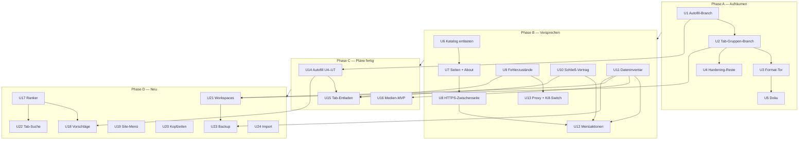
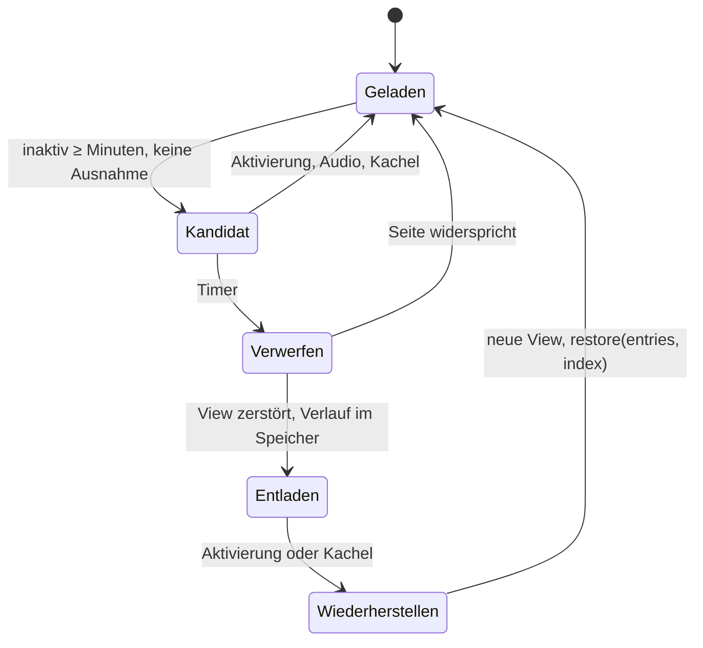
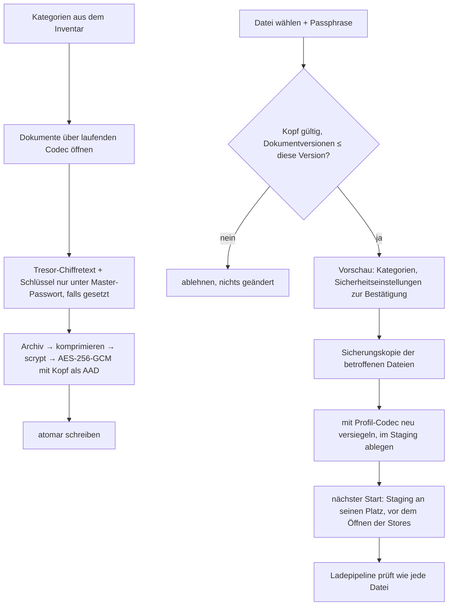

# Roadmap — Aufräumen, Versprechen einlösen, Pläne fertig, Neues - Plan

## Goal Capsule

- **Ziel:** Was Tessera in Menü, Einstellungen und Doku verspricht, tut es auch. Keine Menüaktion ohne Wirkung, keine interne Adresse mit 404, kein Schalter wie der Kill-Switch, der nur behauptet. Die offenen Arbeiten sind fertig: Tab-Gruppen, Autofill, Tab-Entladen, Medien. Dazu kommen fünf lokale Funktionen, die im Alltag fehlen: Vorschläge in der Adressleiste, Site-Menü, Kachel-Kopfzeilen mit Workspaces, Tab-Suche, verschlüsseltes Backup mit Import.
- **Mittel:** Vier Phasen in fester Reihenfolge (KTD1). Neue Logik liegt in puren Modulen mit eigenem Floor, die Verdrahtung in Electron bleibt dünn. Das ist das Muster, das das Projekt schon für Navigation, Absender und Downloads nutzt.
- **Autorität:** Requirements vor Key Technical Decisions vor Implementation Units. Acceptance Examples illustrieren, sie ändern nichts. Für Autofill und Medien gelten ihre eigenen Pläne (`docs/plans/2026-08-09-001-feat-password-autofill-trigger-plan.md`, `docs/plans/2026-08-09-001-feat-media-recorder-plan.md`). Dieser Plan legt nur Reihenfolge und MVP-Schnitt fest. Die Haltung zu Kamera, Mikrofon und Bildschirmfreigabe (unangetastet) steht über jedem Befund, der ihr widerspricht.
- **Abbruchbedingungen:** Anhalten und berichten, wenn:
  - ein Merge in Phase A nur geht, indem gespeicherte Daten ihre Bedeutung ändern oder ein Floor sinkt,
  - die HTTPS-only-Zwischenseite eine Brücke bräuchte (das schaltet HTTPS-only still ab, KTD3),
  - der Kill-Switch sich nur über einen zweiten `webRequest`-Listener bauen ließe,
  - eine Zeilen-, Katalog- oder Coverage-Grenze aus R40 oder ein Floor nur durch Anheben oder Absenken hält,
  - eine Einheit das heutige Verhalten von Kamera, Mikrofon oder Bildschirmfreigabe ändern müsste.
- **Ausführung:** `ce-work` arbeitet die Phasen nacheinander ab. Einheiten, die dieselben Kerndateien ändern (`BrowserWindowController.ts`, `src/main/index.ts`, `surface.ts`, `contract.ts`), laufen nacheinander, nicht parallel in Worktrees. Kein Agent startet die App (kein `pnpm dev`, kein `test:smoke`, kein Electron mit CDP), denn das löst MS Defender aus. Die Prüfung in der laufenden App übernimmt der Benutzer nach der Tabelle im Verification Contract.
- **Offene Blocker:** keine. Nicht blockierende Produktfragen stehen unter Open Questions.

---

## Product Contract

### Summary

Der Plan setzt die Befunde der Code-Prüfung vom 24.09.2026 in vier Phasen um.
Phase A holt die zwei offenen Branches nach main, schaltet die Formatprüfung scharf und bringt die Doku auf den echten Stand.
Phase B löst ein, was heute nur versprochen ist: eine interne Seite ohne 404, eine HTTPS-Zwischenseite, Fehler- und Absturzzustände, `beforeunload`, drei Menüaktionen, vollständiges Löschen sowie Proxy und Kill-Switch.
Phase C schließt Autofill, Tab-Entladen und einen Medien-MVP ab.
Phase D baut fünf neue, rein lokale Funktionen.

### Problem Frame

Die Prüfung vom 24.09.2026 hat alle Pläne gegen den Code gelegt. Drei Pläne sind fertig: Download-Anzeige, Element-Picker, fast das ganze Hardening. Drei sind es nicht. Der Tab-Gruppen-Fix liegt fertig auf `fix/tab-group-ownership`, der Bug lebt aber auf main weiter. Autofill steckt halb auf main, halb auf `feat/autofill-trigger`, und rund 1.360 Zeilen U4-Entwurf liegen uncommittet im Worktree `.claude/worktrees/autofill`. Der Medien-Recorder hat Erkennung und Downloader, aber keinen einzigen Aufrufer.

Schwerer wiegt, was die Oberfläche verspricht und nicht hält. HTTPS-only ist standardmäßig an und schickt jede `http://`-Seite auf `tessera://https-only`, und die Seite gibt 404, weil es weder HTML noch Vite-Eingang gibt. Hilfe › Über zeigt ebenfalls 404. Strg+D, „Browserdaten löschen" und „Alles löschen und beenden" senden ein Ereignis, das niemand behandelt. `network.killSwitch` steht standardmäßig auf an, aber kein Code setzt einen Proxy. Sechs Kommentare und Doku-Stellen behaupten trotzdem Proxy- und Kill-Switch-Schutz. „Beim Beenden löschen" überspringt Verlauf und Downloads, und nach einem Absturz löscht es gar nichts. Wer einen Tab mit halb ausgefülltem Formular schließt, verliert die Eingabe ohne Rückfrage, weil `webContents.close()` ohne `waitForBeforeUnload` läuft.

Das Projekt hat für genau diese Klasse eine Regel („kein Schalter ohne Wirkung", `tests/architecture.test.ts` `notYetRead`), aber sie prüft nur, ob ein Schlüssel irgendwo im Code vorkommt. Das README führt dagegen rund 15 Funktionen als fehlend, die längst existieren. Beide Richtungen kosten: das eine enttäuscht Nutzer, das andere bestellt Doppelarbeit.

### Key Decisions

- **Alle vier Phasen in einem Plan.** (session-settled: user-directed — chosen over „nur Sprint 1": die Reihenfolge der Phasen hängt voneinander ab und gehört in ein Dokument) *Governs R1–R40.*
- **Kamera, Mikrofon und Bildschirmfreigabe bleiben exakt wie heute.** (session-settled: user-directed — chosen over `docs/IMPROVEMENT-PLAN.md` V1 Punkt 2 und W6: bestehende Haltung) *Governs R33.*
- **Prüfung in der laufenden App macht der Benutzer.** (session-settled: user-directed — chosen over autonome Smoke- und CDP-Läufe: sie lösen MS Defender aus) *Governs Verification Contract.*
- **Autofill und Medien folgen ihren eigenen Plänen; dieser Plan setzt nur Reihenfolge und MVP-Schnitt.** (session-settled: user-approved — chosen over „hier neu planen": keine zwei Wahrheiten für dieselbe Arbeit) *Governs R25, R27.*
- **Kill-Switch und Proxy werden gebaut; übrige tote Einstellungen behalten ihren ehrlichen Hinweis, außer ein Feature hier belebt sie.** (session-settled: user-approved — chosen over „alle toten Schalter bauen" und „Kill-Switch nur ehrlich beschriften") *Governs R20–R24, R40.*
- **Panic löscht Browsing-Spuren, nicht das Profil.** Lesezeichen, Passwort-Tresor, Quick Links, Einstellungen und Workspaces bleiben. (session-settled: user-directed — chosen over „wirklich alles" und „Spuren plus Tresor") *Governs R15.*
- **Tab-Entladen bleibt standardmäßig an.** (session-settled: user-directed — chosen over „Standard auf aus": sonst kommt der RAM-Gewinn bei kaum jemandem an) *Governs R26.*
- **Das Backup enthält den Tresor nur, wenn ein Master-Passwort gesetzt ist, und dann nur unter dem Master-Passwort verschlüsselt.** (session-settled: user-directed — chosen over „ohne Tresor" und „Tresor immer, neu versiegelt": der Tresor verlässt das Gerät nie ohne Master-Passwort) *Governs R37.*
- **Bundle-Budgets dürfen mit notiertem Zuwachs wachsen; Zeilen, Katalog und Coverage bleiben hart.** Das Autofill-Preload-Tor gilt als „U14 macht das Preload nicht größer als vor U14 gemessen" (24.09.2026: 41,6 kB) statt 35 kB. (session-settled: user-directed — chosen over „kein Wert schlechter als 24.09": Main liegt bei 507 kB gegen 320, jedes Feature fügt Code hinzu) *Governs R40, R25.*
- **Die neuen Funktionen werden schmaler geplant als die Korrekturen; Produktfragen bleiben offen statt festgelegt.** (session-settled: user-approved — chosen over „alles gleich tief") *Governs R28–R38.*

### Requirements

**Aufräumen**

- R1. Keine Arbeit aus einem offenen Branch oder Worktree geht verloren. `feat/autofill-trigger` (U2, U3) und `fix/tab-group-ownership` (U1–U8) sind in main, der uncommittete U4-Entwurf ist als Commit gesichert.
- R2. Auf main gehören Tab-Gruppen dem Benutzer, wie `docs/plans/2026-08-09-001-fix-tabgruppen-eigentum-plan.md` es festlegt (see origin: that plan, R-IDs dort).
- R3. Die Formatprüfung blockiert in CI, und `git blame` überspringt die Umformatierung.
- R4. Die Lesezeichen-Seite sagt, wenn ihre Datei aus einer neueren Version stammt, ungültig oder nur lesbar ist, so wie die Passwort-Seite.
- R5. README, `docs/STATUS.md` und die Einstellungstexte beschreiben den tatsächlichen Stand. Kein Text nennt Vorhandenes fehlend oder Fehlendes vorhanden.

**Seiten und Zustände**

- R6. Jede Adresse, die der Kern als interne Seite kennt, liefert eine Seite. Hilfe › Über zeigt Name, Version und Lizenz.
- R7. Eine `http://`-Hauptnavigation landet auf einer Zwischenseite mit drei Wegen: „Über HTTPS versuchen", „Unverschlüsselt fortfahren", „Zurück". Die Adressleiste zeigt dabei die Zieladresse.
- R8. „Unverschlüsselt fortfahren" lässt sich von keiner Website auslösen, auch nicht per Weiterleitung. Die Ausnahme gilt je Host, je Sitzung, nur im Speicher, und ein privates Fenster teilt sie nicht.
- R9. Scheitert das Laden einer Hauptseite oder stürzt ihr Renderer ab, zeigt die Kachel einen Zustand mit Grund und „Neu laden". Adresse, Verlauf und Lesezeichen bleiben bei der echten Seite.
- R10. Aborts, die Tessera selbst auslöst, und blockierte Unterressourcen zeigen keinen Fehlerzustand.

**Schließen**

- R11. Schließen eines Tabs oder Fensters sowie eine Navigation weg von einer Seite mit `beforeunload` fragen nach, mit Namen der Site. „Bleiben" lässt alles wie vorher.
- R12. Beenden der App, Panic, Abmelden des Betriebssystems und das Update-Installieren fragen nie. Ein hängender Renderer hält das Schließen höchstens 5 Sekunden auf.

**Menüaktionen**

- R13. Strg+D (Cmd+D) legt ein Lesezeichen für die aktive Seite an. Ist die Lesezeichen-Datei nur lesbar, sagt Tessera das, statt still nichts zu tun.
- R14. „Browserdaten löschen…" fragt nach den Kategorien und löscht sofort, in der Sitzung des fokussierten Fensters.
- R15. „Alles löschen und beenden" löscht nach einer Bestätigung die Browsing-Spuren aus dem Dateninventar (KTD7) und beendet Tessera. Der nächste Start stellt keine Tabs wieder her.
- R16. Die drei Aktionen wirken auch ohne fokussiertes Fenster.

**Daten löschen**

- R17. „Beim Beenden löschen" löscht auch Verlauf und Downloads-Liste. Heruntergeladene Dateien bleiben.
- R18. Endet ein Lauf ohne geordnetes Beenden (Absturz, Kill, Abmelden), holt der nächste Start das Löschen nach, bevor ein Fenster aufgeht.
- R19. Die Kategorie „Formulardaten" verschwindet, weil nichts dahintersteht.

**Netz**

- R20. Ein manuell gesetzter Proxy gilt für allen Verkehr: normale Fenster, private Fenster, Anfragen des Hauptprozesses, Updater. Er gilt ab dem Speichern, ohne Neustart.
- R21. Mit Kill-Switch an und manuellem Proxy geht keine Anfrage direkt hinaus, auch nicht, wenn der Proxy ausfällt. Die Kachel zeigt dann den Zustand „Proxy nicht erreichbar".
- R22. Mit Kill-Switch an und Modus „System" gilt dasselbe, sobald das System direkt auflöst.
- R23. Im Modus „Direkt" sagt der Einstellungstext, dass der Kill-Switch erst mit Proxy wirkt. Er behauptet keinen Tunnel.
- R24. Mit aktivem Proxy verrät WebRTC keine lokale oder öffentliche IP an der Proxy vorbei.

**Laufende Pläne**

- R25. Autofill erfüllt Stufe 1 seines Plans (see origin: `docs/plans/2026-08-09-001-feat-password-autofill-trigger-plan.md`, R1–R9, R14, AE1–AE10). Vor dem Druck aufs Badge erreicht keine Information über den Tresor die Seite.
- R26. Ein Tab, der länger als `advanced.unloadAfterMinutes` inaktiv war, wird entladen. Kacheln, hörbare oder pausierte Medien, angeheftete, ladende, interne und Tabs mit Eingaben in Formularfeldern sind ausgenommen, ebenso Tabs, deren Seite widerspricht. Beim Aktivieren kehren Verlauf und Scroll-Position zurück. Der Tab-Streifen zeigt den entladenen Zustand.
- R27. Der Medien-MVP erfüllt aus seinem Plan R1–R5, R19, R21, R23 und R25 für gemuxte Quellen (see origin: `docs/plans/2026-08-09-001-feat-media-recorder-plan.md`).

**Neu: Adressleiste und Tabs**

- R28. Beim Tippen schlägt die Adressleiste Einträge aus Verlauf, Lesezeichen, Quick Links und offenen Tabs vor, je nach den vier `search.suggestFrom*`-Einstellungen. Nichts davon verlässt das Gerät.
- R29. In einem privaten Fenster kommen keine Vorschläge aus dem Verlauf.
- R30. Enter ohne Auswahl öffnet, was getippt wurde. Die Vorschlagsliste liegt über der Seite und ist klickbar.
- R31. Eine Tab-Suche findet Tabs des aktuellen Fensters nach Titel und Adresse. Aktivieren eines Tabs aus einer eingeklappten Gruppe klappt die Gruppe auf.
- R32. Der Tab-Streifen hält den aktiven Tab sichtbar und zeigt, dass es links oder rechts mehr gibt.

**Neu: Site, Kacheln, Daten**

- R33. Ein Klick aufs Schloss öffnet ein Site-Menü mit Verbindungsstatus, Blocker-Zähler und -Schalter, gespeicherten Berechtigungen samt „vergessen", Zoom der Kachel und Fingerprint-Modus. Kamera, Mikrofon und Bildschirmfreigabe erscheinen darin nicht.
- R34. Mit `splitView.showTileHeaders` trägt jede Kachel eine Kopfzeile mit Favicon und Titel. Die Kopfzeile nimmt der Seite Platz weg und verdeckt sie nicht.
- R35. Ein Layout samt Kachelbelegung lässt sich unter einem Namen speichern und später wieder öffnen, auch nach einem Neustart.
- R36. Ein verschlüsseltes Backup enthält Lesezeichen, Verlauf, Quick Links, Einstellungen, Berechtigungen, Nutzerregeln und Workspaces, geschützt mit einer Passphrase. Tab-Gruppen hängen an Tab-IDs eines Laufs und kommen nicht mit; Workspaces (KTD15) sind ihre übertragbare Form.
- R37. Den Passwort-Tresor enthält es nur bei gesetztem Master-Passwort, und dann nur unter dem Master-Passwort verschlüsselt.
- R38. Wiederherstellen ersetzt Kategorien erst beim nächsten Start, nach einer Sicherungskopie. Ein Backup aus einer neueren Version wird abgelehnt. Sicherheitsrelevante Einstellungen übernimmt es nur nach Bestätigung.
- R39. Lesezeichen und Verlauf lassen sich aus Chrome, Edge, Chromium und Firefox übernehmen. Passwörter nur per CSV.

**Querschnitt**

- R40. Größte Datei, Dateien über der Marke, Katalog-Chunk und Coverage werden nicht schlechter als am 24.09.2026, und kein Floor sinkt. Main-Prozess- und Renderer-Bundle dürfen wachsen; jede Einheit notiert ihren Zuwachs in kB mit dem Feature, das ihn verursacht. Jede belebte Einstellung verlässt die `notYetRead`-Liste samt ihrem Hinweistext in beiden Sprachen.

### Acceptance Examples

- AE1. **Covers R8.** Gegeben `evil.example` antwortet mit 302 auf `tessera://https-only?target=http://bank.example`. Wenn der Benutzer „Unverschlüsselt fortfahren" drückt, dann lädt `http://bank.example` nicht, weil kein gültiges Token vorliegt. Die Seite bietet nur „Über HTTPS versuchen" an.
- AE2. **Covers R8.** Gegeben ein normales und ein privates Fenster. Wenn der Benutzer im privaten Fenster für `http://printer.lan` fortfährt, dann bekommt das normale Fenster für denselben Host wieder die Zwischenseite.
- AE3. **Covers R11, R12.** Gegeben ein Tab mit einem Formular, dessen Seite `beforeunload` setzt. Strg+W fragt. „Bleiben" lässt den Tab offen und legt nichts auf den Stapel „geschlossene Tabs". Cmd+Q beendet ohne Frage.
- AE4. **Covers R15.** Gegeben ein Profil mit Verlauf, Cookies, zehn offenen Tabs und drei Lesezeichen. Nach Panic und Neustart sind Verlauf, Cookies und Tabs weg, die drei Lesezeichen noch da.
- AE5. **Covers R18.** Gegeben „Beim Beenden löschen: Verlauf" ist an, und der Prozess wird hart beendet. Beim nächsten Start ist der Verlauf leer, bevor das erste Fenster erscheint.
- AE6. **Covers R21.** Gegeben Kill-Switch an und Proxy `socks5://127.0.0.1:9050`, der Proxy läuft nicht. Jede Hauptnavigation zeigt „Proxy nicht erreichbar", und keine Verbindung geht direkt hinaus.
- AE7. **Covers R26.** Gegeben ein Hintergrund-Tab mit pausiertem Video. Nach 30 Minuten ist er nicht entladen.
- AE8. **Covers R38.** Gegeben ein Backup einer Tessera-Version mit neuerem Lesezeichen-Schema. Wiederherstellen lehnt vor dem Staging ab, und die aktuellen Daten bleiben unberührt.

### Scope Boundaries

- Kamera, Mikrofon und Bildschirmfreigabe: weder in Berechtigungen, Site-Menü noch Backup-Semantik verändert.
- Keine entfernten Vorschläge in der Adressleiste. `search.remoteSuggestions` behält seinen Hinweis „noch nicht wirksam".
- Kein Umgehen von Zertifikatsfehlern (W1), kein `window.open`-Rückkanal (W2), kein Einfügen im Kontextmenü (W7).
- Kein Performance-Feinschliff (R1, H2–H4 im IMPROVEMENT-PLAN), keine Speicherlecks (Q3 außer der Medien-Hälfte), kein Design-System (D4–D8), keine Modulgrößen-Refactors (Q6).
- Kein Entschlüsseln fremder Passwort-Speicher; Chrome und Firefox verschlüsseln sie an das Gerät oder die App gebunden.
- Keine Synchronisation, kein Cloud-Ziel für Backups.

#### Deferred to Follow-Up Work

- Medien-Recorder über den MVP hinaus: DASH, Muxer, Live, Anfragekontext (R6–R18, R20, R22, R24 seines Plans). Dafür bekommt `docs/plans/2026-08-09-001-feat-media-recorder-plan.md` einen eigenen Anreicherungsdurchgang.
- Autofill Stufe 2 (R10–R13 seines Plans).
- `unresponsive`-Dialog für hängende Seiten.
- Vorschläge im URL-Feld der Kachelleiste.
- Tab-Suche über alle Fenster.
- Eine Seite „Site-Einstellungen" mit allen gespeicherten Berechtigungen.
- Zeitbereich beim Löschen („letzte Stunde").
- Proxy mit Anmeldedaten (407).

### Open Questions

- Q1. **`splitView.showTileHeaders` steht auf `true`.** Wird U20 gebaut, bekommen alle Benutzer sofort Kopfzeilen, obwohl die Kachelleiste bewusst keinen Dauerplatz kostet (`src/shared/split/tile-bar.ts`). Standardwert auf `false` ändern? Annahme bis zur Antwort: ja, auf `false`. Nicht blockierend.
- Q2. **Wie stark ist die Backup-Passphrase?** Mindestlänge, Stärkeanzeige? Annahme: mindestens 12 Zeichen, zweimal eingegeben, mit dem Hinweis, dass eine vergessene Passphrase nicht wiederherstellbar ist. Nicht blockierend.
- Q3. **Beim ersten Start einen Import anbieten?** Annahme: eine Karte auf der Startseite, die nach dem ersten Schließen verschwindet. Kein Assistent. Nicht blockierend.

### Sources / Research

- Code-Prüfung vom 24.09.2026 in dieser Sitzung (sechs Pläne, IMPROVEMENT-PLAN, STATUS), Befunde mit Dateistellen stehen in den Einheiten.
- `docs/solutions/ui-issues/chrome-popups-behind-content-views.md`: alles über der Seite gehört auf die Overlay Surface.
- `docs/solutions/performance-issues/renderer-bundle-bloat-zod-co-location.md`: `model.ts` ohne zod, `schema.ts` daneben.
- `src/main/browser/navigation-policy.ts` („Why a redirect is judged differently"): eine Weiterleitung darf nur eine Seite ohne Rechte erreichen.
- Electron 43.2.0, `node_modules/electron/electron.d.ts`:
  - `session.setProxy` / `ProxyConfig`, `app.setProxy` (:1795–1800)
  - `webContents.close({ waitForBeforeUnload })` und `will-prevent-unload` (:17616, :17889)
  - `navigationHistory.getAllEntries()` / `restore()` (:10133, :10174)
  - `setWebRTCIPHandlingPolicy` ist je WebContents (:18431)
  - Kein natives Discard.
- Chromium: `fixed_servers` ohne `,direct://` scheitert geschlossen (`ERR_PROXY_CONNECTION_FAILED` -130, `ERR_MANDATORY_PROXY_CONFIGURATION_FAILED` -131). Electron verarbeitet `socks5h://` fehlerhaft (electron/electron#4032).
- Electron 43 bringt Node 24.17 mit BoringSSL. `crypto.argon2` wirft dort `ERR_CRYPTO_ARGON2_NOT_SUPPORTED`: Die Electron-Binärdatei hat den Guard `Argon2Job === undefined`, aber keine `Argon2Traits`; `ScryptTraits` sind vorhanden. `node:sqlite` (RC ab 24.15) macht für den Import keine native Abhängigkeit nötig. Passwort-Speicher mit Chromes App-Bound Encryption (ab Chrome 127) sind nicht legitim entschlüsselbar. Firefox-Frecency (firefox-source-docs.mozilla.org/browser/urlbar/ranking.html) ist das Vorbild für den Ranker. age und restic sind die Vorbilder für den Header, der als AAD gebunden wird.

---

## Planning Contract

### Key Technical Decisions

- KTD1. **Feste Phasenfolge A → B → C → D, Merges zuerst.** Phase A macht main zur einzigen Basis. Jede spätere Einheit berührt `BrowserWindowController.ts`, `index.ts` oder `surface.ts`, und die Branches ändern genau diese Dateien. Der Autofill-Branch geht vor jeder neuen Overlay-Art hinein: seine fünf Konflikte sind Vereinigungen in `OVERLAY_KINDS` und Nachbartabellen, und jede neue Art macht sie teurer.
- KTD2. **Merge-Technik:** main direkt in den Branch mergen, Konflikte lösen, dann `pnpm format` über die geänderten Dateien. Nicht den ganzen Branch vorher formatieren; das erzeugt 19+ neue Konflikte. Das Entfernen von `TabGroup.layout` wird als Migration in der Ladepipeline von main ausgedrückt (Versionssprung plus Migration, die das Feld löscht). `rewriteOnLoad` entfällt, weil `z.looseObject` das Feld sonst für immer mitschreibt.
- KTD3. **Die HTTPS-only-Zwischenseite bleibt ohne Rechte; „Fortfahren" löst der Kern im Navigations-Hook ein.** Die Seite kommt nicht in `INTERNAL_PAGES`, sonst lehnt `decideTabNavigation` die Weiterleitung ab und HTTPS-only ist still aus. Ihr Text kommt aus dem gebündelten Katalog nach `navigator.language`.
  - **Token:** Beim Umleiten prägt der Kern ein 256-Bit-Token. Der Eintrag hält WebContents-ID, die volle Zieladresse und 10 Minuten Gültigkeit, höchstens eines je WebContents. Die URL trägt nur `t`.
  - **Einlösen:** `will-frame-navigate` des Hauptframes löst ein, bei einer Navigation, die keine Weiterleitung ist, deren Initiator `tessera://https-only` ist und deren WebContents zum Token passt. Der Vergleich ist zeitkonstant, und der Eintrag wird vor der Verwendung gelöscht.
  - **Keine Wirkung in `protocol.ts`:** Das Schema ist `corsEnabled` und `supportFetchAPI` (`src/main/protocol.ts:29-30`), und `protocol.handle` sieht keine WebContents. Jede Seite könnte die Route per `` treffen, also bewirkt die Route selbst nichts.
  - **Ausnahme:** Eine Anfrage ist ausgenommen, wenn ihr eigener Host der ausgenommene ist *und* das Top-Level-Dokument auf diesem Host liegt. Fremde `http`-Skripte und -Frames auf einer ausgenommenen Seite werden weiter hochgestuft. Der Host-Schlüssel ist normalisiert (klein, Punycode, ohne abschließenden Punkt, Port zählt mit). Die Ausnahme gilt je Sitzungspartition, nur im Speicher.
  - **Gewählt statt eines Buttons in der Chrome-UI**, weil die Seite dann ohne Overlay-Art auskommt. Ein fremder 302 oder `` kennt das Token nicht und hat keinen passenden Initiator.
- KTD4. **Fehler- und Absturzzustände zeichnet die Chrome-UI im Kachel-Rechteck über der verborgenen View.** Das ist keine geladene interne Seite. Adresse, Verlauf, Strg+D und Sitzung bleiben so bei der echten Seite, und mehrere Kacheln können gleichzeitig einen Zustand zeigen, was die Overlay Surface mit einer Fläche nicht kann. `TabState` bekommt ein Feld `failure` (Art, Code, Host), das `tabs:changed` schon transportiert.
- KTD5. **Ein Schließ-Vertrag für alle Wege** (Tabelle in High-Level Technical Design). `closeTab` teilt sich in „anfragen" und „abschließen". Die Logik liegt in einem neuen Modul unter `src/main/browser/`, nicht in `BrowserWindowController.ts`. Tab-Entladen nutzt denselben Handler mit Modus „verwerfen", der nie fragt.
  - **Abschluss:** Er läuft bei `destroyed` nur, wenn für genau diesen Tab eine Schließanfrage offen ist. Entladen und Fenster-Abbau zerstören Views auch, gehen aber nie über den Tab-Abschluss: kein Stapel geschlossener Tabs, keine Ein-Tab-Regel, kein `afterTabClosed`.
  - **Sonderfälle:** Füll-Tabs, die `TileOccupancyController.afterLayoutChange` im selben Durchgang schließt, und interne Seiten behalten den synchronen Weg. Ein Tab mit offener Anfrage trägt eine Markierung „schließt", und ein zweiter Klick tut nichts.
  - **Beenden:** Beim Beenden wird zuerst die Sitzung versiegelt (`SessionStore.seal()` in `beginShutdown`), dann schließen die Tabs still. Sonst schreiben die stillen Schließvorgänge eine schrumpfende Sitzung, und die Wiederherstellung ist kaputt.
- KTD6. **Menüaktionen laufen im Kern, nicht in `App.tsx`.** Keine der drei braucht Fokus oder Cursor der Chrome-UI, und das Repo hat diesen Weg schon für `settings` gewählt (`App.tsx:143-149`). Sie hängen am Menü-Handler selbst, nicht an `focused()?.emit`. Ein Fitness-Test prüft, dass jede Aktion, die `appMenu.ts` sendet, einen Empfänger hat.
- KTD7. **Ein Dateninventar steuert Löschen jetzt, beim Beenden, Panic und Backup.** Ein pures Modul ordnet jede Kategorie ihren Dateien (`paths.ts`), deren Kopien, Chromium-Datentypen und Resten im Speicher zu. Die drei Löschwege und das Backup lesen dieselbe Tabelle, damit sie nicht auseinanderlaufen. Dazu gehören auch Staging und Sicherungskopien aus U23 sowie die `.v<N>.bak`-Kopien der Migrationen.
  - **Notizen:** Es gibt zwei getrennte Notizen, eine für das Beenden und eine für Panic. Keine überschreibt die andere, und eine unlesbare Beenden-Notiz fällt wie heute auf Cookies, Seitenspeicher und Cache zurück. Verlauf und Downloads werden nur aus einer lesbaren Notiz nachgeholt, damit eine beschädigte Notiz nie einen Verlauf löscht, den der Benutzer behalten wollte.
  - **Beenden-Notiz:**
    - Sie wird beim Start scharf geschaltet, wenn Löschen beim Beenden an ist. Dabei wird sie mit einer noch offenen Notiz zusammengeführt.
    - Ändern sich `clearData.onExit` oder `onExitCategories`, wird sie neu geschrieben oder entfernt.
    - Entfernt wird sie erst, wenn Flush und `discardCopies` der geleerten Stores fertig sind. Ein hängender Flush lässt sie liegen.
  - **Vor dem Leeren** werden Verlauf, Downloads, Favicons und Vorschaubilder versiegelt, so wie `sessionStore.seal()`, damit späte Besuche keine Spuren zurückschreiben.
  - **Startreihenfolge:**
    1. Nachholen beider Notizen auf Dateiebene
    2. Staging aus U23 einspielen
    3. Stores öffnen

    Umgekehrt würde das Nachholen den gerade wiederhergestellten Verlauf löschen.
- KTD8. **Kill-Switch heißt: kein direkter Weg.** Mit Kill-Switch an enthält die Proxy-Regel nie `direct://`, und Chromium scheitert selbst geschlossen. Nur `http`, `https`, `socks5` sind erlaubt; `socks5h` wird zu `socks5`, `socks4` abgelehnt.
  - **Modus „System":** Eine Stufe `kill-switch` steht als erste in `STAGE_ORDER` (vor `telemetry` und `https-upgrade`); es ist eine Stufe, kein zweiter Listener. Sie bricht ab, sobald das Ergebnis von `session.resolveProxy` für den Host irgendwo `DIRECT` enthält. PAC liefert oft `PROXY a; DIRECT`, und das fällt bei Ausfall direkt zurück.
    - Weil Stufen synchron sind, liest sie einen Cache je Sitzung und Origin (Schema, Host, Port), denn PAC entscheidet je URL, oft nach Schema. Der Cache wird mit `resolveProxy` auf der Origin der Anfrage asynchron gefüllt und bei `setProxy` sowie beim Netzwechsel geleert.
    - Eine Anfrage ohne Cache-Eintrag hält ein eigener Wartepunkt im einzigen `onBeforeRequest`-Listener, vor den Stufen.
      - Er gilt für jede Ressourcenart, also auch für Unterressourcen, Unterframes und WebSockets zu fremden Hosts.
      - Er wartet, bis `resolveProxy` antwortet. Fehler oder Zeitüberschreitung brechen ab; nichts wird nach einer Frist durchgelassen.
      - Der vorhandene Haltemechanismus für das erste Kompilieren (`RequestPipeline.ts:390`) wird dafür nicht verwendet: Er hält nur Hauptframes und lässt nach 750 ms durch.
    - Die verbleibenden Lecks (PAC/WPAD-Abruf, `dnsResolve()` im PAC) nennt der Einstellungstext (R22).
  - **Abdeckung:** Beim Einrichten wird die Regel sofort auf `session.defaultSession` angewandt, das zu diesem Zeitpunkt schon existiert. Danach gilt sie über `app.on('session-created')` für jede später erzeugte Sitzung, nicht über eine handgepflegte Liste, dazu `app.setProxy`.
    - Sitzungen ohne volle Pipeline, also die `electron-updater`-Partition, bekommen über `session-created` einen `onBeforeRequest` mit nur der Stufe `kill-switch`.
    - Die Partition wird beim Start früh erzeugt, und `UpdateService` wartet vor jedem Abruf auf das angewandte `setProxy`.
    - Beim Start gilt sie vor Sitzungswiederherstellung, PSL-, Filterlisten- und Favicon-Abrufen.
    - Solange eine Regeländerung aussteht und der Kill-Switch an ist, ist alles blockiert.
    - `createWindow` bleibt synchron; den ersten Ladevorgang hält der Controller zurück, bis die Regel seiner Sitzung gilt.
    - Abrufe des Hauptprozesses prüfen `resolveProxy` ebenso.
    - Ein Fitness-Test verbietet in `src/main` das globale `fetch` sowie `node:http` und `node:https`.
  - **Live:** Proxy-Einstellungen wirken ab dem Speichern: `setProxy` auf jeder Sitzung, dann `closeAllConnections`.
  - **WebRTC:** Über `web-contents-created` bekommt jede WebContents `disable_non_proxied_udp`, sobald der Modus „System" oder „Manuell" ist. Im Modus „Direkt" gilt `network.webrtcIpPolicy` unverändert, auch mit Kill-Switch an. Bestehende Peer-Verbindungen brauchen ein Neuladen, und der Text sagt das.
- KTD9. **Entladen heißt: View zerstören, Verlauf im Speicher halten, neue View beim Aktivieren.** Electron 43 hat kein natives Discard. Die Entscheidung trifft ein pures Modul (Tab-Fakten, Jetzt, Einstellungen → Kandidaten). Ein einziger Timer für die ganze App löst aus. Der Verlaufs-Schnappschuss kommt nie in `TabState` oder `SessionTab`, weil `pageState` Megabytes groß sein kann.
  - **Zwei Arten von „entladen":** „Aufgeschoben durch Wiederherstellung" behält seine View und lädt per `loadUrl` wie heute (`Tab.ts` `#deferred`). „Verworfen" hat keine View und bekommt beim Aktivieren eine neue plus `restore()`. Die Sitzung liest in beiden Fällen die URL.
  - **Neue View:** `#createView` besitzt die ganze Verdrahtung der View, heute rund 400 Zeilen `on(...)` im Konstruktor, dazu die Wächter aus U9 und U10.
  - **Wechsel der ID:** Ein Hook `onViewReplaced(alteId, neueId)` aktualisiert `#permissionTabs` im Controller. Die Maps nach WebContents-ID (AutofillService, CosmeticInjector, ElementPicker, MediaSessions, Tokens aus KTD3) räumen die alte ID über `destroyed` ab und nehmen die neue über `web-contents-created` auf.
- KTD10. **Das Medien-Panel nutzt das Vollfenster-Panel der Chrome-UI** (`App.tsx` `panel`-Zustand, `window:setOverlay`), keine neue Overlay-Art. Das ist die billigste Stelle, und ein Panel darf die Seite verbergen. Übertragungen laufen über `DownloadManager.track()`.
- KTD11. **Ein lokaler Ranker für Adressleiste und Tab-Suche**, frecency-artig: Besuchszahl mal Abklingen nach Alter, Präfix vor Wortanfang vor Teilstring, dedupliziert nach normalisierter URL, höchstens 8 Zeilen. Pur, ohne zod, und ein Fitness-Test verbietet jeden Import aus der Netzwerkschicht.
- KTD12. **Vorschläge sind eine neue Overlay-Art mit eigenem Rechteck unter dem Eingabefeld.** Sie nimmt keinen Fokus, holt ihn nach Updates nicht zurück, und die Zeilen füllt der Kern. Gewählt wird bei `pointerdown`, geschlossen wird vom Kern, nicht bei `blur`. Der Rang liegt unter Suchleiste, Picker-Leiste, `autofill-suggest`, `downloads-panel` und `permission-request`. Offene Flächen dieser Arten bleiben, und die Liste erscheint erst nach ihrem Schließen. Die Art gehört nicht zu `TILE_BOUND_KINDS`, aber ein Layoutwechsel schließt sie.
- KTD13. **Das Site-Menü ist ein natives Menü, das mit dem Blocker-Menü verschmilzt.** Es braucht keine Overlay-Art und kein Wachstum von `surface.ts`, und es kollidiert nicht mit der einen Fläche. Der Schild-Knopf daneben öffnet dasselbe Menü. Zoom wirkt je Kachel über `zoom:step`/`zoom:reset`, nicht je Host (Entscheidung vom 29.07.2026).
- KTD14. **Kachel-Kopfzeilen verkleinern die View.** Eine pure Funktion in `src/shared/split/` berechnet das View-Rechteck aus Kachel-Rechteck und Kopfhöhe. Kern und Renderer rufen dieselbe Funktion auf, weil zwei Ableitungen derselben Geometrie auseinanderlaufen (`chrome-insets.ts`). Die Kopfzeile ist Chrome-UI-DOM in der Lücke. Die Hover-Kachelleiste bleibt für die Bedienelemente.
- KTD15. **Workspaces sind ein eigenes Modul mit URL-Plätzen, Brüchen und Namen, keine Arrangements.** Arrangements hängen an Tab-IDs, die einen Neustart nur mit Sitzungswiederherstellung überleben, und die ist standardmäßig aus. Außerdem sind sie unsichtbar und werden verdrängt.
- KTD16. **Die Tab-Suche nutzt das Vollfenster-Panel.** Die Chrome-UI hat `TabState[]` schon, und die eine Overlay-Fläche bleibt für Suchleiste und Vorschläge frei.
- KTD17. **Backup-Format:** eine Datei mit einem versionierten Kopf, der als AAD in AES-256-GCM gebunden ist. Der Kopf enthält Format, App-Version, Dokumentversionen, KDF-Parameter und ein frisches 16-Byte-Salz.
  - **KDF:** scrypt über `crypto.scrypt` mit den Parametern des Tresors (`VAULT_SCRYPT_COST`, N=2^17, r=8, p=1, passendes `maxmem`, also 128 MiB). `crypto.argon2` gibt es in Electron 43 nicht, weil Electrons Node gegen BoringSSL gebaut ist.
  - **Nur erlaubte Parameter:** Beim Lesen gilt eine exakte Liste erlaubter Parameter, für das scrypt des Backups und das des mitgebrachten Tresors. Die KDF läuft vor der AAD-Prüfung, also sprengt ein Kopf mit N=2^30 sonst den Speicher.
  - **Ablauf:** Erst komprimieren, dann in einem Durchgang verschlüsseln, ohne zufällige Nonces je Block. Vor `final()` wird nichts entpackt oder verwendet, und die entpackte Größe hat eine Obergrenze.
  - **Codec:** Dokumente werden über den laufenden Codec entschlüsselt und neu versiegelt, weil `local-data.key` an den Schlüsselbund des Geräts gebunden ist.
  - **Tresor:** Er wandert als Chiffretext mit einem Schlüssel, der nur unter dem Master-Passwort verpackt ist (per R37). Beim Staging bekommt dieser Schlüssel wieder die äußere Hülle aus dem Schlüsselbund dieses Geräts (`safeStorage`, wie `wrapVaultKey`). So braucht der wiederhergestellte Tresor wie vorher Schlüsselbund *und* Master-Passwort.
- KTD18. **Wiederherstellen legt Dokumente für den nächsten Start bereit.** Sie werden mit dem Codec dieses Profils neu verschlüsselt und nach der Startreihenfolge aus KTD7 an ihren Platz verschoben. Die Ladepipeline (Migration, Schema, Quarantäne) prüft sie dann wie jede andere Datei.
  - **Ziele:** Zielpfade kommen nur aus der Zuordnung Kategorie → `paths.ts` im Inventar, nie aus Namen im Archiv. Sonst überschreibt ein präparierter Eintrag `local-data.key` oder `startup-flags.json`.
  - **Manifest:** Ein versiegeltes Manifest wird zuletzt geschrieben und ist die Commit-Marke. Eingespielt wird Datei für Datei, wiederholbar. `passwords` und der Tresor-Schlüssel wandern zusammen, und das Manifest wird zuletzt gelöscht. Ein Manifest mit neuerer App-Version wird abgelehnt, und das Staging bleibt liegen.
  - **Sicherungskopie:** Sie entsteht beim Einspielen, nicht beim Anfordern, damit Änderungen dazwischen nicht verloren gehen.
  - **Sicherheitsrelevante Einstellungen:** Sie tragen ein Kennzeichen in `definitions.ts`, das ein Fitness-Test für jede Einstellung erzwingt. Nicht bestätigte Schlüssel werden vor dem Versiegeln herausgefiltert. Das betrifft unter anderem HTTPS-only, Kill-Switch, Proxy-Modus und -URL, sicheres DNS, Blocker-Ausnahmen und Fingerprint; Berechtigungen und Nutzerregeln stehen ebenfalls zur Bestätigung.
- KTD19. **Import ohne native Abhängigkeit:** Chrome-Lesezeichen aus dem JSON des Profils, Firefox-Lesezeichen per HTML-Export über den vorhandenen Importer, Verlauf über `node:sqlite` schreibgeschützt auf einer Kopie samt `-wal`/`-shm`. Zwei benannte Helfer rechnen die Epochen um (Chrome ab 1601 in µs, Firefox ab 1970 in µs).
- KTD20. **Text, den nur der Kern zeigt, lebt kernseitig**, nach dem Vorbild von `settings-text.*` und `update-text.*`. Das Katalog-Budget von 48 kB wird nicht angehoben; U6 schafft vorher Platz, indem `menu.*` und die Blocker-Menü-Schlüssel in den Kern ziehen.
- KTD21. **Neue Logik in neue Module, Wachstum wird ausgeglichen.** Dateien über der 780-Zeilen-Marke (`BrowserWindowController.ts`, `src/main/index.ts`, `contract.ts`, `Tab.ts`, `surface.ts`, `src/main/ipc/handlers.ts`) bekommen nur Aufrufstellen.
  - `scripts/metrics.mjs` bewertet die größte Datei, also verschlechtert jede zusätzliche Zeile in `BrowserWindowController.ts` die Kennzahl.
  - Jede Einheit, die eine dieser Dateien oder `WindowRegistry.ts` (673 Zeilen, knapp unter der Marke) berührt, misst gegen die Zeilenzahl vom 24.09.2026. Sie nennt eine Auslagerung, die ihr Wachstum ausgleicht, etwa die Fenster-Schließ-Verdrahtung nach `unload-guard.ts`.
  - Neue Handler kommen in Domänendateien unter `src/main/ipc/`, neue Wire-Schemas in `schema.ts`-Dateien statt in `contract.ts`.
- KTD22. **Eine Sichtbarkeitsregel für Views.** Fehlerzustand (U9), entladen (U15) und Kopfzeile (U20) verbergen oder verkleinern Views. Heute setzt `relayout` die Sichtbarkeit bei jedem Layoutwechsel neu, und eine wegen `failure` verborgene View käme wieder. Eine pure Funktion bekommt Kachel, `failure`, `unloaded` und Kopfzeile und liefert Sichtbarkeit und View-Rechteck. `relayout` ruft nur sie. `TabState.failure` ist optional mit Vorgabe „keins", damit `tabStateSchema` und die Test-Fixtures halten, und es kommt nie in die Sitzung. Ein Tab mit `failure` wird nicht entladen.

### High-Level Technical Design

**Phasen und Abhängigkeiten**



Die puren Hälften von U9, U11, U13, U17, U23 und U24 können parallel entstehen; U17 braucht keine frühere Phase. Nacheinander laufen die Verdrahtung und die geteilten Dateien: `vitest.config.ts`, `stryker.config.json`, `tests/architecture.test.ts` (`notYetRead`), `settings-text.*`, `Omnibox.tsx` (U18, U19), `appMenu.ts` (U12, U22).

**HTTPS-only: Umleiten und Fortfahren (KTD3)**

```mermaid
sequenceDiagram
  participant T as Tab
  participant P as RequestPipeline (https-Stufe)
  participant X as Ausnahmen je Sitzung
  participant S as tessera://https-only (ohne Rechte)
  participant N as will-frame-navigate (Kern)
  T->>P: GET http://host/pfad (Hauptframe)
  P->>X: Ausnahme für host?
  X-->>P: nein
  P->>P: Token prägen (webContentsId, volles Ziel, 10 min, eines je WebContents)
  P-->>T: 302 tessera://https-only?target=…&t=Token
  T->>S: Seite zeigt Host als Punycode/IDN, entfernt t per replaceState
  alt Über HTTPS versuchen
    S->>T: location.replace(https://host/pfad)
  else Unverschlüsselt fortfahren (Knopf nach kurzer Verzögerung aktiv)
    S->>N: Navigation auf tessera://https-only/continue?t=Token
    N->>X: kein Redirect, Initiator https-only, WebContents passt, Token gelöscht → Ausnahme setzen
    N-->>T: Navigation auf das gespeicherte Ziel
  else fremder 302 oder img auf /continue
    N-->>T: abgelehnt (Weiterleitung, fremder Initiator oder kein Token); die Route selbst bewirkt nichts
  end
```

**Schließ-Vertrag (KTD5)**

| Auslöser | `beforeunload` fragen | Bei „Bleiben" | Notizen |
|---|---|---|---|
| Tab schließen (×, Strg+W, Mittelklick, `window.close()`) | ja | Tab bleibt, nichts auf den Stapel geschlossener Tabs | Abschluss erst bei `destroyed` |
| Fenster schließen | ja, je widersprechendem Tab nacheinander; der Tab wird vorher aktiviert | Fenster bleibt offen mit den übrigen Tabs; schon still geschlossene Tabs liegen auf dem Stapel geschlossener Tabs | Electron kann `beforeunload` nicht ohne Schließen abfragen; eingeklappte Gruppe klappt auf |
| Navigation, Neu laden | ja | Navigation abgebrochen | ein Dialog „Seite verlassen?" |
| App beenden, Panic, OS-Abmeldung, Update installieren | nein | — | Sitzung zuerst versiegelt, dann stilles Schließen; kein Tab-Abschluss |
| Entladen (U15) | nie; Widerspruch = nicht entladen | Tab bleibt geladen | Modus „verwerfen"; kein Tab-Abschluss |
| Füll-Tabs beim Layoutwechsel, interne Seiten | nein | — | synchroner Weg wie heute |
| Hängender Renderer | nach 5 s erzwungen | — | — |

**Proxy × Kill-Switch (KTD8)**

| Modus \ Kill-Switch | an (Standard) | aus |
|---|---|---|
| Direkt (Standard) | wirkungslos; Text sagt „wirkt erst mit Proxy" | direkt |
| System | Systemregel; Pipeline-Stufe bricht ab, sobald `resolveProxy` irgendwo `DIRECT` enthält | Systemregel |
| Manuell, gültige URL | `fixed_servers` ohne `direct://` → scheitert geschlossen | `fixed_servers,direct://` |
| Manuell, leere oder ungültige URL | Speichern abgelehnt; bis dahin gilt die letzte gültige Regel | Speichern abgelehnt |

Gilt für jede Sitzung über `session-created` (Standard, `private-N`, Updater) und für `app.setProxy`, jeweils vor der ersten Anfrage. Während eine Regeländerung aussteht und der Kill-Switch an ist, ist alles blockiert.

**Dateninventar (KTD7)**

| Kategorie | Quellen | Löschen jetzt | Beim Beenden | Panic | Backup |
|---|---|---|---|---|---|
| Verlauf | `historyFile()`, Kopien, Vorschaubilder, Favicons, Stapel geschlossener Tabs | wählbar | wählbar | ja | ja |
| Downloads-Liste | `downloadsFile()` (Dateien bleiben) | wählbar | wählbar | ja | nein |
| Cookies | Chromium `cookies` | wählbar | wählbar | ja | nein |
| Netzwerkspuren | Chromium `session.clearData()` ohne Typfilter (u. a. `Network Persistent State`, `TransportSecurity`, Reporting/NEL), `clearCodeCaches({})`, `clearHostResolverCache()`, `clearAuthCache()` | mit Cookies | mit Cookies | ja | nein |
| Seitenspeicher | Chromium `localStorage`, `indexedDB`, `serviceWorkers` … | wählbar | wählbar | ja | nein |
| Cache | Chromium `cache` | wählbar | wählbar | ja | nein |
| Sitzung | `sessionStateFile()`, Tab-Gruppen, Arrangements | — | — | ja | nein |
| Berechtigungen | `permissionsFile()` | — | — | ja | ja |
| Medienfunde, HTTPS-Ausnahmen | nur Speicher | mit Cookies | mit Cookies | ja | nein |
| Lesezeichen, Quick Links, Einstellungen, Nutzerregeln, Workspaces | ihre Dateien | — | — | nein | ja |
| Passwort-Tresor | `passwordsFile()`, `passwordVaultKeyFile()` | — | — | nein | nur mit Master-Passwort |
| Nie im Backup | `localDataKeyFile()`, `startupFlagsFile()`, `windowPlacementFile()`, `extensionsFile()`, `pendingClearFile()`, Panic-Notiz, Caches, Filterlisten | | | | |

**Entladen als Zustandsautomat (KTD9)**



**Backup und Wiederherstellen (KTD17, KTD18)**



### System-Wide Impact

- **Vertrauensgrenze:** „Fortfahren" auf der HTTPS-Zwischenseite ist der erste Weg, auf dem eine Seite ohne Rechte etwas im Kern auslöst. Deshalb geschieht es im Navigations-Hook mit Initiator- und WebContents-Prüfung (KTD3), nicht in `protocol.ts`, das jede Seite per `fetch` oder `` erreicht.
- **Netz:** Proxy und Kill-Switch betreffen jede Anfrage aller Sitzungen, auch PSL, Filterlisten, Favicons und Updates des Hauptprozesses. Wer den Kill-Switch an hat und keinen Proxy erreicht, bekommt keine Filterlisten- und Update-Aktualisierung mehr. Die Einstellungsbeschreibung sagt das.
- **Lebenszyklus:** Der Schließ-Vertrag macht das Schließen asynchron. Die Ein-Tab-Regel, `afterTabClosed`, die Permission-Listener und der Stapel geschlossener Tabs laufen erst beim Abschluss, und nur für eine echte Schließanfrage (KTD5).
- **Identität der View:** Entladen erzeugt neue WebContents-IDs. Alles, was nach ID schlüsselt, hängt am Hook `onViewReplaced` oder räumt über `destroyed` und `web-contents-created` (KTD9).
- **Tab-Zustand:** `TabState.failure` und der sichtbare Zustand `unloaded` laufen über `tabs:changed` in jede Chrome-UI. `failure` ist optional, damit alte Fixtures und der Vertragstest halten, und bleibt aus der Sitzung (KTD22).
- **Daten:** Die Beenden-Notiz wird ab U11 bei jedem Start geschrieben, wenn Löschen beim Beenden an ist. Eine ältere Version liest sie, löscht die Kategorien, die sie kennt, und entfernt sie. Verlauf und Downloads überleben dann einen Downgrade; das ist hinnehmbar und steht in den Release Notes.
- **Startreihenfolge:** Nachholen, dann Staging, dann Stores (KTD7). Diese Reihenfolge teilen U11, U12 und U23.
- **Budgets:** Drei neue Oberflächen (Vorschläge, Panels, Kopfzeilen) und neue Texte treffen ein Katalog-Budget, das fast voll ist, sowie sechs Dateien über der Marke und `WindowRegistry.ts` knapp darunter (KTD20, KTD21).

### Risks

| Risiko | Folge | Gegenmaßnahme |
|---|---|---|
| Der U4-Entwurf im Autofill-Worktree geht beim Aufräumen verloren | 1.360 Zeilen Arbeit weg | U1 sichert ihn als ersten Schritt als Commit auf dem Branch, bevor irgendetwas gemergt oder entfernt wird |
| Das asynchrone Schließen bricht Annahmen, die synchrones Entfernen voraussetzen | Tabs verschwinden doppelt, oder die Ein-Tab-Regel greift zu früh | Fake-WebContents-Tests für alle Wege aus der Tabelle; Benutzerprüfung in der laufenden App |
| `system`-Proxy löst per PAC stillschweigend `DIRECT` auf | Kill-Switch lückenhaft | Pipeline-Stufe mit `resolveProxy`; Test mit gefälschter Auflösung |
| Ein Chromium-Update ändert das Fail-closed-Verhalten | Verkehr geht direkt | Test, dass die Regel nie `direct://` enthält; QA 6.4 als Benutzerprüfung bei jedem Electron-Update |
| Entladen verliert Formularinhalte ohne `beforeunload` | Datenverlust | Tabs mit fokussiertem oder geändertem Feld sind ausgenommen (R26) |
| `.omnibox__hint` liegt heute schon unter der Seite | Hinweis unsichtbar | U18 übernimmt ihn als erste Vorschlagszeile; Benutzerprüfung |
| Navigation mit `beforeunload` ist heute vermutlich still blockiert | Nutzer hält U10 für den Auslöser | vor U10 in der laufenden App prüfen lassen und in STATUS festhalten |
| Zeilenverweise in den Einheiten veralten durch die Merges in Phase A | falsche Stellen | nach Phase A gelten Zeilennummern als ungefähr; jede Einheit prüft ihre Stellen vor der Arbeit |
| Eine neue View nach dem Entladen fehlt in einer Map nach WebContents-ID | Berechtigungsdialog, Autofill oder Picker greifen ins Leere | `onViewReplaced` plus Test, dass eine wiederhergestellte View Berechtigungsanfragen stellen kann (KTD9) |
| Ein präpariertes Backup nutzt Parser, KDF oder Zielpfade aus | Speichererschöpfung, überschriebene Schlüsseldatei | erlaubte Parameterliste, nichts vor `final()`, Ziele nur aus dem Inventar (KTD17, KTD18) |
| Panic oder Löschen beim Beenden bricht mitten ab | Spuren bleiben oder Tabs kehren zurück | Notiz zuerst, Entfernen zuletzt, Nachholen vor dem `SessionStore` (KTD7) |

---

## Implementation Units

### Unit Index

| U-ID | Titel | Wichtigste Dateien | Hängt ab von |
|---|---|---|---|
| U1 | Autofill-Branch sichern und mergen | `.claude/worktrees/autofill`, `src/shared/overlay/surface.ts` | — |
| U2 | Tab-Gruppen-Branch mergen | `src/main/data/JsonStore.ts`, `TabGroupStore.ts`, `src/main/index.ts` | U1 |
| U3 | Formatprüfung scharf schalten | `.github/workflows/gates.yml`, `.git-blame-ignore-revs` | U1, U2 |
| U4 | Reste aus dem Hardening | `BookmarksPage.tsx`, `contract.ts`, `reports/mutation/` | U2 |
| U5 | Doku auf den echten Stand | `README.md`, `docs/STATUS.md`, `settings-text.*` | U3 |
| U6 | Katalog-Budget entlasten | `src/shared/i18n/catalog.*`, `src/main/menu/` | Phase A |
| U7 | Interne Seiten vollständig, About-Seite | `electron.vite.config.ts`, `src/renderer/internal/about.*` | U6 |
| U8 | HTTPS-only-Zwischenseite mit Token | `RequestPipeline.ts`, `protocol.ts`, `https-only.*` | U7 |
| U9 | Fehler- und Absturzzustände | `src/main/browser/tab-failure.ts`, `TabFailure.tsx` | Phase A |
| U10 | Schließ-Vertrag (`beforeunload`) | `src/main/browser/unload-guard.ts`, `BrowserWindowController.ts` | Phase A |
| U11 | Dateninventar und Löschen beim Beenden | `src/shared/data/inventory.ts`, `src/main/shutdown.ts` | Phase A |
| U12 | Menüaktionen im Kern | `src/main/menu/menu-actions.ts`, `appMenu.ts` | U8, U10, U11 |
| U13 | Proxy und Kill-Switch | `src/main/session/proxy.ts`, `RequestPipeline.ts`, `WindowRegistry.ts` | U9 |
| U14 | Autofill U4–U7 fertig | laut Autofill-Plan | U1, Phase B |
| U15 | Tab-Entladen | `src/shared/session/unload-policy.ts`, `Tab.ts` | U2, U9, U10, U14 |
| U16 | Medien-MVP | `WindowRegistry.ts`, `MediaDownloader.ts`, `App.tsx` | U11 |
| U17 | Lokaler Ranker | `src/shared/search/rank.ts` | — |
| U18 | Vorschläge in der Adressleiste | `OmniboxSuggestionsSurface.tsx`, `omnibox-handlers.ts` | U6, U14, U17 |
| U19 | Site-Menü hinter dem Schloss | `src/main/menu/site-menu-items.ts`, `Omnibox.tsx` | Phase C |
| U20 | Kachel-Kopfzeilen | `src/shared/split/tile-header.ts`, `TileHeaders.tsx` | Phase C |
| U21 | Workspaces | `src/shared/workspaces/`, `WorkspaceStore.ts` | U2, U11 |
| U22 | Tab-Suche und Tab-Streifen | `TabSearchPanel.tsx`, `TabBar.tsx` | U17 |
| U23 | Verschlüsseltes Backup und Wiederherstellen | `src/main/backup/` | U11, U21 |
| U24 | Import aus anderen Browsern | `src/shared/import/`, `src/main/import/` | Phase C |

### Phase A — Aufräumen

### U1. Autofill-Branch sichern und mergen

**Goal:** Der uncommittete U4-Entwurf ist gesichert, U2 und U3 des Autofill-Plans sind auf main.

**Requirements:** R1; KTD1, KTD2.

**Dependencies:** keine.

**Files:**
- Worktree `.claude/worktrees/autofill` (Branch `feat/autofill-trigger`)
- Konflikte: `src/shared/overlay/surface.ts`, `src/shared/ipc/contract.ts`, `src/renderer/src/overlay.css`, `tests/overlay-surface.test.ts`, `tests/window-events.test.ts`

**Approach:**
1. Den Entwurf im Worktree (17 geänderte Dateien, darunter `src/main/passwords/AutofillSuggest.ts`, `tests/autofill-suggest.test.ts`, `tests/components/overlay-autofill-wiring.test.tsx`) als WIP-Commit auf einem eigenen Branch `wip/autofill-u4` sichern, vom Stand `29a32ba`.
2. `feat/autofill-trigger` bis `29a32ba` (U3) nach main mergen, ohne den WIP-Commit.
3. Die fünf Konflikte sind Vereinigungen: `autofill-suggest` kommt neben `picker-bar` und `downloads-panel` in jede Tabelle von `surface.ts` und bekommt einen eigenen Rang. `fill-policy.ts` mergt automatisch.
4. `pnpm format` über die geänderten Dateien.

**Patterns to follow:** bestehende Einträge von `downloads-panel` in `surface.ts` und `overlay-surface.test.ts`.

**Test scenarios:**
- Die Exhaustivitätstests in `tests/overlay-surface.test.ts` bestehen mit allen drei Arten nebeneinander.
- `autofill-suggest` hat einen Rang gegenüber `picker-bar` und `downloads-panel`, und ein Test belegt, welche Fläche welche verdrängt.
- `tests/window-events.test.ts`: `autofill-suggest` wird bei Unterbrechung geschlossen wie die anderen Arten, die nicht auf eine Antwort warten.

**Verification:** Die Arbeit liegt auf `wip/autofill-u4` und in main. `git status` im Worktree ist leer, alle Tore sind grün.

### U2. Tab-Gruppen-Branch mergen

**Goal:** Der Tab-Gruppen-Fix gilt auf main.

**Requirements:** R1, R2; KTD2.

**Dependencies:** U1.

**Files:**
- `src/main/data/JsonStore.ts`, `src/main/data/TabGroupStore.ts`, `src/main/index.ts`, `src/shared/tabgroups/model.ts`, `src/main/browser/BrowserWindowController.ts`
- `src/main/browser/window-seams.ts`, `src/main/data/ArrangementStore.ts`, `stryker.config.json`, `vitest.config.ts`
- Tests: `tests/tab-group-store.test.ts`, `tests/window-seams.test.ts`, `tests/arrangement-store.test.ts`, `tests/architecture.test.ts`

**Approach:**
1. main in `fix/tab-group-ownership` mergen. `model.ts` und `BrowserWindowController.ts` sind reine Formatkonflikte: die Seite des Branches nehmen, dann formatieren.
2. `index.ts`: beide Seiten behalten, `if (quitting()) return` zuerst, danach der `restoreHost`-Block.
3. `JsonStore.ts`: `rewriteOnLoad` und `loadedFromFile` des Branches verwerfen. Das Entfernen von `layout` wird ein Versionssprung von `tab-groups.json` mit einer Migration, die das Feld löscht, im Mechanismus von main (U6, `832481a`).
4. `ArrangementStore` erfüllt die Store-Konventionen von main: `criticality: 'degradable'`, `migrations: []`, `looseObject`, `discardCopies`, Eintrag in `flushOnExit` und in `stryker.config.json`.
5. U6 Schritt 1 des Tab-Gruppen-Plans nachholen: `window-seams.ts` importiert `screen` nicht mehr aus `electron` und bekommt es injiziert.

**Patterns to follow:** Migrationen in `src/main/data/store-load.ts` und den Stores, die U6 umgestellt hat.

**Test scenarios:**
- Eine Datei `tab-groups.json` der alten Version mit `layout` lädt als `migrated`. Die gespeicherte Datei enthält danach kein `layout` mehr, und daneben liegt eine `.v<N>.bak`.
- Eine Datei der neuen Version ohne `layout` lädt als `current`.
- Eine Datei einer neueren Version ist nur lesbar und wird nicht verändert.
- `ArrangementStore` erscheint im Architekturtest für Flush und Kritikalität.
- `window-seams.ts` lässt sich im Test ohne `vi.mock('electron')` importieren.

**Verification:** Die Szenarien aus `tests/features/tab-groups.feature` bestehen auf main. `BrowserWindowController.ts` ist nicht länger als am 24.09.2026. Der Merge gleicht die Zeilen des Branches aus: Die Arrangement-Verdrahtung zieht nach `window-seams.ts` bzw. in `ArrangementController` (KTD21). Die Fenster-Schließ-Verdrahtung bleibt für U10.

### U3. Formatprüfung scharf schalten

**Goal:** CI lehnt unformatierten Code ab, und `blame` überspringt die Umformatierung.

**Requirements:** R3.

**Dependencies:** U1, U2.

**Files:** `.git-blame-ignore-revs` (neu), `.github/workflows/gates.yml`, `tests/architecture.test.ts`, `docs/plans/2026-09-23-002-fix-review-hardening-plan.md`, `docs/STATUS.md`

**Approach:** `.git-blame-ignore-revs` nennt `45d8111` und `b8b611e` sowie jeden reinen Format-Commit aus U1 und U2. In `gates.yml` entfallen `continue-on-error: true` und sein Kommentar. Die Liste `allowed` im Architekturtest „lets no gate fail quietly…" wird leer. KTD17 und U18 des Hardening-Plans bekommen die tatsächliche Reihenfolge (Umformatierung vor den Merges) mit SHA.

**Test scenarios:**
- Der Architekturtest schlägt fehl, sobald ein Gate in `gates.yml` `continue-on-error` trägt.

**Verification:** `pnpm format:check` ist grün auf main, und der Gate-Test lässt kein stilles Scheitern mehr zu.

### U4. Reste aus dem Hardening

**Goal:** Die Lesezeichen-Seite meldet den Zustand ihrer Datei, und die Mutationszahl ist aktuell.

**Requirements:** R4.

**Dependencies:** U2 (Stryker-Konfiguration geändert).

**Files:**
- `src/shared/ipc/contract.ts` (`bookmarks:status`), `src/main/ipc/handlers.ts:890`, `src/main/data/BookmarkStore.ts`
- `src/renderer/internal/BookmarksPage.tsx`, `src/shared/i18n/catalog.{en,de}.ts`, `src/renderer/internal/pending-messages.ts`
- Tests: `tests/components/bookmarks-page.test.tsx`, `tests/ipc-contract.test.ts`, `tests/internal-page-wiring.test.ts`
- `reports/mutation/`

**Approach:** `bookmarks:status` antwortet zusätzlich mit optionalem `readOnly`, `newer`, `invalid` aus `BookmarkStore.loadReport` und `JsonStore.readOnly`. Die Seite zeigt dieselben vier bedingten Zeilen wie `PasswordsPage.tsx:540-563`. Danach läuft `pnpm test:mutation` einmal, und das Ergebnis kommt nach `reports/mutation/` und in STATUS.

**Patterns to follow:** `VaultStatus` und die Hinweise auf `PasswordsPage.tsx`.

**Test scenarios:**
- Bei `newer` zeigt die Seite „aus einer neueren Version, nur lesbar", und „Neues Lesezeichen" ist deaktiviert.
- Bei `invalid` und nicht nur lesbar zeigt sie den Quarantäne-Hinweis.
- Bei `unreadableEntries > 0` erscheint weiter die bestehende Zeile.
- Ein Handler, der die alten Felder weglässt, besteht den Vertragstest (die neuen Felder sind optional).
- Beide Sprachen haben die neuen Schlüssel.

**Verification:** Die Mutationsbewertung erreicht Break 70, und STATUS nennt das Datum des Laufs.

### U5. Doku auf den echten Stand

**Goal:** README, STATUS und Einstellungstexte stimmen mit dem Code überein.

**Requirements:** R5.

**Dependencies:** U3.

**Files:**
- `README.md` („Was noch nicht da ist", Testzahlen, Performance-Tabelle), `docs/STATUS.md` (Prüfdatum, Namensfrage, Verlauf, U18-Zeile), `docs/TESTING.md` (Metrik-Tabelle)
- `src/main/settings/settings-text.{en,de}.ts` (Theme), `tests/settings-describe.test.ts`

**Approach:** Jeder Punkt der README-Liste wird vor dem Ändern gegen den Code geprüft. Die Doku hat sich mehrfach selbst widerlegt, also gilt das Prüfergebnis vom 24.09.2026 nur als Hypothese. Das Theme bekommt eine echte Beschreibung in beiden Sprachen („folgt dem System oder erzwingt hell/dunkel"). Der Test erwartet unterschiedliche Texte je Sprache, und zwei gelöschte Beschreibungen wären beide `undefined`. Die Namensfrage (#12) in STATUS ist entschieden: Tessera.

**Test scenarios:** Test expectation: none, reine Doku. Der bestehende Test `tests/settings-describe.test.ts` bleibt grün.

**Verification:** Die README nennt als fehlend nur, was nach dem Prüfen wirklich fehlt, und STATUS trägt das Prüfdatum 24.09.2026.

### Phase B — Versprechen einlösen

### U6. Katalog-Budget entlasten

**Goal:** Phase B bis D haben Platz für neue Texte, ohne das Katalog-Budget anzuheben.

**Requirements:** R40; KTD20.

**Dependencies:** Phase A.

**Files:**
- `src/shared/i18n/catalog.{en,de}.ts`, neu `src/main/menu/menu-text.{en,de}.ts`
- `src/main/menu/appMenu.ts`, `src/main/menu/blocker-menu-items.ts`, `src/main/menu/page-context-items.ts`
- Tests: `tests/architecture.test.ts` (Übersetzungsprüfung, Budget), `tests/page-context-menu.test.ts`

**Approach:** In kernseitige Texte ziehen nur die Schlüssel `menu.*` und die Blocker-Menü-Schlüssel, die kein Renderer- und kein Shared-Modul liest. Das folgt dem Muster von `settings-text.*` mit derselben Eintrag-für-Eintrag-Prüfung der deutschen Datei, und der Renderer-Katalog verliert sie.
Im Katalog bleiben die Schlüssel, die der Renderer nutzt:
- `menu.view.zoom*` (Kachelleiste)
- `menu.window` (Tab-Leiste)
- `menu.tools.downloads` (Download-Panel)
- `menu.split.*` (über `LAYOUT_LABELS`)

**Patterns to follow:** `src/main/settings/settings-text.en.ts`, `src/main/updates/update-text.*`.

**Test scenarios:**
- Jeder Menütext existiert in beiden Sprachen, und die deutsche Datei hat keine überzähligen Schlüssel.
- Kein Renderer-Bundle enthält einen Schlüssel, den nur der Kern liest. Die Verification hält die freigewordenen kB fest.
- Das Menü baut sich in beiden Sprachen mit denselben Beschriftungen wie vorher.

**Verification:** Der Budget-Test zeigt für `catalog-*.js` messbar weniger als vorher, und das Menü ist unverändert beschriftet.

### U7. Interne Seiten vollständig, About-Seite

**Goal:** Keine interne Adresse gibt 404 mehr, und Hilfe › Über zeigt Version und Lizenz.

**Requirements:** R6.

**Dependencies:** U6.

**Files:**
- `electron.vite.config.ts` (Vite-Eingänge, `define` für die Version)
- Neu: `src/renderer/internal/about.html`, `about.tsx`, `AboutPage.tsx`, `about.css`
- `tests/architecture.test.ts`, neu `tests/components/about-page.test.tsx`

**Approach:** `about` bleibt ohne Rechte, also außerhalb von `INTERNAL_PAGES`. Die Version kommt als Build-Konstante aus `package.json`. Der Text kommt aus dem gebündelten Katalog nach `navigator.language`, der Weg, den U8 wiederverwendet. Ein neuer Fitness-Test verlangt, dass jeder Eintrag in `KNOWN_PAGES` einen Vite-Eingang hat. Diese Lücke hat den 404 überleben lassen.

**Patterns to follow:** `downloads.html` (CSP), `useInternalI18n.ts` (Fallback auf den gebündelten Katalog).

**Test scenarios:**
- Der Fitness-Test schlägt fehl, wenn ein `KNOWN_PAGES`-Eintrag ohne Vite-Eingang ist, und besteht mit allen.
- Die About-Seite zeigt Produktname, Version aus der Build-Konstante und GPL-3.0-or-later.
- Mit `navigator.language = 'de-DE'` erscheint der deutsche Text, mit `fr` der englische.
- `about.html` besteht die CSP-Prüfung.
- `about` ist nicht in `INTERNAL_PAGES`, und das Preload stellt dort keine Brücke bereit.

**Verification:** `tessera://about` hat einen Vite-Eingang. Der Fitness-Test deckt jede bekannte Seite ab. Den Blick auf die Seite macht der Benutzer.

### U8. HTTPS-only-Zwischenseite mit Token

**Goal:** Die Zwischenseite erscheint und bietet HTTPS, Fortfahren und Zurück, und keine fremde Seite kann das Fortfahren erzwingen.

**Requirements:** R7, R8; KTD3.

**Dependencies:** U7.

**Files:**
- `src/main/privacy/RequestPipeline.ts` (`httpsUpgradeStage`), neu `src/main/privacy/https-exemptions.ts`, neu `src/shared/privacy/https-token.ts`
- `src/main/browser/navigation-policy.ts` und `src/main/browser/Tab.ts` (Einlösen in `will-frame-navigate`), `src/main/privacy/RequestPipeline.ts` (`RequestContext.webContentsId`), `src/shared/url/omnibox.ts` (`omniboxDisplayValue` zeigt das Ziel, IDN-Helfer)
- Neu: `src/renderer/internal/https-only.html` (CSP mit `frame-ancestors 'none'`, `Referrer-Policy: no-referrer`), `https-only.tsx`, `HttpsOnlyPage.tsx`
- Tests: `tests/request-pipeline.test.ts`, `tests/navigation-policy.test.ts`, neu `tests/https-exemptions.test.ts`, neu `tests/https-token.test.ts`, neu `tests/components/https-only-page.test.tsx`, `tests/features/https-only.feature` (neu)

**Approach:**
1. Die Stufe prüft zuerst die Ausnahmen der Sitzung, dann prägt sie ein Token nach KTD3 und leitet mit `target` und `t` um.
2. Die Seite liest `target`, akzeptiert nur `http:` und zeigt den Host über den IDN-Helfer der Adressleiste, bei Mischschriften als Punycode.
3. Sie entfernt `t` per `history.replaceState` aus der sichtbaren URL und nutzt für jeden Weg `location.replace`. „Fortfahren" wird erst nach 1 Sekunde aktiv.
4. „Fortfahren" navigiert auf `tessera://https-only/continue?t=…`, und der Kern löst im Navigations-Hook nach KTD3 ein. Der Handler in `protocol.ts` für diesen Pfad liefert nur eine leere Antwort.
5. Die Ausnahme folgt KTD3. Private Fenster haben eine eigene Menge, die mit dem Fenster stirbt.
6. „Zurück" ohne Verlauf öffnet die Startseite.

Die Katalogschlüssel `error.httpsOnly*` gibt es schon.

**Execution note:** Mit dem Test für den fremden 302 beginnen (AE1).

**Test scenarios:**
- Covers AE1. Ein 302 von fremder Seite auf die Route mit oder ohne Token wird abgelehnt, und keine Ausnahme entsteht.
- Ein `` auf einer fremden Seite bewirkt nichts.
- Ein Token einer anderen WebContents wird abgelehnt.
- Ein abgelaufenes (älter als 10 min) oder schon eingelöstes Token wird abgelehnt.
- Ein zweites Umleiten derselben WebContents macht das erste Token ungültig.
- Covers AE2. Eine Ausnahme im privaten Fenster gilt im normalen nicht.
- Nach dem Fortfahren lädt `http://host/pfad`, und seine `http`-Bilder vom selben Host werden nicht hochgestuft.
- Ein `http://other/…`-Bild oder -Frame auf der ausgenommenen Seite wird weiter hochgestuft.
- `HOST.example.` und `host.example` ergeben denselben Schlüssel. `host.example:8080` ist ein eigener Schlüssel.
- Ein kyrillischer Doppelgänger von `paypal.com` erscheint als Punycode.
- `target=javascript:…` oder `https:` wird nicht als Ziel übernommen.
- `localhost` und IP-Adressen erreichen die Seite weiter nicht (heutiges Verhalten).
- `https-only` bleibt außerhalb von `INTERNAL_PAGES`, und der bestehende Test in `navigation-policy.test.ts` bleibt grün.
- Die Adressleiste zeigt auf der Zwischenseite das Ziel.

**Verification:** Die Pipeline-Tests belegen alle Token-Fälle. Aussehen und Zurück-Verhalten prüft der Benutzer in der App.

### U9. Fehler- und Absturzzustände

**Goal:** Eine gescheiterte Hauptseite oder ein abgestürzter Renderer zeigen in ihrer Kachel einen Zustand mit Grund und „Neu laden".

**Requirements:** R9, R10; KTD4.

**Dependencies:** Phase A.

**Files:**
- Neu `src/shared/browser/tab-failure.ts` (pure Einordnung), neu `src/main/browser/tab-failure-watch.ts` (Ereignisse an einer WebContents)
- `src/main/browser/Tab.ts` (Aufrufstelle), `src/shared/model.ts` (`TabState.failure`), `src/shared/ipc/contract.ts`
- Neu `src/renderer/src/components/TabFailure.tsx`, `src/renderer/src/App.tsx`
- Tests: neu `tests/tab-failure.test.ts`, neu `tests/tab-failure-watch.test.ts`, neu `tests/components/tab-failure.test.tsx`

**Approach:**
- Die Einordnung nimmt Ereignis, Code, Frame-Art und die abbrechende Stufe. Sie liefert `none | network | proxy | certificate | blocked | crashed`.
  - Bei `blocked` trägt `TabState.failure` zusätzlich die Quelle `blocker | telemetry | killSwitch`, weil alle drei denselben Code -20 erzeugen.
  - `TabFailure.tsx` zeigt „trotzdem öffnen" nur bei `blocker`.
- Die Einordnung im Einzelnen:
  - nur Hauptframe
  - `-3` still
  - `-20` je Stufe; der Blocker bietet „trotzdem öffnen" über die bestehende Site-Ausnahme, Telemetrie und Kill-Switch bieten nichts
  - Proxy-Codes (-111, -120, -121, -130, -131) → `proxy`
  - Zertifikat ohne Weiter
- Bei `render-process-gone` ist `clean-exit` still. `memory-eviction` während eines Entladens ist kein Absturz.
- Liegt `failure` an, verbirgt der Kern die View über die Sichtbarkeitsregel (KTD22), damit der nächste `relayout` sie nicht wieder zeigt. Die Chrome-UI zeichnet den Zustand im View-Rechteck aus derselben Regel. Mehrere Kacheln können gleichzeitig einen zeigen.
- `TabState.failure` ist optional und kommt nicht in die Sitzung.
- „Neu laden" lädt denselben Eintrag, und ein Erfolg löscht `failure`.

**Patterns to follow:** `OverlayLayer.ts:328-335` (`render-process-gone`); `useTileRects` für die Geometrie; `restore.ts:loadTimingFor` für eine pure Entscheidung.

**Test scenarios:**
- `did-fail-load` eines Unterframes ergibt `none`.
- `-3` im Hauptframe ergibt `none`, damit die eigene HTTPS-Umleitung stumm bleibt.
- `-20` durch den Blocker ergibt `blocked` mit Ausweg, durch die Telemetrie-Sperre ohne.
- `-130` ergibt `proxy`, `-105` ergibt `network`.
- `render-process-gone` mit `crashed` ergibt `crashed`, mit `clean-exit` `none`.
- Zwei Tabs im selben Renderer stürzen ab, und beide Kacheln zeigen den Zustand.
- „Neu laden" nach Erfolg setzt `failure` zurück. Die Adresse im `TabState` blieb die ganze Zeit die echte.
- Strg+D auf einem Tab mit `failure` legt ein Lesezeichen auf die echte Adresse an.
- Ein Layoutwechsel bei einem Tab mit `failure` lässt die View verborgen.
- Ein `TabState` ohne `failure` besteht den Vertragstest, und die Sitzungsdatei enthält das Feld nie.

**Verification:** Die Einordnung hat einen Floor von 100 %. Aussehen in einer und mehreren Kacheln prüft der Benutzer.

### U10. Schließ-Vertrag (`beforeunload`)

**Goal:** Schließen und Navigieren respektieren `beforeunload` nach der Tabelle in KTD5.

**Requirements:** R11, R12; KTD5.

**Dependencies:** Phase A.

**Files:**
- Neu `src/main/browser/unload-guard.ts`, `src/main/browser/BrowserWindowController.ts` (`closeTab` in Anfrage und Abschluss), `src/main/browser/Tab.ts` (`destroy` mit Modus)
- `src/main/index.ts` (Beenden ohne Frage), `src/main/menu/menu-text.{en,de}.ts` (Dialogtext)
- Tests: neu `tests/unload-guard.test.ts`, `tests/tile-occupancy-controller.test.ts`, `tests/window-events.test.ts`, `tests/features/closing.feature` (neu)

**Approach:**
- `unload-guard` kapselt `close({ waitForBeforeUnload: true })`, `will-prevent-unload`, den nativen Dialog und das 5-s-Limit, mit den Modi `close`, `navigate` und `discard`.
  - Der Dialog ist `dialog.showMessageBoxSync(window, …)` im `will-prevent-unload`-Listener. Nur ein synchrones `event.preventDefault()` lässt die Seite gehen; bei einer Navigation aus der Seite wäre das Ziel sonst verloren.
  - „Verlassen" ruft `preventDefault()`, „Bleiben" nicht.
- `closeTab` startet nur noch die Anfrage und setzt die Markierung „schließt". Stapel geschlossener Tabs, Split, Gruppen, Permission-Listener, Ein-Tab-Regel und `afterTabClosed` laufen im Abschluss nach KTD5.
- Füll-Tabs aus `TileOccupancyController.afterLayoutChange` und interne Seiten schließen synchron wie heute.
- Fenster schließen: `close`-Ereignis abfangen, widersprechende Tabs nacheinander aktivieren und fragen. „Bleiben" bricht alles ab. Der Fenster-Abbau danach geht nicht über den Tab-Abschluss.
- Beenden, Panic, Abmelden und Update: `beginShutdown` versiegelt zuerst die Sitzung, dann schließen die Tabs still.
- Die Fenster-Schließ-Verdrahtung zieht aus `BrowserWindowController.ts` nach `unload-guard.ts` und gleicht so das Wachstum aus (KTD21).

**Execution note:** Vorher lässt der Benutzer prüfen, ob die Navigation weg von einer Seite mit `beforeunload` heute still blockiert ist. Das Ergebnis kommt in STATUS.

**Test scenarios:**
- Covers AE3. Tab mit Widerspruch, „Bleiben": Der Tab bleibt, der Stapel geschlossener Tabs ist unverändert, und `afterTabClosed` wurde nicht gerufen.
- Tab mit Widerspruch, „Verlassen": Der Abschluss läuft genau einmal.
- Tab ohne Handler schließt ohne Dialog.
- Der letzte Tab mit „Bleiben" löst die Ein-Tab-Regel nicht aus.
- Ein Fenster mit drei Tabs; der erste hat keinen Handler, der zweite und dritte widersprechen:
  - Der erste schließt still und liegt auf dem Stapel geschlossener Tabs.
  - Der zweite fragt, und „Verlassen" schließt ihn.
  - „Bleiben" beim dritten lässt das Fenster mit dem dritten Tab offen und aktiviert ihn.
- Eine Navigation per Linkklick weg von einer widersprechenden Seite, „Verlassen": Das Linkziel lädt.
- Ein widersprechender Tab in einer eingeklappten Gruppe: Die Gruppe klappt vor dem Dialog auf.
- Ein Renderer, der nicht antwortet, wird nach 5 s geschlossen.
- Beenden mit einem widersprechenden Tab zeigt keinen Dialog, und die Shutdown-Sequenz läuft normal.
- Beenden mit fünf offenen Tabs: Die versiegelte Sitzung enthält alle fünf, obwohl die Tabs danach still schließen.
- Modus `discard` mit Widerspruch zeigt keinen Dialog und meldet „nicht entladen".
- Ein entladener Tab und ein Fenster-Abbau legen nichts auf den Stapel geschlossener Tabs und lösen die Ein-Tab-Regel nicht aus.
- Ein zweiter Klick auf × eines Tabs mit offener Anfrage tut nichts.
- Ein Layoutwechsel schließt Füll-Tabs und verteilt die übrigen im selben Durchgang wie heute.
- Eine Navigation weg von einer widersprechenden Seite fragt einmal.

**Verification:** `unload-guard` hat einen Floor von 100 %, und `BrowserWindowController.ts` ist nicht länger als am 24.09.2026. Die Benutzerprüfung folgt der Tabelle im Verification Contract.

### U11. Dateninventar und Löschen beim Beenden

**Goal:** Ein Inventar sagt, was jede Kategorie umfasst. Löschen beim Beenden deckt Verlauf und Downloads ab und holt nach einem Absturz nach.

**Requirements:** R17, R18, R19; KTD7.

**Dependencies:** Phase A.

**Files:**
- Neu `src/shared/data/inventory.ts`, neu `src/main/data/clear-data.ts` (aus `clearDataOnExit` in `src/main/index.ts` gezogen)
- `src/main/shutdown.ts` (Notiz beim Start scharf), `src/main/index.ts` (Aufrufstellen), `src/shared/settings/definitions.ts` (`formData` raus), `src/main/settings/settings-text.{en,de}.ts`
- Tests: neu `tests/data-inventory.test.ts`, neu `tests/clear-data.test.ts`, `tests/shutdown.test.ts`, `tests/settings-store-edges.test.ts`, `tests/architecture.test.ts`

**Approach:**
- Das Inventar folgt der Tabelle in High-Level Technical Design.
- `clear-data` bekommt Stores, Sitzungen und Dateifunktionen injiziert und löscht nach Kategorien. Bei offenen Stores läuft das über Versiegeln, `clear()` und `discardCopies`, beim Nachholen auf Dateiebene samt `removeCopiesOf`.
- Notizen und Startreihenfolge folgen KTD7. Das Nachholen läuft vor dem Öffnen von Schutz, Einstellungen und Stores, also liest es nur die Notiz, keine Einstellung.
- `EVERY_CLEARED_CATEGORY` bleibt bei Cookies, Seitenspeicher und Cache (KTD7).
- `formData` verlässt das Enum. Das Schema der Einstellung entfernt unbekannte Werte vor der Enum-Prüfung. Sonst fällt `SettingsStore.open` für den ganzen Schlüssel auf den Standard `['cookies','cache','storage']` zurück und löscht Kategorien, die der Benutzer nie gewählt hat.
- Die Doku-Stellen in ARCHITECTURE „Stores laden", STATUS „Bewusst nicht geändert" und QA 7 werden korrigiert.

**Test scenarios:**
- Jede Datei aus `paths.ts` ist im Inventar genau einer Kategorie oder „nie im Backup" zugeordnet. Eine neue `*File()`-Funktion ohne Eintrag lässt den Test scheitern.
- Beenden mit Verlauf und Downloads angehakt: Beide Stores sind leer, die Kopien entfernt, Dateien auf der Platte unberührt.
- Covers AE5. Notiz liegt vom harten Ende, nächster Start: Die Verlaufsdatei samt Kopien ist weg, bevor der Store öffnet.
- Eine unlesbare Beenden-Notiz löscht Cookies, Seitenspeicher und Cache, nicht Verlauf, Downloads oder Sitzung.
- Laufende Downloads bleiben in der Liste.
- Gespeicherte Einstellung `['history','formData']` lädt als `['history']`, ohne Rückfall auf den Standard.
- Die Notiz wird beim Start nur geschrieben, wenn Löschen beim Beenden an ist.
- Löschen beim Beenden wird während des Laufs ausgeschaltet, dann folgt ein Absturz: Der nächste Start löscht nichts.
- Die Kategorien werden während des Laufs geändert: Die Notiz trägt die neuen.
- Der Verlaufs-Flush hängt beim Beenden: Die Notiz bleibt, und der nächste Start holt nach.
- Eine offene Nachhol-Notiz beim Scharfschalten wird zusammengeführt, nicht überschrieben.
- Ein Besuch, der nach dem Versiegeln eintrifft, landet nicht im geleerten Verlauf.

**Verification:** `clear-data` und das Inventar haben Floors, und der Fitness-Test „removes a category's copies wherever the category is deleted" deckt die neuen Aufrufstellen ab.

### U12. Menüaktionen im Kern

**Goal:** Strg+D, „Browserdaten löschen…" und „Alles löschen und beenden" wirken.

**Requirements:** R13, R14, R15, R16; KTD6, KTD7.

**Dependencies:** U8 (Löschen „Cookies" leert auch HTTPS-Ausnahmen), U10, U11.

**Files:**
- Neu `src/main/menu/menu-actions.ts`, `src/main/menu/appMenu.ts`, `src/main/data/BookmarkStore.ts` (Aufruf)
- Neu `src/main/data/panic.ts`, `src/main/index.ts` (Aufrufstellen), `src/main/menu/menu-text.{en,de}.ts`
- Tests: neu `tests/menu-actions.test.ts`, neu `tests/panic.test.ts`, `tests/architecture.test.ts`, `tests/features/clearing-data.feature` (neu)

**Approach:**
- Die drei Menüpunkte rufen `menu-actions`, nicht `focused()?.emit`.
- **Strg+D:** Ziel ist der aktive Tab des zuletzt fokussierten Fensters (`window-recency.ts`). Ist die Seite schon gespeichert, passiert nichts. Ist die Datei nur lesbar, erscheint ein nativer Hinweis.
- **Löschen jetzt:** nativer Dialog mit Kategorie-Checkboxen aus dem Inventar und dem Hinweis „heruntergeladene Dateien bleiben". Es löscht in der Sitzung des fokussierten Fensters; im privaten Fenster nur dessen Partition.
- **Panic:** eine Bestätigung, dann in fester Reihenfolge:
  1. Die Panic-Notiz mit allem schreiben, was Panic löschen wird (KTD7).
  2. Downloads samt Teilen abbrechen.
  3. Die Kategorien der Spalte „Panic" über Versiegeln und `clear()` der Stores leeren, samt jeder Kopie: `.v<N>.bak`, auch `tab-groups.json.v1.bak` aus U2, `.unreadable`, Staging und Sicherungskopien aus U23.
  4. Die Shutdown-Sequenz überspringt den Sitzungs-Flush, damit die offenen Fenster nicht zurückgeschrieben werden.
  5. `app.quit()` ohne `beforeunload`.
  6. Die Notiz verschwindet erst nach einem vollständigen Löschen.

  Was Chromium sperrt oder ein Absturz mitten in Panic stehen lässt, holt der nächste Start nach, bevor der `SessionStore` öffnet.
- Ein Fitness-Test verlangt, dass jede Aktion, die `appMenu.ts` sendet, einen Empfänger in `App.tsx` oder in `menu-actions` hat.

**Test scenarios:**
- Strg+D ohne fokussiertes Fenster legt das Lesezeichen im zuletzt fokussierten an.
- Strg+D auf einer schon gespeicherten Adresse legt kein zweites an.
- Strg+D bei nur lesbarer Datei zeigt den Hinweis und wirft nicht.
- „Löschen jetzt" mit nur „Cache" angehakt: Verlauf bleibt, Chromium-Cache geleert.
- „Löschen jetzt" im privaten Fenster lässt die normale Sitzung unberührt.
- Covers AE4. Nach Panic sind Sitzung und Verlauf gelöscht, Lesezeichen, Tresor, Quick Links und Einstellungen unverändert.
- Eine gesperrte Datei bei Panic hinterlässt die Notiz, und das Nachholen löscht sie beim nächsten Start.
- Ein Absturz nach Schritt 3, mit `restoreAfterCrash` an: Der nächste Start stellt keine Tabs wieder her.
- Nach Panic und Neustart gibt es weder `session.json` noch `tab-groups.json.v1.bak`.
- Panic und „Löschen jetzt" mit Cookies rufen `clearData()` ohne Typfilter, `clearCodeCaches`, `clearHostResolverCache` und `clearAuthCache`.
- Panic und danach ein erfolgreiches Löschen beim Beenden: Die Panic-Notiz bleibt, bis Panic vollständig ist.
- Panic mit laufendem Download bricht ihn ab und entfernt die `.part`-Datei.
- Der Fitness-Test scheitert, wenn eine gesendete Aktion keinen Empfänger hat.

**Verification:** Die drei Menüpunkte haben einen Empfänger, und der Fitness-Test ist grün. Den Panic-Durchlauf prüft der Benutzer in der App.

### U13. Proxy und Kill-Switch

**Goal:** Ein manueller Proxy gilt überall und sofort, und der Kill-Switch verhindert jeden direkten Weg.

**Requirements:** R20–R24; KTD8.

**Dependencies:** U9 (Zustand `proxy`).

**Files:**
- Neu `src/shared/network/proxy-rules.ts` (pure: Einstellungen → `ProxyConfig`, Prüfung der URL), neu `src/main/session/proxy.ts` (auf Sitzungen anwenden, live)
- `src/main/privacy/RequestPipeline.ts` (Stufe `kill-switch` zuerst in `STAGE_ORDER`), `src/main/browser/BrowserWindowController.ts` (erster Ladevorgang wartet), `src/main/session/hardening.ts` (WebRTC über `web-contents-created`), `src/main/index.ts` (Regel vor Wiederherstellung und Abrufen)
- `src/shared/settings/definitions.ts` (`proxyMode`, `proxyUrl` auf `live`, URL-Prüfung), `src/main/settings/settings-text.{en,de}.ts`, `tests/architecture.test.ts` (`notYetRead`)
- Die sechs Kommentare, die Schutz behaupten (`MediaSessions.ts`, `FilterListStore.ts`, `FilterSubscription.ts`, `PublicSuffixSubscription.ts`, `FaviconStore.ts`, `docs/ARCHITECTURE.md`), `docs/QA.md` 6.4
- Tests: neu `tests/proxy-rules.test.ts`, neu `tests/session-proxy.test.ts`, `tests/request-pipeline.test.ts`, `tests/features/proxy.feature` (neu)

**Approach:**
- `proxy-rules` bildet die Matrix in High-Level Technical Design ab.
- `proxy.ts` wendet die Regel nach KTD8 an: über `session-created` auf jede Sitzung, dazu `app.setProxy`, danach `closeAllConnections`, bei jeder Änderung der Einstellungen.
- Beim Start gilt die Regel, bevor die Sitzung wiederhergestellt und bevor PSL, Filterlisten und Favicons abgerufen werden.
- `createWindow` bleibt synchron. Der Controller hält den ersten Ladevorgang zurück, bis `setProxy` seiner Sitzung aufgelöst ist.
- Die Stufe `kill-switch` folgt KTD8: Cache je Sitzung und Origin, eigener Wartepunkt bei fehlendem Eintrag, irgendein `DIRECT` bricht ab. Sie gilt nur für `http(s)` und `ws(s)`.
- Bricht die Stufe im Modus „System" ab, trägt der Fehlerzustand die Quelle `killSwitch` und den Grund „Die Systemeinstellung erlaubt einen direkten Weg" samt einem Weg zu den Netzwerk-Einstellungen (U9).
- Wechselt der Benutzer bei eingeschaltetem Kill-Switch auf „System", prüft die Einstellungsseite `resolveProxy` für eine Testadresse. Sie warnt sofort, wenn das Ergebnis `DIRECT` enthält.
- Beschriftung und Beschreibung des Kill-Switch sprechen in jedem Modus vom Proxy, nicht von Tunnel oder VPN, etwa „Allen Verkehr stoppen, wenn der Proxy ausfällt". Die Beschreibung sagt, dass ein VPN des Betriebssystems nicht erkannt wird (R23).
- WebRTC folgt KTD8 über `web-contents-created`. Damit bekommt `network.webrtcIpPolicy` sein fehlendes Live-Anwenden.
- Der Fitness-Test gegen globales `fetch`, `node:http` und `node:https` in `src/main` kommt dazu.
- `WindowRegistry.ts` darf die 780 Zeilen nicht erreichen. Die Proxy-Verdrahtung liegt in `proxy.ts`, nicht in der Registry.
- `proxyMode`, `proxyUrl` und `killSwitch` verlassen `notYetRead` samt ihren Hinweistexten.
- Die sechs Behauptungen werden wahr oder korrigiert.

**Execution note:** Mit dem Test beginnen, dass die Regel bei Kill-Switch an nie `direct://` enthält.

**Test scenarios:**
- Manuell `http://proxy:8080`, Kill-Switch an: Die Regel ist `http://proxy:8080` ohne `direct://`.
- Dieselbe Regel mit Kill-Switch aus hängt `,direct://` an.
- `socks5h://h:1080` wird zu `socks5://h:1080`, `socks4://…` wird abgelehnt.
- Leere oder unparsbare URL im Modus „Manuell" wird beim Speichern abgelehnt, und die letzte gültige Regel bleibt.
- Covers AE6. Eine Anfrage scheitert mit -130, und die Kachel zeigt `proxy`.
- Modus „System", `resolveProxy` liefert `DIRECT`, Kill-Switch an: Die Stufe bricht die Hauptnavigation ab.
- Modus „System", `resolveProxy` liefert `PROXY a:3128; DIRECT`: Die Stufe bricht ebenfalls ab.
- Dasselbe mit Kill-Switch aus lässt sie durch.
- Eine Anfrage ohne Cache-Eintrag wird gehalten, bis `resolveProxy` antwortet, und nie ungeprüft durchgelassen.
- `setProxy` leert den Cache.
- Die Stufe lässt `tessera://` und `file://` unberührt.
- Ein privates Fenster lädt seine erste Seite erst nach aufgelöstem `setProxy`, und `createWindow` gibt synchron zurück.
- Eine neu erzeugte Sitzung (`session-created`) bekommt die Regel ohne Eintrag in einer Liste.
- Während eine Regeländerung aussteht, blockiert der Kill-Switch jede Anfrage.
- PSL- und Filterlisten-Abruf beim Start laufen erst nach dem ersten `setProxy`.
- Mit Modus „Manuell" oder „System" haben neue und bestehende WebContents `disable_non_proxied_udp`.
- Im Modus „Direkt" gilt `network.webrtcIpPolicy` unverändert, auch mit Kill-Switch an.
- Die Standardsitzung trägt die Regel, bevor das erste Fenster lädt.
- Die Updater-Partition bricht im Modus „System" mit Kill-Switch einen Abruf ab, dessen `resolveProxy` `DIRECT` enthält.
- Eine Unterressource eines fremden Hosts ohne Cache-Eintrag wird gehalten, nicht durchgelassen.
- Ein `resolveProxy`, das nie antwortet, endet mit Abbruch.
- Derselbe Host mit `http` und `https` hat zwei getrennte Cache-Einträge.
- Die Kill-Switch-Beschriftung nennt in beiden Sprachen weder Tunnel noch VPN.
- Der Fitness-Test scheitert an einem `fetch(` aus Node oder einem Import von `node:https` in `src/main`.
- Im Modus „Direkt" nennt der Einstellungstext die Bedingung „wirkt erst mit Proxy".
- `network.killSwitch` hat einen Verhaltenstest, nicht nur einen Leser. Er steht in `tests/session-proxy.test.ts`.

**Verification:** Die Tests aus QA 6.4 macht der Benutzer: Proxy stoppen, Anzeige und Blockade beobachten, auch im privaten Fenster.

### Phase C — Laufende Pläne fertig

### U14. Autofill U4–U7 fertig

**Goal:** Autofill erfüllt Stufe 1 seines Plans.

**Requirements:** R25.

**Dependencies:** U1, Phase B (Katalog-Platz aus U6).

**Files:** laut U4–U7 in `docs/plans/2026-08-09-001-feat-password-autofill-trigger-plan.md`, plus `src/shared/passwords/fill-policy.ts`, `src/preload/autofill.ts`, `tests/components/autofill-preload.test.ts`.

**Approach:** Die Einheiten U4 bis U7 des Autofill-Plans gelten unverändert. Drei Abweichungen gegenüber dem Stand seit `fe33648`:
1. `wip/autofill-u4` wird auf main gezogen. Er stammt von vor `fe33648`, also ist mit Konflikten in `fill-policy.ts`, `AutofillService.ts` und `src/preload/autofill.ts` zu rechnen.
2. U4 entfernt `decideOffer`, `OfferContext`, `offerableSubjects`, `offerFor` und die Liste in der Seite. `fe33648` verletzt R2 und KTD7/KTD10 jenes Plans; sein Bug (#2) verschwindet mit dem Badge.
3. `focusout → reportFillable(false)` aus `fe33648` bleibt für „Fokus geht ins Leere", mit der Ausnahme für Badge und offene Liste aus dem WIP. Sonst bricht die Tastaturbedienung (AE10 jenes Plans).

**Test scenarios:** laut Autofill-Plan, dazu:
- Ein Fokus-Ereignis der Seite löst keinen Aufruf aus, der den Tresor abfragt (Covers AE2 jenes Plans).
- Tab vom Feld zum Badge meldet dem Kern nicht „nicht mehr ausfüllbar".
- Die Tests aus `fe33648` für die Liste in der Seite sind durch Badge-Tests ersetzt.

**Verification:** U14 macht das Preload nicht größer als vor U14 gemessen (24.09.2026: 41,6 kB). Beide Zahlen stehen in STATUS, und der Autofill-Plan bekommt das neue Tor. Die Prüfung in der App macht der Benutzer laut Autofill-Plan.

### U15. Tab-Entladen

**Goal:** Inaktive Tabs werden entladen und kehren beim Aktivieren mit Verlauf zurück.

**Requirements:** R26; KTD9.

**Dependencies:** U2, U9 (Tabs mit `failure` sind ausgenommen), U10, U14 (Preload-Änderungen nacheinander, nicht parallel).

**Files:**
- Neu `src/shared/session/unload-policy.ts`, neu `src/main/browser/tab-unloader.ts` (ein Timer, Ausführung)
- `src/main/browser/Tab.ts` (`#createView` aus dem Konstruktor ziehen, `view` nicht mehr `readonly`, Modus `discard`, `lastActiveAt`), `src/main/browser/BrowserWindowController.ts` (View an Index 0 tauschen)
- `src/renderer/src/components/TabBar.tsx` (entladener Zustand), `src/main/settings/settings-text.{en,de}.ts`, `tests/architecture.test.ts` (`notYetRead`)
- Tests: neu `tests/unload-policy.test.ts`, neu `tests/tab-unloader.test.ts`, `tests/components/tab-bar-groups.test.tsx`, `tests/features/session-restore.feature`

**Approach:**
- Die Policy nimmt Tab-Fakten, Jetzt und Einstellungen und liefert Kandidaten. Ausgenommen:
  - hat Kachel
  - hörbar, spielt stumm oder pausiert Medien
  - angeheftet, lädt, DevTools offen, HTML-Vollbild
  - Ziel des Pickers, offene Berechtigungs- oder Navigationsanfrage, offene Speicherleiste oder Ausfüllanfrage, Suche aktiv
  - ungesicherte Eingabe, gemeldet über einen eigenen Preload-Kanal:
    - gesetzt beim ersten echten `input`-Ereignis auf einem editierbaren Element im Hauptframe
    - zurückgesetzt bei Navigation oder Absenden
    - Die vorhandene Fillable-Meldung gilt nur für Passwortfelder mit Fokus und taugt dafür nicht.
    - Das Preload wächst dadurch um wenige hundert Byte, gemessen vor und nach.
  - interne Seite
  - Zustand `failure` (KTD22)
- Der Timer läuft einmal je Minute für die ganze App.
- Beim Entladen: Schnappschuss von `getAllEntries()` und Index in eine Map im Speicher, `unload-guard` mit Modus `discard`. Bei Erfolg wird die alte View entfernt, und der Tab heißt „verworfen", getrennt von „aufgeschoben durch Wiederherstellung" (KTD9).
- Beim Aktivieren: `#createView` baut die neue View mit der ganzen Verdrahtung, dann `restore()`. Zoom, Stummschaltung, Rechtschreibung und WebRTC-Richtlinie werden neu angewandt, und `onViewReplaced` meldet den ID-Wechsel.
- Sichtbarkeit und Rechteck kommen aus der Sichtbarkeitsregel (KTD22).
- Der Tab-Streifen zeigt `unloaded` gedimmt.

**Patterns to follow:** `restore.ts:loadTimingFor`, `TileOccupancyController` mit Host-Schnittstelle, die Tests zu R2 „Revision 2" im IMPROVEMENT-PLAN.

**Test scenarios:**
- Ein Tab 31 Minuten inaktiv, keine Ausnahme: Er ist Kandidat.
- Derselbe mit Kachel, hörbar, angeheftet oder ladend ist kein Kandidat.
- Covers AE7. Pausiertes Video: kein Kandidat.
- Fokussiertes Formularfeld: kein Kandidat.
- Geänderte Textarea ohne Fokus: kein Kandidat.
- `unloadInactiveTabs = false`: keine Kandidaten.
- Minutenwert 1 und 1440 an den Grenzen.
- Die Seite widerspricht per `beforeunload`: Der Tab bleibt geladen, ohne Dialog.
- Aktivieren eines entladenen Tabs ruft `restore` mit dem gespeicherten Index. Die neue View liegt an Index 0.
- Ein entladener Tab in eine Kachel gezogen wird wiederhergestellt.
- Der Schnappschuss erscheint nie in `TabState` oder in der Sitzungsdatei.
- Entladen ruft `onCloseRequested` nicht auf.
- Ein entladener Tab einer eingeklappten Gruppe, aktiviert per Tab-Wechsel, klappt die Gruppe auf.
- Die neue View bekommt dieselbe Menge an Listenern wie die alte, gezählt über eine Fake-WebContents.
- Nach dem Wiederherstellen erreicht eine Berechtigungsanfrage der neuen View den Dialog über ihrer Kachel (`#permissionTabs` aktualisiert).
- Ein von der Wiederherstellung aufgeschobener Tab lädt beim Aktivieren per `loadUrl` in seine bestehende View, ein verworfener bekommt eine neue.
- Ein Tab mit `failure` ist kein Kandidat.

**Verification:** Die Policy hat einen Floor von 100 %. Die kurze leere Kachel beim Aktivieren und den RAM-Effekt mit `app.getAppMetrics()` prüft der Benutzer.

### U16. Medien-MVP

**Goal:** Gemuxte Medien werden erkannt, sind über die Werkzeugleiste erreichbar und landen über die Download-Anzeige auf der Platte.

**Requirements:** R27; KTD10.

**Dependencies:** U11 (Löschen vergisst Funde).

**Files:**
- `src/main/browser/WindowRegistry.ts` (`media` in den Abhängigkeiten, Hooks in `#prepareSession`, `release` beim Schließen privater Fenster), `src/main/browser/BrowserWindowController.ts` (`onTabClosed`), `src/main/index.ts`
- `src/main/media/MediaDownloader.ts` (Ziel vor dem Schreiben, `resolveSavePath`), `src/main/media/MediaService.ts`, `src/main/media/MediaSessions.ts` (`forgetAll`), neu `src/shared/media/url-guard.ts`
- `src/renderer/src/App.tsx` (Panel `media`), `src/renderer/src/components/Toolbar.tsx`, neu `src/renderer/src/components/MediaButton.tsx`
- Tests: `tests/media-wiring.test.ts`, `tests/media-downloader.test.ts`, neu `tests/media-url-guard.test.ts`, `tests/components/media-panel.test.tsx`, neu `tests/components/media-button.test.tsx`

**Approach:**
- **Medien-R1:** `hooks.onRequest` und `onResponse` gehen an `media.forSession(session)`.
- **Medien-R4:** `onTabClosed` ruft `forgetTab`, das Schließen eines privaten Fensters ruft `release`.
- **Medien-R5:** `forgetAll` hängt am Löschen „Cookies" und an Panic.
- **Medien-R2:** Panel über den `panel`-Zustand in `App.tsx`, Knopf neben `DownloadsButton` mit Zähler (R3 des Medien-Plans, billig).
- **Medien-R19, R23:** `MediaDownloader` reserviert das Ziel über `resolveSavePath` und `safeDownloadFileName` und meldet sich über `DownloadManager.track()`.
- **Medien-R25:** Der Guard lehnt alles außer `http(s)` ab, ebenso Loopback, Link-Local und private Bereiche, auch für Segment- und Varianten-URLs aus HLS-Playlisten.
- Das Abbrechen einer privaten Sitzung entfernt Teile. Das widerspricht R20 des Medien-Plans, das dort auf später verschoben ist.

**Test scenarios:**
- Eine beobachtete Antwort mit `video/mp4` erzeugt einen Fund für den Tab.
- Schließen des Tabs lässt `forgetTab` den Fund entfernen.
- Schließen eines privaten Fensters gibt seine Medien-Sitzung frei.
- Löschen mit „Cookies" leert alle Funde.
- Download eines Fundes erscheint in der Download-Anzeige mit Fortschritt, und Abbrechen entfernt `.part`.
- Zwei Downloads mit demselben Namen bekommen verschiedene Ziele nach der Regel von `target-path.ts`.
- Eine HLS-Playlist mit Segment `http://127.0.0.1/…` oder `http://10.0.0.1/…` wird abgelehnt.
- `file:`, `data:` und `blob:` werden abgelehnt.
- Der Knopf zeigt die Zahl der Funde des aktiven Tabs und wechselt mit dem Tab.
- Ein offenes Medien-Panel zeigt nach einem Tab-Wechsel die Funde des neuen aktiven Tabs.

**Verification:** Beobachtung, Freigabe und Guard sind getestet. Das echte Speichern eines Videos prüft der Benutzer.

### Phase D — Neu

### U17. Lokaler Ranker

**Goal:** Ein Modul ordnet lokale Kandidaten für Adressleiste und Tab-Suche.

**Requirements:** R28, R31; KTD11.

**Dependencies:** keine; die pure Arbeit kann jederzeit beginnen.

**Files:** neu `src/shared/search/rank.ts`, neu `tests/search-rank.test.ts`, `tests/architecture.test.ts`, `vitest.config.ts`, `stryker.config.json`

**Approach:** Die Eingaben sind Kandidaten mit Quelle, Titel, URL, Besuchszahl und letztem Besuch sowie der getippte Text. Die Ausgabe sind höchstens 8 Zeilen. Deduplizierung nach `historyUrlOf`-normalisierter URL. Offene Tabs bekommen einen Bonus, Lesezeichen ohne Besuch einen festen hohen Wert (Frecency-Vorbild). Zwei Fitness-Tests: kein zod-Import und kein Import aus Netzwerkmodulen.

**Test scenarios:**
- „git" stellt `github.com` (Host-Präfix) vor eine Seite mit „git" im Titel.
- Zwei Einträge derselben normalisierten URL aus Verlauf und Lesezeichen ergeben eine Zeile mit der stärkeren Quelle.
- Ein Eintrag mit 50 Besuchen vor 90 Tagen liegt hinter einem mit 5 Besuchen gestern (Abklingen).
- Leerer Text ergibt keine Zeilen.
- 200 Kandidaten ergeben 8 Zeilen.
- Groß-/Kleinschreibung und führendes `www.` ändern nichts.

**Verification:** Floor 100 %, und beide Fitness-Tests sind grün.

### U18. Vorschläge in der Adressleiste

**Goal:** Die Adressleiste zeigt eine klickbare, lokale Vorschlagsliste über der Seite.

**Requirements:** R28, R29, R30; KTD12.

**Dependencies:** U6, U14 (Rang gegenüber `autofill-suggest`), U17.

**Files:**
- `src/shared/overlay/surface.ts` (Art `omnibox-suggestions` in jeder Tabelle), neu `src/shared/omnibox/schema.ts`
- Neu `src/main/ipc/omnibox-handlers.ts`, neu `src/renderer/src/surfaces/OmniboxSuggestionsSurface.tsx`, `src/renderer/src/components/Omnibox.tsx`, `src/renderer/src/styles.css` (`.omnibox__hint` entfällt)
- `src/main/settings/settings-text.{en,de}.ts`, `tests/architecture.test.ts` (`notYetRead`: drei `suggestFrom*`)
- Tests: `tests/overlay-surface.test.ts`, neu `tests/omnibox-handlers.test.ts`, neu `tests/components/omnibox-suggestions.test.tsx`, `tests/features/address-bar.feature`

**Approach:**
- Die Chrome-UI sendet nur Art, Anker und Text mit einer laufenden Nummer. Der Kern füllt die Zeilen aus den Stores nach den Einstellungen und verwirft veraltete Nummern. Im privaten Fenster kommen keine Verlaufszeilen.
- Die erste Zeile ist immer „`<Text>` öffnen" bzw. „mit `<Suchmaschine>` suchen". Das ersetzt `.omnibox__hint`.
- Pfeiltasten und Enter behandelt `Omnibox.onKeyDown`. Enter ohne Auswahl öffnet den Text. Escape schließt zuerst die Liste, dann setzt es den Text zurück.
- Während einer IME-Komposition nimmt Enter keine Zeile.
- Die Wahl kommt bei `pointerdown` im Overlay an. Geschlossen wird vom Kern: Wahl, Escape, Tab-Wechsel, Navigation, Fokusverlust des Fensters.
- `search.remoteSuggestions` bleibt auf der Liste `notYetRead`.

**Patterns to follow:** `DownloadsPanelSurface.tsx` (Kern füllt), `downloads-panel` in `surface.ts` (kein Fokus, kein Zurückholen).

**Test scenarios:**
- Tippen „wiki" mit einem Verlaufs- und einem Lesezeichentreffer: Die Liste zeigt die erste Zeile plus beide.
- `suggestFromHistory = false`: keine Verlaufszeilen.
- Privates Fenster: keine Verlaufszeilen, Lesezeichen und eigene Tabs schon.
- Eine Antwort mit veralteter Nummer wird verworfen.
- Pfeil runter plus Enter öffnet die gewählte Zeile. Eine offene-Tab-Zeile aktiviert den Tab über `tabs:activate`.
- Enter ohne Auswahl ruft `nav:navigate` mit dem getippten Text.
- `pointerdown` auf einer Zeile wählt sie, obwohl das Eingabefeld danach seinen Fokus verliert.
- Bei offener Suchleiste verdrängt die Liste sie nicht.
- Die Tabellen in `surface.ts` sind für die neue Art vollständig.

**Verification:** Alle Tore sind grün, und die drei `suggestFrom*` sind von der Liste `notYetRead` samt Text. Klickbarkeit über der Seite, Tastatur und IME prüft der Benutzer.

### U19. Site-Menü hinter dem Schloss

**Goal:** Das Schloss öffnet ein Menü mit allem, was für die aktuelle Site gilt.

**Requirements:** R33; KTD13.

**Dependencies:** Phase C.

**Files:**
- Neu `src/main/menu/site-menu-items.ts` (pure Vorlage, übernimmt `blocker-menu-items.ts`), neu `src/main/ipc/site-handlers.ts`
- `src/main/data/PermissionStore.ts` (`list`/`forget` bekommen Aufrufer), `src/renderer/src/components/Omnibox.tsx` (Schloss wird `<button>`, Schild öffnet dasselbe Menü)
- `src/shared/ipc/channels.ts`, neu `src/shared/site/schema.ts`
- Tests: neu `tests/site-menu-items.test.ts`, `tests/permission-store.test.ts`, `tests/components/toolbar-zoom.test.tsx`, `tests/features/content-blocker.feature`

**Approach:** Die Vorlage ist pur: Zustand der Site hinein, Menüeinträge heraus. Sie enthält:
- Verbindungsstatus aus `TabState.security`
- Blocker-Zähler und -Schalter über `withSiteExemption`
- gespeicherte Berechtigungen der Origin ohne `camera`, `microphone` und `display-capture`, je mit „vergessen", dazu „alle vergessen"
- Zoom der Kachel (+, −, zurücksetzen)
- Fingerprint-Modus aus den Einstellungen, mit dem Hinweis, dass ein vor der Änderung geöffneter Tab noch den alten Plan hat

**Patterns to follow:** `blocker-menu-items.ts` und seine Vorlagen-Tests, `permission-handlers.ts`.

**Test scenarios:**
- Eine Site mit gespeicherter Kamera- und Standort-Entscheidung: Das Menü zeigt nur Standort.
- „Vergessen" auf Standort ruft `PermissionStore.forget` für genau diese Origin und dieses Thema.
- Der Blocker-Schalter schreibt dieselbe Ausnahme wie das bisherige Blocker-Menü.
- Zoom + auf einer Kachel ändert nur diese Kachel.
- Ein privates Fenster zeigt keine gespeicherten Berechtigungen.
- `http:`, `https:` und `tessera:` ergeben den jeweils passenden Status.
- Das Schloss ist ein Button mit Namen und per Tastatur erreichbar.

**Verification:** Die Vorlage hat einen Floor von 100 %, und das Menü erscheint beim Klick aufs Schloss, geprüft in den Komponententests.

### U20. Kachel-Kopfzeilen

**Goal:** Mit der Einstellung trägt jede Kachel eine Kopfzeile, ohne die Seite zu verdecken.

**Requirements:** R34; KTD14.

**Dependencies:** Phase C.

**Files:**
- Neu `src/shared/split/tile-header.ts` (View-Rechteck aus Kachel-Rechteck), `src/main/browser/SplitController.ts`, `src/main/browser/BrowserWindowController.ts` (`relayout`)
- `src/renderer/src/hooks/useTileRects.ts`, neu `src/renderer/src/components/TileHeaders.tsx`, `src/renderer/src/components/TabFailure.tsx` (zeichnet im verkleinerten View-Rechteck), Sichtbarkeitsregel aus KTD22
- `src/shared/split/tile-bar.ts` (Kachelleisten-Rechteck unter der Kopfzeile), `src/main/browser/TileInputController.ts` (Band für das Einblenden)
- `src/shared/settings/definitions.ts` (Q1: Standard `false`), `src/main/settings/settings-text.{en,de}.ts`, `tests/architecture.test.ts`
- Tests: neu `tests/tile-header.test.ts`, `tests/split-controller.test.ts`, `tests/tile-bar.test.ts`, `tests/chrome-insets.test.ts`, neu `tests/components/tile-headers.test.tsx`

**Approach:** Kern und Renderer rufen dieselbe pure Funktion. Die Kopfzeile ist 28 px hoch und zeigt Favicon, Titel und das Symbol „stumm", wenn stumm. Im maximierten Zustand, im Kachel-Vollbild und bei 1×1 gibt es keine Kopfzeile. Suchleiste und Picker-Leiste richten sich nach der View und wandern mit. Der Effekt überlebt die frühen Returns der Komponente; das war die Lehre aus der entfernten Kachelmarkierung (U1 im IMPROVEMENT-PLAN).

**Execution note:** Die Benutzerprüfung in der App ist Pflicht, bevor die Einheit als fertig gilt. Dieselbe Klasse Dekoration wurde schon einmal zurückgebaut.

**Test scenarios:**
- Ein 2×1-Layout mit Kopfzeilen: Jede View ist um 28 px niedriger und beginnt 28 px tiefer als ihre Kachel.
- Kern und Renderer liefern für dasselbe Layout identische Rechtecke.
- 1×1 und maximiert ergeben View-Rechteck gleich Kachel-Rechteck.
- Die Kachelleiste liegt unter der Kopfzeile, nicht darauf.
- Eine Kachel am Mindestmaß bleibt am Mindestmaß; die Kopfzeile zählt mit.
- Die Einstellung aus ergibt das heutige Verhalten, byte-gleich.

**Verification:** Die Geometrie hat einen Floor von 100 %. Sichtbarkeit, Klickbarkeit der Teiler und Kachelleiste mit Kopfzeilen prüft der Benutzer.

### U21. Workspaces

**Goal:** Layout und Belegung lassen sich unter einem Namen speichern und öffnen.

**Requirements:** R35; KTD15.

**Dependencies:** U2, U11 (Eintrag im Inventar).

**Files:**
- Neu `src/shared/workspaces/model.ts`, `src/shared/workspaces/schema.ts`, neu `src/main/data/WorkspaceStore.ts`, `src/main/paths.ts` (`workspacesFile()`)
- Neu `src/main/ipc/workspace-handlers.ts`, `src/renderer/src/surfaces/LayoutMenuSurface.tsx` (Einträge „speichern als…", Liste)
- `src/shared/data/inventory.ts` (Kategorie Workspaces)
- Tests: neu `tests/workspaces-model.test.ts`, neu `tests/workspace-store.test.ts`, `tests/components/layout-menu-surface.test.tsx`

**Approach:**
- Ein Workspace besteht aus Name, Layout-ID, Brüchen und Plätzen (URL oder leer), gespeichert `critical` in einem eigenen Store mit Migrationskette, ohne Obergrenze-Verdrängung. Workspaces sind vom Benutzer gemacht wie Lesezeichen. Ein `degradable` Store lüde bei einer neueren Datei Vorgaben und verwürfe Speichervorgänge still. Der Architekturtest, der `critical` auf Lesezeichen und Passwörter beschränkt, wird bewusst um Workspaces erweitert.
- Öffnen legt das Layout an und belegt die Plätze. Ein offener Tab mit derselben URL wird genommen, sonst ein neuer Tab. Tabs, die keinen Platz bekommen, bleiben unbelegt und offen.
- Private Fenster können öffnen, aber nicht speichern.

**Patterns to follow:** `ArrangementStore` und `window-seams.ts` nach U2 (Positionsplätze, Wiederherstellen über die Seams).

**Test scenarios:**
- Speichern eines 2×2 mit drei belegten Kacheln ergibt vier Plätze, einer leer.
- Öffnen nimmt einen passenden offenen Tab statt eines neuen.
- Öffnen schließt keinen Tab.
- Brüche werden übernommen.
- Ein schon vergebener Name überschreibt den alten Workspace erst nach Bestätigung. Ohne Bestätigung bleibt der alte unverändert.
- Eine Datei einer neueren Version ist nur lesbar, und „speichern" meldet das.
- Ein privates Fenster zeigt „speichern" deaktiviert.

**Verification:** Modell und Store haben Floors, und der Store steht im Architekturtest für Flush und Kritikalität.

### U22. Tab-Suche und Tab-Streifen

**Goal:** Tabs lassen sich finden, und der Streifen trägt viele Tabs.

**Requirements:** R31, R32; KTD16.

**Dependencies:** U17.

**Files:**
- `src/shared/shortcuts/bindings.ts` (Aktion `searchTabs`, drei Plattformtabellen), `src/main/menu/appMenu.ts`
- `src/renderer/src/App.tsx` (Panel `tabSearch`), neu `src/renderer/src/components/TabSearchPanel.tsx`
- `src/renderer/src/components/TabBar.tsx` (`scrollIntoView`, Überlaufhinweis), `src/renderer/src/hooks/useTabDrag.ts` (Auto-Scroll am Rand)
- Tests: neu `tests/components/tab-search-panel.test.tsx`, `tests/components/tab-bar-groups.test.tsx`, `tests/shortcut-format.test.ts`, `tests/architecture.test.ts`

**Approach:**
- Strg+Shift+A (Cmd+Shift+A) öffnet das Panel. Die Taste wird gegen `KNOWN_CONFLICTS` geprüft.
- Kandidaten sind die Tabs dieses Fensters in `displayOrder()`, gereiht über U17.
- Aktivieren eines Mitglieds einer eingeklappten Gruppe klappt sie auf.
- Der Streifen scrollt den aktiven Tab in die Sicht. Kanten mit Verlauf zeigen Überlauf.
- Beim Ziehen scrollt der Streifen am Rand.

**Test scenarios:**
- Tippen filtert nach Titel und Adresse. Enter aktiviert die erste Zeile, Escape schließt.
- Ein Tab aus einer eingeklappten Gruppe wird gefunden, und Aktivieren klappt die Gruppe auf.
- Ein Wechsel des aktiven Tabs ruft `scrollIntoView` mit `inline: 'nearest'` (gestubbt in happy-dom).
- Der Überlaufhinweis erscheint nur, wenn der Inhalt breiter ist als der Streifen.
- Die Tastenkombination hat einen Menüeintrag und ist auf allen drei Plattformen registriert.

**Verification:** Die Komponententests sind grün, und der Fitness-Test für Tasten mit Menüeintrag ist grün. Wheel und Ziehen über der Drag-Region unter Windows prüft der Benutzer.

### U23. Verschlüsseltes Backup und Wiederherstellen

**Goal:** Ein Backup lässt sich mit Passphrase anlegen und beim nächsten Start sicher einspielen.

**Requirements:** R36, R37, R38; KTD17, KTD18.

**Dependencies:** U11, U21 (Workspaces im Backup).

**Files:**
- Neu `src/main/backup/format.ts` (Kopf, scrypt, AES-256-GCM), neu `src/main/backup/create-backup.ts`, neu `src/main/backup/stage-restore.ts`, neu `src/shared/backup/model.ts`, `src/shared/backup/schema.ts`
- `src/main/paths.ts` (`restoreStagingDir()`), `src/main/index.ts` (Staging vor dem Öffnen der Stores), `src/main/crypto/vault-key.ts` (Schlüssel nur unter Master-Passwort verpacken)
- Neu `src/main/ipc/backup-handlers.ts`, `src/renderer/internal/SettingsPage.tsx` (Abschnitt „Sichern und Wiederherstellen"), `src/shared/ipc/channels.ts` (Seite `settings`)
- Tests: neu `tests/backup-format.test.ts`, neu `tests/create-backup.test.ts`, neu `tests/stage-restore.test.ts`, `tests/internal-page-wiring.test.ts`

**Approach:**
- Kategorien kommen aus dem Inventar (Spalte „Backup").
- Die Dokumente öffnet der laufende Codec. Bei gesetztem Master-Passwort kommt der Tresor-Chiffretext mit einem Schlüssel, der nur unter dem Master-Passwort verpackt ist; ohne Master-Passwort bleibt der Tresor draußen, und die Oberfläche sagt das.
- Format, Parameter und Entschlüsseln folgen KTD17.
- Der Core öffnet den Dateidialog, und die Seite schickt weder Pfad noch Inhalt (Muster der Importer).
- **Wiederherstellen** nach KTD18:
  1. KDF-Parameter gegen die erlaubte Liste prüfen, dann entschlüsseln. Vor `final()` wird nichts verwendet.
  2. Dokumentversionen ≤ dieser Version, sonst ablehnen.
  3. Vorschau der Kategorien. Sicherheitsrelevante Einstellungen, Berechtigungen und Nutzerregeln werden nur nach Bestätigung übernommen. Nicht bestätigte Schlüssel fallen vor dem Versiegeln heraus.
  4. Mit dem Profil-Codec neu versiegeln, ins Staging legen, Manifest zuletzt.
  5. Beim nächsten Start in der Reihenfolge von KTD7: Sicherungskopie der betroffenen Dateien, dann Datei für Datei an den Zielpfad aus dem Inventar, Manifest zuletzt löschen.
- Staging und Sicherungskopien stehen im Inventar unter ihren Kategorien, damit Löschen und Panic sie mitnehmen.

**Execution note:** Das Format zuerst testgetrieben bauen: Rundreise, falsche Passphrase, manipulierter Kopf, überzogene KDF-Parameter.

**Test scenarios:**
- Rundreise: Lesezeichen, Verlauf und Einstellungen sind nach dem Wiederherstellen gleich.
- Eine falsche Passphrase ergibt die Meldung „falsche Passphrase oder beschädigte Datei", und nichts wird geändert.
- Ein im Kopf manipuliertes Byte lässt `final()` scheitern. Nichts wird entpackt, gestaged oder angezeigt.
- Ein Kopf mit N=2^30 oder unbekannten Parametern wird abgelehnt, bevor die KDF läuft.
- Ein Archiv, das entpackt größer als die Obergrenze wäre, wird beim Entpacken abgebrochen.
- Zwei Backups derselben Daten mit derselben Passphrase haben verschiedene Salze und Chiffretexte.
- Ein Archiveintrag namens `../local-data.key` landet nirgends. Ziele kommen nur aus dem Inventar.
- Ein Staging ohne Manifest (Absturz beim Staging) wird verworfen, nicht eingespielt.
- Ein Einspielen, das nach der Hälfte abbricht, wird beim nächsten Start sauber zu Ende geführt.
- Ein Manifest mit neuerer App-Version wird abgelehnt, und das Staging bleibt liegen.
- Änderungen zwischen dem Anfordern und dem Neustart liegen in der Sicherungskopie.
- Ein Proxy aus dem Backup wird ohne Bestätigung nicht übernommen.
- Covers AE8. Ein Dokument einer neueren Version führt zur Ablehnung vor dem Staging.
- Mit Master-Passwort: Der Tresor kommt mit und öffnet nach dem Wiederherstellen nur mit dem Master-Passwort.
- Ohne Master-Passwort: kein Tresor im Archiv, und der Grund steht in der Vorschau.
- `local-data.key`, `startup-flags.json`, `window-placement.json`, `extensions.json`, die Nachhol-Notizen und Caches sind nie im Archiv.
- Mit verfügbarem Schlüsselbund trägt das wiederhergestellte `passwords.key` die Schlüsselbund-Hülle und öffnet nur mit dem Master-Passwort.
- Ein Staging, das beim Start liegt, wird vor dem Öffnen der Stores verschoben, und der Store lädt es über die Ladepipeline.
- Ein Absturz zwischen Staging und Neustart: Der nächste Start spielt das Staging ein.
- Sicherheitseinstellungen ohne Bestätigung bleiben beim aktuellen Wert.
- Eine Passphrase unter 12 Zeichen wird abgelehnt (Q2).

**Verification:** Das Format hat einen Floor von 100 % und ist in `stryker.config.json`. Die Kanäle stehen nur auf der Liste der Seite `settings`. Eine Rundreise auf echten Profildaten macht der Benutzer.

### U24. Import aus anderen Browsern

**Goal:** Lesezeichen und Verlauf aus Chrome, Edge, Chromium und Firefox lassen sich übernehmen.

**Requirements:** R39; KTD19.

**Dependencies:** Phase C.

**Files:**
- Neu `src/shared/import/chrome-bookmarks.ts`, neu `src/shared/import/epochs.ts`, neu `src/main/import/profiles.ts` (Profilpfade je Plattform), neu `src/main/import/history-sqlite.ts`
- `src/shared/bookmarks/import.ts` (weiterverwendet für Firefox-HTML), `src/main/data/HistoryStore.ts` (Einfügen importierter Besuche), neu `src/main/ipc/import-handlers.ts`
- `src/renderer/internal/SettingsPage.tsx` (Abschnitt „Importieren"), `src/renderer/internal/StartPage.tsx` (Karte beim ersten Start, Q3)
- Tests: neu `tests/import-chrome-bookmarks.test.ts`, neu `tests/import-epochs.test.ts`, neu `tests/import-history-sqlite.test.ts`, neu `tests/import-profiles.test.ts`

**Approach:**
- **Chrome-Lesezeichen:** das JSON `Bookmarks` aus dem gewählten Profil, auf den Baum abgebildet und über `graftImportedBookmarks` eingehängt.
- **Firefox-Lesezeichen:** HTML-Export über den vorhandenen Importer. Die Oberfläche erklärt, wie man ihn in Firefox erzeugt.
- **Verlauf:** `History` bzw. `places.sqlite` samt `-wal`/`-shm` in ein Temp-Verzeichnis kopieren und schreibgeschützt öffnen. Besuche nach Epochenumrechnung einfügen, nach normalisierter URL mit dem eigenen Verlauf zusammengeführt. Zeitpunkte in der Zukunft werden verworfen.
  - Die Obergrenze von 10.000 Einträgen (`src/shared/history/model.ts:53`) gilt für den ganzen Verlauf. Der Import füllt nur freien Platz und sagt vorher, wie viele Einträge wegfallen. Er verdrängt nie still den eigenen Verlauf.
  - Ist der Store nur lesbar, lehnt der Import ab.
  - Läuft der andere Browser, bittet die Oberfläche, ihn zu schließen.
- **Passwörter:** nur der vorhandene CSV-Import, mit Verweis darauf.

**Test scenarios:**
- Ein Chrome-`Bookmarks`-JSON mit Leiste, „Weitere" und verschachtelten Ordnern ergibt dieselbe Struktur. `javascript:`-Einträge werden gezählt verworfen.
- `date_added` 13345678901234567 (Chrome) und `visit_date` 1726000000000000 (Firefox) ergeben die richtigen JS-Zeitpunkte.
- Ein eigener Verlauf mit 9.000 Einträgen und ein Import von 5.000: Nach Bestätigung kommen 1.000 hinzu, und der eigene Verlauf bleibt vollständig.
- Ein Besuch mit Zeitpunkt nach „jetzt" wird verworfen.
- Dieselbe URL im eigenen und im importierten Verlauf ergibt einen Eintrag mit summierter Besuchszahl.
- Ein nur lesbarer Verlaufs-Store lehnt den Import mit Meldung ab.
- Eine gesperrte oder fehlende Datei ergibt eine verständliche Meldung, keinen Absturz.
- Die Profilpfade stimmen je Plattform für Chrome, Edge, Chromium und Firefox, und ein fehlender Browser erscheint nicht.
- Ein doppelter Import legt Lesezeichen nicht doppelt an (Deduplizierung nach URL im Zielordner).

**Verification:** Parser und Umrechnung haben Floors. Den Import aus einem echten Profil macht der Benutzer.

---

## Verification Contract

| Tor | Kommando | Gilt für | Fertig, wenn |
|---|---|---|---|
| Typen | `pnpm typecheck` | alle | keine Fehler |
| Lint | `pnpm lint` | alle | keine Warnung |
| Format | `pnpm format:check` | alle; ab U3 blockierend in CI | grün |
| Build | `pnpm build` | alle, vor dem Testlauf | erfolgreich; Architekturtests lesen `out/` |
| Tests mit Floors | `pnpm test:coverage` | alle | grün, kein Floor abgesenkt, jedes neue pure Modul mit eigenem Floor |
| Mutation | `pnpm test:mutation` | nach Phase A (U4) und nach jeder Phase | Break 70; neue Module stehen in `stryker.config.json` |
| Metriken | `pnpm metrics` | jede Phase | nach R40: Zeilen, Katalog, Coverage nicht schlechter als am 24.09.2026; Bundle-Zuwachs je Einheit in kB notiert (vorher gegen nachher, weil der Exit-Code schon rot ist) |
| Nie durch Agenten | `pnpm dev`, `pnpm test:smoke`, Electron mit CDP | — | nur der Benutzer |

**Nur der Benutzer kann prüfen (laufende App):**

| Einheit | Was |
|---|---|
| U1, U2, U14 | Autofill-Badge und -Liste; Tab-Gruppen einklappen, kacheln, neu starten |
| U7, U8 | About-Seite; Zwischenseite: Aussehen, HTTPS versuchen, Fortfahren, Zurück, privates Fenster |
| U9 | Absturz- und Fehlerzustand in einer und in mehreren Kacheln |
| U10 | Vorher: Navigation weg von `beforeunload`-Seite heute; nachher: Tab, Fenster, Beenden laut Tabelle |
| U12 | Strg+D, Löschen jetzt, Panic mit Neustart |
| U13 | QA 6.4: Proxy stoppen, Anzeige und Blockade, auch im privaten Fenster; WebRTC-Leak-Test |
| U15 | Entladen nach Zeit, leere Kachel beim Aktivieren, RAM |
| U16 | Echtes Video erkennen und speichern |
| U18 | Liste über der Seite klickbar, Tastatur, IME; `.omnibox__hint` vorher |
| U20 | Kopfzeilen, Teiler und Kachelleiste zusammen |
| U22 | Wheel und Ziehen im Tab-Streifen unter Windows |
| U23, U24 | Backup-Rundreise; Import aus einem echten Profil |

---

## Definition of Done

- Alle Tore des Verification Contract sind grün. Die Zeilen „nur der Benutzer" sind bestätigt oder als offen in `docs/STATUS.md` eingetragen.
- Jede belebte Einstellung (`network.proxyMode`, `network.proxyUrl`, `network.killSwitch`, `advanced.unloadInactiveTabs`, `advanced.unloadAfterMinutes`, drei `search.suggestFrom*`, `splitView.showTileHeaders`) hat die Liste `notYetRead` verlassen, ihren Hinweistext in beiden Sprachen verloren und einen Verhaltenstest.
- Jedes neue pure Modul hat seinen Floor in `vitest.config.ts` und seinen Eintrag in `stryker.config.json` in derselben Einheit bekommen.
- Jeder neue Store hat `criticality`, eine Migrationskette und einen Flush-Eintrag. Jede neue Datei aus `paths.ts` steht im Inventar.
- `pnpm metrics` erfüllt R40, und der Bundle-Zuwachs jeder Einheit steht mit seinem Feature in STATUS. Die Dateien über der Marke sind nicht länger als am 24.09.2026.
- README, `docs/STATUS.md`, `docs/IMPROVEMENT-PLAN.md` (V3, V5, W4, R2, U3, U7, U8 als erledigt), `docs/ARCHITECTURE.md` und `docs/QA.md` beschreiben den neuen Stand. Die sechs Proxy-Behauptungen sind wahr.
- Die Pläne für Autofill, Tab-Gruppen und Hardening vermerken, was hier umgesetzt wurde.
- Kein Code aus verworfenen Ansätzen bleibt im Diff, und der Branch `wip/autofill-u4` ist nach U14 gelöscht.
- Commits folgen `type(scope): satz im imperativ` ohne jede Selbstzuschreibung.
- Je Einheit: ihre Verification ist erfüllt, und ihre Test scenarios sind als Tests vorhanden.
