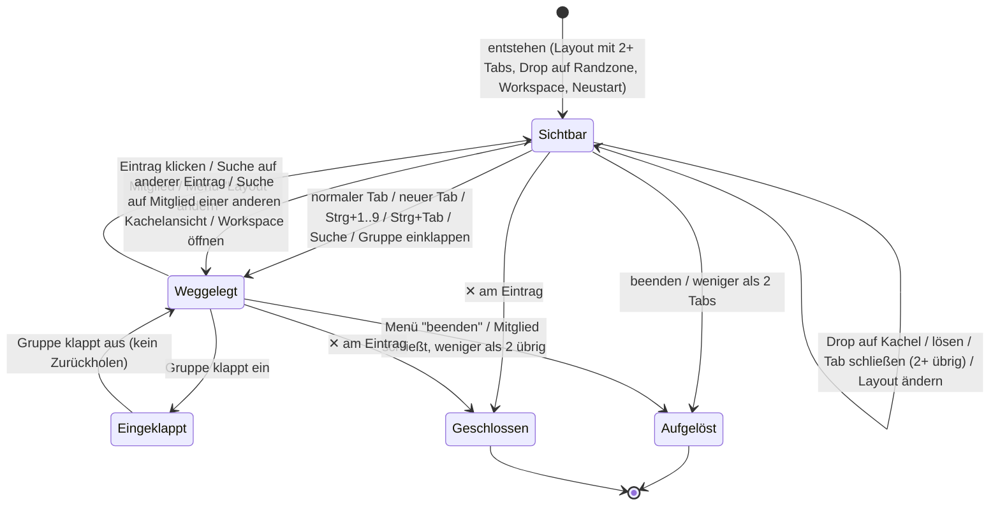
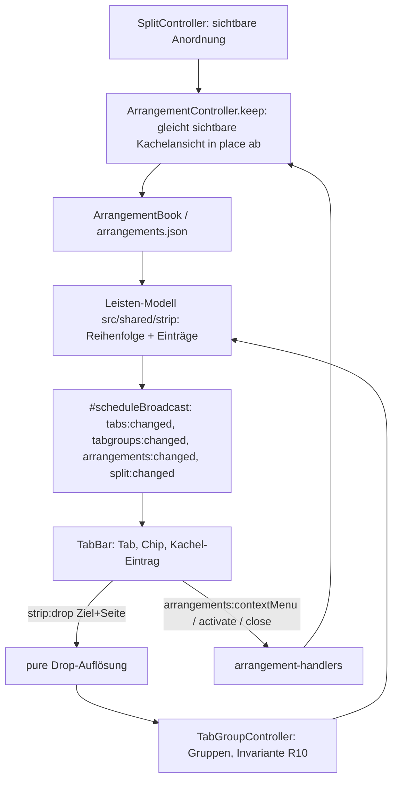
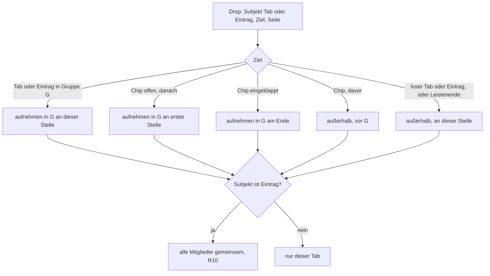

# Kachelansicht als ein Tab, Gruppen mit Drag & Drop - Plan

## Goal Capsule

- **Ziel:** Wer mehrere Seiten nebeneinander ansieht, sieht diese Kachelansicht in der Tab-Leiste als einen Eintrag. Man kann mehrere davon halten, wegklicken und zurückholen, ändern und beenden, und sie zusammen mit normalen Tabs in farbigen Gruppen ordnen. Keine Seite verschwindet dabei unbemerkt oder wechselt ungefragt in eine andere Kachelansicht oder Gruppe.
- **Mittel:** Die heute unsichtbare Aufnahme weggelegter Kachelansichten (`src/shared/arrangements/`) wird zur sichtbaren Entität mit stabiler Identität (KTD1). Leiste, Gruppen und Drag & Drop bauen auf einem puren Leisten-Modell auf (KTD6, KTD7).
- **Autorität:** Requirements vor Key Technical Decisions vor Implementation Units. Acceptance Examples illustrieren, sie ändern nichts. Wo dieser Plan dem Plan `docs/plans/2026-08-09-001-fix-tabgruppen-eigentum-plan.md` widerspricht, gilt dieser Plan, aber nur für die Punkte, die unter Key Decisions ausdrücklich als Umkehr benannt sind.
- **Abbruchbedingungen:** Anhalten und berichten, wenn:
  - eine Einheit Gruppenlogik in `ArrangementController.ts` oder `TileOccupancyController.ts` bräuchte (verboten durch `tests/architecture.test.ts`, Regel „ownership of tab groups"),
  - eine Zeilen-, Coverage- oder Mutationsgrenze nur durch Absenken hält,
  - das Ziehen aus der Kachel-Leiste in die Tab-Leiste sich nicht über `TabDragController` bauen lässt (dann bleibt U10 beim Knopf, siehe KTD14),
  - die Migration bestehender Aufnahmen Daten anderer Fenster verändern müsste, die nicht zum Upgrade gehören.
- **Ausführung:** `ce-work` arbeitet die Phasen A bis D nacheinander ab, auf einem eigenen Branch von `main`. Im Worktree liegt fremde, uncommittete Arbeit (`src/main/browser/view-contents.ts` u.a.); sie wird weder angefasst noch mitcommittet. Einheiten, die `BrowserWindowController.ts`, `window-seams.ts` oder `contract.ts` ändern, laufen nacheinander. Kein Agent startet die App (kein `pnpm dev`, kein `test:smoke`, kein Electron mit CDP), denn das löst MS Defender aus. Die Prüfung in der laufenden App übernimmt der Benutzer nach der Tabelle im Verification Contract. Commits ohne Selbstzuschreibung.
- **Offene Blocker:** keine.

---

## Product Contract

### Summary

Eine Kachelansicht erscheint in der Tab-Leiste als ein Eintrag mit allen Favicons und dem Titel der aktiven Kachel, ohne Kachelnummern.
Es kann mehrere Kachelansichten geben. Ein Klick auf einen normalen Tab legt die sichtbare weg, ein Klick auf ihren Eintrag holt sie zurück.
Rechtsklick auf den Eintrag oder die Layout-Option der Toolbar ändert oder beendet sie. Dabei fallen Startseiten-Kacheln weg, alle anderen Tabs werden normale Tabs.
Tabs und Kachel-Einträge lassen sich per Drag & Drop in Gruppen hinein- und herausziehen. Ein Kachel-Eintrag klappt mit seiner Gruppe ein.

### Problem Frame

Heute ist jeder Tab in einer Kachel ein eigener Tab in der Leiste, mit einer Nummer, die sagt, in welcher Kachel er sitzt (`src/renderer/src/components/TabBar.tsx`, `tab__tile`). Wer drei Streams nebeneinander schaut, hat drei Tabs mit „1", „2", „3" zwischen seinen anderen Tabs. Dass die drei zusammengehören, sieht man nicht, und die Nummern sagen dem Benutzer nichts, was er braucht.

Unter der Oberfläche gibt es die Zusammengehörigkeit schon. Legt man eine Kachelansicht weg, zeichnet `ArrangementController` sie auf, und ein Klick auf einen ihrer Tabs stellt sie wieder her. Diese Aufnahme ist aber absichtlich unsichtbar (Eigentums-Plan R5, KTD6) und darauf gebaut: Ihre ID wechselt bei jeder Änderung, eine Überschneidung mit einer neuen Aufnahme löscht die alte still, und bei 32 Aufnahmen verschwindet die älteste ohne Hinweis. Wird die Aufnahme sichtbar, werden diese stillen Verluste zu verschwundenen Einträgen.

Gruppen gibt es: mehrere, jede mit eigener Farbe, ein- und ausklappbar. Hinein kommt ein Tab aber nur über das Kontextmenü. Zieht man einen Tab zwischen Gruppenmitglieder, schiebt `contiguousOrder` ihn wieder hinaus. Dazu kommt ein Fehler im Ziehen: Die Leiste zählt nur gezeichnete Tabs, der Kern fügt aber in eine Reihenfolge ein, die eingeklappte Tabs enthält. Mit Kachel-Einträgen würde das noch schlimmer.

### Key Decisions

- **Der Kachel-Eintrag zeigt alle Favicons nebeneinander und den Titel der aktiven Kachel.** (session-settled: user-approved — chosen over geteilte Titel wie bei Opera und über Raster-Symbol mit Anzahl: kompakt und zeigt trotzdem, was drin ist) *Governs R1, R2.*
- **Beim Ändern und Beenden fällt jede Kachel weg, die gerade die Startseite zeigt, egal wer sie geöffnet hat.** (session-settled: user-approved — chosen over „nur automatisch eingefügte Startseiten": beide sehen gleich aus, die Regel ist so vorhersehbar) *Governs R7, R8.*
- **Mehrere Kachelansichten gleichzeitig, jede ein eigener Eintrag.** (session-settled: user-approved — chosen over „nur eine, die neue löst die alte auf": man verliert sonst ein Raster) *Governs R3, R4.*
- **Ein Kachel-Eintrag kann als Einheit in einer Gruppe liegen und klappt mit ihr ein.** (session-settled: user-directed — chosen over „erstmal nicht gruppierbar": der Benutzer will Kachelansichten wie Tabs in Themen sammeln) *Governs R10, R11.*
- **Das ✕ am Eintrag schließt alle Tabs darin, „Beenden" löst sie in normale Tabs auf.** (session-settled: user-approved — chosen over „✕ löst auf": wie bei Opera, und Beenden bleibt als eigener Weg) *Governs R5, R6.*
- **Ein neuer Tab während der Kachelansicht bekommt das ganze Fenster, die Kachelansicht bleibt als Eintrag.** (session-settled: user-approved — chosen over „neuer Tab löst die Kachelansicht auf") *Governs R3.*
- **Einen einzelnen Tab löst man an der Kachel selbst, der Eintrag in der Leiste klappt nicht auf.** (session-settled: user-approved — chosen over einen aufklappbaren Eintrag) *Governs R9.*
- **Einen normalen Tab auf eine Kachel zu ziehen fügt ihn dieser Kachelansicht hinzu, wie heute.** (session-settled: user-approved — chosen over eine eigene Aktion zum Hinzufügen) *Governs R9.*
- **Startseiten in einer Kachelansicht kommen beim Neustart mit zurück, das Raster bleibt exakt.** (session-settled: user-directed — chosen over „nicht wiederherstellen, Kachelansicht rückt zusammen": das Raster soll nach dem Neustart genau so aussehen wie vorher, der Renderer-Prozess pro Startseite wird in Kauf genommen) *Governs R15.*
- **Umkehr früherer Festlegungen aus `docs/plans/2026-08-09-001-fix-tabgruppen-eigentum-plan.md`.** R5 und KTD6 (Aufnahme unsichtbar, kein IPC) entfallen, weil der Eintrag sichtbar ist. R3 (kein automatischer Vorgang ändert Gruppen) wird ergänzt: Eine Benutzeraktion auf eine Kachelansicht oder eine ihrer Kacheln gilt als Gruppierungsakt für die ganze Kachelansicht. R9/AE10 (Einklappen gibt nur Mitgliedskacheln frei) wird durch R10 ersetzt. *Governs R10, R11, R12.*

### Requirements

**Kachel-Eintrag in der Leiste**

- R1. Tabs, die zu einer Kachelansicht gehören, erscheinen in der Tab-Leiste nicht einzeln, sondern als ein Eintrag. Eine Kachelnummer zeigt die Leiste nirgends mehr.
- R2. Der Eintrag zeigt die Favicons aller Tabs in Kachel-Reihenfolge und den Titel des Tabs der aktiven Kachel. Sein Tooltip und sein Name für Screenreader nennen alle Titel.
- R3. Ein Klick auf einen normalen Tab, ein neuer Tab, ein Tastenkürzel oder die Tab-Suche auf einen anderen Tab legt die sichtbare Kachelansicht weg. Ihr Eintrag bleibt stehen, mit Anordnung, aktiver Kachel und Teilerpositionen. Das gilt auch, wenn „Layout an Tabs anpassen" aus ist.
- R4. Ein Klick auf den Eintrag holt die Kachelansicht mit ihrer zuletzt aktiven Kachel zurück. Mehrere Kachelansichten bestehen nebeneinander, jeder Tab gehört zu höchstens einer.
- R5. Das ✕ am Eintrag schließt alle Tabs der Kachelansicht. Verweigert eine Seite das Schließen, werden die übrigen Tabs normale Tabs.
- R6. Ein Mitglied, das hörbar ist, macht den Eintrag hörbar. Der Lautsprecher am Eintrag schaltet alle Mitglieder stumm oder laut.

**Ändern und Beenden**

- R7. Rechtsklick auf den Eintrag öffnet ein Menü mit „Layout ändern ▸", „Kachelansicht beenden", den Gruppenaktionen und „Alle Tabs schließen". Die Layout-Option der Toolbar ändert oder beendet („Einzeln") die sichtbare Kachelansicht.
- R8. Beim Ändern auf weniger Kacheln und beim Beenden werden zuerst Startseiten-Kacheln geschlossen. Die übrigen Seiten rücken in die verbleibenden Kacheln nach, was keinen Platz findet, wird ein normaler Tab direkt hinter dem Eintrag. Bleiben weniger als zwei Tabs, löst sich die Kachelansicht in einen normalen Tab auf. Weglegen, Einklappen einer Gruppe und das Schließen eines einzelnen Tabs schließen keine Startseite.
- R9. Die Kachel-Leiste einer Kachel bietet „Aus Kachelansicht lösen". Der Tab wird ein normaler Tab hinter dem Eintrag, die Kachelansicht bleibt sichtbar und rückt zusammen. Einen normalen Tab auf eine Kachel zu ziehen fügt ihn der sichtbaren Kachelansicht hinzu, wie heute.

**Gruppen**

- R10. Alle Tabs einer Kachelansicht sind in derselben Gruppe oder in keiner. Jede Aktion, die einen Tab einer Kachelansicht in eine Gruppe nimmt oder herausnimmt, wirkt auf die ganze Kachelansicht.
- R11. Einklappen einer Gruppe legt eine sichtbare Kachelansicht darin weg, ändert sie aber nicht. Ausklappen holt nichts von selbst zurück. Der Chip einer eingeklappten Gruppe zählt eine Kachelansicht als einen Eintrag.
- R12. Tabs und Kachel-Einträge lassen sich per Drag & Drop in eine Gruppe hinein-, aus ihr heraus- und innerhalb der Leiste umsortieren. Ein Drop zwischen Gruppenmitglieder oder auf einen eingeklappten Chip nimmt in die Gruppe auf, ein Drop außerhalb ihres Laufs nimmt heraus. Ein Tab, der auf eine Kachel gezogen wird, übernimmt die Gruppenlage dieser Kachelansicht.

**Tastatur und Suche**

- R13. Strg+1…9 und Strg+Tab zählen einen Kachel-Eintrag als eine Position.
- R14. Die Tab-Suche listet weiter jeden Tab. Wer ein Mitglied einer weggelegten Kachelansicht wählt, holt sie zurück, mit diesem Tab in der aktiven Kachel.

**Beständigkeit**

- R15. Kachelansichten überstehen einen Neustart mit Identität, Anordnung, aktiver Kachel und Teilerpositionen, ohne doppelten Eintrag, und mit ihren Startseiten-Kacheln. Private Fenster halten sie nur im Speicher.
- R16. Keine Kachelansicht verschwindet still: Es gibt keine Verdrängung einer sichtbaren Kachelansicht, und automatische Vorgänge ziehen nie einen Tab aus einer anderen Kachelansicht oder Gruppe in eine Kachel.

### Acceptance Examples

- AE1. **Covers R3, R4.** **Given** Kachelansicht A mit YouTube | Twitch ist sichtbar, **when** der Benutzer den normalen Tab „Mail" anklickt, **then** zeigt das Fenster nur Mail, A steht als Eintrag in der Leiste, und ein Klick darauf zeigt wieder YouTube | Twitch mit Twitch aktiv, wenn Twitch vorher aktiv war.
- AE2. **Covers R8.** **Given** eine 2x2-Kachelansicht mit Startseite, YouTube, Startseite, Twitch, **when** der Benutzer „Layout ändern ▸ 2 Spalten" wählt, **then** schließen beide Startseiten, YouTube und Twitch stehen nebeneinander, kein Tab wird zum normalen Tab.
- AE3. **Covers R8.** **Given** eine 1x3-Kachelansicht mit YouTube, Startseite, Twitch, **when** der Benutzer „Kachelansicht beenden" wählt, **then** schließt die Startseite, YouTube und Twitch stehen als normale Tabs an der Stelle des Eintrags, der Tab der aktiven Kachel ist aktiv.
- AE4. **Covers R8.** **Given** eine Kachelansicht mit einer Startseite in Kachel 2, **when** der Benutzer einen normalen Tab anklickt, **then** bleibt die Startseite Mitglied der weggelegten Kachelansicht.
- AE5. **Covers R10, R12.** **Given** Kachelansicht A liegt in Gruppe „Sport" (grün), **when** der Benutzer einen losen Tab auf eine Kachel von A zieht, **then** ist dieser Tab Mitglied von A und von „Sport".
- AE6. **Covers R10, R11.** **Given** die sichtbare Kachelansicht A liegt in „Sport", **when** der Benutzer „Sport" einklappt, **then** ist A weggelegt und unverändert, das Fenster zeigt den ersten sichtbaren Tab, und der Chip zählt A als 1.
- AE7. **Covers R16.** **Given** Kachelansicht B ist weggelegt und A ist sichtbar, **when** in A ein Tab geschlossen wird, **then** rückt A zusammen, und kein Mitglied von B wird in A gezogen.
- AE8. **Covers R5.** **Given** Kachelansicht A mit drei Tabs, einer davon mit ungespeichertem Formular, **when** der Benutzer ✕ am Eintrag drückt und beim Formular „Bleiben" wählt, **then** sind zwei Tabs geschlossen und der Formular-Tab ist ein normaler Tab.

### Scope Boundaries

- Keine neuen Layouts, keine Änderung an Teilerlogik, Kachel-Vollbild oder Maximieren außer dem, was R3 und KTD11 fürs Weglegen verlangen.
- Die Kachelköpfe (`TileHeaders.tsx`) bleiben nicht interaktiv.
- Gruppen-Chips werden nicht ziehbar. Ganze Gruppen verschiebt man weiter über ihre Mitglieder.
- Ein Kachel-Eintrag lässt sich nicht auf die sichtbare Kachelansicht ziehen, um zwei Kachelansichten zu verschmelzen. Beim Ziehen eines Eintrags gibt es keine Drop-Zonen über den Kacheln.
- Strg+Umschalt+T bringt geschlossene Tabs weiter einzeln als normale Tabs zurück, nicht eine ganze Kachelansicht.
- Anheften von Tabs: Ein angehefteter Tab in einer Kachelansicht behält sein Flag, der Eintrag selbst wird nicht angeheftet dargestellt.

#### Deferred to Follow-Up Work

- Gruppen-Chips ziehen, um eine ganze Gruppe zu verschieben.
- Strg+Umschalt+T für eine ganze Kachelansicht.
- Kacheln innerhalb einer Kachelansicht durch Ziehen der Kachel-Leiste tauschen, falls U10 das Ziehen nur in Richtung Tab-Leiste umsetzt.

### Sources / Research

- Aufnahme-Lebenszyklus: `src/shared/arrangements/model.ts` (`recordArrangement` ersetzt bei Überschneidung, `MAX_ARRANGEMENTS`, `isUnobstructed`), `src/main/data/ArrangementStore.ts` (neue ID pro `record`), `src/main/browser/ArrangementController.ts` (`keep`, `restoreFor`, `endTiling`), Aufruf in `BrowserWindowController.#scheduleBroadcast`.
- Belegung: `src/main/browser/TileOccupancyController.ts` (`claimTileForNewTab`, `afterLayoutChange`, `afterTabClosed`, `#firstHiddenTab`, `#rehomeHiddenTabs`, `applyDrop`), `src/shared/split/tile-fill.ts` (`tabsToCloseOnShrink`), `src/shared/url/omnibox.ts` (`isHomeUrl` ist auch für `''` und `about:blank` wahr).
- Gruppen: `src/shared/tabgroups/model.ts` (`contiguousOrder`, `addTabToGroup` mit Index), `src/shared/tabgroups/strip.ts` (`stripItems`), `src/main/browser/TabGroupController.ts` (`setCollapsed`), `src/main/ipc/tabgroup-handlers.ts` als Muster für neue Handler.
- Ziehen: `src/renderer/src/useTabDrag.ts` (`stripIndexAt` zählt nur gezeichnete Tabs), `BrowserWindowController.moveTab`, `src/main/browser/TabDragController.ts`, `src/shared/split/dropzones.ts`.
- Workspaces greifen offene Tabs mit gleicher Adresse ab: `src/shared/workspaces/model.ts` (`planOpening`).
- Wiederherstellung: `src/main/session-restore/apply.ts`, `src/shared/session/restore.ts` (`withFirstTileFilled`).
- Architektur-Grenzen: `tests/architecture.test.ts` (Regel „ownership of tab groups"; zod nur in `schema.ts`; Handler über den Router; Fenster aus dem Absender; keine Literale in Komponenten).
- Frühere Festlegungen: `docs/plans/2026-08-09-001-fix-tabgruppen-eigentum-plan.md` (R3, R5, R9, KTD1, KTD6).

---

## Planning Contract

### Key Technical Decisions

- KTD1. **Die Aufnahme (`Arrangement`) bleibt der Träger und wird eine Entität mit stabiler ID.** Die ID wird einmal beim Entstehen vergeben und bei jeder Änderung behalten, der Datensatz bekommt `activeTile`, `fractions` und die Stummschaltung pro Kachel dazu. Verworfen: eine neue, zweite Entität neben der Aufnahme (zwei Wahrheiten für dieselben Tabs) und eine aus den Mitgliedern abgeleitete ID (ändert sich, sobald das erste Mitglied geht). Kein Bake-off: Die Alternativen sind schon konkret genug für eine Abwägung, und die Aufnahme hat bereits die richtige Mitgliedschaft, Speicherung und Fenster-Zuordnung. Das Code-Wort bleibt `Arrangement`, das Wort in der Oberfläche ist „Kachelansicht". *Governs R4, R15.*
- KTD2. **Mitgliedschaft ändert sich nur durch benannte Operationen.** Diese Operationen sind: entstehen, Tab hinzufügen (Drop), lösen, Tab schließen, Layout ändern, beenden und alle schließen. `keep()` im Broadcast gleicht nur die sichtbare Kachelansicht mit dem `SplitController` ab, in place und unter ihrer ID. Das Ersetzen bei Überschneidung (`isSupersededBy`) entfällt. Grund: Mit sichtbaren Einträgen muss jede Änderung einen Urheber haben, den der Benutzer kennt. *Governs R4, R16.*
- KTD3. **Die sichtbare Kachelansicht steht mit ihrer ID im Session-Slot, und ein geschlossenes Fenster vergisst seine Kachelansichten nach derselben Regel wie seinen Session-Slot.** Beim Neustart gleicht `applySessionRestore` beide Quellen vor dem ersten Broadcast ab, so gibt es keinen doppelten Eintrag. Trägt der Slot keine ID (Sessions älterer Builds), übernimmt der Abgleich die Aufnahme, deren Sitze dem wiederhergestellten Raster gleichen, und verwirft jede andere, die einen Tab mit ihm teilt. Ist `splitView.restoreLayoutOnStart` aus, kommt die Kachelansicht weggelegt zurück, und `withFirstTileFilled` nimmt einen Tab, der zu keiner Kachelansicht gehört. Die Kachelansichten eines Fensters werden nur vergessen, wenn danach noch ein anderes normales Fenster offen ist, wie `forgetWindow` in `src/shared/session/model.ts` es für Session-Slots hält. Schließt das letzte Fenster, bleiben sie für den Neustart erhalten. `MAX_ARRANGEMENTS` entfällt: `record` verdrängt nie, und `retainTabs` begrenzt die Zahl beim Start auf Aufnahmen, deren Tabs zurückgekommen sind. *Governs R15, R16.*
- KTD4. **Gruppen bleiben Mengen von Tab-IDs, die Invariante aus R10 setzt der Gruppen-Teil durch.** `TabGroupController` erweitert jede Aufnahme oder Herausnahme eines Kachel-Mitglieds auf die ganze Kachelansicht, und `window-seams.ts` wendet beim Drop auf eine Kachel die Gruppenlage an. `ArrangementController` und `TileOccupancyController` bleiben gruppenfrei. Die Belegung fragt nur, ob ein Tab Mitglied irgendeiner Kachelansicht ist (`isArrangementMember(tabId)`). Die Antwort kommt aus dem Buch der Aufnahmen und enthält nichts über Gruppen, neben dem vorhandenen `isHiddenByCollapse`. Verworfen: eine eigene ID-Art für Kachel-Einträge in `group.tabIds`. Sie bricht `retainTabs`, `isTabHidden` und das Schema und erbte die frühere ID-Instabilität. *Governs R10, R11, R12, R16.*
- KTD5. **Ein neues Ereignis `arrangements:changed` trägt die Kachelansichten des Fensters in die Chrome UI.** Die Nutzlast enthält pro Kachelansicht ID, Mitglieder in Kachel-Reihenfolge, Layout, aktive Kachel und ob sie sichtbar ist. Sie wird im selben Broadcast nach `keep()` gesendet und aus dem Schnappschuss dieses Durchlaufs gebaut, so plant kein Schreiben einen weiteren Durchlauf. Das Schema liegt in `src/shared/arrangements/schema.ts`, `contract.ts` bekommt nur die eine Ereigniszeile. Verworfen: ein Feld an `tabs:changed`. Das würde `TabState` für jeden Verbraucher aufblähen, und die Leiste braucht die Zusammenfassung pro Kachelansicht, nicht pro Tab. *Governs R1, R2.*
- KTD6. **Ein pures Leisten-Modell in `src/shared/strip/` legt Reihenfolge und Einträge aus Tabs, Gruppen und Kachelansichten fest.** Die Mitglieder einer Kachelansicht bilden einen zusammenhängenden Lauf an der Stelle ihres ersten Mitglieds, verschachtelt in den Lauf ihrer Gruppe. `stripItems` bekommt die Art `split`, und Strg+1…9, Strg+Tab und der Chip-Zähler lesen dieselben Einträge. Der Satz „Tab strip order is independent of Tile assignment" in `CONCEPTS.md` wird dafür angepasst. Das Modul importiert die puren Modelle von Gruppen und Aufnahmen, keine Schemas. *Governs R1, R11, R13.*
- KTD7. **Ein Drop in der Leiste wird als Ziel plus Seite gemeldet und im Kern aufgelöst.** Das Ziel ist ein Tab, ein Chip, ein Eintrag oder das Leistenende, die Seite ist davor oder danach. Eine pure Funktion im Leisten-Modell liefert daraus die neue Reihenfolge und die Gruppenänderung. `TabGroupController` wendet sie an, der neue Kanal `strip:drop` ersetzt `tabs:move` in der Leiste. Damit ist auch der heutige Fehler mit den Index-Räumen behoben. Aufnahmeregel: Ziel innerhalb einer Gruppe bedeutet aufnehmen. Hinter dem Chip einer offenen Gruppe heißt erste Position. Auf einen eingeklappten Chip heißt ans Ende. Vor einem Chip oder am Leistenende heißt außerhalb. *Governs R12.*
- KTD8. **Das Schließen von Startseiten ist eine eigene Option des Layoutwechsels, nur für Ändern und Beenden.** `LayoutChangeOptions` bekommt ein Pflichtfeld `closeStartPages`, `true` nur aus `chooseLayout` und dem Menü des Eintrags. Das Prädikat `isStartPageTile` ist pur in `src/shared/split/`: die bestätigte URL ist eine Startseite, es lädt nichts, und es wartet keine Eingabe. So wird eine Kachel, deren erste Navigation noch läuft, nicht geschlossen. Reihenfolge beim Verkleinern: Startseiten schließen, dann nachrücken lassen, dann das kleinste passende Layout. *Governs R8.*
- KTD9. **R3 gilt unabhängig von `splitView.adaptLayoutToTabs`.** `claimTileForNewTab` legt die sichtbare Kachelansicht immer weg. Der Schalter regelt nur noch das Füllen neuer Kacheln mit Startseiten und das Zusammenrücken nach dem Schließen. *Governs R3.*
- KTD10. **Kein automatisches Nachziehen mehr in eine Kachelansicht.** Wird in der sichtbaren Kachelansicht (Layout mit 2+ Kacheln) ein Tab geschlossen, rückt sie zusammen (Schalter an) oder behält eine leere Kachel (Schalter aus). Schließt der einzige sichtbare Tab eines `1x1`-Fensters, zeigt das Fenster den ersten Tab, der weder eingeklappt noch Mitglied einer Kachelansicht ist. Gibt es keinen, holt es die erste Kachelansicht in Leistenreihenfolge zurück. So steht nie ein einzelnes Mitglied allein auf dem Bildschirm. Wächst das Layout, füllen Startseiten die neuen Kacheln (Schalter an) oder sie bleiben leer. `#rehomeHiddenTabs` und das Nachziehen in `afterTabClosed` entfallen. `planOpening` der Workspaces übergeht Mitglieder anderer Kachelansichten. Grund: Mit sichtbaren Einträgen wäre jedes Nachziehen ein Tab, der ungefragt aus der Leiste verschwindet (R16). *Governs R16.*
- KTD11. **Die Ansicht pro Kachelansicht umfasst Teiler, aktive Kachel und Stummschaltung pro Kachel. Maximieren und Kachel-Vollbild enden beim Weglegen.** Beim Weglegen wird die Seite im Kachel-Vollbild aufgefordert, das Vollbild zu verlassen, nicht nur ihr Index gelöscht. Der Lautsprecher am Eintrag schreibt dieselbe Stummschaltung pro Kachel: bei der sichtbaren Kachelansicht über `TileAudioController.setMutedByUser` für jede Kachel, bei einer weggelegten in ihr gespeichertes `tileAudio` und direkt auf die Mitglieds-Tabs. So hebt weder das nächste `apply()` noch ein `restore` ihn wieder auf. Der Eintrag zeigt „stumm", wenn alle hörbaren Mitglieder stumm sind. Sonst zeigt er „laut", und ein Klick schaltet alle stumm. *Governs R3, R4, R6.*
- KTD12. **Das Menü des Eintrags ist nativ, wie `tab-context-items.ts`.** Die Vorlage liegt pur in `src/main/menu/arrangement-items.ts`, die Beschriftungen stehen in `menu-text.{en,de}.ts`, und der Handler steht in `src/main/ipc/arrangement-handlers.ts` nach dem Muster von `tabgroup-handlers.ts`. „Layout ändern" auf einer weggelegten Kachelansicht holt sie zuerst zurück, denn ein Layout lässt sich nur auf dem Bildschirm ändern. „Beenden" auf einer weggelegten Kachelansicht läuft dagegen abseits des Bildschirms: `planShrink` mit Ziel `1x1` über ihre gespeicherten Sitze, Startseiten schließen, Aufnahme vergessen, die übrigen Tabs stehen in Kachel-Reihenfolge an der Stelle des Eintrags. Die sichtbare Kachelansicht und der aktive Tab bleiben unverändert. Das App-Menü bekommt „Kachelansicht beenden". *Governs R7, R8.*
- KTD13. **„Alle schließen" löst die Kachelansicht zuerst auf und schließt dann.** Sie wird weggelegt und per ID vergessen, bevor die erste Schließanfrage läuft. Danach gehen alle früheren Mitglieder als normale Tabs durch `CloseContract`. Grund: `CloseContract` ruft vor einer „Seite verlassen?"-Frage `activateTab` für den fragenden Tab (`unload-guard.ts`), und das würde eine noch bestehende Kachelansicht über `restoreFor` wieder auf den Bildschirm holen. Überlebende sind so schon normale Tabs (R5). *Governs R5.*
- KTD14. **Lösen kommt zuerst als Knopf in der Kachel-Leiste, Ziehen in die Leiste als zweiter Schritt.** Ob ein Ziehen, das auf der Overlay Surface beginnt, über der Chrome UI ankommt, ist in dieser App nicht belegt. Der Knopf erfüllt R9 allein. Das Ziehen baut auf `TabDragController` auf und gilt erst nach der Prüfung durch den Benutzer als fertig. *Governs R9.*
- KTD15. **Bestehende Aufnahmen werden in zwei Schritten übernommen.** (1) Die `StoreMigration` von Version 1 auf 2 ergänzt nur `activeTile` 0, Standard-Teiler und Standard-`tileAudio`. Sie läuft beim Laden der Datei, wo es noch keine Tabs und Gruppen gibt (`src/main/data/store-load.ts`). (2) Ein purer Abgleich in `src/shared/arrangements/model.ts` läuft bei jedem Start in `applySessionRestore` direkt nach `retainTabs`. Er bekommt die Mitglieder jeder Gruppe als Tab-ID-Mengen und verwirft jede Aufnahme, deren Mitglieder über eine Gruppengrenze reichen. Teilen zwei Aufnahmen einen Tab, bleibt nur die neueste nach `recordedAt`. Aufnahmen in einer eingeklappten Gruppe bleiben. Der Abgleich ist idempotent. *Governs R4, R10, R15.*

### High-Level Technical Design

**Lebenszyklus einer Kachelansicht**

Nur die Übergänge Sichtbar → Sichtbar, → Aufgelöst und → Geschlossen schreiben Mitgliedschaft (KTD2). Weglegen und Einklappen schreiben nur den Ansichtszustand (KTD11).

**Datenfluss in die Leiste**

**Auflösung eines Drops in der Leiste (KTD7)**

### System-Wide Impact

- **Gespeicherte Daten:** `arrangements.json` bekommt neue Felder und eine Migration (KTD15), der Session-Slot die ID der sichtbaren Kachelansicht (KTD3). Beide Schemas heilen fehlende Werte, ein älterer Build liest neue Dateien ohne Absturz.
- **IPC:** neu sind `arrangements:changed` (Ereignis), `arrangements:activate`, `arrangements:close`, `arrangements:contextMenu`, `arrangements:setMuted`, `strip:drop` und `split:releaseTab`. Alle stehen nur der Chrome UI offen und stehen auf keiner Allowlist einer Internal Page. `tabs:move` verliert seinen Aufrufer in der Leiste und wird entfernt, falls sonst niemand ihn ruft.
- **Workspaces und Wiederherstellung:** `planOpening` und `withFirstTileFilled` achten auf Kachel-Mitgliedschaft (KTD3, KTD10).
- **Barrierefreiheit:** Der Eintrag ist ein `role="tab"` mit vollem Namen. `aria-selected` hängt am Eintrag, wenn der aktive Tab ein Mitglied ist.
- **Doku:** `CONCEPTS.md` („Tab strip order is independent…", „Shrinking a Layout never closes a Tab"), `docs/STATUS.md`, `docs/QA.md` 5.1 (Kachelnummer vorgelesen) werden angepasst.

### Risks

| Risiko | Gegenmaßnahme |
|---|---|
| Ein vergessener automatischer Pfad ändert weiter Mitgliedschaft | U3 geht die Liste aller Schreiber von Kachel-Belegung und `group.tabIds` einzeln durch. Jeder bekommt einen Test gegen den echten `SplitController` und `TileOccupancyController`. |
| `BrowserWindowController.ts` (1404 Zeilen) wächst weiter über die 780er-Grenze | Neue Logik geht in Controller und pure Module, die Fenster-Klasse bekommt nur Aufrufstellen. |
| Das Ziehen aus der Kachel-Leiste funktioniert fensterübergreifend nicht | KTD14: Der Knopf ist die fertige Lösung, das Ziehen bleibt ein zweiter Schritt mit Benutzerprüfung. |
| Auf Windows zieht ein Drag über der Drag-Region das Fenster statt des Eintrags | Der Eintrag bekommt `no-drag` wie Tabs. Der Benutzer prüft das in der App. |
| Der Abgleich beim Start verwirft Aufnahmen, die jemand vermisst | Aufnahmen waren bisher unsichtbar. Der Abgleich (KTD15) verwirft nur Aufnahmen über eine Gruppengrenze hinweg und ältere Doppelte. Aufnahmen in eingeklappten Gruppen bleiben. |

---

## Implementation Units

### Unit Index

| U-ID | Titel | Wichtigste Dateien | Hängt ab von |
|---|---|---|---|
| U1 | Kachelansicht als Entität | `src/shared/arrangements/model.ts`, `schema.ts`, `src/main/data/ArrangementStore.ts` | – |
| U2 | Sichtbare Kachelansicht im Fenster | `ArrangementController.ts`, `window-seams.ts`, `session-restore/apply.ts`, `WindowRegistry.ts` | U1 |
| U3 | Automatische Pfade entschärfen | `TileOccupancyController.ts`, `window-seams.ts`, `workspaces/model.ts` | U2 |
| U4 | Startseiten beim Ändern und Beenden | `src/shared/split/tile-fill.ts`, `TileOccupancyController.ts` | U3 |
| U5 | Leisten-Modell | `src/shared/strip/*`, `tab-strip-position.ts`, `tabgroups/strip.ts` | U2 |
| U6 | IPC und Menü des Eintrags | `arrangement-handlers.ts`, `arrangement-items.ts`, `menu-text.*`, `appMenu.ts` | U4, U5 |
| U7 | Kachel-Eintrag in der Leiste | `TabBar.tsx`, `useBrowserState.ts`, `App.tsx`, Kataloge, `TileAudioController.ts` | U6 |
| U8 | Gruppen-Invariante | `TabGroupController.ts`, `window-seams.ts`, `tab-context-items.ts` | U5 |
| U9 | Drag & Drop in der Leiste | `src/shared/strip/drop.ts`, `useTabDrag.ts`, neuer Handler | U7, U8 |
| U10 | Tab aus Kachelansicht lösen | `TileBarSurface.tsx`, `tile-bar.ts`, `TileInputController.ts` | U3 |
| U11 | Doku und BDD | `CONCEPTS.md`, `docs/STATUS.md`, `docs/QA.md`, `tests/features/*` | U1–U10 |

Zeitschätzung für die Ausführung durch einen Agenten, ohne Wartezeit auf die Benutzerprüfung:

| Phase | Einheiten | Schätzung |
|---|---|---|
| A — Fundament | U1–U4 | etwa 11 Stunden |
| B — Leiste | U5–U7 | etwa 9 Stunden |
| C — Gruppen | U8–U9 | etwa 7 Stunden |
| D — Lösen und Abschluss | U10–U11 | etwa 4 Stunden |
| Gesamt | | etwa 31 Stunden, also 4 Arbeitstage |

Die Phasen A bis C werden zusammen gemergt, nur Phase D lässt sich getrennt mergen. Ohne U8 entstünden Kachelansichten mit Mitgliedern in zwei Gruppen. Ohne U9 würde die Leiste weiter über `tabs:move` mit einem Index umsortieren, der nur gezeichnete Einträge zählt.

### Phase A — Fundament

### U1. Kachelansicht als Entität

- **Goal:** Eine Aufnahme hat eine stabile ID, Ansichtszustand und benannte Operationen statt Ersetzen bei Überschneidung.
- **Requirements:** R4, R15, R16; KTD1, KTD2, KTD3, KTD15.
- **Dependencies:** keine.
- **Files:** `src/shared/arrangements/model.ts`, `src/shared/arrangements/schema.ts`, `src/main/data/ArrangementStore.ts`, `tests/arrangements-model.test.ts`, `tests/arrangement-store.test.ts`.
- **Approach:**
  1. `Arrangement` bekommt `activeTile`, `fractions` und `tileAudio`, im Schema optional mit `.catch()`-Heilung.
  2. Pure Operationen: `createArrangement`, `updateArrangement(id, …)` (behält ID), `removeTabFromArrangements` (Sitz wird `null`, unter `MIN_ARRANGED_TILES` fällt die Aufnahme weg), `forgetArrangement`, `forgetArrangementsOfTabs`.
  3. `recordArrangement` ersetzt nicht mehr bei Überschneidung und verdrängt nie. `MAX_ARRANGEMENTS` und `oldestEvictable` entfallen, auch in `repairArrangements` (KTD3).
  4. `ArrangementBook` bekommt `create`, `update`, `removeTab`, `forgetTabs`. Die ID vergibt der Store wie bisher, aber nur in `create`.
  5. `StoreMigration` auf Version 2 ergänzt nur die neuen Felder (KTD15, Schritt 1).
  6. Purer Abgleich `reconcileArrangements(arrangements, memberSets)` für KTD15 Schritt 2. Er bekommt Mengen von Tab-IDs, ohne Gruppenbegriff im Modell. Aufgerufen wird er in U2.
- **Patterns to follow:** `TAB_GROUP_MIGRATIONS` in `src/main/data/TabGroupStore.ts`; `z.looseObject` mit Heilung in `src/shared/arrangements/schema.ts`; `SameShape`-Zusicherungen in beide Richtungen.
- **Test scenarios:**
  - `updateArrangement` mit geändertem Layout und Sitzen behält die ID und setzt `activeTile`.
  - `createArrangement` für Tabs, die schon in einer anderen Aufnahme sitzen, lehnt ab und ändert nichts.
  - `removeTabFromArrangements` auf einer Aufnahme mit drei Sitzen macht den Sitz `null` und behält die Aufnahme.
  - `removeTabFromArrangements` auf einer Aufnahme mit zwei Sitzen entfernt die Aufnahme.
  - 40 Aufnahmen eines Fensters: `record` verdrängt keine, und alle 40 überstehen Speichern und Laden.
  - Eine gespeicherte Aufnahme der Version 1 ohne `activeTile` und `fractions` lädt als Version 2 mit `activeTile` 0 und Standard-Teilern, mit derselben ID.
  - Abgleich: Eine Aufnahme, deren Tabs über eine Gruppengrenze reichen, fällt weg.
  - Abgleich: Von zwei Aufnahmen mit gemeinsamem Tab bleibt die neuere.
  - Abgleich: Eine Aufnahme ganz in einer eingeklappten Gruppe bleibt. Ein zweiter Lauf ändert nichts mehr.
  - Ein private-mode Buch schreibt nichts auf die Platte.
- **Verification:** Modell und Store sind zu 100 % abgedeckt, und kein Test verlässt sich mehr auf ein Ersetzen bei Überschneidung.

### U2. Sichtbare Kachelansicht im Fenster

- **Goal:** Das Fenster kennt die ID seiner sichtbaren Kachelansicht, gleicht sie in place ab, veröffentlicht alle Kachelansichten und hält sie über Schließen, Fensterschluss und Neustart konsistent.
- **Requirements:** R3, R4, R15, R16; KTD2, KTD3, KTD5, KTD11.
- **Dependencies:** U1.
- **Files:** `src/main/browser/ArrangementController.ts`, `src/main/browser/SplitController.ts`, `src/main/browser/window-seams.ts`, `src/main/browser/BrowserWindowController.ts` (nur Aufrufstellen), `src/main/browser/WindowRegistry.ts`, `src/main/session-restore/apply.ts`, `src/shared/session/restore.ts` (Startseiten in Kachelansichten), `src/shared/arrangements/schema.ts`, `src/shared/ipc/channels.ts`, `src/shared/ipc/contract.ts` (eine Ereigniszeile), Tests: `tests/arrangement-controller.test.ts`, `tests/window-seams-arrangements.test.ts`, `tests/session-restore.test.ts`, `tests/split-controller.test.ts`.
- **Approach:**
  1. `ArrangementController` hält `liveId`. Ist `liveId` leer und sitzen alle sichtbaren Tabs in genau einer vorhandenen Aufnahme, übernimmt `keep()` diese als `liveId`. Sonst legt `keep()` beim Übergang auf 2+ Tabs an (`create`). Danach gleicht es per `update(liveId)` ab und setzt `liveId` auf `null`, wenn weniger als 2 Tabs sichtbar bleiben.
  2. `putAway()` schreibt den Ansichtszustand (KTD11), beendet das Maximieren, fordert eine Seite im Kachel-Vollbild zum Verlassen auf, fällt auf `1x1` zurück ohne etwas zu schließen und setzt `liveId` auf `null`.
  3. `restore(id)` und `restoreFor(tabId)` rufen zuerst `putAway()`, wenn eine andere Kachelansicht sichtbar ist. Erst danach wenden sie Layout, Sitze, aktive Kachel, Teiler und Stummschaltung an und setzen `liveId`. Das Öffnen eines Workspace ruft ebenso zuerst `putAway()`. `restoreFor(tabId)` bleibt für Suche und Tastatur, mit dem gesuchten Tab aktiv (R14).
  4. `SplitController` bekommt eine Methode, die Teiler und Kachel-Audio für eine Wiederherstellung setzt.
  5. `#finishClose` meldet das Schließen an `ArrangementController.tabClosed`, das `removeTab` im Buch aufruft.
  6. `WindowRegistry` ruft beim Schließen eines Fensters `forgetTabs` mit den Tabs des Fensters auf, aber nur, wenn danach noch ein anderes normales Fenster offen ist (KTD3, wie `forgetWindow`).
  7. Der Session-Slot bekommt die `liveId`. `applySessionRestore` gleicht vor dem ersten Broadcast ab, auch für Slots ohne `liveId` (KTD3), und ruft direkt nach `retainTabs` den Abgleich aus U1 mit den Gruppen als Tab-ID-Mengen auf (KTD15).
  8. `arrangements:changed` wird im Broadcast nach `keep()` aus demselben Schnappschuss gesendet (KTD5).
  9. Die Wiederherstellung (`src/shared/session/restore.ts`) verwirft Startseiten-Tabs weiter, außer sie sitzen in einer Kachelansicht (R15). Diese kommen mit ihrer ID zurück, damit `retainTabs` ihre Sitze behält.
- **Patterns to follow:** die bestehenden `keep()`-Gates gegen Schreibschleifen in `ArrangementController`; `tabgroups:changed` für ein Ereignis mit Schema aus dem Feature-Ordner; `bookFor(mode)`.
- **Test scenarios:**
  - Covers AE1. Sichtbar mit A | B, `putAway`, dann `restore(id)`: Layout, Sitze, aktive Kachel B und Teiler sind wie vorher, die ID ist gleich.
  - Zwei Kachelansichten nacheinander weggelegt: Beide bleiben mit eigener ID, keine ersetzt die andere.
  - A (2x2 mit Startseite) ist sichtbar, B (2x2 mit einem leeren Sitz) ist weggelegt, der Benutzer holt B: A behält ID, Sitze, Startseite, aktive Kachel und Teiler, B ist unter eigener ID sichtbar und enthält keinen Tab von A.
  - A ist sichtbar, ein Workspace öffnet: A steht unverändert als weggelegter Eintrag.
  - Neustart mit einem Slot ohne `liveId` und einer Aufnahme, die dem sichtbaren Raster gleicht: genau ein Eintrag, sichtbar, mit der ID dieser Aufnahme.
  - Ein Tab in die sichtbare Kachelansicht gezogen: `keep()` aktualisiert unter derselben ID.
  - Ein Mitglied einer weggelegten Kachelansicht mit drei Tabs schließt: Der Sitz wird leer, der Eintrag bleibt wiederherstellbar.
  - Ein Mitglied einer weggelegten Kachelansicht mit zwei Tabs schließt: Die Kachelansicht verschwindet, der übrige Tab ist normal.
  - Stummschaltung von Kachel 2 in A, Wechsel zu B: B hat seine eigene Stummschaltung, A behält seine beim Zurückholen.
  - Eine Seite im Kachel-Vollbild wird beim Weglegen aufgefordert, das Vollbild zu verlassen.
  - Neustart mit sichtbarer Kachelansicht: genau ein Eintrag, dieselbe ID, sichtbar.
  - Neustart mit `restoreLayoutOnStart` aus: Die Kachelansicht ist weggelegt, das Fenster zeigt einen Tab außerhalb jeder Kachelansicht.
  - Ein Fenster schließt, ein anderes bleibt offen: Seine Kachelansichten sind aus dem Buch entfernt, die des anderen Fensters bleiben.
  - Das letzte Fenster schließt (noch kein `before-quit`), die App startet neu: Alle Kachelansichten dieses Fensters sind wieder da.
  - Neustart mit einer weggelegten Kachelansicht aus einer Seite und einer Startseite: Beide Tabs kommen zurück, die Kachelansicht hat zwei Sitze.
  - Neustart mit einem losen Startseiten-Tab außerhalb jeder Kachelansicht: Er wird wie heute verworfen.
  - `arrangements:changed` erscheint einmal pro Broadcast, und `keep()` löst keinen zweiten Durchlauf aus.
- **Verification:** Die Wiring-Tests laufen gegen echte Stores. `BrowserWindowController.ts` wächst nur um Aufrufstellen.

### U3. Automatische Pfade entschärfen

- **Goal:** Kein automatischer Vorgang zieht einen Tab ungefragt in eine Kachelansicht oder aus ihr heraus.
- **Requirements:** R3, R16; KTD4, KTD9, KTD10.
- **Dependencies:** U2.
- **Files:** `src/main/browser/TileOccupancyController.ts`, `src/main/browser/window-seams.ts`, `src/shared/workspaces/model.ts`, `src/main/ipc/workspace-handlers.ts`, `src/main/browser/TabGroupController.ts` (Einklappen), Tests: `tests/tile-occupancy-controller.test.ts`, `tests/window-seams.test.ts`, `tests/workspaces-model.test.ts` (oder die vorhandene Workspace-Testdatei), `tests/tab-group-controller.test.ts`.
- **Approach:** Jeder Schreiber bekommt eine Regel und einen Test:
  1. `claimTileForNewTab`: immer weglegen, auch mit Schalter aus (KTD9).
  2. `afterTabClosed`: kein Nachziehen mehr in eine sichtbare Kachelansicht. Mit Schalter an rückt sie zusammen, mit Schalter aus bleibt die Kachel leer. Im `1x1`-Fenster gilt die Regel für den einzigen Tab aus KTD10, über `isArrangementMember` und eine Host-Methode, die die erste Kachelansicht zurückholt.
  3. `#rehomeHiddenTabs` und dessen Aufrufe in `afterLayoutChange` und `applyDrop` entfallen. Das Füllen mit Startseiten bleibt beim Schalter (KTD10).
  4. `#reseat`: Die verdrängte Seite bleibt Mitglied, in der frei gewordenen oder ersten leeren Kachel. Gibt es keine, wird sie ein normaler Tab.
  5. `planOpening`: Mitglieder anderer Kachelansichten sind keine Kandidaten. Die Menge kommt über die Seam herein.
  6. Einklappen einer Gruppe mit der sichtbaren Kachelansicht ruft `putAway()` statt Kacheln einzeln freizugeben, es schreibt keine Sitze (R11).
  7. `isArrangementMember(tabId)` auf `TileOccupancyHost`, von `window-seams.ts` aus dem Buch der Aufnahmen beantwortet (KTD4). Der Architekturtest für den Host bleibt unverändert grün.
- **Execution note:** Zuerst Charakterisierungstests für die sieben Pfade im heutigen Verhalten, dann umstellen. So zeigt jeder rote Test genau die beabsichtigte Änderung.
- **Patterns to follow:** `isHiddenByCollapse` als gruppenfreie Frage auf dem Host; die Fake-Host-Tests in `tests/tile-occupancy-controller.test.ts`.
- **Test scenarios:**
  - Covers AE7. Weggelegtes B, sichtbares A mit drei Tabs, ein Tab in A schließt: A hat zwei Tabs, B ist unverändert.
  - Schalter aus, sichtbare Kachelansicht, Klick auf normalen Tab: Die Kachelansicht ist weggelegt, die Kachel wurde nicht ersetzt.
  - Schalter aus, Tab in sichtbarer Kachelansicht schließt: Eine leere Kachel bleibt, und niemand wird nachgezogen.
  - `1x1`-Fenster, der sichtbare Tab schließt: Der nächste normale Tab erscheint, kein Mitglied einer weggelegten Kachelansicht sitzt allein auf dem Bildschirm.
  - `1x1`-Fenster, der sichtbare Tab schließt, und es gibt nur noch Mitglieder von Kachelansichten: Die erste Kachelansicht in Leistenreihenfolge ist sichtbar.
  - Layout von 1x2 auf 2x2 mit Schalter an: Zwei neue Startseiten, kein loser Tab wird hineingezogen.
  - Drop auf eine belegte Kachel: Die verdrängte Seite sitzt in der frei gewordenen Kachel und bleibt Mitglied.
  - Workspace öffnet eine Adresse, die ein Mitglied einer weggelegten Kachelansicht zeigt: Es wird ein neuer Tab geöffnet, das Mitglied bleibt.
  - Covers AE6. Gruppe mit der sichtbaren Kachelansicht klappt ein: Die Kachelansicht ist weggelegt, ihre Sitze sind unverändert, keine Startseite schließt.
  - Architekturtest „ownership of tab groups" bleibt grün.
- **Verification:** Die Liste der sieben Schreiber ist vollständig abgedeckt. Ein Suchlauf nach `assignTabToTile` im Kern findet keinen Aufrufer, der keine der Regeln hat.

### U4. Startseiten beim Ändern und Beenden

- **Goal:** Ändern und Beenden schließen Startseiten-Kacheln, lassen echte Seiten nachrücken und machen den Rest zu normalen Tabs.
- **Requirements:** R7, R8; KTD8.
- **Dependencies:** U3.
- **Files:** `src/shared/split/tile-fill.ts`, `src/main/browser/TileOccupancyController.ts`, `src/main/browser/window-seams.ts`, Tests: `tests/tile-fill.test.ts`, `tests/tile-occupancy-controller.test.ts`, `tests/home-url.test.ts`.
- **Approach:**
  1. Pures `isStartPageTile({ committedUrl, loading, pendingInput })` in `src/shared/split/tile-fill.ts`.
  2. `LayoutChangeOptions.closeStartPages` ist ein Pflichtfeld. Nur `chooseLayout` und das Eintrags-Menü setzen es auf `true`.
  3. Pures `planShrink(seats, isStartPage, targetLayout)` liefert: zu schließen, neue Sitze nach dem Nachrücken, freigestellt, Ergebnis-Layout.
  4. Beenden (`1x1` oder Menü) schließt Startseiten, die übrigen werden normale Tabs an der Stelle des Eintrags in Kachel-Reihenfolge, der Tab der aktiven Kachel bleibt aktiv. Ist er eine Startseite, wird der erste übrige aktiv. Bleibt im Fenster nichts, greift das bestehende `keepOneTab`.
  5. Der Host bekommt `isStartPage(tabId)` neben `isEphemeral`.
- **Patterns to follow:** Pflichtfelder in `LayoutChangeOptions`, „so muss ein neuer Aufrufer entscheiden"; `tabsToCloseOnShrink` als pures Vorbild.
- **Test scenarios:**
  - Covers AE2. 2x2 mit Startseite, YouTube, Startseite, Twitch auf 1x2: beide Startseiten geschlossen, YouTube | Twitch.
  - Covers AE3. 1x3 mit YouTube, Startseite, Twitch beenden: Startseite geschlossen, YouTube und Twitch normal in Kachel-Reihenfolge, der aktive bleibt aktiv.
  - 1x3 mit drei echten Seiten auf 1x2: Die dritte wird ein normaler Tab hinter dem Eintrag.
  - Covers AE4. Weglegen mit Startseite in Kachel 2: nichts wird geschlossen.
  - Eine Kachel mit URL `''` und laufender erster Navigation zählt nicht als Startseite.
  - Eine Kachel mit `about:blank` und ohne Laden zählt als Startseite.
  - Verkleinern auf weniger als zwei übrige Tabs: Die Kachelansicht löst sich auf.
  - Beenden, wenn alle Kacheln Startseiten sind und das Fenster sonst nichts hat: Es bleibt ein frischer Start-Tab.
  - Einklappen und das Schließen eines einzelnen Tabs setzen `closeStartPages` nie.
- **Verification:** `src/shared/split/**` hält 100 % Zeilen und 95 % Zweige.

### Phase B — Leiste

### U5. Leisten-Modell

- **Goal:** Ein pures Modell bestimmt Reihenfolge und Einträge der Leiste aus Tabs, Gruppen und Kachelansichten.
- **Requirements:** R1, R11, R13, R14; KTD6.
- **Dependencies:** U2.
- **Files:** `src/shared/strip/model.ts` (neu), `src/shared/tabgroups/strip.ts`, `src/main/browser/tab-strip-position.ts`, `src/main/browser/TabGroupController.ts` (`displayOrder`), `vitest.config.ts` (neuer Ordner mit 100 %), `stryker.config.json`, Tests: `tests/strip-model.test.ts` (neu), `tests/tabgroup-strip.test.ts`, `tests/tab-strip-position.test.ts`.
- **Approach:**
  1. `stripOrder(tabOrder, groups, arrangements)`: Kachel-Läufe zusammenhängend an ihrem ersten Mitglied, in Kachel-Reihenfolge, verschachtelt in Gruppenläufe.
  2. `stripItems` liefert zusätzlich `{ kind: 'split', arrangementId, tabIds, activeTabId, group, position }`. Der Chip-Zähler zählt Einträge.
  3. `stripEntryOf(tabId)` für die Zuordnung „aktiver Tab → Eintrag" (für `aria-selected`, R13, R14).
  4. `tabForStripPosition` zählt Einträge. Ein Eintrag an Position n liefert seine Kachelansicht.
  5. Strg+Tab (`App.tsx`) nutzt dieselbe Eintragsliste. Die Umstellung passiert in U7, die Funktion kommt von hier.
- **Patterns to follow:** `contiguousOrder` und `stripItems` (pur, zod-frei, 100 %).
- **Test scenarios:**
  - Tabs X, A1, Y, A2 mit Kachelansicht A = [A1, A2]: Reihenfolge X, A1, A2, Y, und ein Eintrag für A an Position 2.
  - Kachelansicht in Gruppe G mit einem losen G-Tab davor: G-Chip, G-Tab, Eintrag A, alles in einem Lauf.
  - Eingeklappte G mit Kachelansicht A und einem Tab: Der Chip zählt 2.
  - Strg+3 bei X, Eintrag A, Y: liefert Y. Strg+2 liefert A.
  - Der aktive Tab ist A2: `stripEntryOf` liefert den Eintrag A.
  - Eine Kachelansicht, deren Mitglied fehlt (Rennen mit Schließen): Der Eintrag zeigt nur vorhandene Mitglieder, und nichts wirft.
- **Verification:** Der neue Ordner steht im Coverage-Floor und im Mutationsumfang.

### U6. IPC und Menü des Eintrags

- **Goal:** Der Kern bietet Aktivieren, Schließen, Menü, Layout ändern und Beenden für eine Kachelansicht per ID.
- **Requirements:** R4, R5, R7; KTD12, KTD13.
- **Dependencies:** U4, U5.
- **Files:** `src/main/ipc/arrangement-handlers.ts` (neu), `src/main/menu/arrangement-items.ts` (neu), `src/main/menu/tabContextMenu.ts`, `src/main/menu/menu-text.en.ts`, `src/main/menu/menu-text.de.ts`, `src/main/menu/appMenu.ts`, `src/main/ipc/handlers.ts` (nur Registrierung), `src/shared/arrangements/schema.ts` (Invoke-Contract), `src/shared/ipc/channels.ts`, `src/shared/ipc/contract.ts` (Spread), Tests: `tests/arrangement-handlers.test.ts` (neu), `tests/arrangement-items.test.ts` (neu), `tests/menu-text.test.ts`, `tests/menu-actions.test.ts`.
- **Approach:**
  1. Kanäle `arrangements:activate`, `arrangements:close`, `arrangements:contextMenu`, jeweils mit `{ id }`, und `arrangements:setMuted` mit `{ id, muted }` (KTD11).
  2. Menüvorlage: „Layout ändern ▸" (Radio über `LAYOUT_IDS` ohne `1x1`, aus `LAYOUT_LABELS`), „Kachelansicht beenden", Gruppenaktionen der ganzen Kachelansicht (Neue Gruppe, Zu Gruppe hinzufügen ▸, Aus Gruppe entfernen), „Alle Tabs schließen". Für eine unbekannte ID liefert sie `[]`.
  3. „Layout ändern" auf einer weggelegten Kachelansicht ruft erst `restore(id)`, dann `chooseLayout`. „Beenden" auf einer weggelegten läuft abseits des Bildschirms (KTD12).
  4. „Alle schließen" nach KTD13: erst auflösen, dann schließen.
  5. App-Menü „Split View" bekommt „Kachelansicht beenden" für die sichtbare Kachelansicht.
- **Patterns to follow:** `src/main/ipc/tabgroup-handlers.ts` (Pick-Interface, eingespritztes `showMenu`), `tab-context-items.ts` (pure Vorlage), `appMenu.ts` Layout-Radio.
- **Test scenarios:**
  - Das Menü einer sichtbaren 1x2-Kachelansicht zeigt „2 Spalten" als markiert.
  - Das Menü einer unbekannten ID ist leer, und es öffnet sich nichts.
  - „Layout ändern ▸ 2x2" auf einer weggelegten Kachelansicht: Sie ist danach sichtbar und im Layout 2x2.
  - Covers AE8. „Alle schließen" mit drei Tabs, einer verweigert: zwei geschlossen, der dritte normal, keine Kachelansicht übrig.
  - „Alle schließen" auf der sichtbaren Kachelansicht: Zwischen den Schließungen wird kein Tab nachgezogen.
  - „Alle schließen" mit einem Mitglied, das nachfragt: Während der Frage wird keine Kachelansicht wiederhergestellt, und nichts rückt zusammen.
  - „Beenden" auf der weggelegten B, während A sichtbar ist: A bleibt unverändert, B ist aufgelöst, ihre Startseiten sind geschlossen.
  - `arrangements:setMuted` auf einer weggelegten Kachelansicht: Alle Mitglieder sind sofort stumm und bleiben es nach dem Zurückholen.
  - `arrangements:activate` einer weggelegten Kachelansicht stellt sie mit ihrer gespeicherten aktiven Kachel wieder her.
  - Eine Internal Page, die `arrangements:close` ruft, wird vom Router abgewiesen.
  - Jede Menüaktion hat einen Empfänger (Architekturtest).
- **Verification:** Die Architekturtests zu Router, Absender-Fenster und einmaliger Registrierung sind grün.

### U7. Kachel-Eintrag in der Leiste

- **Goal:** Die Leiste zeichnet Kachelansichten als einen Eintrag und zeigt keine Kachelnummern mehr.
- **Requirements:** R1, R2, R5, R6, R13; KTD5, KTD6.
- **Dependencies:** U6.
- **Files:** `src/renderer/src/components/TabBar.tsx`, `src/renderer/src/useBrowserState.ts`, `src/renderer/src/App.tsx` (Strg+Tab), `src/renderer/src/styles.css`, `src/shared/i18n/catalog.en.ts`, `src/shared/i18n/catalog.de.ts`, `src/main/browser/TileAudioController.ts` (Stummschalten aller Mitglieder), Tests: `tests/components/tab-bar-split-entry.test.tsx` (neu), `tests/components/tab-bar-groups.test.tsx`, `tests/components/tab-cycle-collapsed-groups.test.tsx`.
- **Approach:**
  1. `useBrowserState` abonniert `arrangements:changed` (mit Abmeldung).
  2. `TabBar` rendert `split`-Einträge: Favicons in Kachel-Reihenfolge, Titel der aktiven Kachel, Lautsprecher bei hörbarem Mitglied, ✕. Klick ruft `arrangements:activate`, Mittelklick und ✕ rufen `arrangements:close`, Rechtsklick ruft `arrangements:contextMenu`.
  3. `aria-selected` und `tabIndex` hängen am Eintrag, wenn der aktive Tab ein Mitglied ist. Name und Tooltip kommen aus neuen Katalogschlüsseln (`tab.splitEntry…`) mit allen Titeln.
  4. `tab__tile`, `tab.inTile` und `tab--unassigned` entfallen, samt CSS.
  5. Der Lautsprecher am Eintrag ruft `arrangements:setMuted`. Sein Zustand kommt aus der Stummschaltung pro Kachel (KTD11).
  6. Strg+Tab springt über Einträge.
  7. Der Eintrag bekommt `-webkit-app-region: no-drag` wie Tabs.
- **Patterns to follow:** `GroupChip` in `TabBar.tsx`; Bridge-Fake aus `tests/components/tab-bar-groups.test.tsx`; keine Literale in Komponenten.
- **Test scenarios:**
  - Drei Tabs, davon zwei in Kachelansicht A: Es gibt einen normalen Tab und einen Eintrag mit zwei Favicons und dem Titel der aktiven Kachel.
  - Keine Kachelnummer im DOM, auch nicht bei 2x2.
  - Klick auf den Eintrag ruft `arrangements:activate` mit der ID.
  - ✕ und Mittelklick rufen `arrangements:close`, der Klick auf ✕ aktiviert nicht.
  - Rechtsklick ruft `arrangements:contextMenu`.
  - Der aktive Tab ist ein Mitglied: Der Eintrag hat `aria-selected="true"` und `tabIndex` 0.
  - Der zugängliche Name nennt alle Titel und markiert den aktiven.
  - Ein hörbares Mitglied zeigt den Lautsprecher, ein Klick ruft `arrangements:setMuted` mit `muted: true`.
  - Ein hörbares Mitglied ist stumm, ein anderes nicht: Der Eintrag zeigt „laut", ein Klick schaltet alle stumm.
  - Alle hörbaren Mitglieder sind stumm: Der Eintrag zeigt „stumm", ein Klick schaltet alle laut.
  - Strg+Tab über X, Eintrag A, Y springt in drei Schritten einmal herum.
  - Ein eingeklappter Chip mit einer Kachelansicht zeigt die Zahl der Einträge.
- **Verification:** Beide Kataloge sind vollständig (Compiler), und das Renderer-Bundle-Budget hält.

### Phase C — Gruppen

### U8. Gruppen-Invariante

- **Goal:** Eine Kachelansicht ist ganz in einer Gruppe oder in keiner, und jede Gruppenaktion wahrt das.
- **Requirements:** R10, R11, R12; KTD4.
- **Dependencies:** U5.
- **Files:** `src/main/browser/TabGroupController.ts`, `src/main/browser/window-seams.ts`, `src/main/menu/tab-context-items.ts`, `src/main/ipc/tabgroup-handlers.ts`, Tests: `tests/tab-group-controller.test.ts`, `tests/window-seams.test.ts`, `tests/tab-context-items.test.ts`, `tests/tabgroup-handlers.test.ts`.
- **Approach:**
  1. `TabGroupHost` bekommt `arrangementMembersOf(tabId): string[]`, von der Seam aus dem Buch berechnet.
  2. `create`, `addTab` und `removeTab` erweitern die übergebene Tab-ID auf alle Mitglieder ihrer Kachelansicht.
  3. Beim Drop auf eine Kachel wendet die Seam nach `applyDrop` die Gruppenlage der Ziel-Kachelansicht auf den gezogenen Tab an (R12). Beim Entstehen einer Kachelansicht per Randzonen-Drop übernimmt der gezogene Tab die Gruppenlage des Tabs, der schon auf dem Bildschirm war.
  4. Lösen (U10) und Auflösen lassen die Gruppenlage der Tabs unverändert.
  5. Einklappen ruft `putAway()` (U3) und zählt über `stripItems` (U5).
- **Patterns to follow:** `#settle` in `TabGroupController`; die Seam-Wiring-Tests mit echten Stores.
- **Test scenarios:**
  - Covers AE5. Loser Tab auf eine Kachel von A in „Sport": Der Tab ist in „Sport".
  - Tab aus Gruppe „Arbeit" auf eine Kachel des ungruppierten A: Der Tab verlässt „Arbeit".
  - `tabgroups:addTab` mit der ID eines Mitglieds von A: Alle Mitglieder von A sind in der Gruppe, als ein zusammenhängender Lauf.
  - `tabgroups:removeTab` für ein Mitglied: Alle Mitglieder verlassen die Gruppe.
  - Randzonen-Drop eines losen Tabs neben einen gruppierten Tab: Die neue Kachelansicht liegt ganz in dessen Gruppe.
  - Auflösen einer gruppierten Kachelansicht: Alle früheren Mitglieder bleiben in der Gruppe.
  - Der Architekturtest „ownership of tab groups" bleibt grün.
- **Verification:** Kein Test erzeugt eine Kachelansicht mit Mitgliedern in zwei Gruppen.

### U9. Drag & Drop in der Leiste

- **Goal:** Tabs und Kachel-Einträge lassen sich in Gruppen hinein-, heraus- und umsortieren.
- **Requirements:** R12, R10; KTD7.
- **Dependencies:** U7, U8.
- **Files:** `src/shared/strip/drop.ts` (neu), `src/renderer/src/useTabDrag.ts`, `src/renderer/src/components/TabBar.tsx`, `src/main/ipc/strip-handlers.ts` (neu) oder Erweiterung von `arrangement-handlers.ts`, `src/shared/strip/schema.ts` (neu), `src/shared/ipc/channels.ts`, `src/main/browser/BrowserWindowController.ts` (Aufrufstelle, `moveTab` entfällt falls ungenutzt), Tests: `tests/strip-drop.test.ts` (neu), `tests/components/tab-bar-drag.test.tsx` (neu), `tests/tab-drag-controller.test.ts`.
- **Approach:**
  1. Pure `resolveStripDrop(order, groups, arrangements, subject, target, side)` nach der Entscheidungstabelle im High-Level Technical Design.
  2. `useTabDrag.begin` nimmt ein Subjekt `{ kind: 'tab' | 'split', id }` und meldet das Ziel über `data-strip-target`-Attribute statt eines Index.
  3. Beim Ziehen eines Eintrags ruft `drag:start` keine Drop-Zonen über den Kacheln auf (keine Verschmelzung).
  4. Kanal `strip:drop` wendet das Ergebnis über `TabGroupController` an und veröffentlicht.
  5. Die Einfügemarke (`tab--dropbefore`) zeigt zusätzlich, ob der Drop in eine Gruppe aufnimmt.
- **Patterns to follow:** Zeiger-basiertes Ziehen in `useTabDrag` (Schwelle, `rafThrottle`, Randscrollen); `addTabToGroup` mit Index.
- **Test scenarios:**
  - Loser Tab zwischen zwei Mitglieder von G: Er ist in G an dieser Stelle.
  - Mitglied von G vor den G-Chip gezogen: Es verlässt G und steht davor.
  - Loser Tab auf den eingeklappten Chip von G: Er ist in G am Ende und nicht sichtbar.
  - Tab hinter das letzte Mitglied von G, G ist das Letzte in der Leiste: Er ist in G. Ans Leistenende gezogen: außerhalb.
  - Kachel-Eintrag A in G gezogen: Alle Mitglieder von A sind in G, als ein Lauf.
  - Eine eingeklappte Gruppe links vom Zeiger verschiebt das Ziel nicht (Regression für den Index-Fehler).
  - Beim Ziehen eines Eintrags erscheinen keine Drop-Zonen über den Kacheln.
  - Loser Tab auf einen weggelegten Eintrag: nur umsortiert, kein Beitritt zur Kachelansicht.
- **Verification:** `src/shared/strip/**` hält 100 %. `tabs:move` hat keinen Aufrufer in der Leiste mehr.

### Phase D — Lösen und Abschluss

### U10. Tab aus Kachelansicht lösen

- **Goal:** Ein einzelner Tab lässt sich aus der sichtbaren Kachelansicht lösen, per Knopf und nach Prüfung auch per Ziehen.
- **Requirements:** R9; KTD14.
- **Dependencies:** U3.
- **Files:** `src/renderer/overlay/TileBarSurface.tsx`, `src/shared/split/tile-bar.ts`, `src/main/browser/TileInputController.ts`, `src/main/browser/TileOccupancyController.ts` (`releaseTab`), `src/main/browser/TabDragController.ts` (Ziehen aus der Kachel-Leiste), `src/main/ipc/handlers.ts` (nur Registrierung) oder `arrangement-handlers.ts`, Kataloge, Tests: `tests/tile-bar.test.ts`, `tests/components/tile-bar-surface.test.tsx`, `tests/tile-occupancy-controller.test.ts`, `tests/tab-drag-controller.test.ts`.
- **Approach:**
  1. `releaseTab(tabId)` in der Belegung: Sitz frei, zusammenrücken, der Tab wird normal hinter dem Eintrag, die Kachelansicht bleibt sichtbar. Unter zwei Tabs löst sie sich auf.
  2. Die Kachel-Leiste bekommt den Knopf „Aus Kachelansicht lösen" über einen Kanal `split:releaseTab`.
  3. Danach Ziehen: Ein Griff in der Kachel-Leiste startet `TabDragController.start` für den Tab der Kachel. Loslassen über der Tab-Leiste bedeutet lösen, loslassen über einer anderen Kachel bedeutet tauschen (vorhandene Zonen).
- **Execution note:** Knopf zuerst fertigstellen und committen. Das Ziehen ist ein eigener Commit, der erst als fertig gilt, wenn der Benutzer ihn in der App bestätigt hat (Verification Contract, Prüfung 5).
- **Patterns to follow:** bestehende Knöpfe in `TileBarSurface` und `tileBarStep`.
- **Test scenarios:**
  - Lösen in einer 1x3-Kachelansicht: 1x2 bleibt sichtbar, der Tab ist normal und steht hinter dem Eintrag, aktiv bleibt eine Kachel der Kachelansicht.
  - Lösen in einer 1x2-Kachelansicht: Die Kachelansicht löst sich auf, beide Tabs sind normal, der übrige zeigt das Fenster.
  - Lösen eines gruppierten Mitglieds: Der Tab bleibt in der Gruppe.
  - Lösen schließt keine Startseite, auch wenn eine andere Kachel eine zeigt.
  - Der Knopf ist per Tastatur in der Kachel-Leiste erreichbar (`tileBarStep`).
  - Das Ziehen aus der Kachel-Leiste auf eine andere Kachel tauscht die beiden Tabs (Controller-Test mit Fake-Host).
- **Verification:** Der Knopf ist per Test belegt, das Ziehen per Controller-Test und Benutzerprüfung.

### U11. Doku und BDD

- **Goal:** Glossar, Status, QA und BDD beschreiben das neue Verhalten.
- **Requirements:** R1–R16.
- **Dependencies:** U1–U10.
- **Files:** `CONCEPTS.md`, `docs/STATUS.md`, `docs/QA.md`, `tests/features/split-view.feature`, `tests/features/tab-groups.feature`, `tests/features/steps/split-view.steps.ts`, `tests/features/steps/tab-groups.steps.ts`.
- **Approach:**
  1. `CONCEPTS.md`: Eintrag „Arrangement" (Oberfläche: Kachelansicht) mit Lebenszyklus sichtbar, weggelegt, aufgelöst. „Tab strip order is independent of Tile assignment" und „Shrinking a Layout never closes a Tab" werden auf das neue Verhalten korrigiert (KTD6, R8).
  2. `docs/QA.md` 5.1: Statt der Kachelnummer wird der Name des Eintrags vorgelesen.
  3. BDD: Szenarien zu AE1, AE3, AE5 und AE6 als Gherkin.
- **Test scenarios:**
  - Die BDD-Szenarien zu AE1, AE3, AE5 und AE6 laufen mit `pnpm test:bdd` grün.
- **Verification:** Kein Dokument behauptet mehr, dass die Leiste Kachelnummern zeigt oder dass Verkleinern nie einen Tab schließt.

---

## Verification Contract

| Prüfung | Befehl | Wann |
|---|---|---|
| Typen | `pnpm typecheck` | jede Einheit |
| Tests | `pnpm test:unit` | jede Einheit |
| BDD | `pnpm test:bdd` | U3, U4, U8, U11 |
| Coverage-Floors | `pnpm test:coverage` | jede Einheit, besonders `src/shared/split/**`, `src/shared/tabgroups/**`, `src/shared/strip/**`, `src/shared/arrangements/**` |
| Lint | `pnpm lint` | jede Einheit |
| Metriken (Zeilen, Kommentare) | `pnpm metrics` | jede Einheit; `BrowserWindowController.ts`, `contract.ts` dürfen nicht wachsen außer um Aufrufstellen und Ereigniszeilen |
| Format | `pnpm format:check` | vor jedem Commit |
| Mutation | `pnpm test:mutation` | nach U5, U9 für die neuen puren Dateien |
| Gesamt | `pnpm quality` | Ende jeder Phase |

**Prüfung in der laufenden App durch den Benutzer** (kein Agent startet die App):

| # | Prüfung | Nach |
|---|---|---|
| 1 | Zwei Seiten kacheln, anderen Tab anklicken, Eintrag anklicken: Raster mit gleicher aktiver Kachel und gleichen Teilern zurück | U7 |
| 2 | Zwei Kachelansichten gleichzeitig, beide wechselweise anzeigen, App neu starten: beide da, kein doppelter Eintrag | U7 |
| 3 | 2x2 mit zwei Startseiten per Rechtsklick auf 2 Spalten ändern, dann beenden: Startseiten weg, Rest normale Tabs | U7 |
| 4 | Tab in eine Gruppe ziehen, heraus ziehen, Kachel-Eintrag in eine Gruppe ziehen und Gruppe einklappen | U9 |
| 5 | Tab per Griff aus der Kachel-Leiste in die Tab-Leiste ziehen (nur wenn U10 das Ziehen umsetzt) | U10 |
| 6 | Unter Windows: Kachel-Eintrag ziehen verschiebt nicht das Fenster | U9 |
| 7 | Video im Kachel-Vollbild, Kachelansicht weglegen: Video verlässt das Vollbild sauber | U7 |

---

## Definition of Done

- Alle Requirements R1–R16 sind durch mindestens einen Test einer Einheit belegt, AE1–AE8 durch die markierten Szenarien.
- `pnpm quality` ist grün, kein Floor wurde gesenkt, und der Mutationsumfang enthält die neuen puren Dateien.
- Die Architekturtests sind unverändert und grün, besonders „ownership of tab groups".
- Die Benutzerprüfungen 1–4, 6 und 7 sind bestätigt. Prüfung 5 ist bestätigt oder das Ziehen aus der Kachel-Leiste ist nicht im Merge (KTD14).
- `CONCEPTS.md`, `docs/STATUS.md` und `docs/QA.md` beschreiben das neue Verhalten.
- Kein Code aus verworfenen Ansätzen bleibt im Diff, und `tabs:move` ist entfernt, wenn es keinen Aufrufer mehr hat.
- Die fremde, uncommittete Arbeit im Worktree ist unberührt und in keinem Commit dieses Plans.
